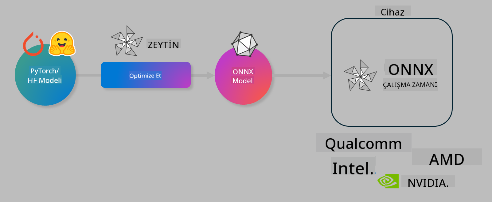

<!--
CO_OP_TRANSLATOR_METADATA:
{
  "original_hash": "6bbe47de3b974df7eea29dfeccf6032b",
  "translation_date": "2025-05-09T04:37:38+00:00",
  "source_file": "code/04.Finetuning/olive-lab/readme.md",
  "language_code": "tr"
}
-->
# Lab. Cihazda çıkarım için AI modellerini optimize etme

## Giriş

> [!IMPORTANT]  
> Bu laboratuvar, **Nvidia A10 veya A100 GPU** ile birlikte ilgili sürücüler ve CUDA araç seti (sürüm 12+) yüklü olmasını gerektirir.

> [!NOTE]  
> Bu, OLIVE kullanarak cihazda çıkarım için modelleri optimize etmenin temel kavramlarını uygulamalı olarak tanıtacak **35 dakikalık** bir laboratuvardır.

## Öğrenme Hedefleri

Bu laboratuvarın sonunda OLIVE kullanarak şunları yapabileceksiniz:

- AWQ kantlaştırma yöntemiyle bir AI modelini kantlaştırmak.
- Belirli bir görev için bir AI modelini ince ayar yapmak.
- ONNX Runtime üzerinde verimli cihaz içi çıkarım için LoRA adaptörleri (ince ayar yapılmış model) oluşturmak.

### Olive Nedir

Olive (*O*NNX *live*), ONNX runtime +++https://onnxruntime.ai+++ için kalite ve performansla model gönderimi yapmanızı sağlayan CLI destekli bir model optimizasyon araç takımıdır.



Olive’a genellikle bir PyTorch veya Hugging Face modeli girilir ve çıktı olarak ONNX runtime üzerinde çalışan optimize edilmiş bir ONNX modeli elde edilir. Olive, Qualcomm, AMD, Nvidia veya Intel gibi donanım sağlayıcılarının sunduğu AI hızlandırıcıları (NPU, GPU, CPU) için modeli dağıtım hedefinde optimize eder.

Olive, *workflow* adı verilen, bireysel model optimizasyon görevlerinden oluşan sıralı bir diziyi çalıştırır. Örnek görevler; model sıkıştırma, grafik yakalama, kantlaştırma, grafik optimizasyonudur. Her görev, doğruluk ve gecikme gibi metrikleri değerlendiren ilgili değerlendirici tarafından en iyi sonuçları elde etmek için ayarlanabilen parametreler içerir. Olive, her görevi tek tek veya görev gruplarını birlikte otomatik ayarlamak için bir arama algoritması kullanan bir arama stratejisi uygular.

#### Olive’ın Avantajları

- Grafik optimizasyonu, sıkıştırma ve kantlaştırma için farklı tekniklerle deneme-yanılma deneyiminde **zaman ve hayal kırıklığını azaltır**. Kalite ve performans kısıtlarınızı belirleyin, Olive en iyi modeli otomatik bulsun.
- Kantlaştırma, sıkıştırma, grafik optimizasyonu ve ince ayar alanlarında **40+ yerleşik model optimizasyon bileşeni**.
- Yaygın model optimizasyon görevleri için **kullanımı kolay CLI**. Örneğin, olive quantize, olive auto-opt, olive finetune.
- Model paketleme ve dağıtımı yerleşik.
- **Multi LoRA servisi** için model oluşturmayı destekler.
- Model optimizasyon ve dağıtım görevlerini düzenlemek için YAML/JSON ile workflow oluşturma.
- **Hugging Face** ve **Azure AI** entegrasyonu.
- **Maliyet tasarrufu** sağlayan yerleşik **önbellekleme** mekanizması.

## Laboratuvar Talimatları

> [!NOTE]  
> Azure AI Hub ve Projenizi hazırladığınızdan ve A100 hesaplamanızı Lab 1’e göre kurduğunuzdan emin olun.

### Adım 0: Azure AI Compute’a Bağlanma

**VS Code**’un uzak özelliklerini kullanarak Azure AI compute’a bağlanacaksınız.

1. Masaüstü uygulamanızda **VS Code**’u açın:  
1. **Shift+Ctrl+P** ile **komut paletini** açın.  
1. Komut paletinde **AzureML - remote: Connect to compute instance in New Window** arayın.  
1. Azure Aboneliğiniz, Kaynak Grubunuz, Projeniz ve Lab 1’de kurduğunuz Compute adınızı seçerek ekrandaki talimatları izleyin.  
1. Azure ML Compute düğümünüze bağlandığınızda, bu durum **Visual Code’un sol alt köşesinde** gösterilecektir `><Azure ML: Compute Name`

### Adım 1: Bu repoyu klonlayın

VS Code’da **Ctrl+J** ile yeni terminal açıp repoyu klonlayabilirsiniz:

Terminalde aşağıdaki istemi görmelisiniz

```
azureuser@computername:~/cloudfiles/code$ 
```  
Çözümü klonlayın  

```bash
cd ~/localfiles
git clone https://github.com/microsoft/phi-3cookbook.git
```

### Adım 2: VS Code’da Klasörü Açma

Terminalde aşağıdaki komutu çalıştırarak ilgili klasörde yeni bir pencere açabilirsiniz:

```bash
code phi-3cookbook/code/04.Finetuning/Olive-lab
```

Alternatif olarak, **File** > **Open Folder** seçeneğiyle klasörü açabilirsiniz.

### Adım 3: Bağımlılıklar

Azure AI Compute Instance’da VS Code terminalinde (ipucu: **Ctrl+J**) aşağıdaki komutları çalıştırarak bağımlılıkları yükleyin:

```bash
conda create -n olive-ai python=3.11 -y
conda activate olive-ai
pip install -r requirements.txt
az extension remove -n azure-cli-ml
az extension add -n ml
```

> [!NOTE]  
> Tüm bağımlılıkların kurulumu yaklaşık 5 dakika sürer.

Bu laboratuvarda modelleri Azure AI Model kataloğundan indirip yükleyeceksiniz. Model kataloğuna erişmek için Azure’a giriş yapmanız gerekir:

```bash
az login
```

> [!NOTE]  
> Giriş sırasında aboneliğinizi seçmeniz istenecek. Bu laboratuvar için sağlanan aboneliği seçtiğinizden emin olun.

### Adım 4: Olive komutlarını çalıştırma

Azure AI Compute Instance’daki VS Code terminalinde (ipucu: **Ctrl+J**) `olive-ai` conda ortamının aktif olduğundan emin olun:

```bash
conda activate olive-ai
```

Sonra, aşağıdaki Olive komutlarını çalıştırın.

1. **Veriyi inceleyin:** Bu örnekte, seyahatle ilgili soruları yanıtlamaya özel hale getirmek için Phi-3.5-Mini modelini ince ayar yapacaksınız. Aşağıdaki kod, JSON lines formatındaki veri kümesinin ilk birkaç kaydını gösterir:

    ```bash
    head data/data_sample_travel.jsonl
    ```

1. **Modeli kantlaştırın:** Modeli eğitmeden önce, Active Aware Quantization (AWQ) +++https://arxiv.org/abs/2306.00978+++ tekniğini kullanan aşağıdaki komutla kantlaştırma yaparsınız. AWQ, çıkarım sırasında oluşan aktivasyonları dikkate alarak model ağırlıklarını kantlaştırır. Bu, kantlaştırma sürecinin aktivasyonlardaki gerçek veri dağılımını hesaba katması anlamına gelir ve geleneksel ağırlık kantlaştırma yöntemlerine göre model doğruluğunun daha iyi korunmasını sağlar.

    ```bash
    olive quantize \
       --model_name_or_path microsoft/Phi-3.5-mini-instruct \
       --trust_remote_code \
       --algorithm awq \
       --output_path models/phi/awq \
       --log_level 1
    ```

    AWQ kantlaştırması **yaklaşık 8 dakika** sürer ve model boyutunu **~7.5GB’den ~2.5GB’ye** düşürür.

    Bu laboratuvarda, Hugging Face’den (örneğin: `microsoft/Phi-3.5-mini-instruct`). However, Olive also allows you to input models from the Azure AI catalog by updating the `model_name_or_path` argument to an Azure AI asset ID (for example:  `azureml://registries/azureml/models/Phi-3.5-mini-instruct/versions/4`). 

1. **Train the model:** Next, the `olive finetune` komutu kantlaştırılmış modeli ince ayar yapar) modelleri nasıl girdi olarak alacağınızı gösteriyoruz. Modeli ince ayardan önce kantlaştırmak, ince ayar süreci kantlaştırmadan kaynaklanan kaybın bir kısmını telafi ettiğinden daha iyi doğruluk sağlar.

    ```bash
    olive finetune \
        --method lora \
        --model_name_or_path models/phi/awq \
        --data_files "data/data_sample_travel.jsonl" \
        --data_name "json" \
        --text_template "<|user|>\n{prompt}<|end|>\n<|assistant|>\n{response}<|end|>" \
        --max_steps 100 \
        --output_path ./models/phi/ft \
        --log_level 1
    ```

    İnce ayar (100 adımla) **yaklaşık 6 dakika** sürer.

1. **Optimize edin:** Model eğitildikten sonra, Olive’ın `auto-opt` command, which will capture the ONNX graph and automatically perform a number of optimizations to improve the model performance for CPU by compressing the model and doing fusions. It should be noted, that you can also optimize for other devices such as NPU or GPU by just updating the `--device` and `--provider` argümanlarını kullanarak modeli optimize edin - ancak bu laboratuvar için CPU kullanacağız.

    ```bash
    olive auto-opt \
       --model_name_or_path models/phi/ft/model \
       --adapter_path models/phi/ft/adapter \
       --device cpu \
       --provider CPUExecutionProvider \
       --use_ort_genai \
       --output_path models/phi/onnx-ao \
       --log_level 1
    ```

    Optimizasyon **yaklaşık 5 dakika** sürer.

### Adım 5: Model çıkarımı hızlı testi

Model çıkarımını test etmek için klasörünüzde **app.py** adlı bir Python dosyası oluşturun ve aşağıdaki kodu yapıştırın:

```python
import onnxruntime_genai as og
import numpy as np

print("loading model and adapters...", end="", flush=True)
model = og.Model("models/phi/onnx-ao/model")
adapters = og.Adapters(model)
adapters.load("models/phi/onnx-ao/model/adapter_weights.onnx_adapter", "travel")
print("DONE!")

tokenizer = og.Tokenizer(model)
tokenizer_stream = tokenizer.create_stream()

params = og.GeneratorParams(model)
params.set_search_options(max_length=100, past_present_share_buffer=False)
user_input = "what is the best thing to see in chicago"
params.input_ids = tokenizer.encode(f"<|user|>\n{user_input}<|end|>\n<|assistant|>\n")

generator = og.Generator(model, params)

generator.set_active_adapter(adapters, "travel")

print(f"{user_input}")

while not generator.is_done():
    generator.compute_logits()
    generator.generate_next_token()

    new_token = generator.get_next_tokens()[0]
    print(tokenizer_stream.decode(new_token), end='', flush=True)

print("\n")
```

Kodu şu şekilde çalıştırın:

```bash
python app.py
```

### Adım 6: Modeli Azure AI’ye yükleme

Modeli Azure AI model deposuna yüklemek, modelin geliştirme ekibinizin diğer üyeleriyle paylaşılmasını sağlar ve modelin sürüm kontrolünü yapar. Modeli yüklemek için aşağıdaki komutu çalıştırın:

> [!NOTE]  
> `{}` içindeki `resourceGroup` ve Azure AI Proje adını güncelleyerek aşağıdaki komutu çalıştırın

```
az ml workspace show
```

Ya da +++ai.azure.com+++ adresine gidip **management center** > **project** > **overview** seçeneğini kullanabilirsiniz.

`{}` yer tutucularını kaynak grubunuzun ve Azure AI Proje adınızın adıyla değiştirin.

```bash
az ml model create \
    --name ft-for-travel \
    --version 1 \
    --path ./models/phi/onnx-ao \
    --resource-group {RESOURCE_GROUP_NAME} \
    --workspace-name {PROJECT_NAME}
```  
Yüklediğiniz modeli https://ml.azure.com/model/list adresinde görebilir ve dağıtabilirsiniz.

**Feragatname**:  
Bu belge, AI çeviri hizmeti [Co-op Translator](https://github.com/Azure/co-op-translator) kullanılarak çevrilmiştir. Doğruluk için çaba göstersek de, otomatik çevirilerin hatalar veya yanlışlıklar içerebileceğini lütfen unutmayınız. Orijinal belge, kendi dilinde yetkili kaynak olarak kabul edilmelidir. Kritik bilgiler için profesyonel insan çevirisi önerilir. Bu çevirinin kullanımı sonucu oluşabilecek herhangi bir yanlış anlama veya yorumdan sorumlu değiliz.