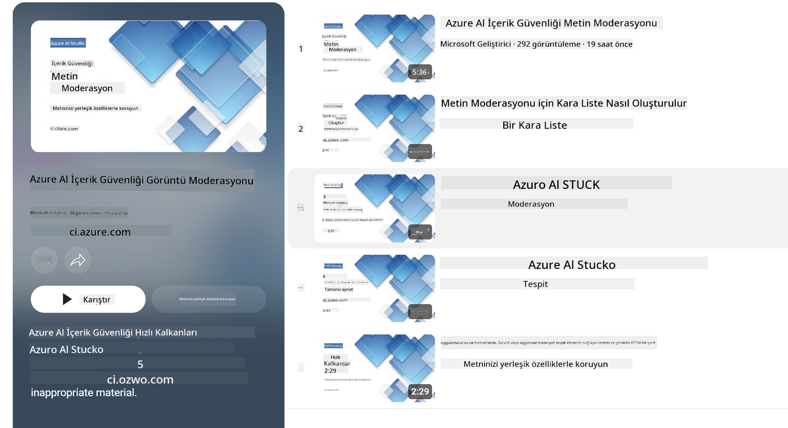

<!--
CO_OP_TRANSLATOR_METADATA:
{
  "original_hash": "c8273672cc57df2be675407a1383aaf0",
  "translation_date": "2025-05-09T05:59:25+00:00",
  "source_file": "md/01.Introduction/01/01.AISafety.md",
  "language_code": "tr"
}
-->
# Phi modelleri için Yapay Zeka güvenliği  
Phi modeli ailesi, [Microsoft Sorumlu Yapay Zeka Standardı](https://query.prod.cms.rt.microsoft.com/cms/api/am/binary/RE5cmFl) doğrultusunda geliştirildi. Bu standart, şirket genelinde geçerli olan ve şu altı ilkeye dayanan bir dizi gereksinimden oluşur: hesap verebilirlik, şeffaflık, adalet, güvenilirlik ve güvenlik, gizlilik ve emniyet, kapsayıcılık; bunlar aynı zamanda [Microsoft’un Sorumlu Yapay Zeka ilkelerini](https://www.microsoft.com/ai/responsible-ai) oluşturur.

Önceki Phi modellerinde olduğu gibi, çok yönlü bir güvenlik değerlendirmesi ve eğitim sonrası güvenlik yaklaşımı benimsendi; bu sürümün çok dilli yetenekleri göz önünde bulundurularak ek önlemler alındı. Güvenlik eğitimi ve değerlendirmeleri, çoklu dil ve risk kategorilerinde testler dahil olmak üzere, [Phi Güvenlik Eğitim Sonrası Makalesi](https://arxiv.org/abs/2407.13833) ile açıklanmıştır. Phi modelleri bu yaklaşımdan faydalansa da, geliştiriciler kendi kullanım senaryoları ile kültürel ve dilsel bağlamlarına özgü riskleri haritalandırmalı, ölçmeli ve azaltmalı, sorumlu yapay zeka en iyi uygulamalarını uygulamalıdır.

## En İyi Uygulamalar  

Diğer modellerde olduğu gibi, Phi modeli ailesi de haksız, güvenilmez veya rahatsız edici davranışlar sergileyebilir.

SLM ve LLM’nin bazı sınırlayıcı davranışları şunlardır:

- **Hizmet Kalitesi:** Phi modelleri öncelikle İngilizce metinler üzerinde eğitilmiştir. İngilizce dışındaki dillerde performans daha düşük olabilir. Eğitim verilerinde daha az temsil edilen İngilizce dil çeşitleri, standart Amerikan İngilizcesine kıyasla daha düşük performans gösterebilir.  
- **Zararların Temsili ve Stereotiplerin Sürdürülmesi:** Bu modeller bazı insan gruplarını fazla ya da az temsil edebilir, bazı grupların temsillerini silebilir veya küçültücü ya da olumsuz stereotipleri pekiştirebilir. Güvenlik eğitim sonrası yapılmış olsa da, farklı grupların temsiliyet seviyeleri veya eğitim verilerindeki olumsuz stereotip örneklerinin yaygınlığı nedeniyle bu sınırlamalar devam edebilir; bu durum gerçek dünya kalıplarını ve toplumsal önyargıları yansıtabilir.  
- **Uygunsuz veya Rahatsız Edici İçerik:** Bu modeller, başka türden uygunsuz veya rahatsız edici içerikler üretebilir; bu nedenle ek önlemler alınmadan hassas bağlamlarda kullanılması uygun olmayabilir.  
- **Bilgi Güvenilirliği:** Dil modelleri mantıksız içerik üretebilir veya mantıklı gibi görünen ancak yanlış ya da güncel olmayan içerikler oluşturabilir.  
- **Kod İçin Sınırlı Kapsam:** Phi-3 eğitim verilerinin çoğunluğu Python tabanlıdır ve "typing, math, random, collections, datetime, itertools" gibi yaygın paketleri kullanır. Model başka paketler kullanan Python betikleri ya da farklı dillerde betikler oluşturursa, kullanıcıların tüm API kullanımlarını manuel olarak doğrulamalarını şiddetle tavsiye ederiz.

Geliştiriciler, sorumlu yapay zeka en iyi uygulamalarını uygulamalı ve belirli bir kullanım senaryosunun ilgili yasa ve düzenlemelere (örneğin gizlilik, ticaret vb.) uygunluğunu sağlamaktan sorumludur.

## Sorumlu Yapay Zeka Hususları  

Diğer dil modellerinde olduğu gibi, Phi serisi modeller de haksız, güvenilmez veya rahatsız edici davranışlar sergileyebilir. Dikkat edilmesi gereken bazı sınırlayıcı davranışlar şunlardır:

**Hizmet Kalitesi:** Phi modelleri öncelikle İngilizce metinler üzerinde eğitilmiştir. İngilizce dışındaki dillerde performans daha düşük olabilir. Eğitim verilerinde daha az temsil edilen İngilizce dil çeşitleri, standart Amerikan İngilizcesine kıyasla daha düşük performans gösterebilir.

**Zararların Temsili ve Stereotiplerin Sürdürülmesi:** Bu modeller bazı insan gruplarını fazla ya da az temsil edebilir, bazı grupların temsillerini silebilir veya küçültücü ya da olumsuz stereotipleri pekiştirebilir. Güvenlik eğitim sonrası yapılmış olsa da, farklı grupların temsiliyet seviyeleri veya eğitim verilerindeki olumsuz stereotip örneklerinin yaygınlığı nedeniyle bu sınırlamalar devam edebilir; bu durum gerçek dünya kalıplarını ve toplumsal önyargıları yansıtabilir.

**Uygunsuz veya Rahatsız Edici İçerik:** Bu modeller, başka türden uygunsuz veya rahatsız edici içerikler üretebilir; bu nedenle ek önlemler alınmadan hassas bağlamlarda kullanılması uygun olmayabilir.  
Bilgi Güvenilirliği: Dil modelleri mantıksız içerik üretebilir veya mantıklı gibi görünen ancak yanlış ya da güncel olmayan içerikler oluşturabilir.

**Kod İçin Sınırlı Kapsam:** Phi-3 eğitim verilerinin çoğunluğu Python tabanlıdır ve "typing, math, random, collections, datetime, itertools" gibi yaygın paketleri kullanır. Model başka paketler kullanan Python betikleri ya da farklı dillerde betikler oluşturursa, kullanıcıların tüm API kullanımlarını manuel olarak doğrulamalarını şiddetle tavsiye ederiz.

Geliştiriciler, sorumlu yapay zeka en iyi uygulamalarını uygulamalı ve belirli bir kullanım senaryosunun ilgili yasa ve düzenlemelere (örneğin gizlilik, ticaret vb.) uygunluğunu sağlamaktan sorumludur. Dikkate alınması gereken önemli alanlar şunlardır:

**Tahsis:** Modeller, yasal statü veya kaynakların ya da yaşam fırsatlarının tahsisi üzerinde önemli etkisi olabilecek senaryolar için uygun olmayabilir (örneğin: konut, istihdam, kredi vb.) ve ek değerlendirmeler ile önyargı azaltma teknikleri gerektirebilir.

**Yüksek Riskli Senaryolar:** Geliştiriciler, haksız, güvenilmez veya rahatsız edici çıktılarının çok maliyetli olabileceği veya zarara yol açabileceği yüksek riskli senaryolarda modellerin uygunluğunu değerlendirmelidir. Bu, doğruluk ve güvenilirliğin kritik olduğu hassas veya uzmanlık gerektiren alanlarda (örneğin: hukuki veya sağlık tavsiyesi) öneriler sunmayı içerir. Uygulama düzeyinde, dağıtım bağlamına göre ek koruyucu önlemler uygulanmalıdır.

**Yanlış Bilgi:** Modeller yanlış bilgi üretebilir. Geliştiriciler şeffaflık en iyi uygulamalarını takip etmeli ve son kullanıcıları yapay zeka sistemiyle etkileşimde oldukları konusunda bilgilendirmelidir. Uygulama düzeyinde, geliştiriciler geri bildirim mekanizmaları ve yanıtları kullanım senaryosuna özgü, bağlamsal bilgilerle destekleyen boru hatları oluşturabilir; bu teknik Retrieval Augmented Generation (RAG) olarak bilinir.

**Zararlı İçerik Üretimi:** Geliştiriciler çıktıları bağlama göre değerlendirmeli ve kullanım senaryolarına uygun mevcut güvenlik sınıflandırıcıları veya özel çözümleri kullanmalıdır.

**Kötüye Kullanım:** Dolandırıcılık, spam veya kötü amaçlı yazılım üretimi gibi diğer kötüye kullanım biçimleri mümkün olabilir; geliştiriciler uygulamalarının geçerli yasa ve düzenlemelere aykırı olmadığından emin olmalıdır.

### İnce Ayar ve Yapay Zeka İçerik Güvenliği  

Bir modeli ince ayar yaptıktan sonra, modellerin oluşturduğu içeriği izlemek, potansiyel riskleri, tehditleri ve kalite sorunlarını tespit etmek ve engellemek için [Azure AI Content Safety](https://learn.microsoft.com/azure/ai-services/content-safety/overview) önlemlerini kullanmanızı şiddetle tavsiye ederiz.

[Azure AI Content Safety](https://learn.microsoft.com/azure/ai-services/content-safety/overview) hem metin hem de görsel içeriği destekler. Bulutta, bağlantısız konteynerlerde ve uç/gömülü cihazlarda dağıtılabilir.

## Azure AI Content Safety Genel Bakış  

Azure AI Content Safety, herkese uyan tek bir çözüm değildir; işletmelerin özel politikalarına uyacak şekilde özelleştirilebilir. Ayrıca, çok dilli modelleri sayesinde birden fazla dili aynı anda anlayabilir.

- **Azure AI Content Safety**  
- **Microsoft Developer**  
- **5 video**

Azure AI Content Safety hizmeti, uygulamalarda ve servislerde zararlı kullanıcı tarafından oluşturulan ve yapay zeka tarafından oluşturulan içerikleri tespit eder. Zararlı veya uygunsuz materyalleri tespit etmeye olanak tanıyan metin ve görsel API’lerini içerir.

[AI Content Safety Playlist](https://www.youtube.com/playlist?list=PLlrxD0HtieHjaQ9bJjyp1T7FeCbmVcPkQ)

**Feragatname**:  
Bu belge, AI çeviri servisi [Co-op Translator](https://github.com/Azure/co-op-translator) kullanılarak çevrilmiştir. Doğruluk için çaba gösterilse de, otomatik çevirilerin hatalar veya yanlışlıklar içerebileceğini lütfen unutmayın. Orijinal belge, kendi ana dilinde yetkili kaynak olarak kabul edilmelidir. Kritik bilgiler için profesyonel insan çevirisi önerilir. Bu çevirinin kullanımı sonucunda ortaya çıkabilecek yanlış anlamalar veya yanlış yorumlamalar nedeniyle sorumluluk kabul edilmemektedir.