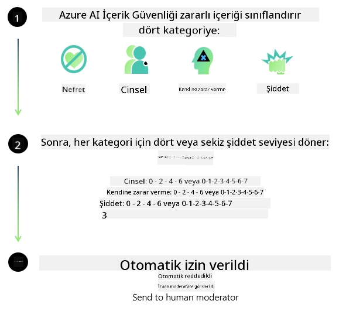
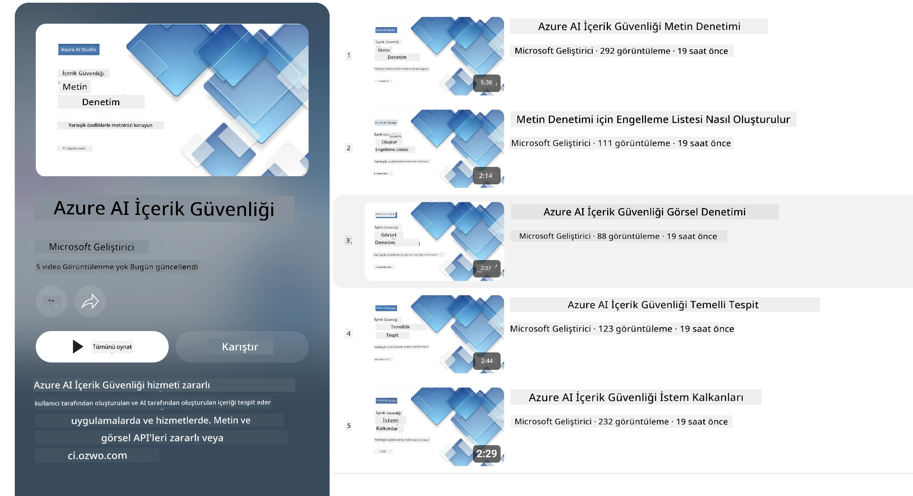

<!--
CO_OP_TRANSLATOR_METADATA:
{
  "original_hash": "839ccc4b3886ef10cfd4e64977f5792d",
  "translation_date": "2026-01-05T14:32:01+00:00",
  "source_file": "md/01.Introduction/01/01.AISafety.md",
  "language_code": "tr"
}
-->
# Phi modelleri için Yapay Zeka güvenliği
Phi model ailesi, aşağıdaki altı ilkeye dayanan, şirket genelinde geçerli gereksinimlerden oluşan [Microsoft Sorumlu AI Standardı](https://www.microsoft.com/ai/principles-and-approach#responsible-ai-standard) doğrultusunda geliştirilmiştir: hesap verebilirlik, şeffaflık, adalet, güvenilirlik ve güvenlik, gizlilik ve güvenlik, kapsayıcılık; bu ilkeler [Microsoft’un Sorumlu AI prensiplerini](https://www.microsoft.com/ai/responsible-ai) oluşturur.

Önceki Phi modellerinde olduğu gibi, çok yönlü bir güvenlik değerlendirmesi ve güvenlik sonrası eğitim yaklaşımı benimsenmiş, bu sürümün çok dilli yetenekleri dikkate alınarak ek tedbirler alınmıştır. Çoklu dillerde ve risk kategorilerinde testleri içeren güvenlik eğitimi ve değerlendirme yaklaşımımız [Phi Güvenlik Sonrası Eğitim Makalesi](https://arxiv.org/abs/2407.13833)‘nde özetlenmiştir. Phi modelleri bu yaklaşımdan faydalanırken, geliştiricilerin belirli kullanım durumları ve kültürel ile dilsel bağlamlarıyla ilgili riskleri haritalandırma, ölçme ve azaltmayı içeren sorumlu AI en iyi uygulamalarını uygulamaları gerekir.

## En İyi Uygulamalar

Diğer modeller gibi, Phi modelleri adaletsiz, güvenilmez veya saldırgan davranışlar sergileyebilir.

SLM ve LLM'nin farkında olunması gereken bazı sınırlayıcı davranışları şunlardır:

- **Hizmet Kalitesi:** Phi modelleri öncelikle İngilizce metinler üzerinde eğitilmiştir. İngilizce dışındaki dillerde performans daha düşük olacaktır. Eğitim verisinde daha az temsil edilen İngilizce dil çeşitleri, standart Amerikan İngilizcesine göre daha kötü performans gösterebilir.
- **Zararlı İçerik Temsili ve Kalıp Yargıların Sürdürülmesi:** Bu modeller, bazı insan gruplarını aşırı veya az temsil edebilir, bazı grupların temsilini silip yok sayabilir veya aşağılayıcı ve olumsuz kalıp yargıları pekiştirebilir. Güvenlik sonrası eğitime rağmen, farklı grupların temsildeki farklı seviyeleri veya gerçek dünya kalıplarını ve toplumsal önyargıları yansıtan olumsuz kalıp yargı örneklerinin eğitim verisindeki yaygınlığı nedeniyle bu sınırlamalar hala var olabilir.
- **Uygunsuz veya Saldırgan İçerik:** Bu modeller, diğer tür uygunsuz veya saldırgan içerikler oluşturabilir, bu nedenle ek kullanım durumuna özel hafifletmeler olmadan hassas bağlamlarda kullanımı uygun olmayabilir.
- **Bilgi Güvenilirliği:** Dil modelleri mantıksız içerik üretebilir veya mantıklı görünebilecek ama yanlış ya da güncelliğini yitirmiş içerik uydurabilir.
- **Kod İçin Sınırlı Kapsam:** Phi-3 eğitim verisinin çoğunluğu Python tabanlıdır ve yaygın paketler ("typing, math, random, collections, datetime, itertools") kullanılmaktadır. Model başka paketler veya başka dillerde komut dosyaları üretirse, kullanıcıların tüm API kullanımlarını manuel olarak doğrulamalarını şiddetle öneriyoruz.

Geliştiriciler, sorumlu AI en iyi uygulamalarını benimsemeli ve belirli bir kullanım durumunun geçerli yasa ve yönetmeliklere (örneğin gizlilik, ticaret vb.) uygunluğunu sağlamakla yükümlüdür.

## Sorumlu AI Dikkat Edilmesi Gerekenler

Diğer dil modelleri gibi, Phi serisi modeller adaletsiz, güvenilmez veya saldırgan davranışlar sergileyebilir. Dikkat edilmesi gereken sınırlamalar şunlardır:

**Hizmet Kalitesi:** Phi modelleri öncelikli olarak İngilizce metinlerle eğitilmiştir. İngilizce dışındaki dillerde performans daha kötü olacaktır. Eğitim verisinde az temsil edilen İngilizce dil varyantları, standart Amerikan İngilizcesine göre daha kötü performans gösterebilir.

**Zararlı İçerik Temsili ve Kalıp Yargıların Sürdürülmesi:** Bu modeller, bazı insan gruplarını aşırı veya az temsil edebilir, bazı grupların temsilini silip yok sayabilir veya aşağılayıcı ya da olumsuz kalıp yargıları pekiştirebilir. Güvenlik sonrası eğitime rağmen, farklı grupların temsildeki farklı seviyeleri veya gerçek dünya kalıplarını ve toplumsal önyargıları yansıtan olumsuz kalıp yargı örneklerinin eğitim verisindeki yaygınlığı nedeniyle bu sınırlamalar hala devam ediyor olabilir.

**Uygunsuz veya Saldırgan İçerik:** Bu modeller başka tür uygunsuz ya da saldırgan içerikler oluşturabilir, bu nedenle ek kullanım durumuna özgü hafifletmeler olmadan hassas bağlamlarda kullanımı uygun olmayabilir.  
Bilgi Güvenilirliği: Dil modelleri mantıksız içerik üretebilir veya mantıklı görünen ancak hatalı veya güncel olmayan içerik uydurabilir.

**Kod İçin Sınırlı Kapsam:** Phi-3 eğitim verisinin çoğunluğu Python üzerinedir ve "typing, math, random, collections, datetime, itertools" gibi yaygın paketler kullanılır. Model başka paketler veya diğer dillerde komut dosyaları üretiyorsa, kullanıcıların tüm API kullanımlarını manuel doğrulamasını kesinlikle öneriyoruz.

Geliştiriciler sorumlu AI en iyi uygulamalarını takip etmeli ve belirli kullanımların ilgili yasa ve düzenlemelere (örneğin gizlilik, ticaret vb.) uyduğundan emin olmalıdır. Dikkate alınması gereken önemli noktalar şunlardır:

**Tahsis:** Modeller, hukuki statü veya kaynakların ya da yaşam olanaklarının tahsisi üzerinde ciddi etkisi olabilecek durumlar için (örneğin: konut, istihdam, kredi vb.) ek değerlendirmeler ve önyargı giderme teknikleri uygulanmadan uygun olmayabilir.

**Yüksek Riskli Senaryolar:** Geliştiriciler, haksız, güvenilmez veya saldırgan çıktının ciddi maliyet veya zarara yol açabileceği yüksek riskli senaryolarda modellerin uygunluğunu değerlendirmelidir. Bu, doğruluk ve güvenilirliğin kritik olduğu hassas veya uzman alanlarda (örneğin: hukuki veya sağlık tavsiyesi) verilen önerileri içerir. Uygulama seviyesinde konuşlandırma bağlamına göre ek güvenlik önlemleri uygulanmalıdır.

**Yanlış Bilgi:** Modeller yanlış bilgiler üretebilir. Geliştiriciler şeffaflık en iyi uygulamalarını izlemeli ve son kullanıcıları AI sistemi ile etkileşimde oldukları konusunda bilgilendirmelidir. Uygulama seviyesinde geliştiriciler, yanıtları kullanım durumuna özgü, bağlamsal bilgiye dayandırmak için geri bildirim mekanizmaları ve süreçleri geliştirebilir; bu teknik Retrieval Augmented Generation (RAG) olarak bilinir.

**Zararlı İçerik Üretimi:** Geliştiriciler çıktıları bağlam içinde değerlendirmeli ve kullanım durumlarına uygun mevcut güvenlik sınıflandırıcıları veya özel çözümler kullanmalıdır.

**Kötüye Kullanım:** Dolandırıcılık, spam veya kötü amaçlı yazılım üretimi gibi diğer kötüye kullanım türleri mümkün olabilir; geliştiriciler uygulamalarının yürürlükteki yasa ve düzenlemeleri ihlal etmemesini sağlamalıdır.

### İnce Ayar ve AI İçerik Güvenliği

Bir model ince ayar yapıldıktan sonra, modeller tarafından oluşturulan içeriği izlemek, potansiyel riskleri, tehditleri ve kalite sorunlarını belirlemek ve engellemek için [Azure AI Content Safety](https://learn.microsoft.com/azure/ai-services/content-safety/overview) önlemlerini kullanmanızı şiddetle tavsiye ederiz.

[Azure AI Content Safety](https://learn.microsoft.com/azure/ai-services/content-safety/overview) hem metin hem görsel içeriği destekler. Bulutta, bağlantısız konteynerlerde ve uç/gömülü cihazlarda kullanılabilir.

## Azure AI Content Safety Genel Bakış

Azure AI Content Safety tek tip bir çözüm değildir; işletmelerin özel politikalarıyla uyumlu olacak şekilde özelleştirilebilir. Ayrıca çok dilli modelleri aynı anda birden çok dili anlamasına olanak sağlar.

- **Azure AI Content Safety**
- **Microsoft Developer**
- **5 video**

Azure AI Content Safety servisi, uygulamalarda ve servislerde zararlı kullanıcı ve AI kaynaklı içerikleri tespit eder. Zararlı veya uygunsuz materyali algılamanızı sağlayan metin ve görsel API’lerini içerir.

[AI İçerik Güvenliği Oynatma Listesi](https://www.youtube.com/playlist?list=PLlrxD0HtieHjaQ9bJjyp1T7FeCbmVcPkQ)

---

<!-- CO-OP TRANSLATOR DISCLAIMER START -->
**Feragatname**:
Bu belge, AI çeviri hizmeti [Co-op Translator](https://github.com/Azure/co-op-translator) kullanılarak çevrilmiştir. Doğruluk için çaba gösterilse de, otomatik çevirilerin hatalar veya yanlışlıklar içerebileceğini lütfen unutmayınız. Orijinal belge, kendi dilinde yetkili kaynak olarak kabul edilmelidir. Kritik bilgiler için profesyonel insan çevirisi önerilir. Bu çevirinin kullanımı sonucu oluşabilecek yanlış anlamalar veya hatalı yorumlamalardan sorumlu değiliz.
<!-- CO-OP TRANSLATOR DISCLAIMER END -->