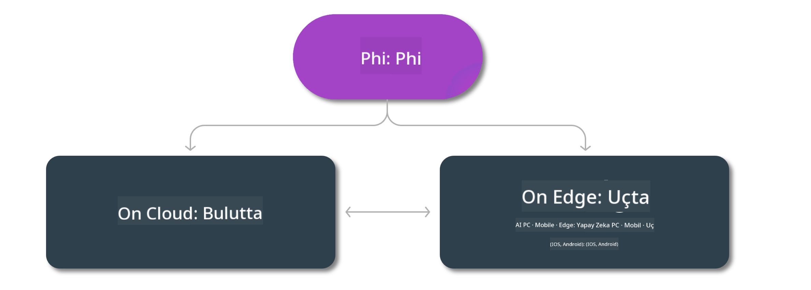

<!--
CO_OP_TRANSLATOR_METADATA:
{
  "original_hash": "777aa0ff38fceecc29a00834f2f7a2f0",
  "translation_date": "2025-07-16T18:00:47+00:00",
  "source_file": "md/01.Introduction/01/01.Edgeandcloud.md",
  "language_code": "tr"
}
-->
# Phi Modelleri ve Platformlar Arası Kullanılabilirlik

## Edge & Bulut Senaryoları

## Model Kullanılabilirliği ve Kaynaklar

| | | | | | | | | |
|-|-|-|-|-|-|-|-|-|
|Model|Girdi|İçerik Uzunluğu|Azure AI (MaaS)|Azure ML (MaaP)|ONNX|Hugging Face|Ollama|Nvidia NIM|
|Phi-3-vision-128k-instruct|Metin+Görsel|128k|[Playground & Dağıtım](https://ai.azure.com/explore/models/Phi-3-vision-128k-instruct/version/2/registry/azureml)|[Playground, Dağıtım & İnce Ayar](https://ml.azure.com/registries/azureml/models/Phi-3-vision-128k-instruct/version/2)|[CUDA](https://huggingface.co/microsoft/Phi-3-vision-128k-instruct-onnx-cuda/tree/main),[CPU](https://huggingface.co/microsoft/Phi-3-vision-128k-instruct-onnx-cpu/tree/main), [DirectML](https://huggingface.co/microsoft/Phi-3-vision-128k-instruct-onnx-directml/tree/main)|[İndir](https://huggingface.co/microsoft/Phi-3-vision-128k-instruct)|-YOK-|[NIM API'leri](https://build.nvidia.com/microsoft/phi-3-vision-128k-instruct)|
|Phi-3-mini-4k-instruct|Metin|4k|[Playground & Dağıtım](https://aka.ms/phi3-mini-4k-azure-ml)|[Playground, Dağıtım](https://aka.ms/phi3-mini-4k-azure-ml) & İnce Ayar|[CUDA](https://huggingface.co/microsoft/Phi-3-mini-4k-instruct-onnx), [Web](https://huggingface.co/microsoft/Phi-3-mini-4k-instruct-onnx)|[Playground & İndir](https://huggingface.co/chat/models/microsoft/Phi-3-mini-4k-instruct)|[GGUF](https://huggingface.co/microsoft/Phi-3-mini-4k-instruct-gguf)|[NIM API'leri](https://build.nvidia.com/microsoft/phi-3-mini-4k)|
|Phi-3-mini-128k-instruct|Metin|128k|[Playground & Dağıtım](https://ai.azure.com/explore/models/Phi-3-mini-128k-instruct/version/9/registry/azureml)|[Playground, Dağıtım](https://ai.azure.com/explore/models/Phi-3-mini-128k-instruct/version/9/registry/azureml) & İnce Ayar|[CUDA](https://huggingface.co/microsoft/Phi-3-mini-128k-instruct-onnx)|[İndir](https://huggingface.co/microsoft/Phi-3-mini-128k-instruct-onnx)|-YOK-|[NIM API'leri](https://build.nvidia.com/microsoft/phi-3-mini)|
|Phi-3-small-8k-instruct|Metin|8k|[Playground & Dağıtım](https://ml.azure.com/registries/azureml/models/Phi-3-small-8k-instruct/version/2)|[Playground, Dağıtım](https://ai.azure.com/explore/models/Phi-3-small-8k-instruct/version/2/registry/azureml) & İnce Ayar|[CUDA](https://huggingface.co/microsoft/Phi-3-small-8k-instruct-onnx-cuda)|[İndir](https://huggingface.co/microsoft/Phi-3-small-8k-instruct-onnx-cuda)|-YOK-|[NIM API'leri](https://build.nvidia.com/microsoft/phi-3-small-8k-instruct?docker=false)|
|Phi-3-small-128k-instruct|Metin|128k|[Playground & Dağıtım](https://ai.azure.com/explore/models/Phi-3-small-128k-instruct/version/2/registry/azureml)|[Playground, Dağıtım](https://ml.azure.com/registries/azureml/models/Phi-3-small-128k-instruct/version/2) & İnce Ayar|[CUDA](https://huggingface.co/microsoft/Phi-3-medium-128k-instruct-onnx-cuda)|[İndir](https://huggingface.co/microsoft/Phi-3-small-128k-instruct)|-YOK-|[NIM API'leri](https://build.nvidia.com/microsoft/phi-3-small-128k-instruct?docker=false)|
|Phi-3-medium-4k-instruct|Metin|4k|[Playground & Dağıtım](https://huggingface.co/microsoft/Phi-3-medium-4k-instruct)|[Playground, Dağıtım](https://ml.azure.com/registries/azureml/models/Phi-3-medium-4k-instruct/version/2) & İnce Ayar|[CUDA](https://huggingface.co/microsoft/Phi-3-medium-4k-instruct-onnx-cuda/tree/main), [CPU](https://huggingface.co/microsoft/Phi-3-medium-4k-instruct-onnx-cpu/tree/main), [DirectML](https://huggingface.co/microsoft/Phi-3-medium-4k-instruct-onnx-directml/tree/main)|[İndir](https://huggingface.co/microsoft/Phi-3-medium-4k-instruct)|-YOK-|[NIM API'leri](https://build.nvidia.com/microsoft/phi-3-medium-4k-instruct?docker=false)|
|Phi-3-medium-128k-instruct|Metin|128k|[Playground & Dağıtım](https://ai.azure.com/explore/models/Phi-3-medium-128k-instruct/version/2)|[Playground, Dağıtım](https://ml.azure.com/registries/azureml/models/Phi-3-medium-128k-instruct/version/2) & İnce Ayar|[CUDA](https://huggingface.co/microsoft/Phi-3-medium-128k-instruct-onnx-cuda/tree/main), [CPU](https://huggingface.co/microsoft/Phi-3-medium-128k-instruct-onnx-cpu/tree/main), [DirectML](https://huggingface.co/microsoft/Phi-3-medium-128k-instruct-onnx-directml/tree/main)|[İndir](https://huggingface.co/microsoft/Phi-3-medium-128k-instruct)|-YOK-|-YOK-|

**Feragatname**:  
Bu belge, AI çeviri servisi [Co-op Translator](https://github.com/Azure/co-op-translator) kullanılarak çevrilmiştir. Doğruluk için çaba göstersek de, otomatik çevirilerin hatalar veya yanlışlıklar içerebileceğini lütfen unutmayınız. Orijinal belge, kendi dilinde yetkili kaynak olarak kabul edilmelidir. Kritik bilgiler için profesyonel insan çevirisi önerilir. Bu çevirinin kullanımı sonucu oluşabilecek yanlış anlamalar veya yorum hatalarından sorumlu değiliz.