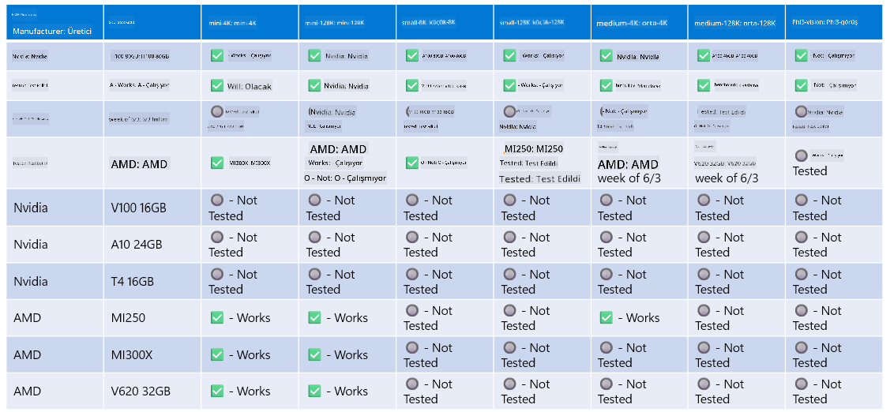

<!--
CO_OP_TRANSLATOR_METADATA:
{
  "original_hash": "8cdc17ce0f10535da30b53d23fe1a795",
  "translation_date": "2025-05-09T07:49:18+00:00",
  "source_file": "md/01.Introduction/01/01.Hardwaresupport.md",
  "language_code": "tr"
}
-->
# Phi Donanım Desteği

Microsoft Phi, ONNX Runtime için optimize edilmiştir ve Windows DirectML’i destekler. GPU’lar, CPU’lar ve hatta mobil cihazlar dahil olmak üzere çeşitli donanım türlerinde iyi çalışır.

## Cihaz Donanımı  
Desteklenen donanımlar şunlardır:

- GPU SKU: RTX 4090 (DirectML)  
- GPU SKU: 1 A100 80GB (CUDA)  
- CPU SKU: Standard F64s v2 (64 vCPU, 128 GiB bellek)  

## Mobil SKU

- Android - Samsung Galaxy S21  
- Apple iPhone 14 veya daha üstü A16/A17 İşlemci  

## Phi Donanım Özellikleri

- Minimum Gereken Konfigürasyon.  
- Windows: DirectX 12 destekli GPU ve en az 4GB toplam RAM  

CUDA: Compute Capability >= 7.02 olan NVIDIA GPU  



## Birden Fazla GPU’da onnxruntime Çalıştırma

Şu anda mevcut Phi ONNX modelleri sadece 1 GPU için uygundur. Phi modeli için çoklu GPU desteği mümkün olsa da, 2 GPU ile çalışan ORT’nin, 2 ayrı ortanca instance’a göre daha fazla performans sağlayacağı garanti edilmez. En son güncellemeler için lütfen [ONNX Runtime](https://onnxruntime.ai/) adresine bakınız.

[Build 2024’te GenAI ONNX Ekibi](https://youtu.be/WLW4SE8M9i8?si=EtG04UwDvcjunyfC), Phi modelleri için çoklu GPU yerine çoklu instance desteğini etkinleştirdiklerini duyurdu.

Şu anda bu, CUDA_VISIBLE_DEVICES ortam değişkeni ile tek bir onnxruntime veya onnxruntime-genai instance’ı çalıştırmanıza olanak tanıyor.

```Python
CUDA_VISIBLE_DEVICES=0 python infer.py
CUDA_VISIBLE_DEVICES=1 python infer.py
```

Phi’yi daha detaylı keşfetmek için [Azure AI Foundry](https://ai.azure.com) adresini ziyaret edebilirsiniz.

**Feragatname**:  
Bu belge, AI çeviri hizmeti [Co-op Translator](https://github.com/Azure/co-op-translator) kullanılarak çevrilmiştir. Doğruluk için çaba göstersek de, otomatik çevirilerin hatalar veya yanlışlıklar içerebileceğini lütfen unutmayınız. Orijinal belge, kendi ana dilindeki haliyle yetkili kaynak olarak kabul edilmelidir. Kritik bilgiler için profesyonel insan çevirisi önerilir. Bu çevirinin kullanımı sonucu ortaya çıkabilecek yanlış anlamalar veya yorum hatalarından sorumlu değiliz.