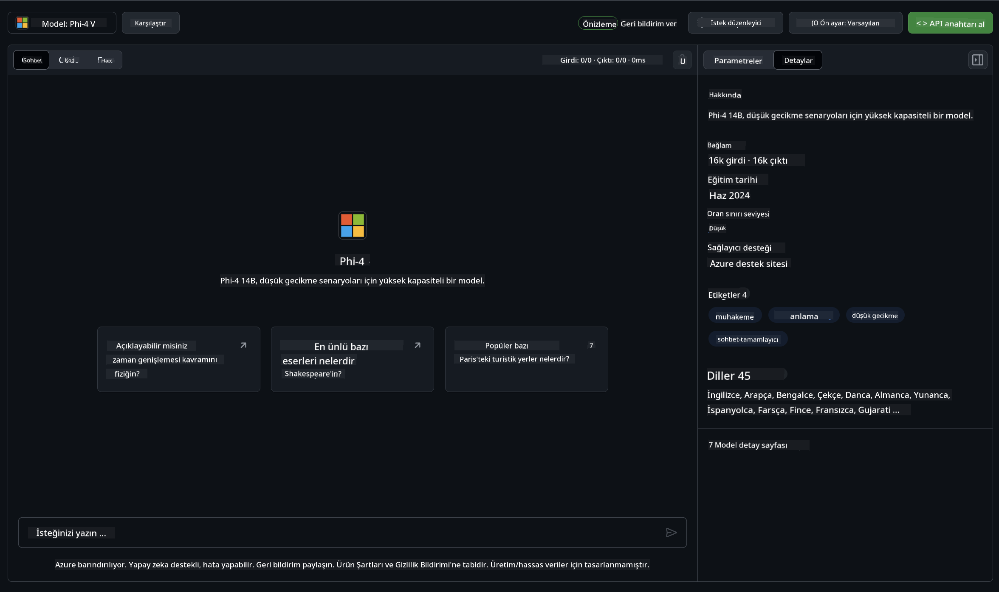
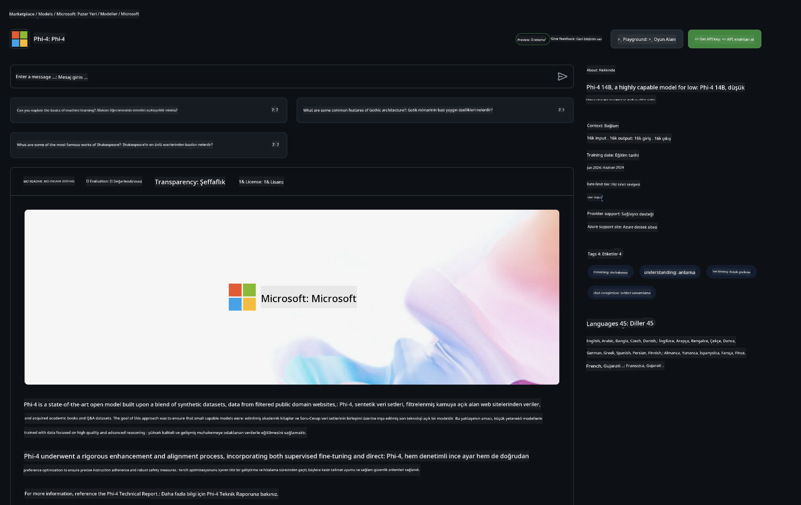

<!--
CO_OP_TRANSLATOR_METADATA:
{
  "original_hash": "fb67a08b9fc911a10ed58081fadef416",
  "translation_date": "2025-07-16T19:00:54+00:00",
  "source_file": "md/01.Introduction/02/02.GitHubModel.md",
  "language_code": "tr"
}
-->
## GitHub Modellerinde Phi Ailesi

[GitHub Modelleri](https://github.com/marketplace/models) sayfasına hoş geldiniz! Azure AI üzerinde barındırılan Yapay Zeka Modellerini keşfetmeniz için her şey hazır ve sizi bekliyor.


GitHub Modellerinde bulunan modeller hakkında daha fazla bilgi için [GitHub Model Marketplace](https://github.com/marketplace/models) sayfasını inceleyebilirsiniz.

## Mevcut Modeller

Her model için özel bir deneme alanı ve örnek kodlar bulunmaktadır.



### GitHub Model Kataloğunda Phi Ailesi

- [Phi-4](https://github.com/marketplace/models/azureml/Phi-4)

- [Phi-3.5-MoE instruct (128k)](https://github.com/marketplace/models/azureml/Phi-3-5-MoE-instruct)

- [Phi-3.5-vision instruct (128k)](https://github.com/marketplace/models/azureml/Phi-3-5-vision-instruct)

- [Phi-3.5-mini instruct (128k)](https://github.com/marketplace/models/azureml/Phi-3-5-mini-instruct)

- [Phi-3-Medium-128k-Instruct](https://github.com/marketplace/models/azureml/Phi-3-medium-128k-instruct)

- [Phi-3-medium-4k-instruct](https://github.com/marketplace/models/azureml/Phi-3-medium-4k-instruct)

- [Phi-3-mini-128k-instruct](https://github.com/marketplace/models/azureml/Phi-3-mini-128k-instruct)

- [Phi-3-mini-4k-instruct](https://github.com/marketplace/models/azureml/Phi-3-mini-4k-instruct)

- [Phi-3-small-128k-instruct](https://github.com/marketplace/models/azureml/Phi-3-small-128k-instruct)

- [Phi-3-small-8k-instruct](https://github.com/marketplace/models/azureml/Phi-3-small-8k-instruct)

## Başlarken

Çalıştırmanız için hazır birkaç temel örnek bulunmaktadır. Bunları samples dizininde bulabilirsiniz. Favori programlama dilinize doğrudan geçmek isterseniz, örnekler aşağıdaki dillerde mevcuttur:

- Python
- JavaScript
- C#
- Java
- cURL

Ayrıca örnekleri ve modelleri çalıştırmak için özel bir Codespaces Ortamı da bulunmaktadır.


## Örnek Kod

Aşağıda bazı kullanım senaryoları için örnek kod parçacıkları yer almaktadır. Azure AI Inference SDK hakkında daha fazla bilgi için tam dokümantasyon ve örneklere bakabilirsiniz.

## Kurulum

1. Kişisel erişim tokenı oluşturun  
Token’a herhangi bir izin vermeniz gerekmez. Token’ın Microsoft servisine gönderileceğini unutmayın.

Aşağıdaki kod parçacıklarını kullanabilmek için, token’ınızı istemci kodu için anahtar olarak ayarlayacak bir ortam değişkeni oluşturun.

Eğer bash kullanıyorsanız:  
```
export GITHUB_TOKEN="<your-github-token-goes-here>"
```  
Powershell kullanıyorsanız:  

```
$Env:GITHUB_TOKEN="<your-github-token-goes-here>"
```  

Windows komut istemcisindeyseniz:  

```
set GITHUB_TOKEN=<your-github-token-goes-here>
```  

## Python Örneği

### Bağımlılıkları yükleyin  
Azure AI Inference SDK’yı pip ile yükleyin (Gereksinim: Python >=3.8):

```
pip install azure-ai-inference
```  
### Basit bir kod örneği çalıştırın

Bu örnek, chat completion API’sine temel bir çağrıyı gösterir. GitHub AI model çıkarım uç noktasını ve GitHub tokenınızı kullanır. Çağrı eşzamanlıdır.

```python
import os
from azure.ai.inference import ChatCompletionsClient
from azure.ai.inference.models import SystemMessage, UserMessage
from azure.core.credentials import AzureKeyCredential

endpoint = "https://models.inference.ai.azure.com"
model_name = "Phi-4"
token = os.environ["GITHUB_TOKEN"]

client = ChatCompletionsClient(
    endpoint=endpoint,
    credential=AzureKeyCredential(token),
)

response = client.complete(
    messages=[
        UserMessage(content="I have $20,000 in my savings account, where I receive a 4% profit per year and payments twice a year. Can you please tell me how long it will take for me to become a millionaire? Also, can you please explain the math step by step as if you were explaining it to an uneducated person?"),
    ],
    temperature=0.4,
    top_p=1.0,
    max_tokens=2048,
    model=model_name
)

print(response.choices[0].message.content)
```

### Çok turlu sohbet çalıştırma

Bu örnek, chat completion API ile çok turlu bir sohbeti gösterir. Modeli sohbet uygulaması için kullanırken, sohbet geçmişini yönetmeniz ve en son mesajları modele göndermeniz gerekir.

```
import os
from azure.ai.inference import ChatCompletionsClient
from azure.ai.inference.models import AssistantMessage, SystemMessage, UserMessage
from azure.core.credentials import AzureKeyCredential

token = os.environ["GITHUB_TOKEN"]
endpoint = "https://models.inference.ai.azure.com"
# Replace Model_Name
model_name = "Phi-4"

client = ChatCompletionsClient(
    endpoint=endpoint,
    credential=AzureKeyCredential(token),
)

messages = [
    SystemMessage(content="You are a helpful assistant."),
    UserMessage(content="What is the capital of France?"),
    AssistantMessage(content="The capital of France is Paris."),
    UserMessage(content="What about Spain?"),
]

response = client.complete(messages=messages, model=model_name)

print(response.choices[0].message.content)
```

### Çıktıyı akış halinde alma

Daha iyi bir kullanıcı deneyimi için, modelin yanıtını akış halinde almak istersiniz; böylece ilk token erken görünür ve uzun yanıtlar için beklemek zorunda kalmazsınız.

```
import os
from azure.ai.inference import ChatCompletionsClient
from azure.ai.inference.models import SystemMessage, UserMessage
from azure.core.credentials import AzureKeyCredential

token = os.environ["GITHUB_TOKEN"]
endpoint = "https://models.inference.ai.azure.com"
# Replace Model_Name
model_name = "Phi-4"

client = ChatCompletionsClient(
    endpoint=endpoint,
    credential=AzureKeyCredential(token),
)

response = client.complete(
    stream=True,
    messages=[
        SystemMessage(content="You are a helpful assistant."),
        UserMessage(content="Give me 5 good reasons why I should exercise every day."),
    ],
    model=model_name,
)

for update in response:
    if update.choices:
        print(update.choices[0].delta.content or "", end="")

client.close()
```

## GitHub Modelleri için ÜCRETSİZ Kullanım ve Kota Sınırları



[Deneme alanı ve ücretsiz API kullanımı için kota sınırları](https://docs.github.com/en/github-models/prototyping-with-ai-models#rate-limits), modellerle denemeler yapmanızı ve yapay zeka uygulamanızın prototipini oluşturmanızı kolaylaştırmak içindir. Bu sınırların ötesinde kullanım ve uygulamanızı ölçeklendirmek için Azure hesabından kaynak sağlamanız ve kimlik doğrulamasını GitHub kişisel erişim tokenınız yerine oradan yapmanız gerekir. Kodunuzda başka bir değişiklik yapmanıza gerek yoktur. Azure AI’de ücretsiz katman sınırlarını aşmak için bu bağlantıyı kullanabilirsiniz.

### Açıklamalar

Bir modelle etkileşimde bulunurken yapay zeka ile deneme yaptığınızı unutmayın, bu nedenle içerik hataları olabilir.

Bu özellik çeşitli sınırlamalara tabidir (dakikadaki istek sayısı, günlük istek sayısı, istek başına token sayısı ve eşzamanlı istekler dahil) ve üretim kullanımı için tasarlanmamıştır.

GitHub Modelleri, Azure AI İçerik Güvenliği kullanır. Bu filtreler GitHub Modelleri deneyiminin bir parçası olarak kapatılamaz. Ücretli bir hizmet üzerinden modelleri kullanmaya karar verirseniz, içerik filtrelerinizi ihtiyaçlarınıza göre yapılandırmanız gerekmektedir.

Bu hizmet GitHub’ın Ön Sürüm Şartları kapsamındadır.

**Feragatname**:  
Bu belge, AI çeviri servisi [Co-op Translator](https://github.com/Azure/co-op-translator) kullanılarak çevrilmiştir. Doğruluk için çaba göstersek de, otomatik çevirilerin hatalar veya yanlışlıklar içerebileceğini lütfen unutmayın. Orijinal belge, kendi dilinde yetkili kaynak olarak kabul edilmelidir. Kritik bilgiler için profesyonel insan çevirisi önerilir. Bu çevirinin kullanımı sonucu ortaya çıkabilecek yanlış anlamalar veya yorum hatalarından sorumlu değiliz.