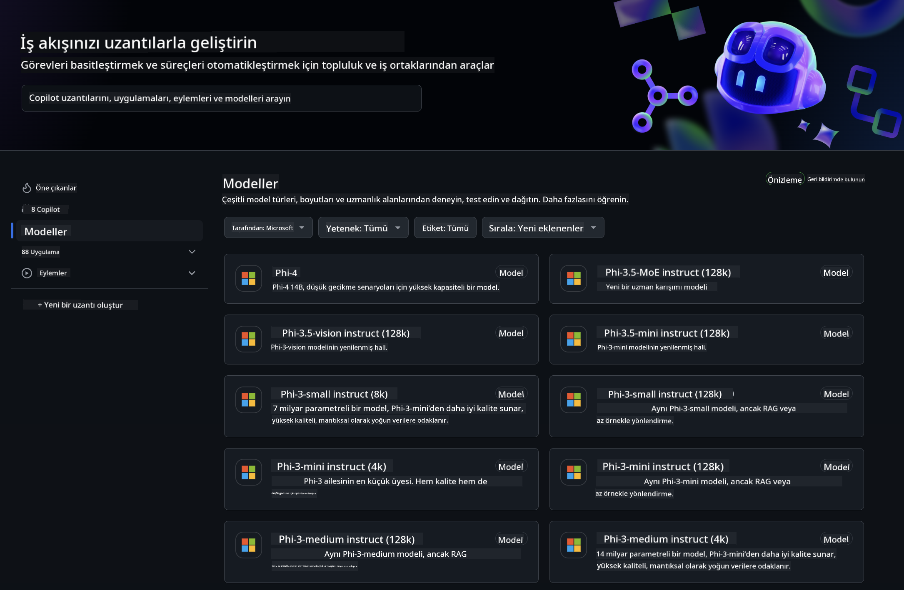
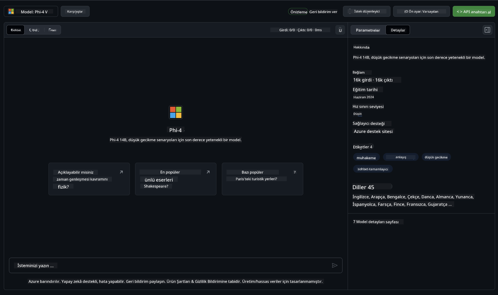
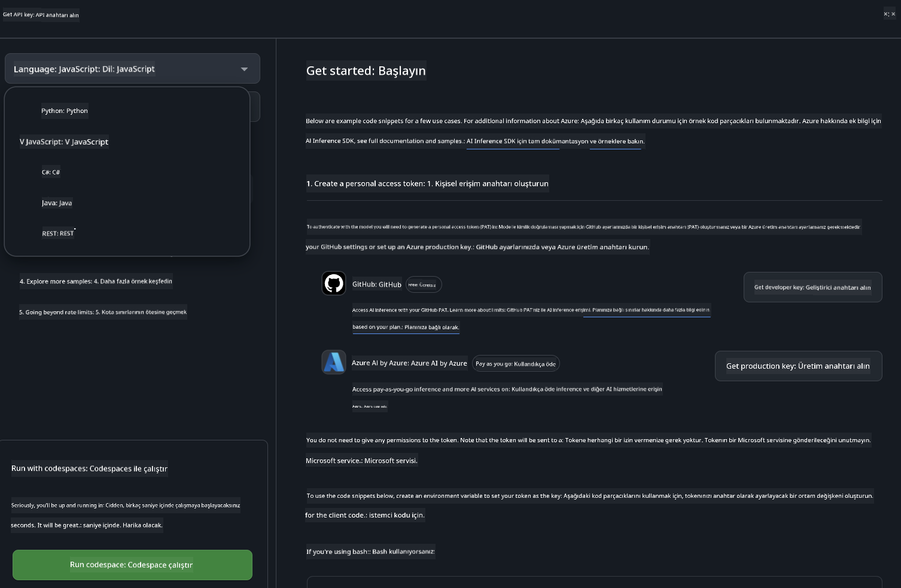

<!--
CO_OP_TRANSLATOR_METADATA:
{
  "original_hash": "fb67a08b9fc911a10ed58081fadef416",
  "translation_date": "2025-05-09T08:49:39+00:00",
  "source_file": "md/01.Introduction/02/02.GitHubModel.md",
  "language_code": "tr"
}
-->
## Phi Ailesi GitHub Modellerinde

[GitHub Modeller](https://github.com/marketplace/models)'e hoş geldiniz! Azure AI üzerinde barındırılan AI Modellerini keşfetmeniz için her şey hazır ve sizi bekliyor.



GitHub Modellerde bulunan Modeller hakkında daha fazla bilgi için [GitHub Model Marketplace](https://github.com/marketplace/models) sayfasına göz atabilirsiniz.

## Mevcut Modeller

Her modelin kendine ait bir deneme alanı ve örnek kodları bulunmaktadır.



### GitHub Model Kataloğunda Phi Ailesi

- [Phi-4](https://github.com/marketplace/models/azureml/Phi-4)

- [Phi-3.5-MoE instruct (128k)](https://github.com/marketplace/models/azureml/Phi-3-5-MoE-instruct)

- [Phi-3.5-vision instruct (128k)](https://github.com/marketplace/models/azureml/Phi-3-5-vision-instruct)

- [Phi-3.5-mini instruct (128k)](https://github.com/marketplace/models/azureml/Phi-3-5-mini-instruct)

- [Phi-3-Medium-128k-Instruct](https://github.com/marketplace/models/azureml/Phi-3-medium-128k-instruct)

- [Phi-3-medium-4k-instruct](https://github.com/marketplace/models/azureml/Phi-3-medium-4k-instruct)

- [Phi-3-mini-128k-instruct](https://github.com/marketplace/models/azureml/Phi-3-mini-128k-instruct)

- [Phi-3-mini-4k-instruct](https://github.com/marketplace/models/azureml/Phi-3-mini-4k-instruct)

- [Phi-3-small-128k-instruct](https://github.com/marketplace/models/azureml/Phi-3-small-128k-instruct)

- [Phi-3-small-8k-instruct](https://github.com/marketplace/models/azureml/Phi-3-small-8k-instruct)

## Başlarken

Çalıştırmanız için birkaç temel örnek hazır. Bunları samples dizininde bulabilirsiniz. Favori programlama dilinize doğrudan geçmek isterseniz, örnekleri aşağıdaki dillerde bulabilirsiniz:

- Python
- JavaScript
- C#
- Java
- cURL

Ayrıca örnekleri ve modelleri çalıştırmak için özel bir Codespaces Ortamı da mevcuttur.




## Örnek Kod

Aşağıda birkaç kullanım durumu için örnek kod parçacıkları bulunmaktadır. Azure AI Inference SDK hakkında daha fazla bilgi için tam dokümantasyon ve örneklere bakabilirsiniz.

## Kurulum

1. Kişisel erişim tokenı oluşturun  
Token’a herhangi bir izin vermenize gerek yoktur. Token’ın Microsoft servisine gönderileceğini unutmayın.

Aşağıdaki kod parçacıklarını kullanabilmek için, token’ınızı client kodu için anahtar olarak ayarlayan bir ortam değişkeni oluşturun.

Eğer bash kullanıyorsanız:  
```
export GITHUB_TOKEN="<your-github-token-goes-here>"
```  
Eğer powershell kullanıyorsanız:  

```
$Env:GITHUB_TOKEN="<your-github-token-goes-here>"
```  

Windows komut istemcisindeyseniz:  

```
set GITHUB_TOKEN=<your-github-token-goes-here>
```  

## Python Örneği

### Bağımlılıkları yükleyin  
Azure AI Inference SDK’yı pip ile yükleyin (Gereksinim: Python >=3.8):

```
pip install azure-ai-inference
```  
### Temel bir kod örneği çalıştırın

Bu örnek, chat completion API’sine temel bir çağrı yapmayı gösterir. GitHub AI model çıkarım uç noktasını ve GitHub token’ınızı kullanır. Çağrı eşzamanlıdır.

```python
import os
from azure.ai.inference import ChatCompletionsClient
from azure.ai.inference.models import SystemMessage, UserMessage
from azure.core.credentials import AzureKeyCredential

endpoint = "https://models.inference.ai.azure.com"
model_name = "Phi-4"
token = os.environ["GITHUB_TOKEN"]

client = ChatCompletionsClient(
    endpoint=endpoint,
    credential=AzureKeyCredential(token),
)

response = client.complete(
    messages=[
        UserMessage(content="I have $20,000 in my savings account, where I receive a 4% profit per year and payments twice a year. Can you please tell me how long it will take for me to become a millionaire? Also, can you please explain the math step by step as if you were explaining it to an uneducated person?"),
    ],
    temperature=0.4,
    top_p=1.0,
    max_tokens=2048,
    model=model_name
)

print(response.choices[0].message.content)
```

### Çok turlu sohbet çalıştırma

Bu örnek, chat completion API ile çok turlu bir sohbeti gösterir. Modeli bir sohbet uygulaması için kullanırken, sohbet geçmişini yönetmeniz ve modele en son mesajları göndermeniz gerekir.

```
import os
from azure.ai.inference import ChatCompletionsClient
from azure.ai.inference.models import AssistantMessage, SystemMessage, UserMessage
from azure.core.credentials import AzureKeyCredential

token = os.environ["GITHUB_TOKEN"]
endpoint = "https://models.inference.ai.azure.com"
# Replace Model_Name
model_name = "Phi-4"

client = ChatCompletionsClient(
    endpoint=endpoint,
    credential=AzureKeyCredential(token),
)

messages = [
    SystemMessage(content="You are a helpful assistant."),
    UserMessage(content="What is the capital of France?"),
    AssistantMessage(content="The capital of France is Paris."),
    UserMessage(content="What about Spain?"),
]

response = client.complete(messages=messages, model=model_name)

print(response.choices[0].message.content)
```

### Çıktıyı akış halinde gösterme

Daha iyi bir kullanıcı deneyimi için, modelin yanıtını akış halinde almak istersiniz; böylece ilk token daha erken görünür ve uzun yanıtlar için beklemek zorunda kalmazsınız.

```
import os
from azure.ai.inference import ChatCompletionsClient
from azure.ai.inference.models import SystemMessage, UserMessage
from azure.core.credentials import AzureKeyCredential

token = os.environ["GITHUB_TOKEN"]
endpoint = "https://models.inference.ai.azure.com"
# Replace Model_Name
model_name = "Phi-4"

client = ChatCompletionsClient(
    endpoint=endpoint,
    credential=AzureKeyCredential(token),
)

response = client.complete(
    stream=True,
    messages=[
        SystemMessage(content="You are a helpful assistant."),
        UserMessage(content="Give me 5 good reasons why I should exercise every day."),
    ],
    model=model_name,
)

for update in response:
    if update.choices:
        print(update.choices[0].delta.content or "", end="")

client.close()
```

## GitHub Modelleri için ÜCRETSİZ Kullanım ve Oran Sınırları


[Deneme alanı ve ücretsiz API kullanım oran sınırları](https://docs.github.com/en/github-models/prototyping-with-ai-models#rate-limits), modellerle deneme yapmanızı ve AI uygulamanızın prototipini oluşturmanızı desteklemek için tasarlanmıştır. Bu sınırların ötesinde kullanım için ve uygulamanızı ölçeklendirmek amacıyla, Azure hesabınızdan kaynak sağlamanız ve kimlik doğrulamasını GitHub kişisel erişim token’ınız yerine oradan yapmanız gerekir. Kodunuzda başka bir değişiklik yapmanıza gerek yoktur. Ücretsiz katman sınırlarını aşmak için Azure AI’da nasıl ilerleyeceğinizi bu bağlantıdan öğrenebilirsiniz.

### Açıklamalar

Bir modelle etkileşimde bulunurken AI ile deneme yaptığınızı unutmayın; bu nedenle içerik hataları olabilir.

Özellik çeşitli sınırlamalara tabidir (dakika başına istek sayısı, günlük istek sayısı, istek başına token sayısı ve eşzamanlı istekler dahil) ve üretim kullanımı için tasarlanmamıştır.

GitHub Modeller Azure AI İçerik Güvenliği kullanır. Bu filtreler GitHub Modeller deneyimi kapsamında kapatılamaz. Ücretli bir hizmet üzerinden modelleri kullanmaya karar verirseniz, içerik filtrelerinizi ihtiyaçlarınıza göre yapılandırmanız gerekir.

Bu hizmet GitHub’ın Ön Sürüm Şartları kapsamındadır.

**Feragatname**:  
Bu belge, AI çeviri servisi [Co-op Translator](https://github.com/Azure/co-op-translator) kullanılarak çevrilmiştir. Doğruluk için çaba gösterilse de, otomatik çevirilerin hatalar veya yanlışlıklar içerebileceğini lütfen unutmayınız. Orijinal belge, kendi dilinde yetkili kaynak olarak kabul edilmelidir. Kritik bilgiler için profesyonel insan çevirisi önerilir. Bu çevirinin kullanımı sonucunda oluşabilecek yanlış anlamalar veya yorum hatalarından sorumlu değiliz.