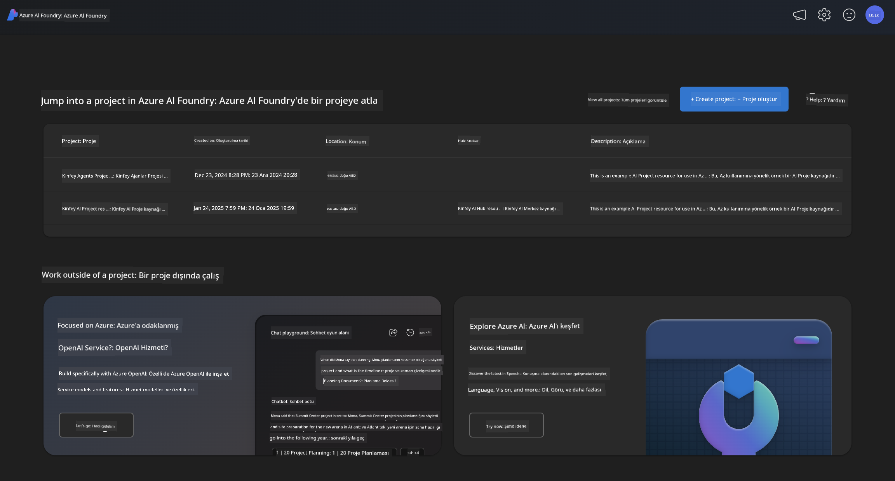
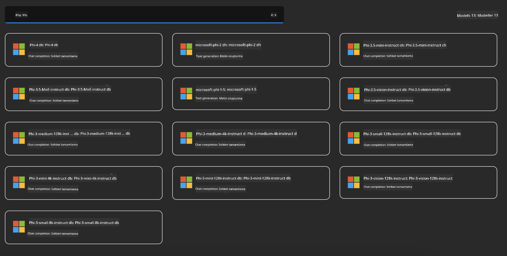
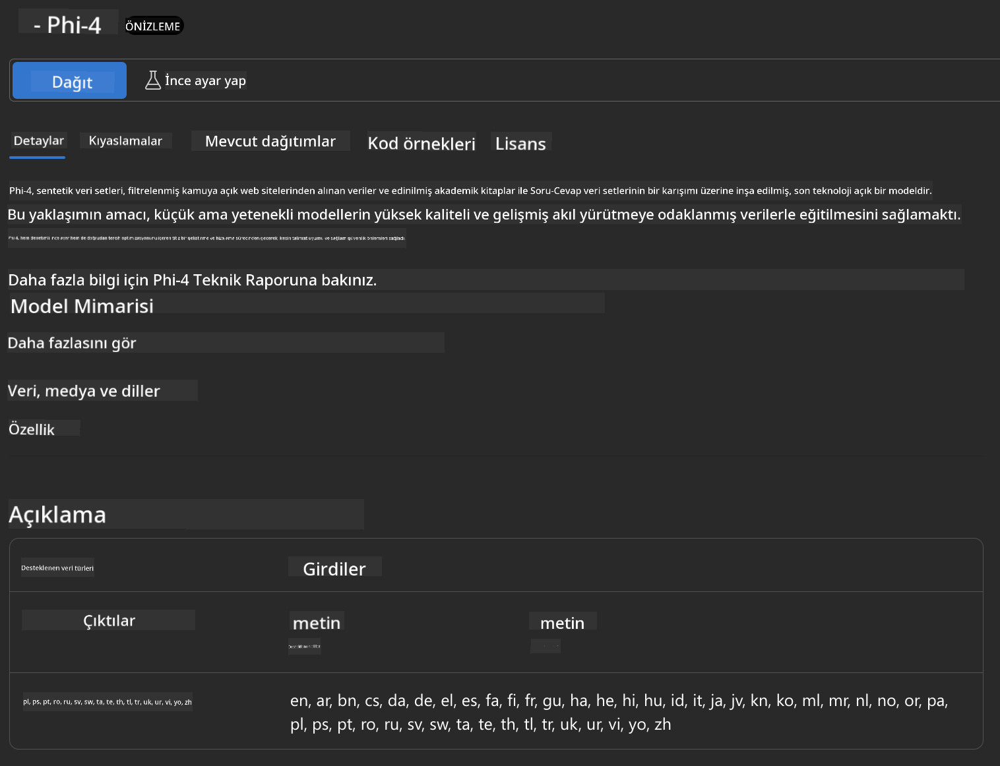
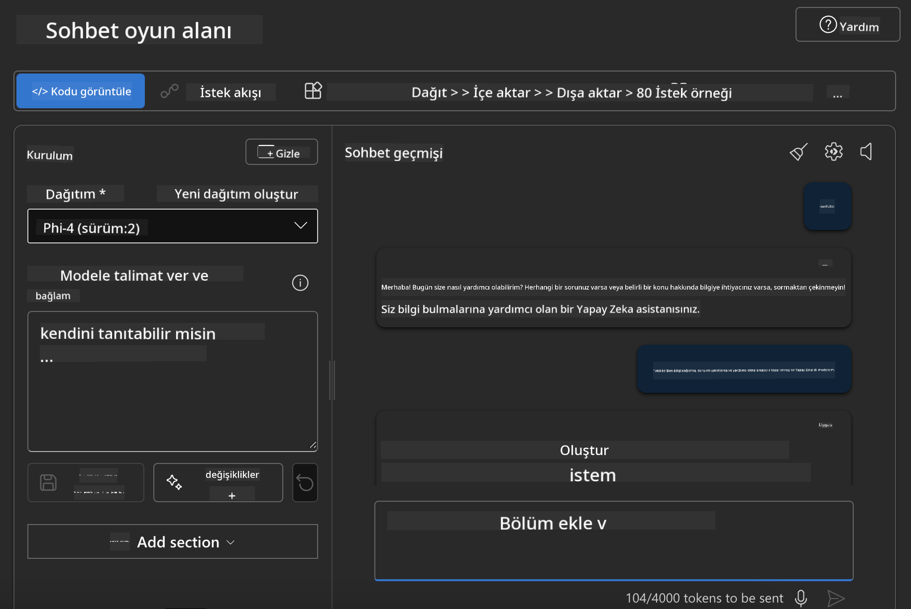

<!--
CO_OP_TRANSLATOR_METADATA:
{
  "original_hash": "3ae21dc5554e888defbe57946ee995ee",
  "translation_date": "2025-07-16T19:09:09+00:00",
  "source_file": "md/01.Introduction/02/03.AzureAIFoundry.md",
  "language_code": "tr"
}
-->
## Azure AI Foundry'de Phi Ailesi

[Azure AI Foundry](https://ai.azure.com), geliştiricilerin yenilik yapmasını ve geleceği yapay zeka ile güvenli, emniyetli ve sorumlu bir şekilde şekillendirmesini sağlayan güvenilir bir platformdur.

[Azure AI Foundry], geliştiriciler için tasarlanmıştır:

- Kurumsal düzeyde bir platformda üretken yapay zeka uygulamaları geliştirmek.
- Sorumlu yapay zeka uygulamalarına dayalı, en son yapay zeka araçları ve ML modellerini keşfetmek, oluşturmak, test etmek ve dağıtmak.
- Uygulama geliştirme sürecinin tamamında bir ekip ile iş birliği yapmak.

Azure AI Foundry ile çok çeşitli modelleri, servisleri ve yetenekleri keşfedebilir ve hedeflerinize en uygun yapay zeka uygulamalarını geliştirmeye başlayabilirsiniz. Azure AI Foundry platformu, kavram kanıtlarını tam kapsamlı üretim uygulamalarına dönüştürürken ölçeklenebilirliği kolaylaştırır. Sürekli izleme ve iyileştirme uzun vadeli başarıyı destekler.



Azure AI Foundry'de Azure AOAI Service kullanmanın yanı sıra, Azure AI Foundry Model Kataloğu'nda üçüncü taraf modelleri de kullanabilirsiniz. Eğer Azure AI Foundry'yi yapay zeka çözüm platformunuz olarak kullanmak istiyorsanız bu iyi bir seçenektir.

Azure AI Foundry Model Kataloğu üzerinden Phi Ailesi Modellerini hızlıca dağıtabiliriz

[Microsoft Phi Modelleri Azure AI Foundry Modellerinde](https://ai.azure.com/explore/models/?selectedCollection=phi)



### **Azure AI Foundry'de Phi-4'ü Dağıtma**



### **Azure AI Foundry Playground'da Phi-4'ü Test Etme**



### **Azure AI Foundry Phi-4'ü Çağırmak için Python Kodu Çalıştırma**

```python

import os  
import base64
from openai import AzureOpenAI  
from azure.identity import DefaultAzureCredential, get_bearer_token_provider  
        
endpoint = os.getenv("ENDPOINT_URL", "Your Azure AOAI Service Endpoint")  
deployment = os.getenv("DEPLOYMENT_NAME", "Phi-4")  
      
token_provider = get_bearer_token_provider(  
    DefaultAzureCredential(),  
    "https://cognitiveservices.azure.com/.default"  
)  
  
client = AzureOpenAI(  
    azure_endpoint=endpoint,  
    azure_ad_token_provider=token_provider,  
    api_version="2024-05-01-preview",  
)  
  

chat_prompt = [
    {
        "role": "system",
        "content": "You are an AI assistant that helps people find information."
    },
    {
        "role": "user",
        "content": "can you introduce yourself"
    }
] 
    
# Include speech result if speech is enabled  
messages = chat_prompt 

completion = client.chat.completions.create(  
    model=deployment,  
    messages=messages,
    max_tokens=800,  
    temperature=0.7,  
    top_p=0.95,  
    frequency_penalty=0,  
    presence_penalty=0,
    stop=None,  
    stream=False  
)  
  
print(completion.to_json())  

```

**Feragatname**:  
Bu belge, AI çeviri servisi [Co-op Translator](https://github.com/Azure/co-op-translator) kullanılarak çevrilmiştir. Doğruluk için çaba göstersek de, otomatik çevirilerin hatalar veya yanlışlıklar içerebileceğini lütfen unutmayınız. Orijinal belge, kendi dilinde yetkili kaynak olarak kabul edilmelidir. Kritik bilgiler için profesyonel insan çevirisi önerilir. Bu çevirinin kullanımı sonucu ortaya çıkabilecek yanlış anlamalar veya yorumlamalardan sorumlu değiliz.