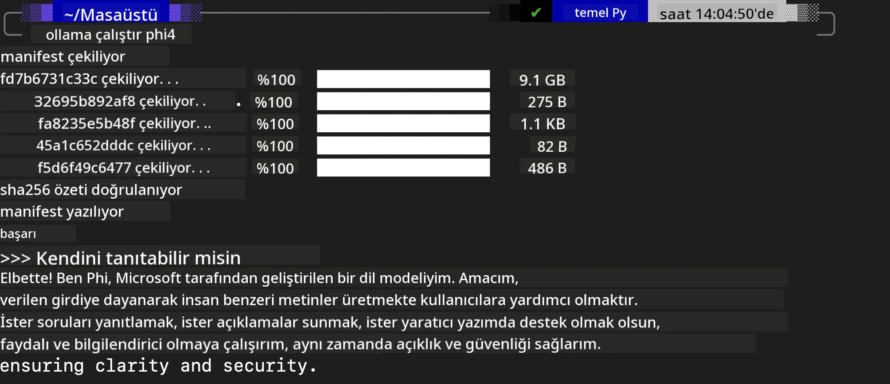

## Ollama'daki Phi Ailesi


[Ollama](https://ollama.com) daha fazla kişinin açık kaynak LLM veya SLM'i basit betikler aracılığıyla doğrudan dağıtmasına olanak tanır ve yerel Copilot uygulama senaryolarına yardımcı olması için API'ler oluşturabilir.

## **1. Kurulum**

Ollama, Windows, macOS ve Linux üzerinde çalışmayı destekler. Ollama'yı şu bağlantı üzerinden yükleyebilirsiniz ([https://ollama.com/download](https://ollama.com/download)). Başarılı kurulumdan sonra, bir terminal penceresinde Ollama betiğini kullanarak doğrudan Phi-3'ü çağırabilirsiniz. Tüm [mevcut kütüphaneleri Ollama'da](https://ollama.com/library) görebilirsiniz. Bu depoyu bir Codespace içinde açarsanız, Ollama zaten yüklü olacaktır.

```bash

ollama run phi4

```

> [!NOTE]
> Model, ilk çalıştırdığınızda önce indirilecektir. Elbette, indirilmiş Phi-4 modelini doğrudan belirtebilirsiniz. Komutu çalıştırmak için WSL örneğini alıyoruz. Model başarıyla indirildikten sonra terminal üzerinde doğrudan etkileşimde bulunabilirsiniz.



## **2. Ollama'dan phi-4 API'sini çağırma**

Ollama tarafından oluşturulan Phi-4 API'sini çağırmak istiyorsanız, Ollama sunucusunu başlatmak için terminalde bu komutu kullanabilirsiniz.

```bash

ollama serve

```

> [!NOTE]
> macOS veya Linux çalıştırıyorsanız, şu hatayla karşılaşabileceğinizi unutmayın **"Error: listen tcp 127.0.0.1:11434: bind: address already in use"** Bu komutu çalıştırırken bu hatayı alabilirsiniz. Bu hatayı görmezden gelebilirsiniz, çünkü genellikle sunucunun zaten çalıştığını gösterir; ya da Ollama'yı durdurup yeniden başlatabilirsiniz:

**macOS**

```bash

brew services restart ollama

```

**Linux**

```bash

sudo systemctl stop ollama

```

Ollama iki API'yi destekler: generate ve chat. İhtiyaçlarınıza göre Ollama tarafından sağlanan model API'sini, 11434 portunda çalışan yerel servise istek göndererek çağırabilirsiniz.

**Sohbet**

```bash

curl http://127.0.0.1:11434/api/chat -d '{
  "model": "phi3",
  "messages": [
    {
      "role": "system",
      "content": "Your are a python developer."
    },
    {
      "role": "user",
      "content": "Help me generate a bubble algorithm"
    }
  ],
  "stream": false
  
}'
```

Bu, Postman'deki sonuçtur


## Ek Kaynaklar

Ollama'daki kullanılabilir modellerin listesini [kütüphanelerinde](https://ollama.com/library) kontrol edin.

Modelinizi Ollama sunucusundan şu komutla çekin

```bash
ollama pull phi4
```

Modeli şu komutla çalıştırın

```bash
ollama run phi4
```

***Not:*** Daha fazlasını öğrenmek için bu bağlantıyı ziyaret edin [https://github.com/ollama/ollama/blob/main/docs/api.md](https://github.com/ollama/ollama/blob/main/docs/api.md)

## Ollama'yı Python'dan Çağırma

Yukarıda kullanılan yerel sunucu uç noktalarına istek yapmak için `requests` veya `urllib3` kullanabilirsiniz. Ancak, Ollama'nın OpenAI uyumlu sunucu uç noktaları sağlaması nedeniyle, Python'da Ollama'yı kullanmanın popüler yollarından biri [openai](https://pypi.org/project/openai/) SDK'sıdır.

phi3-mini için bir örnek:

```python
import openai

client = openai.OpenAI(
    base_url="http://localhost:11434/v1",
    api_key="nokeyneeded",
)

response = client.chat.completions.create(
    model="phi4",
    temperature=0.7,
    n=1,
    messages=[
        {"role": "system", "content": "You are a helpful assistant."},
        {"role": "user", "content": "Write a haiku about a hungry cat"},
    ],
)

print("Response:")
print(response.choices[0].message.content)
```

## Ollama'yı JavaScript'ten Çağırma 
```javascript
// Phi-4 ile bir dosyanın özetlenmesine örnek
script({
    model: "ollama:phi4",
    title: "Summarize with Phi-4",
    system: ["system"],
})

// Özetleme örneği
const file = def("FILE", env.files)
$`Summarize ${file} in a single paragraph.`
```

## Ollama'yı C#'tan Çağırma

Yeni bir C# Console uygulaması oluşturun ve aşağıdaki NuGet paketini ekleyin:

```bash
dotnet add package Microsoft.SemanticKernel --version 1.34.0
```

Ardından `Program.cs` dosyasındaki bu kodu değiştirin

```csharp
using Microsoft.SemanticKernel;
using Microsoft.SemanticKernel.ChatCompletion;

// add chat completion service using the local ollama server endpoint
#pragma warning disable SKEXP0001, SKEXP0003, SKEXP0010, SKEXP0011, SKEXP0050, SKEXP0052
builder.AddOpenAIChatCompletion(
    modelId: "phi4",
    endpoint: new Uri("http://localhost:11434/"),
    apiKey: "non required");

// invoke a simple prompt to the chat service
string prompt = "Write a joke about kittens";
var response = await kernel.InvokePromptAsync(prompt);
Console.WriteLine(response.GetValue<string>());
```

Uygulamayı şu komutla çalıştırın:

```bash
dotnet run
```

---

<!-- CO-OP TRANSLATOR DISCLAIMER START -->
Feragatname:
Bu belge, AI çeviri hizmeti [Co-op Translator](https://github.com/Azure/co-op-translator) kullanılarak çevrilmiştir. Doğruluk için çaba göstersek de, otomatik çevirilerin hatalar veya yanlışlıklar içerebileceğini lütfen unutmayın. Orijinal belgenin kendi dilindeki versiyonu otoritatif kaynak olarak kabul edilmelidir. Kritik bilgiler için profesyonel insan çevirisi önerilir. Bu çevirinin kullanımı sonucunda ortaya çıkabilecek herhangi bir yanlış anlama veya hatalı yorumdan sorumlu değiliz.
<!-- CO-OP TRANSLATOR DISCLAIMER END -->