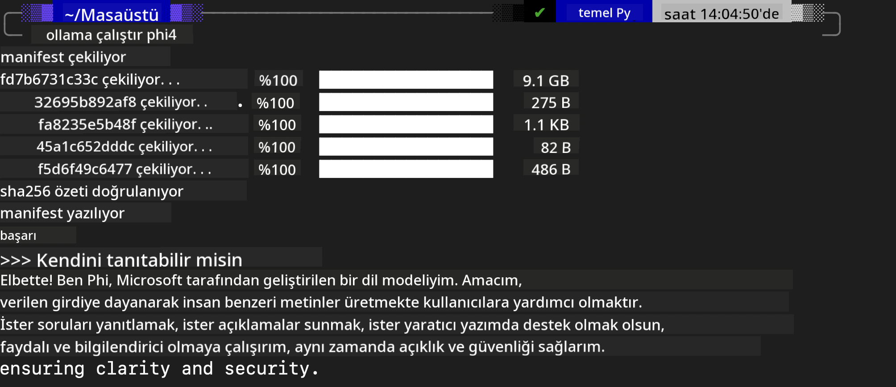
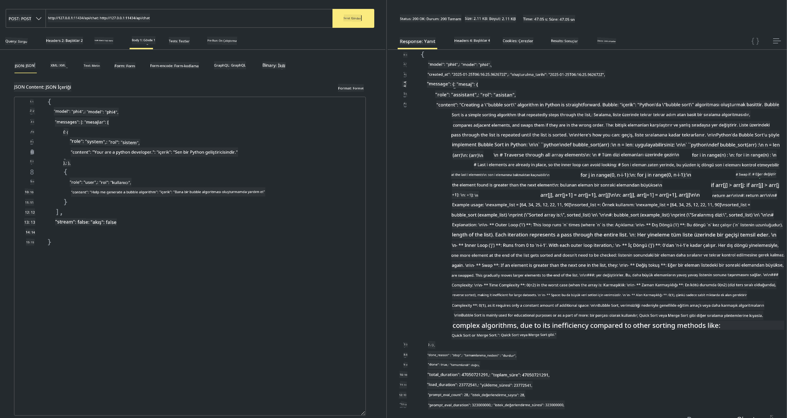

<!--
CO_OP_TRANSLATOR_METADATA:
{
  "original_hash": "0b38834693bb497f96bf53f0d941f9a1",
  "translation_date": "2025-07-16T19:15:56+00:00",
  "source_file": "md/01.Introduction/02/04.Ollama.md",
  "language_code": "tr"
}
-->
## Ollama'da Phi Ailesi


[Ollama](https://ollama.com), daha fazla kişinin açık kaynak LLM veya SLM'yi basit betikler aracılığıyla doğrudan dağıtmasına olanak tanır ve yerel Copilot uygulama senaryolarına yardımcı olmak için API'ler oluşturabilir.

## **1. Kurulum**

Ollama, Windows, macOS ve Linux üzerinde çalışmayı destekler. Ollama'yı bu bağlantıdan ([https://ollama.com/download](https://ollama.com/download)) kurabilirsiniz. Kurulum başarılı olduktan sonra, terminal penceresinden doğrudan Ollama betiğini kullanarak Phi-3'ü çağırabilirsiniz. Tüm [mevcut kütüphaneleri Ollama'da görebilirsiniz](https://ollama.com/library). Bu depoyu bir Codespace içinde açarsanız, Ollama zaten yüklü olacaktır.

```bash

ollama run phi4

```

> [!NOTE]
> Model, ilk kez çalıştırdığınızda indirilecektir. Tabii ki, indirilen Phi-4 modelini doğrudan da belirtebilirsiniz. Komutu çalıştırmak için WSL örneğini kullanıyoruz. Model başarıyla indirildikten sonra, terminal üzerinden doğrudan etkileşimde bulunabilirsiniz.



## **2. Ollama'dan phi-4 API'sini Çağırma**

Ollama tarafından oluşturulan Phi-4 API'sini çağırmak istiyorsanız, terminalde bu komutu kullanarak Ollama sunucusunu başlatabilirsiniz.

```bash

ollama serve

```

> [!NOTE]
> MacOS veya Linux kullanıyorsanız, aşağıdaki hatayla karşılaşabilirsiniz **"Error: listen tcp 127.0.0.1:11434: bind: address already in use"** Bu hatayı komutu çalıştırırken alabilirsiniz. Bu hatayı genellikle sunucunun zaten çalıştığını gösterdiği için görmezden gelebilirsiniz veya Ollama'yı durdurup yeniden başlatabilirsiniz:

**macOS**

```bash

brew services restart ollama

```

**Linux**

```bash

sudo systemctl stop ollama

```

Ollama iki API destekler: generate ve chat. İhtiyacınıza göre, 11434 portunda çalışan yerel servise istek göndererek Ollama'nın sağladığı model API'sini çağırabilirsiniz.

**Chat**

```bash

curl http://127.0.0.1:11434/api/chat -d '{
  "model": "phi3",
  "messages": [
    {
      "role": "system",
      "content": "Your are a python developer."
    },
    {
      "role": "user",
      "content": "Help me generate a bubble algorithm"
    }
  ],
  "stream": false
  
}'

This is the result in Postman



## Additional Resources

Check the list of available models in Ollama in [their library](https://ollama.com/library).

Pull your model from the Ollama server using this command

```bash
ollama pull phi4
```

Run the model using this command

```bash
ollama run phi4
```

***Note:*** Visit this link [https://github.com/ollama/ollama/blob/main/docs/api.md](https://github.com/ollama/ollama/blob/main/docs/api.md) to learn more

## Calling Ollama from Python

You can use `requests` or `urllib3` to make requests to the local server endpoints used above. However, a popular way to use Ollama in Python is via the [openai](https://pypi.org/project/openai/) SDK, since Ollama provides OpenAI-compatible server endpoints as well.

Here is an example for phi3-mini:

```python
import openai

client = openai.OpenAI(
    base_url="http://localhost:11434/v1",
    api_key="nokeyneeded",
)

response = client.chat.completions.create(
    model="phi4",
    temperature=0.7,
    n=1,
    messages=[
        {"role": "system", "content": "You are a helpful assistant."},
        {"role": "user", "content": "Write a haiku about a hungry cat"},
    ],
)

print("Response:")
print(response.choices[0].message.content)
```

## Calling Ollama from JavaScript 

```javascript
// Phi-4 ile bir dosyayı özetleme örneği
script({
    model: "ollama:phi4",
    title: "Phi-4 ile Özetle",
    system: ["system"],
})

// Özetleme örneği
const file = def("FILE", env.files)
$`Özetle ${file} tek bir paragrafta.`
```

## Calling Ollama from C#

Create a new C# Console application and add the following NuGet package:

```bash
dotnet add package Microsoft.SemanticKernel --version 1.34.0
```

Then replace this code in the `Program.cs` file

```csharp
using Microsoft.SemanticKernel;
using Microsoft.SemanticKernel.ChatCompletion;

// yerel ollama sunucu uç noktasını kullanarak sohbet tamamlama servisini ekle
#pragma warning disable SKEXP0001, SKEXP0003, SKEXP0010, SKEXP0011, SKEXP0050, SKEXP0052
builder.AddOpenAIChatCompletion(
    modelId: "phi4",
    endpoint: new Uri("http://localhost:11434/"),
    apiKey: "non required");

// sohbet servisine basit bir istem gönder
string prompt = "Kedilerle ilgili bir şaka yaz";
var response = await kernel.InvokePromptAsync(prompt);
Console.WriteLine(response.GetValue<string>());
```

Run the app with the command:

```bash
dotnet run

**Feragatname**:  
Bu belge, AI çeviri servisi [Co-op Translator](https://github.com/Azure/co-op-translator) kullanılarak çevrilmiştir. Doğruluk için çaba göstersek de, otomatik çevirilerin hatalar veya yanlışlıklar içerebileceğini lütfen unutmayın. Orijinal belge, kendi dilinde yetkili kaynak olarak kabul edilmelidir. Kritik bilgiler için profesyonel insan çevirisi önerilir. Bu çevirinin kullanımı sonucu ortaya çıkabilecek yanlış anlamalar veya yorum hatalarından sorumlu değiliz.