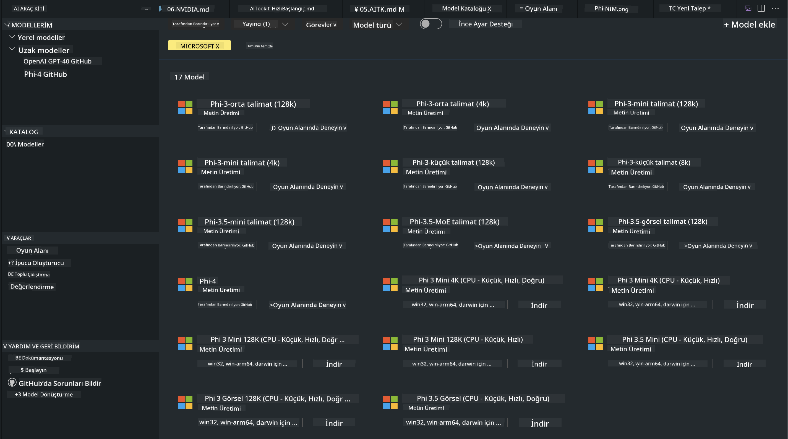
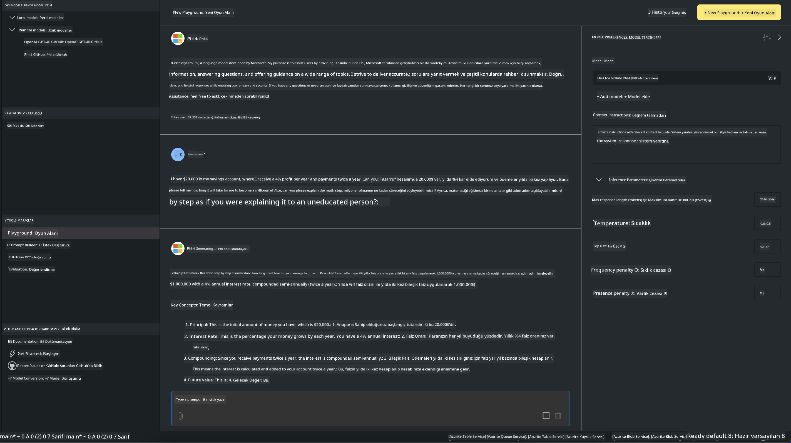

<!--
CO_OP_TRANSLATOR_METADATA:
{
  "original_hash": "4951d458c0b60c02cd1e751b40903877",
  "translation_date": "2025-05-09T09:33:30+00:00",
  "source_file": "md/01.Introduction/02/05.AITK.md",
  "language_code": "tr"
}
-->
# Phi Ailesi AITK'da

[AI Toolkit for VS Code](https://marketplace.visualstudio.com/items?itemName=ms-windows-ai-studio.windows-ai-studio), Azure AI Foundry Kataloğu ve Hugging Face gibi diğer kataloglardan en yeni yapay zeka geliştirme araçları ve modellerini bir araya getirerek üretken yapay zeka uygulama geliştirmeyi kolaylaştırır. GitHub Modelleri ve Azure AI Foundry Model Katalogları tarafından desteklenen yapay zeka modelleri kataloğunda gezinebilir, modelleri yerel veya uzaktan indirip, ince ayar yapabilir, test edebilir ve uygulamanızda kullanabilirsiniz.

AI Toolkit Önizlemesi yerel olarak çalışacaktır. Yerel çıkarım veya ince ayar, seçtiğiniz modele bağlıdır; NVIDIA CUDA GPU gibi bir GPU’ya ihtiyacınız olabilir. GitHub Modellerini doğrudan AITK ile de çalıştırabilirsiniz.

## Başlarken

[Windows alt sistemini Linux için nasıl kuracağınızı öğrenin](https://learn.microsoft.com/windows/wsl/install?WT.mc_id=aiml-137032-kinfeylo)

ve [varsayılan dağıtımı değiştirme](https://learn.microsoft.com/windows/wsl/install#change-the-default-linux-distribution-installed).

[AI Toolkit GitHub Deposu](https://github.com/microsoft/vscode-ai-toolkit/)

- Windows, Linux, macOS
  
- Hem Windows hem Linux üzerinde ince ayar yapmak için Nvidia GPU gereklidir. Ayrıca, **Windows** için Ubuntu dağıtımı 18.4 veya daha yeni olan Linux alt sistemi gereklidir. [Windows alt sistemini Linux için nasıl kuracağınızı öğrenin](https://learn.microsoft.com/windows/wsl/install) ve [varsayılan dağıtımı değiştirme](https://learn.microsoft.com/windows/wsl/install#change-the-default-linux-distribution-installed).

### AI Toolkit Kurulumu

AI Toolkit, bir [Visual Studio Code Eklentisi](https://code.visualstudio.com/docs/setup/additional-components#_vs-code-extensions) olarak sunulur, bu yüzden önce [VS Code](https://code.visualstudio.com/docs/setup/windows?WT.mc_id=aiml-137032-kinfeylo) yüklemeli ve ardından AI Toolkit'i [VS Marketplace](https://marketplace.visualstudio.com/items?itemName=ms-windows-ai-studio.windows-ai-studio) üzerinden indirmeniz gerekir.  
[AI Toolkit Visual Studio Marketplace'te mevcuttur](https://marketplace.visualstudio.com/items?itemName=ms-windows-ai-studio.windows-ai-studio) ve diğer VS Code eklentileri gibi kurulabilir.

VS Code eklentisi yüklemeye aşina değilseniz, şu adımları izleyin:

### Oturum Açma

1. VS Code’daki Aktivite Çubuğunda **Extensions** (Eklentiler) seçeneğini tıklayın  
1. Eklenti Arama çubuğuna "AI Toolkit" yazın  
1. "AI Toolkit for Visual Studio code" seçeneğini seçin  
1. **Install** (Yükle) seçeneğine tıklayın  

Artık eklentiyi kullanmaya hazırsınız!

GitHub’a giriş yapmanız istenecek, devam etmek için lütfen "Allow" (İzin Ver) butonuna tıklayın. GitHub giriş sayfasına yönlendirileceksiniz.

Lütfen giriş yapın ve işlem adımlarını takip edin. Başarıyla tamamlandıktan sonra VS Code’a geri yönlendirileceksiniz.

Eklenti yüklendikten sonra, Aktivite Çubuğunuzda AI Toolkit simgesini göreceksiniz.

Hadi mevcut işlemleri keşfedelim!

### Mevcut İşlemler

AI Toolkit’in ana yan çubuğu şu şekilde düzenlenmiştir:

- **Models**  
- **Resources**  
- **Playground**  
- **Fine-tuning**  
- **Evaluation**

Resources bölümünde bulunur. Başlamak için **Model Catalog** seçin.

### Katalogdan model indirme

VS Code yan çubuğundan AI Toolkit’i başlattığınızda aşağıdaki seçeneklerden birini seçebilirsiniz:



- **Model Catalog**’tan desteklenen bir modeli bulun ve yerel olarak indirin  
- **Model Playground**’da model çıkarımını test edin  
- **Model Fine-tuning** ile modeli yerel veya uzaktan ince ayar yapın  
- İnce ayar yapılmış modelleri AI Toolkit için komut paletinden buluta dağıtın  
- Modelleri değerlendirin

> [!NOTE]
>
> **GPU ve CPU**
>
> Model kartlarında model boyutu, platform ve hızlandırıcı türü (CPU, GPU) gösterilir. **En az bir GPU’ya sahip Windows cihazlarında**, yalnızca Windows’a özel model sürümlerini seçmek optimize edilmiş performans sağlar.
>
> Bu, DirectML hızlandırıcısı için optimize edilmiş bir modele sahip olmanızı garanti eder.
>
> Model isimleri şu formatta olur:
>
> - `{model_name}-{accelerator}-{quantization}-{format}`.
>
> Windows cihazınızda GPU olup olmadığını kontrol etmek için **Görev Yöneticisi**ni açın ve **Performans** sekmesini seçin. GPU’nuz varsa, "GPU 0" veya "GPU 1" gibi isimlerle listelenecektir.

### Modeli playground’da çalıştırma

Tüm parametreler ayarlandıktan sonra **Generate Project** (Proje Oluştur) butonuna tıklayın.

Modeliniz indirildikten sonra katalogdaki model kartında **Load in Playground** seçeneğini seçin:

- Model indirmeyi başlatır  
- Gerekli tüm önkoşul ve bağımlılıkları kurar  
- VS Code çalışma alanı oluşturur



### Uygulamanızda REST API kullanımı

AI Toolkit, [OpenAI sohbet tamamlama formatını](https://platform.openai.com/docs/api-reference/chat/create) kullanan yerel bir REST API web sunucusuyla **5272 numaralı portta** gelir.

Bu sayede uygulamanızı bulut yapay zeka modeli servisine bağlı kalmadan yerelde test edebilirsiniz. Örneğin, aşağıdaki JSON dosyası istek gövdesinin nasıl yapılandırılacağını gösterir:

```json
{
    "model": "Phi-4",
    "messages": [
        {
            "role": "user",
            "content": "what is the golden ratio?"
        }
    ],
    "temperature": 0.7,
    "top_p": 1,
    "top_k": 10,
    "max_tokens": 100,
    "stream": true
}
```

REST API’yi [Postman](https://www.postman.com/) veya CURL (Client URL) aracıyla test edebilirsiniz:

```bash
curl -vX POST http://127.0.0.1:5272/v1/chat/completions -H 'Content-Type: application/json' -d @body.json
```

### Python için OpenAI istemci kütüphanesini kullanma

```python
from openai import OpenAI

client = OpenAI(
    base_url="http://127.0.0.1:5272/v1/", 
    api_key="x" # required for the API but not used
)

chat_completion = client.chat.completions.create(
    messages=[
        {
            "role": "user",
            "content": "what is the golden ratio?",
        }
    ],
    model="Phi-4",
)

print(chat_completion.choices[0].message.content)
```

### .NET için Azure OpenAI istemci kütüphanesini kullanma

Projeye NuGet ile [Azure OpenAI istemci kütüphanesini](https://www.nuget.org/packages/Azure.AI.OpenAI/) ekleyin:

```bash
dotnet add {project_name} package Azure.AI.OpenAI --version 1.0.0-beta.17
```

Projeye **OverridePolicy.cs** adlı bir C# dosyası ekleyin ve aşağıdaki kodu yapıştırın:

```csharp
// OverridePolicy.cs
using Azure.Core.Pipeline;
using Azure.Core;

internal partial class OverrideRequestUriPolicy(Uri overrideUri)
    : HttpPipelineSynchronousPolicy
{
    private readonly Uri _overrideUri = overrideUri;

    public override void OnSendingRequest(HttpMessage message)
    {
        message.Request.Uri.Reset(_overrideUri);
    }
}
```

Sonra, aşağıdaki kodu **Program.cs** dosyanıza yapıştırın:

```csharp
// Program.cs
using Azure.AI.OpenAI;

Uri localhostUri = new("http://localhost:5272/v1/chat/completions");

OpenAIClientOptions clientOptions = new();
clientOptions.AddPolicy(
    new OverrideRequestUriPolicy(localhostUri),
    Azure.Core.HttpPipelinePosition.BeforeTransport);
OpenAIClient client = new(openAIApiKey: "unused", clientOptions);

ChatCompletionsOptions options = new()
{
    DeploymentName = "Phi-4",
    Messages =
    {
        new ChatRequestSystemMessage("You are a helpful assistant. Be brief and succinct."),
        new ChatRequestUserMessage("What is the golden ratio?"),
    }
};

StreamingResponse<StreamingChatCompletionsUpdate> streamingChatResponse
    = await client.GetChatCompletionsStreamingAsync(options);

await foreach (StreamingChatCompletionsUpdate chatChunk in streamingChatResponse)
{
    Console.Write(chatChunk.ContentUpdate);
}
```


## AI Toolkit ile İnce Ayar

- Model keşfi ve playground ile başlayın.  
- Yerel hesaplama kaynakları kullanarak model ince ayarı ve çıkarımı yapın.  
- Azure kaynakları kullanarak uzaktan ince ayar ve çıkarım yapın.

[AI Toolkit ile İnce Ayar](../../03.FineTuning/Finetuning_VSCodeaitoolkit.md)

## AI Toolkit Soru-Cevap Kaynakları

En yaygın sorunlar ve çözümler için lütfen [Soru-Cevap sayfamıza](https://github.com/microsoft/vscode-ai-toolkit/blob/main/archive/QA.md) bakın.

**Feragatname**:  
Bu belge, AI çeviri servisi [Co-op Translator](https://github.com/Azure/co-op-translator) kullanılarak çevrilmiştir. Doğruluk için çaba göstersek de, otomatik çevirilerin hatalar veya yanlışlıklar içerebileceğini lütfen unutmayınız. Orijinal belge, kendi dilinde yetkili kaynak olarak kabul edilmelidir. Kritik bilgiler için profesyonel insan çevirisi önerilir. Bu çevirinin kullanımı nedeniyle oluşabilecek yanlış anlamalar veya yorum hatalarından sorumlu değiliz.