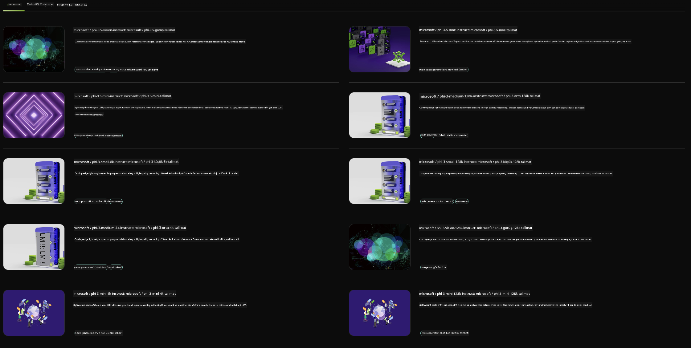

<!--
CO_OP_TRANSLATOR_METADATA:
{
  "original_hash": "7b08e277df2a9307f861ae54bc30c772",
  "translation_date": "2025-07-16T19:36:34+00:00",
  "source_file": "md/01.Introduction/02/06.NVIDIA.md",
  "language_code": "tr"
}
-->
## NVIDIA NIM'de Phi Ailesi

NVIDIA NIM, generatif yapay zeka modellerinin bulut, veri merkezi ve iş istasyonları genelinde hızlıca dağıtılmasını kolaylaştırmak için tasarlanmış kullanımı basit mikroservisler setidir. NIM'ler model ailesine ve modele göre kategorize edilmiştir. Örneğin, büyük dil modelleri (LLM'ler) için NVIDIA NIM, en gelişmiş LLM'lerin gücünü kurumsal uygulamalara getirerek eşsiz doğal dil işleme ve anlama yetenekleri sunar.

NIM, BT ve DevOps ekiplerinin büyük dil modellerini (LLM'ler) kendi yönetilen ortamlarında kolayca barındırmasını sağlarken, geliştiricilere güçlü yardımcılar, sohbet botları ve işlerini dönüştürebilecek yapay zeka asistanları oluşturmak için endüstri standardı API'ler sunar. NVIDIA’nın son teknoloji GPU hızlandırması ve ölçeklenebilir dağıtımı sayesinde, NIM benzersiz performansla en hızlı çıkarım yolunu sunar.

Phi Ailesi Modellerini çıkarım yapmak için NVIDIA NIM'i kullanabilirsiniz



### **Örnekler - NVIDIA NIM'de Phi-3-Vision**

Elinizde bir resim (`demo.png`) olduğunu ve bu resmi işleyip yeni bir versiyonunu (`phi-3-vision.jpg`) kaydeden Python kodu oluşturmak istediğinizi hayal edin.

Yukarıdaki kod bu süreci otomatikleştirir:

1. Ortamı ve gerekli yapılandırmaları ayarlar.
2. Modele gerekli Python kodunu oluşturması için talimat veren bir metin istemi oluşturur.
3. İstemi modele gönderir ve oluşturulan kodu toplar.
4. Oluşturulan kodu çıkarır ve çalıştırır.
5. Orijinal ve işlenmiş resimleri gösterir.

Bu yaklaşım, yapay zekanın gücünden yararlanarak görüntü işleme görevlerini otomatikleştirir ve hedeflerinize daha kolay ve hızlı ulaşmanızı sağlar.

[Örnek Kod Çözümü](../../../../../code/06.E2E/E2E_Nvidia_NIM_Phi3_Vision.ipynb)

Kodun tamamının adım adım ne yaptığını inceleyelim:

1. **Gerekli Paketi Yükle**:
    ```python
    !pip install langchain_nvidia_ai_endpoints -U
    ```  
    Bu komut, `langchain_nvidia_ai_endpoints` paketini en güncel sürümüyle yükler.

2. **Gerekli Modülleri İçe Aktar**:
    ```python
    from langchain_nvidia_ai_endpoints import ChatNVIDIA
    import getpass
    import os
    import base64
    ```  
    Bu importlar, NVIDIA AI uç noktalarıyla etkileşim, şifreleri güvenli şekilde yönetme, işletim sistemi işlemleri ve base64 formatında veri kodlama/çözme için gerekli modülleri getirir.

3. **API Anahtarını Ayarla**:
    ```python
    if not os.getenv("NVIDIA_API_KEY"):
        os.environ["NVIDIA_API_KEY"] = getpass.getpass("Enter your NVIDIA API key: ")
    ```  
    Bu kod, `NVIDIA_API_KEY` ortam değişkeninin ayarlanıp ayarlanmadığını kontrol eder. Ayarlı değilse, kullanıcıdan güvenli şekilde API anahtarını girmesini ister.

4. **Model ve Resim Yolunu Tanımla**:
    ```python
    model = 'microsoft/phi-3-vision-128k-instruct'
    chat = ChatNVIDIA(model=model)
    img_path = './imgs/demo.png'
    ```  
    Kullanılacak modeli belirler, belirtilen modelle `ChatNVIDIA` örneği oluşturur ve resim dosyasının yolunu tanımlar.

5. **Metin İstemi Oluştur**:
    ```python
    text = "Please create Python code for image, and use plt to save the new picture under imgs/ and name it phi-3-vision.jpg."
    ```  
    Modele, bir resmi işlemek için Python kodu oluşturması talimatını veren metin istemini tanımlar.

6. **Resmi Base64 Formatında Kodla**:
    ```python
    with open(img_path, "rb") as f:
        image_b64 = base64.b64encode(f.read()).decode()
    image = f''
    ```  
    Resim dosyasını okur, base64 formatında kodlar ve kodlanmış veriyi içeren bir HTML img etiketi oluşturur.

7. **Metin ve Resmi İstemde Birleştir**:
    ```python
    prompt = f"{text} {image}"
    ```  
    Metin istemi ile HTML img etiketini tek bir stringde birleştirir.

8. **ChatNVIDIA ile Kod Üret**:
    ```python
    code = ""
    for chunk in chat.stream(prompt):
        print(chunk.content, end="")
        code += chunk.content
    ```  
    İstemi `ChatNVIDIA` modeline gönderir, oluşturulan kod parçalarını toplar, her parçayı yazdırır ve `code` değişkenine ekler.

9. **Oluşturulan İçerikten Python Kodunu Çıkar**:
    ```python
    begin = code.index('```python') + 9  
    code = code[begin:]  
    end = code.index('```')
    code = code[:end]
    ```  
    Markdown formatlamasını kaldırarak gerçek Python kodunu çıkarır.

10. **Oluşturulan Kodu Çalıştır**:
    ```python
    import subprocess
    result = subprocess.run(["python", "-c", code], capture_output=True)
    ```  
    Çıkarılan Python kodunu bir alt süreç olarak çalıştırır ve çıktısını yakalar.

11. **Resimleri Göster**:
    ```python
    from IPython.display import Image, display
    display(Image(filename='./imgs/phi-3-vision.jpg'))
    display(Image(filename='./imgs/demo.png'))
    ```  
    `IPython.display` modülünü kullanarak orijinal ve işlenmiş resimleri gösterir.

**Feragatname**:  
Bu belge, AI çeviri servisi [Co-op Translator](https://github.com/Azure/co-op-translator) kullanılarak çevrilmiştir. Doğruluk için çaba gösterilse de, otomatik çevirilerin hatalar veya yanlışlıklar içerebileceğini lütfen unutmayınız. Orijinal belge, kendi dilinde yetkili kaynak olarak kabul edilmelidir. Kritik bilgiler için profesyonel insan çevirisi önerilir. Bu çevirinin kullanımı sonucu oluşabilecek yanlış anlamalar veya yorum hatalarından sorumlu değiliz.