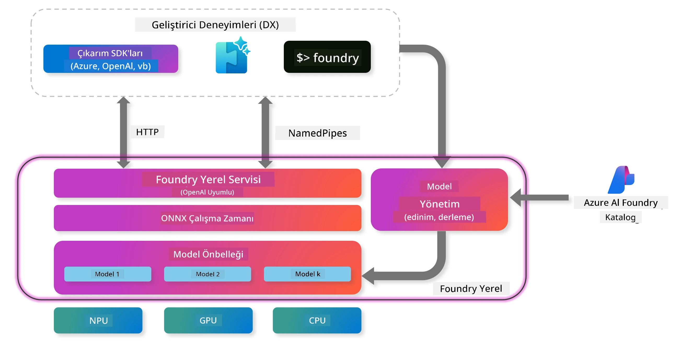
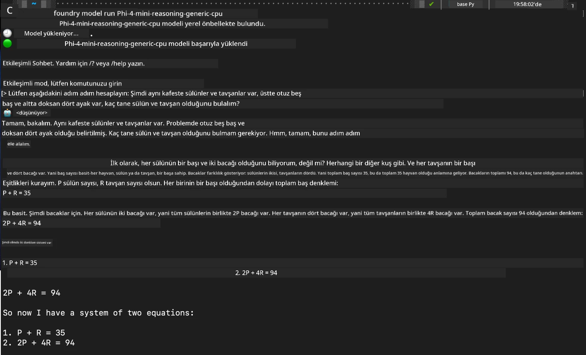

## Foundry Local'da Phi-Aile Modelleri ile Başlarken

### Foundry Local'a Giriş

Foundry Local, kurumsal düzeyde yapay zeka yeteneklerini doğrudan yerel donanımınıza getiren güçlü bir cihaz içi AI çıkarım çözümüdür. Bu eğitim, Foundry Local ile Phi-Aile modellerini kurup kullanmanızı adım adım gösterecek; böylece AI iş yükleriniz üzerinde tam kontrol sağlarken gizliliği koruyup maliyetleri azaltabileceksiniz.

Foundry Local, AI modellerini cihazınızda yerel olarak çalıştırarak performans, gizlilik, özelleştirme ve maliyet avantajları sunar. Kullanımı kolay CLI, SDK ve REST API aracılığıyla mevcut iş akışlarınıza ve uygulamalarınıza sorunsuzca entegre olur.




### Neden Foundry Local Tercih Etmelisiniz?

Foundry Local’ın avantajlarını anlamak, AI dağıtım stratejiniz için bilinçli kararlar vermenize yardımcı olur:

- **Cihaz İçi Çıkarım:** Modelleri kendi donanımınızda yerel olarak çalıştırarak maliyetlerinizi düşürür ve tüm verilerinizi cihazınızda tutarsınız.

- **Model Özelleştirme:** Önceden tanımlı modeller arasından seçim yapabilir veya kendi modellerinizi kullanarak özel ihtiyaç ve kullanım senaryolarına uyum sağlayabilirsiniz.

- **Maliyet Verimliliği:** Mevcut donanımınızı kullanarak sürekli bulut hizmeti maliyetlerini ortadan kaldırır, AI’yı daha erişilebilir hale getirir.

- **Sorunsuz Entegrasyon:** SDK, API uç noktaları veya CLI aracılığıyla uygulamalarınıza bağlanabilir, ihtiyaçlarınız arttıkça Microsoft Foundry’ye kolayca ölçeklendirebilirsiniz.

> **Başlarken Notu:** Bu eğitim, Foundry Local’ı CLI ve SDK arayüzleri üzerinden kullanmaya odaklanmaktadır. Her iki yöntemi de öğrenecek ve kullanım durumunuza en uygun olanı seçebileceksiniz.

## Bölüm 1: Foundry Local CLI Kurulumu

### Adım 1: Kurulum

Foundry Local CLI, AI modellerini yerel olarak yönetip çalıştırmanız için kapınızdır. Hadi sisteminize kurulumla başlayalım.

**Desteklenen Platformlar:** Windows ve macOS

Detaylı kurulum talimatları için lütfen [resmi Foundry Local dokümantasyonuna](https://github.com/microsoft/Foundry-Local/blob/main/README.md) bakınız.

### Adım 2: Mevcut Modelleri Keşfetme

Foundry Local CLI kurulduktan sonra, kullanım durumunuza uygun hangi modellerin mevcut olduğunu keşfedebilirsiniz. Bu komut size desteklenen tüm modelleri gösterecektir:


```bash
foundry model list
```

### Adım 3: Phi Aile Modellerini Anlama

Phi Ailesi, farklı kullanım senaryoları ve donanım yapılandırmaları için optimize edilmiş çeşitli modeller sunar. İşte Foundry Local’da bulunan Phi modelleri:

**Mevcut Phi Modelleri:** 

- **phi-3.5-mini** - Temel görevler için kompakt model
- **phi-3-mini-128k** - Daha uzun sohbetler için genişletilmiş bağlam versiyonu
- **phi-3-mini-4k** - Genel kullanım için standart bağlam modeli
- **phi-4** - Gelişmiş yeteneklere sahip model
- **phi-4-mini** - Phi-4’ün hafif versiyonu
- **phi-4-mini-reasoning** - Karmaşık akıl yürütme görevleri için özel model

> **Donanım Uyumluluğu:** Her model, sisteminizin yeteneklerine bağlı olarak farklı donanım hızlandırmaları (CPU, GPU) için yapılandırılabilir.

### Adım 4: İlk Phi Modelinizi Çalıştırma

Pratik bir örnekle başlayalım. Karmaşık problemleri adım adım çözmede başarılı olan `phi-4-mini-reasoning` modelini çalıştıracağız.


**Modeli çalıştırmak için komut:**

```bash
foundry model run Phi-4-mini-reasoning-generic-cpu
```

> **İlk Kurulum:** Bir modeli ilk kez çalıştırdığınızda, Foundry Local modeli otomatik olarak yerel cihazınıza indirir. İndirme süresi ağ hızınıza bağlı olarak değişir, bu yüzden ilk kurulum sırasında sabırlı olun.

### Adım 5: Modeli Gerçek Bir Problemle Test Etme

Şimdi modelimizi klasik bir mantık problemiyle test edelim ve adım adım akıl yürütme yeteneğini görelim:

**Örnek Problem:**

```txt
Please calculate the following step by step: Now there are pheasants and rabbits in the same cage, there are thirty-five heads on top and ninety-four legs on the bottom, how many pheasants and rabbits are there?
```

**Beklenen Davranış:** Model, bu problemi mantıksal adımlara ayırmalı ve sülünlerin 2, tavşanların ise 4 bacağı olduğunu kullanarak denklem sistemini çözmelidir.

**Sonuçlar:**



## Bölüm 2: Foundry Local SDK ile Uygulama Geliştirme

### Neden SDK Kullanmalı?

CLI, test ve hızlı etkileşimler için mükemmel olsa da, SDK Foundry Local’ı uygulamalarınıza programatik olarak entegre etmenizi sağlar. Bu da şunları mümkün kılar:

- Özel AI destekli uygulamalar geliştirmek
- Otomatik iş akışları oluşturmak
- AI yeteneklerini mevcut sistemlere entegre etmek
- Chatbotlar ve etkileşimli araçlar geliştirmek

### Desteklenen Programlama Dilleri

Foundry Local, geliştirme tercihinize uygun çoklu programlama dili desteği sunar:

**📦 Mevcut SDK’lar:**

- **C# (.NET):** [SDK Dokümantasyonu & Örnekler](https://github.com/microsoft/Foundry-Local/tree/main/sdk/cs)
- **Python:** [SDK Dokümantasyonu & Örnekler](https://github.com/microsoft/Foundry-Local/tree/main/sdk/python)
- **JavaScript:** [SDK Dokümantasyonu & Örnekler](https://github.com/microsoft/Foundry-Local/tree/main/sdk/js)
- **Rust:** [SDK Dokümantasyonu & Örnekler](https://github.com/microsoft/Foundry-Local/tree/main/sdk/rust)

### Sonraki Adımlar

1. Geliştirme ortamınıza uygun SDK’yı seçin
2. SDK’ya özel dokümantasyonu takip ederek detaylı uygulama rehberlerine göz atın
3. Karmaşık uygulamalar geliştirmeden önce basit örneklerle başlayın
4. Her SDK deposunda sunulan örnek kodları inceleyin

## Sonuç

Artık şunları öğrendiniz:
- ✅ Foundry Local CLI’yı kurup yapılandırmayı
- ✅ Phi Aile modellerini keşfedip çalıştırmayı
- ✅ Modelleri gerçek dünya problemleriyle test etmeyi
- ✅ Uygulama geliştirme için SDK seçeneklerini anlamayı

Foundry Local, AI yeteneklerini doğrudan yerel ortamınıza getirerek performans, gizlilik ve maliyetler üzerinde kontrol sağlar; ihtiyaç duyduğunuzda bulut çözümlerine ölçeklendirme esnekliği sunar.

**Feragatname**:  
Bu belge, AI çeviri servisi [Co-op Translator](https://github.com/Azure/co-op-translator) kullanılarak çevrilmiştir. Doğruluk için çaba göstersek de, otomatik çevirilerin hatalar veya yanlışlıklar içerebileceğini lütfen unutmayınız. Orijinal belge, kendi dilinde yetkili kaynak olarak kabul edilmelidir. Kritik bilgiler için profesyonel insan çevirisi önerilir. Bu çevirinin kullanımı sonucu oluşabilecek yanlış anlamalar veya yorum hatalarından sorumlu değiliz.