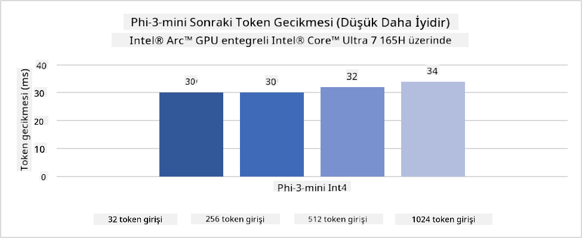
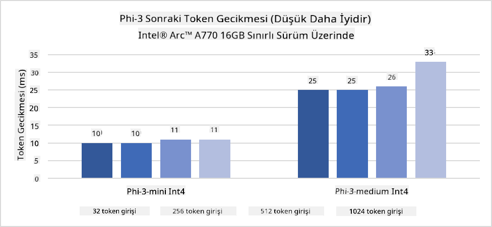
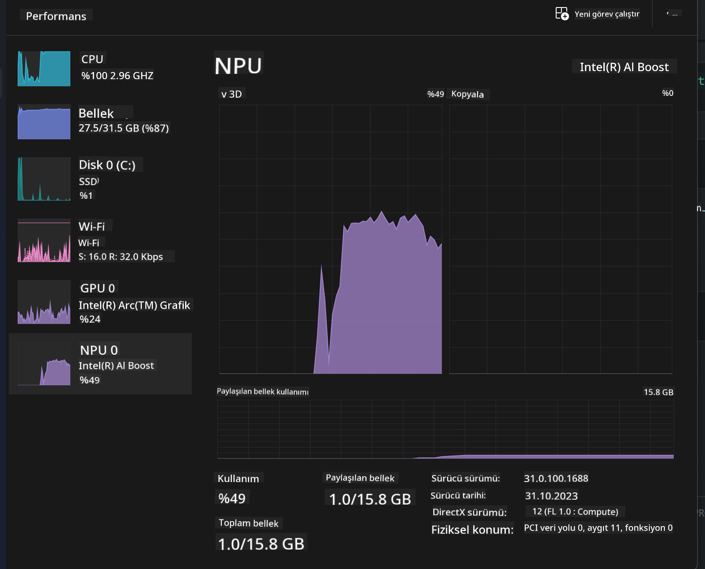
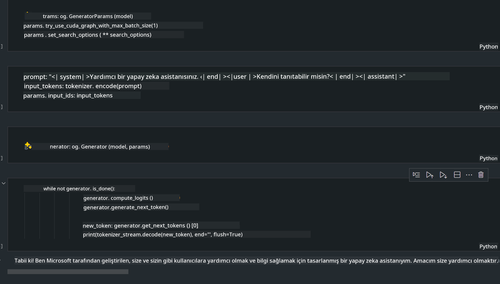
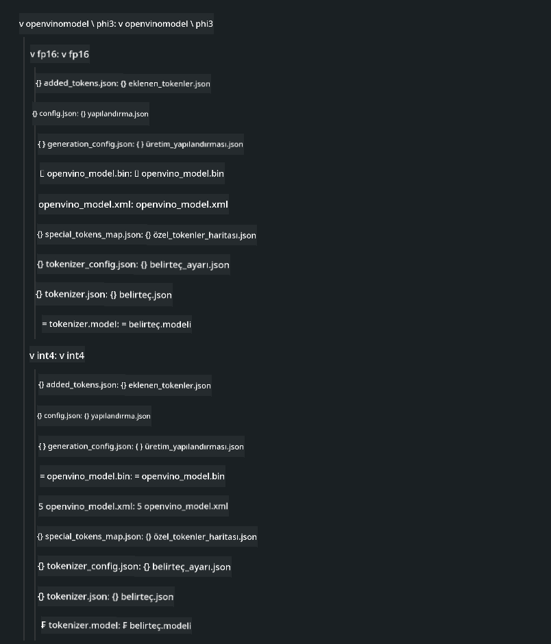
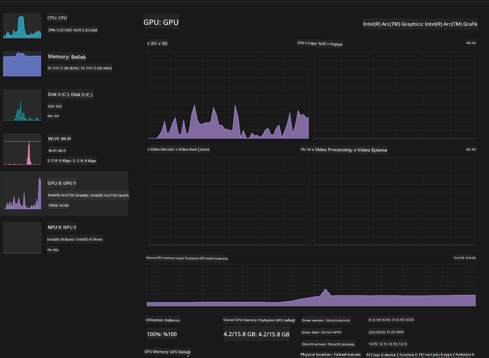

<!--
CO_OP_TRANSLATOR_METADATA:
{
  "original_hash": "e08ce816e23ad813244a09ca34ebb8ac",
  "translation_date": "2025-07-16T20:01:05+00:00",
  "source_file": "md/01.Introduction/03/AIPC_Inference.md",
  "language_code": "tr"
}
-->
# **AI PC'de Phi-3 Çıkarımı**

Üretken yapay zekâdaki gelişmeler ve uç cihaz donanım yeteneklerindeki iyileşmelerle birlikte, giderek daha fazla üretken yapay zekâ modeli kullanıcıların Kendi Cihazını Getir (BYOD) cihazlarına entegre edilebiliyor. AI PC'ler de bu modeller arasında yer alıyor. 2024 itibarıyla Intel, AMD ve Qualcomm, PC üreticileriyle iş birliği yaparak donanım değişiklikleriyle yerel üretken yapay zekâ modellerinin dağıtımını kolaylaştıran AI PC'leri tanıttı. Bu yazıda, Intel AI PC'lere odaklanacak ve Phi-3 modelinin Intel AI PC üzerinde nasıl dağıtılacağını inceleyeceğiz.

### NPU Nedir

NPU (Sinir İşlem Birimi), daha büyük bir SoC üzerinde yapay sinir ağı işlemlerini ve yapay zekâ görevlerini hızlandırmak için özel olarak tasarlanmış bir işlemci veya işlem birimidir. Genel amaçlı CPU ve GPU'lardan farklı olarak, NPU'lar veri odaklı paralel hesaplama için optimize edilmiştir; bu sayede video ve görüntü gibi büyük multimedya verilerini ve sinir ağları için verileri işlemek konusunda oldukça verimlidirler. Konuşma tanıma, video görüşmelerde arka plan bulanıklaştırma ve nesne tespiti gibi fotoğraf veya video düzenleme süreçleri gibi yapay zekâ ile ilgili görevlerde özellikle başarılıdırlar.

## NPU ve GPU Karşılaştırması

Birçok yapay zekâ ve makine öğrenimi işi GPU'larda çalışsa da, GPU ve NPU arasında önemli bir fark vardır.  
GPU'lar paralel hesaplama yetenekleriyle bilinir, ancak tüm GPU'lar grafik işleme dışındaki görevlerde aynı verimlilikte değildir. NPU'lar ise sinir ağı işlemlerinde yer alan karmaşık hesaplamalar için özel olarak tasarlanmıştır ve yapay zekâ görevlerinde çok daha etkilidir.

Özetle, NPU'lar yapay zekâ hesaplamalarını hızlandıran matematik uzmanlarıdır ve AI PC'lerin yükselen çağında önemli bir rol oynarlar!

***Bu örnek, Intel'in en yeni Intel Core Ultra İşlemcisi temel alınarak hazırlanmıştır***

## **1. Phi-3 Modelini Çalıştırmak için NPU Kullanımı**

Intel® NPU cihazı, Intel® Core™ Ultra nesil CPU'lardan (eski adıyla Meteor Lake) itibaren Intel istemci CPU'larına entegre edilmiş bir yapay zekâ çıkarım hızlandırıcısıdır. Yapay sinir ağı görevlerinin enerji verimli şekilde yürütülmesini sağlar.





**Intel NPU Hızlandırma Kütüphanesi**

Intel NPU Hızlandırma Kütüphanesi [https://github.com/intel/intel-npu-acceleration-library](https://github.com/intel/intel-npu-acceleration-library), Intel Sinir İşlem Birimi (NPU) gücünden yararlanarak uyumlu donanımlarda yüksek hızlı hesaplamalar yapmanızı sağlayan Python kütüphanesidir.

Intel® Core™ Ultra işlemcilerle güçlendirilmiş AI PC üzerinde Phi-3-mini örneği.


Python Kütüphanesini pip ile yükleyin

```bash

   pip install intel-npu-acceleration-library

```

***Not*** Proje hâlâ geliştirme aşamasında, ancak referans model oldukça tamamlanmış durumda.

### **Intel NPU Hızlandırma Kütüphanesi ile Phi-3 Çalıştırma**

Intel NPU hızlandırması kullanıldığında, bu kütüphane geleneksel kodlama sürecini etkilemez. Orijinal Phi-3 modelini FP16, INT8, INT4 gibi biçimlerde kuantize etmek için sadece bu kütüphaneyi kullanmanız yeterlidir.

```python
from transformers import AutoTokenizer, pipeline,TextStreamer
from intel_npu_acceleration_library import NPUModelForCausalLM, int4
from intel_npu_acceleration_library.compiler import CompilerConfig
import warnings

model_id = "microsoft/Phi-3-mini-4k-instruct"

compiler_conf = CompilerConfig(dtype=int4)
model = NPUModelForCausalLM.from_pretrained(
    model_id, use_cache=True, config=compiler_conf, attn_implementation="sdpa"
).eval()

tokenizer = AutoTokenizer.from_pretrained(model_id)

text_streamer = TextStreamer(tokenizer, skip_prompt=True)
```

Kuantizasyon başarılı olduktan sonra, Phi-3 modelini çalıştırmak için NPU çağrısı yapılır.

```python
generation_args = {
   "max_new_tokens": 1024,
   "return_full_text": False,
   "temperature": 0.3,
   "do_sample": False,
   "streamer": text_streamer,
}

pipe = pipeline(
   "text-generation",
   model=model,
   tokenizer=tokenizer,
)

query = "<|system|>You are a helpful AI assistant.<|end|><|user|>Can you introduce yourself?<|end|><|assistant|>"

with warnings.catch_warnings():
    warnings.simplefilter("ignore")
    pipe(query, **generation_args)
```

Kod çalıştırılırken, Görev Yöneticisi üzerinden NPU'nun çalışma durumu izlenebilir.



***Örnekler*** : [AIPC_NPU_DEMO.ipynb](../../../../../code/03.Inference/AIPC/AIPC_NPU_DEMO.ipynb)

## **2. Phi-3 Modelini Çalıştırmak için DirectML + ONNX Runtime Kullanımı**

### **DirectML Nedir**

[DirectML](https://github.com/microsoft/DirectML), makine öğrenimi için yüksek performanslı, donanım hızlandırmalı bir DirectX 12 kütüphanesidir. DirectML, AMD, Intel, NVIDIA ve Qualcomm gibi üreticilerin tüm DirectX 12 destekli GPU'ları dahil olmak üzere geniş bir donanım ve sürücü yelpazesinde yaygın makine öğrenimi görevleri için GPU hızlandırması sağlar.

Tek başına kullanıldığında, DirectML API'si düşük seviyeli bir DirectX 12 kütüphanesidir ve frameworkler, oyunlar ve diğer gerçek zamanlı uygulamalar gibi yüksek performanslı, düşük gecikmeli uygulamalar için uygundur. DirectML'in Direct3D 12 ile sorunsuz birlikte çalışması, düşük ek yükü ve donanım genelinde uyumluluğu, yüksek performansın ve donanım genelinde güvenilir ve öngörülebilir sonuçların kritik olduğu durumlarda makine öğrenimini hızlandırmak için ideal kılar.

***Not*** : En son DirectML sürümü artık NPU desteği sunmaktadır (https://devblogs.microsoft.com/directx/introducing-neural-processor-unit-npu-support-in-directml-developer-preview/)

### DirectML ve CUDA'nın yetenekleri ve performans açısından karşılaştırılması:

**DirectML**, Microsoft tarafından geliştirilen bir makine öğrenimi kütüphanesidir. Windows cihazlarda, masaüstü, dizüstü ve uç cihazlarda makine öğrenimi iş yüklerini hızlandırmak için tasarlanmıştır.  
- DX12 Tabanlı: DirectML, DirectX 12 (DX12) üzerine inşa edilmiştir ve NVIDIA ile AMD dahil olmak üzere geniş GPU desteği sunar.  
- Daha Geniş Destek: DX12 kullandığı için, DirectML DX12 destekleyen tüm GPU'larla, hatta entegre GPU'larla çalışabilir.  
- Görüntü İşleme: DirectML, görüntü tanıma, nesne tespiti gibi görevler için sinir ağları kullanarak görüntü ve diğer verileri işler.  
- Kurulum Kolaylığı: DirectML kurulumu basittir ve GPU üreticilerinden özel SDK veya kütüphane gerektirmez.  
- Performans: Bazı durumlarda DirectML iyi performans gösterir ve belirli iş yüklerinde CUDA'dan daha hızlı olabilir.  
- Sınırlamalar: Ancak, özellikle float16 büyük batch boyutlarında DirectML bazen daha yavaş olabilir.

**CUDA**, NVIDIA'nın paralel hesaplama platformu ve programlama modelidir. Geliştiricilerin NVIDIA GPU'larının gücünü genel amaçlı hesaplamalar, makine öğrenimi ve bilimsel simülasyonlar için kullanmasını sağlar.  
- NVIDIA'ya Özel: CUDA, NVIDIA GPU'ları için sıkı entegrasyonla tasarlanmıştır.  
- Yüksek Optimizasyon: NVIDIA GPU'larda hızlandırılmış görevler için mükemmel performans sunar.  
- Yaygın Kullanım: TensorFlow ve PyTorch gibi birçok makine öğrenimi frameworkü CUDA desteğine sahiptir.  
- Özelleştirme: Geliştiriciler CUDA ayarlarını belirli görevler için ince ayar yapabilir, böylece optimal performans elde edilir.  
- Sınırlamalar: Ancak, CUDA'nın NVIDIA donanımına bağımlılığı, farklı GPU'larda geniş uyumluluk isteyenler için kısıtlayıcı olabilir.

### DirectML ve CUDA Arasında Seçim

DirectML ve CUDA arasında seçim, kullanım amacınıza, donanımınıza ve tercihinize bağlıdır.  
Daha geniş uyumluluk ve kolay kurulum arıyorsanız DirectML iyi bir seçenek olabilir. Ancak NVIDIA GPU'larınız varsa ve yüksek optimize performans gerekiyorsa, CUDA güçlü bir tercihtir. Özetle, her iki teknoloji de avantaj ve dezavantajlara sahiptir; karar verirken ihtiyaçlarınızı ve mevcut donanımı göz önünde bulundurun.

### **ONNX Runtime ile Üretken Yapay Zekâ**

Yapay zekâ çağında, AI modellerinin taşınabilirliği çok önemlidir. ONNX Runtime, eğitilmiş modelleri farklı cihazlara kolayca dağıtabilir. Geliştiriciler çıkarım çerçevesine odaklanmadan, tek bir API kullanarak model çıkarımı yapabilirler. Üretken yapay zekâ çağında, ONNX Runtime ayrıca kod optimizasyonu da yapmaktadır (https://onnxruntime.ai/docs/genai/). Optimizasyonlu ONNX Runtime sayesinde, kuantize edilmiş üretken yapay zekâ modelleri farklı uç cihazlarda çıkarılabilir. ONNX Runtime ile üretken yapay zekâ model API'si Python, C#, C/C++ dillerinde kullanılabilir. Tabii ki, iPhone üzerinde dağıtımda C++'ın ONNX Runtime API'sinden faydalanılabilir.

[Örnek Kod](https://github.com/Azure-Samples/Phi-3MiniSamples/tree/main/onnx)

***ONNX Runtime kütüphanesini derleme***

```bash

winget install --id=Kitware.CMake  -e

git clone https://github.com/microsoft/onnxruntime.git

cd .\onnxruntime\

./build.bat --build_shared_lib --skip_tests --parallel --use_dml --config Release

cd ../

git clone https://github.com/microsoft/onnxruntime-genai.git

cd .\onnxruntime-genai\

mkdir ort

cd ort

mkdir include

mkdir lib

copy ..\onnxruntime\include\onnxruntime\core\providers\dml\dml_provider_factory.h ort\include

copy ..\onnxruntime\include\onnxruntime\core\session\onnxruntime_c_api.h ort\include

copy ..\onnxruntime\build\Windows\Release\Release\*.dll ort\lib

copy ..\onnxruntime\build\Windows\Release\Release\onnxruntime.lib ort\lib

python build.py --use_dml


```

**Kütüphaneyi yükleme**

```bash

pip install .\onnxruntime_genai_directml-0.3.0.dev0-cp310-cp310-win_amd64.whl

```

Çalıştırma sonucu



***Örnekler*** : [AIPC_DirectML_DEMO.ipynb](../../../../../code/03.Inference/AIPC/AIPC_DirectML_DEMO.ipynb)

## **3. Phi-3 Modelini Çalıştırmak için Intel OpenVino Kullanımı**

### **OpenVINO Nedir**

[OpenVINO](https://github.com/openvinotoolkit/openvino), derin öğrenme modellerini optimize etmek ve dağıtmak için açık kaynaklı bir araç setidir. TensorFlow, PyTorch gibi popüler frameworklerden gelen görsel, ses ve dil modelleri için derin öğrenme performansını artırır. OpenVINO ile başlayın. OpenVINO, CPU ve GPU ile birlikte Phi-3 modelini çalıştırmak için de kullanılabilir.

***Not***: Şu anda OpenVINO NPU desteği sunmamaktadır.

### **OpenVINO Kütüphanesini Yükleme**

```bash

 pip install git+https://github.com/huggingface/optimum-intel.git

 pip install git+https://github.com/openvinotoolkit/nncf.git

 pip install openvino-nightly

```

### **OpenVINO ile Phi-3 Çalıştırma**

NPU gibi, OpenVINO da kuantize edilmiş modelleri çalıştırarak üretken yapay zekâ modellerinin çağrısını tamamlar. Öncelikle Phi-3 modelini kuantize etmemiz gerekir ve optimum-cli ile komut satırından model kuantizasyonu tamamlanır.

**INT4**

```bash

optimum-cli export openvino --model "microsoft/Phi-3-mini-4k-instruct" --task text-generation-with-past --weight-format int4 --group-size 128 --ratio 0.6  --sym  --trust-remote-code ./openvinomodel/phi3/int4

```

**FP16**

```bash

optimum-cli export openvino --model "microsoft/Phi-3-mini-4k-instruct" --task text-generation-with-past --weight-format fp16 --trust-remote-code ./openvinomodel/phi3/fp16

```

Dönüştürülmüş format aşağıdaki gibidir



Model yolları (model_dir), ilgili konfigürasyonlar (ov_config = {"PERFORMANCE_HINT": "LATENCY", "NUM_STREAMS": "1", "CACHE_DIR": ""}) ve donanım hızlandırmalı cihazlar (GPU.0) OVModelForCausalLM aracılığıyla yüklenir.

```python

ov_model = OVModelForCausalLM.from_pretrained(
     model_dir,
     device='GPU.0',
     ov_config=ov_config,
     config=AutoConfig.from_pretrained(model_dir, trust_remote_code=True),
     trust_remote_code=True,
)

```

Kod çalıştırılırken, Görev Yöneticisi üzerinden GPU'nun çalışma durumu izlenebilir.



***Örnekler*** : [AIPC_OpenVino_Demo.ipynb](../../../../../code/03.Inference/AIPC/AIPC_OpenVino_Demo.ipynb)

### ***Not*** : Yukarıdaki üç yöntemin her birinin kendine özgü avantajları vardır, ancak AI PC çıkarımı için NPU hızlandırması kullanılması önerilir.

**Feragatname**:  
Bu belge, AI çeviri servisi [Co-op Translator](https://github.com/Azure/co-op-translator) kullanılarak çevrilmiştir. Doğruluk için çaba gösterilse de, otomatik çevirilerin hatalar veya yanlışlıklar içerebileceğini lütfen unutmayınız. Orijinal belge, kendi dilinde yetkili kaynak olarak kabul edilmelidir. Kritik bilgiler için profesyonel insan çevirisi önerilir. Bu çevirinin kullanımı sonucu oluşabilecek yanlış anlamalar veya yorum hatalarından sorumlu değiliz.