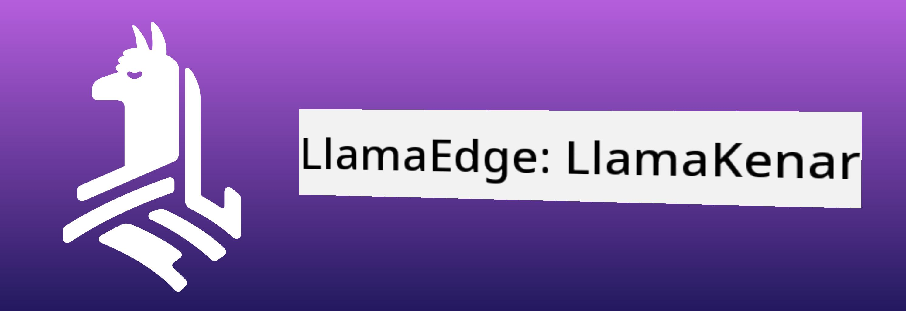
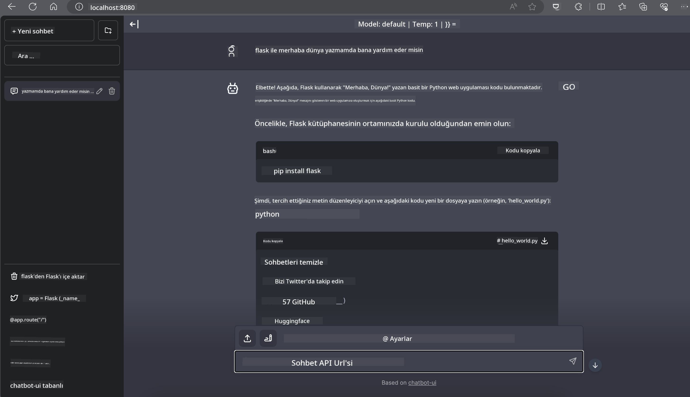

<!--
CO_OP_TRANSLATOR_METADATA:
{
  "original_hash": "be4101a30d98e95a71d42c276e8bcd37",
  "translation_date": "2025-05-09T11:37:06+00:00",
  "source_file": "md/01.Introduction/03/Jetson_Inference.md",
  "language_code": "tr"
}
-->
# **Nvidia Jetson'da Phi-3 Çıkarımı**

Nvidia Jetson, Nvidia tarafından geliştirilen gömülü bilgisayar kartları serisidir. Jetson TK1, TX1 ve TX2 modelleri, ARM mimarili bir merkezi işlem birimini (CPU) entegre eden Nvidia'nın Tegra işlemcisini (veya SoC) taşır. Jetson düşük güç tüketimli bir sistemdir ve makine öğrenimi uygulamalarını hızlandırmak için tasarlanmıştır. Nvidia Jetson, profesyonel geliştiriciler tarafından tüm sektörlerde çığır açan yapay zeka ürünleri oluşturmak için, öğrenciler ve meraklılar tarafından ise pratik yapay zeka öğrenimi ve harika projeler yapmak için kullanılır. SLM, Jetson gibi uç cihazlarda konuşlandırılır ve endüstriyel üretken yapay zeka uygulama senaryolarının daha iyi hayata geçirilmesini sağlar.

## NVIDIA Jetson Üzerinde Dağıtım:
Otonom robotik ve gömülü cihazlar üzerinde çalışan geliştiriciler Phi-3 Mini’den faydalanabilir. Phi-3’ün nispeten küçük boyutu, uçta dağıtım için idealdir. Eğitim sırasında parametreler titizlikle ayarlanmış olup, yanıtların yüksek doğrulukta olmasını sağlar.

### TensorRT-LLM Optimizasyonu:
NVIDIA’nın [TensorRT-LLM kütüphanesi](https://github.com/NVIDIA/TensorRT-LLM?WT.mc_id=aiml-138114-kinfeylo) büyük dil modeli çıkarımını optimize eder. Phi-3 Mini’nin uzun bağlam penceresini destekleyerek hem verimliliği hem de gecikmeyi artırır. Optimizasyonlar LongRoPE, FP8 ve inflight batching gibi teknikleri içerir.

### Kullanılabilirlik ve Dağıtım:
Geliştiriciler, 128K bağlam penceresi ile Phi-3 Mini’yi [NVIDIA AI](https://www.nvidia.com/en-us/ai-data-science/generative-ai/) üzerinden keşfedebilir. Bu, standart API’ye sahip bir mikroservis olan NVIDIA NIM olarak paketlenmiştir ve her yere dağıtılabilir. Ayrıca, [TensorRT-LLM GitHub uygulamaları](https://github.com/NVIDIA/TensorRT-LLM) mevcuttur.

## **1. Hazırlık**

a. Jetson Orin NX / Jetson NX

b. JetPack 5.1.2+

c. Cuda 11.8

d. Python 3.8+

## **2. Jetson’da Phi-3 Çalıştırma**

[Ollama](https://ollama.com) veya [LlamaEdge](https://llamaedge.com) tercih edilebilir.

Bulut ve uç cihazlarda aynı anda gguf kullanmak isterseniz, LlamaEdge, WasmEdge olarak düşünülebilir (WasmEdge, bulut yerel, uç ve merkezi olmayan uygulamalar için uygun, hafif, yüksek performanslı ve ölçeklenebilir bir WebAssembly çalışma zamanıdır. Sunucusuz uygulamaları, gömülü fonksiyonları, mikroservisleri, akıllı sözleşmeleri ve IoT cihazlarını destekler. Gguf’nun nicel modelini LlamaEdge aracılığıyla uç cihazlara ve buluta dağıtabilirsiniz).



Kullanım adımları:

1. İlgili kütüphaneleri ve dosyaları indirip kurun

```bash

curl -sSf https://raw.githubusercontent.com/WasmEdge/WasmEdge/master/utils/install.sh | bash -s -- --plugin wasi_nn-ggml

curl -LO https://github.com/LlamaEdge/LlamaEdge/releases/latest/download/llama-api-server.wasm

curl -LO https://github.com/LlamaEdge/chatbot-ui/releases/latest/download/chatbot-ui.tar.gz

tar xzf chatbot-ui.tar.gz

```

**Not**: llama-api-server.wasm ve chatbot-ui aynı dizinde olmalıdır

2. Terminalde scriptleri çalıştırın

```bash

wasmedge --dir .:. --nn-preload default:GGML:AUTO:{Your gguf path} llama-api-server.wasm -p phi-3-chat

```

Çalıştırma sonucu aşağıdaki gibidir



***Örnek kod*** [Phi-3 mini WASM Notebook Örneği](https://github.com/Azure-Samples/Phi-3MiniSamples/tree/main/wasm)

Özetle, Phi-3 Mini, verimlilik, bağlam farkındalığı ve NVIDIA optimizasyon gücünü birleştirerek dil modellemede önemli bir ilerlemeyi temsil eder. İster robotlar ister uç uygulamalar geliştiriyor olun, Phi-3 Mini güçlü bir araçtır.

**Feragatname**:  
Bu belge, AI çeviri servisi [Co-op Translator](https://github.com/Azure/co-op-translator) kullanılarak çevrilmiştir. Doğruluk için çaba gösterilse de, otomatik çevirilerin hatalar veya yanlışlıklar içerebileceğini lütfen unutmayın. Orijinal belge, kendi ana dilinde yetkili kaynak olarak kabul edilmelidir. Kritik bilgiler için profesyonel insan çevirisi önerilir. Bu çevirinin kullanımı sonucunda ortaya çıkabilecek herhangi bir yanlış anlama veya yorum hatasından sorumlu değiliz.