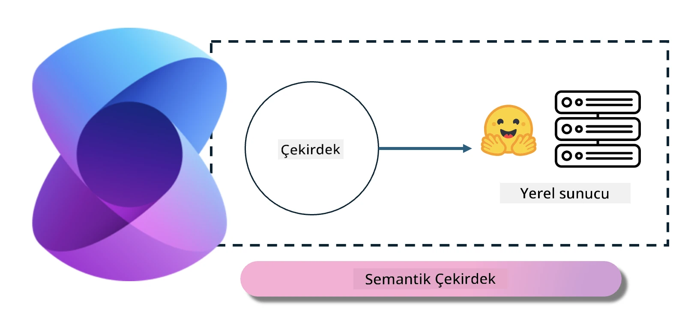
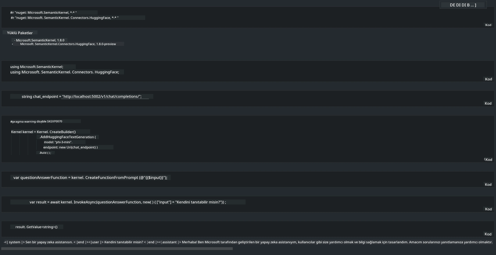

# **Yerel Sunucuda Phi-3 Çıkarımı**

Phi-3'ü yerel bir sunucuda dağıtabiliriz. Kullanıcılar [Ollama](https://ollama.com) veya [LM Studio](https://llamaedge.com) çözümlerini tercih edebilir ya da kendi kodlarını yazabilirler. Phi-3'ün yerel servislerine [Semantic Kernel](https://github.com/microsoft/semantic-kernel?WT.mc_id=aiml-138114-kinfeylo) veya [Langchain](https://www.langchain.com/) aracılığıyla bağlanarak Copilot uygulamaları oluşturabilirsiniz.

## **Phi-3-mini'ye erişmek için Semantic Kernel kullanımı**

Copilot uygulamasında, Semantic Kernel / LangChain aracılığıyla uygulamalar oluşturuyoruz. Bu tür uygulama çerçevesi genellikle Azure OpenAI Service / OpenAI modelleriyle uyumludur ve aynı zamanda Hugging Face üzerindeki açık kaynak modelleri ile yerel modelleri de destekleyebilir. Semantic Kernel kullanarak Phi-3-mini'ye erişmek istersek ne yapmalıyız? .NET örneği üzerinden, Semantic Kernel'deki Hugging Face Connector ile birleştirebiliriz. Varsayılan olarak, Hugging Face üzerindeki model kimliğiyle eşleşir (ilk kullanımda model Hugging Face'den indirileceği için uzun sürebilir). Ayrıca, oluşturulmuş yerel servise de bağlanabilirsiniz. İkisi arasında, özellikle kurumsal uygulamalarda daha yüksek bir özerklik sağladığı için ikincisini kullanmanızı öneririz.

Şekilden de görüldüğü gibi, Semantic Kernel aracılığıyla yerel servislere erişim, kendi oluşturduğunuz Phi-3-mini model sunucusuna kolayca bağlanabilir. İşte çalışma sonucu:

***Örnek Kod*** https://github.com/kinfey/Phi3MiniSamples/tree/main/semantickernel

**Feragatname**:  
Bu belge, AI çeviri servisi [Co-op Translator](https://github.com/Azure/co-op-translator) kullanılarak çevrilmiştir. Doğruluk için çaba göstersek de, otomatik çevirilerin hatalar veya yanlışlıklar içerebileceğini lütfen unutmayınız. Orijinal belge, kendi ana dilinde yetkili kaynak olarak kabul edilmelidir. Kritik bilgiler için profesyonel insan çevirisi önerilir. Bu çevirinin kullanımı sonucu oluşabilecek yanlış anlamalar veya yorum hatalarından sorumlu değiliz.