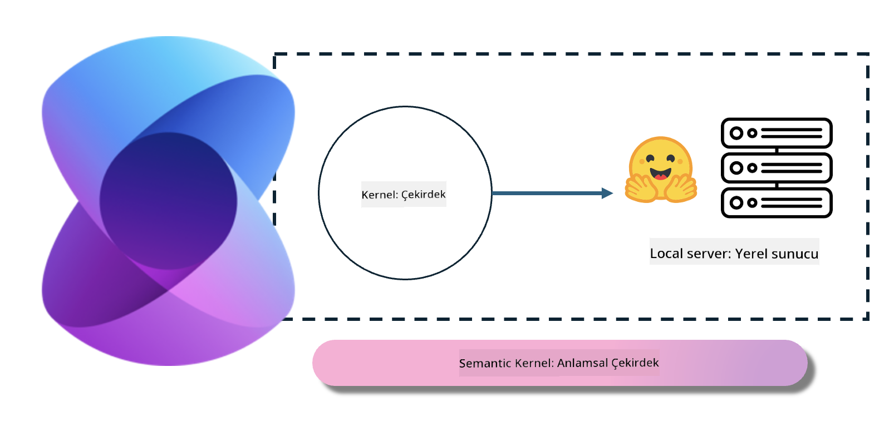
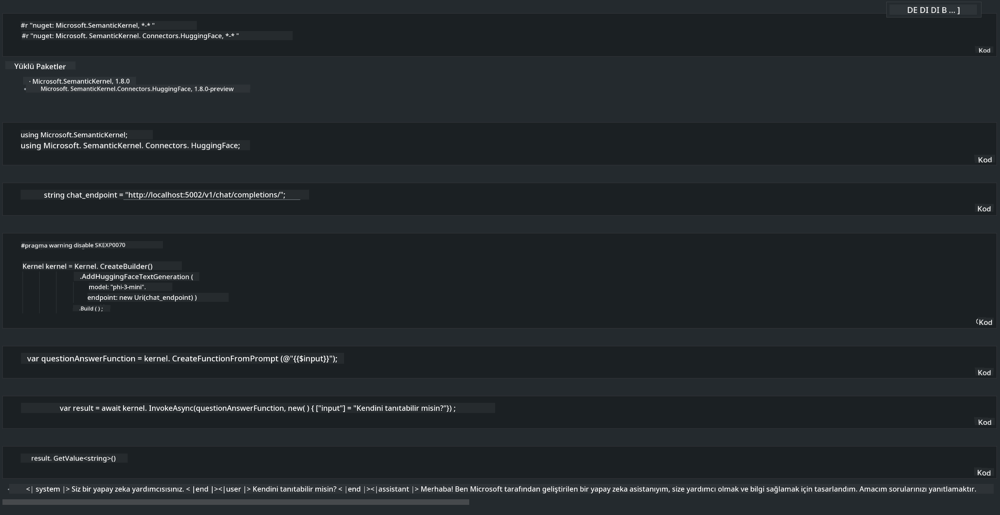

<!--
CO_OP_TRANSLATOR_METADATA:
{
  "original_hash": "bcf5dd7031db0031abdb9dd0c05ba118",
  "translation_date": "2025-05-09T12:04:15+00:00",
  "source_file": "md/01.Introduction/03/Local_Server_Inference.md",
  "language_code": "tr"
}
-->
# **Yerel Sunucuda Phi-3 Çıkarımı**

Phi-3’ü yerel bir sunucuda dağıtabiliriz. Kullanıcılar [Ollama](https://ollama.com) veya [LM Studio](https://llamaedge.com) çözümlerini tercih edebilir ya da kendi kodlarını yazabilirler. Phi-3’ün yerel servislerine [Semantic Kernel](https://github.com/microsoft/semantic-kernel?WT.mc_id=aiml-138114-kinfeylo) veya [Langchain](https://www.langchain.com/) aracılığıyla bağlanarak Copilot uygulamaları oluşturabilirsiniz.

## **Phi-3-mini’ye erişmek için Semantic Kernel kullanımı**

Copilot uygulamasında, Semantic Kernel / LangChain ile uygulamalar geliştiriyoruz. Bu tür uygulama çerçeveleri genellikle Azure OpenAI Service / OpenAI modelleriyle uyumludur ve aynı zamanda Hugging Face üzerindeki açık kaynak modelleri ve yerel modelleri destekleyebilir. Semantic Kernel kullanarak Phi-3-mini’ye erişmek istersek ne yapmalıyız? .NET örneği üzerinden açıklarsak, Semantic Kernel’deki Hugging Face Connector ile birleştirebiliriz. Varsayılan olarak, Hugging Face üzerindeki model kimliğine karşılık gelir (ilk kullanımda model Hugging Face’den indirileceği için biraz zaman alır). Ayrıca, yerel olarak oluşturulan servise de bağlanabilirsiniz. İkisi arasında, özellikle kurumsal uygulamalarda daha yüksek özerkliğe sahip olduğu için ikincisini kullanmanızı öneriyoruz.

Şekilden de görüldüğü gibi, Semantic Kernel üzerinden yerel servislere erişmek, kendi oluşturduğunuz Phi-3-mini model sunucusuna kolayca bağlanabilir. İşte çalıştırma sonucu:

***Sample Code*** https://github.com/kinfey/Phi3MiniSamples/tree/main/semantickernel

**Feragatname**:  
Bu belge, AI çeviri servisi [Co-op Translator](https://github.com/Azure/co-op-translator) kullanılarak çevrilmiştir. Doğruluk için çaba göstersek de, otomatik çevirilerin hatalar veya yanlışlıklar içerebileceğini lütfen unutmayınız. Orijinal belge, kendi dilinde yetkili kaynak olarak kabul edilmelidir. Kritik bilgiler için profesyonel insan çevirisi önerilir. Bu çevirinin kullanımı sonucunda ortaya çıkabilecek yanlış anlamalar veya yorum farklılıklarından sorumlu değiliz.