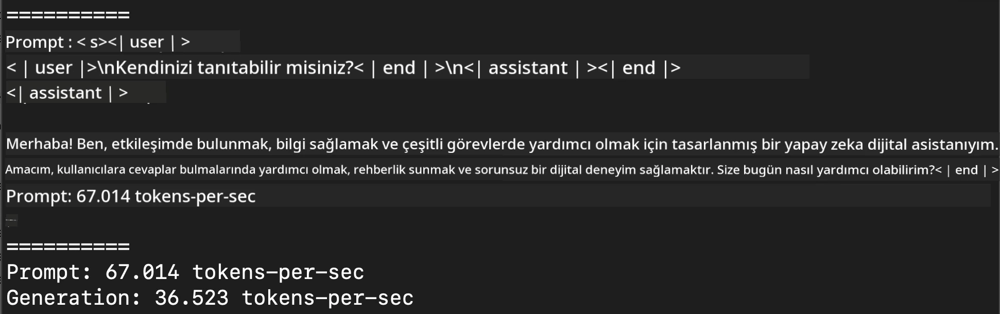
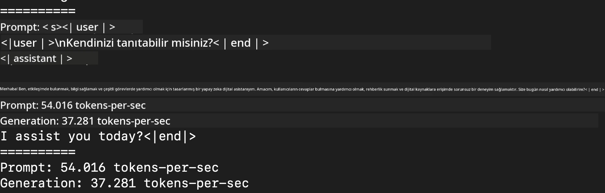
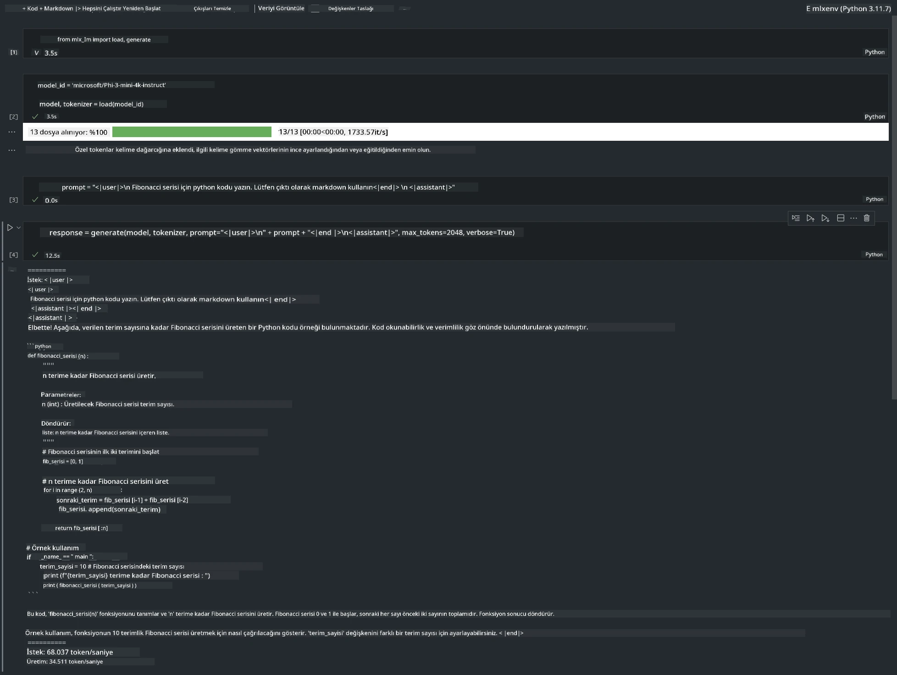

<!--
CO_OP_TRANSLATOR_METADATA:
{
  "original_hash": "dcb656f3d206fc4968e236deec5d4384",
  "translation_date": "2025-07-16T21:03:03+00:00",
  "source_file": "md/01.Introduction/03/MLX_Inference.md",
  "language_code": "tr"
}
-->
# **Apple MLX Framework ile Phi-3 Çıkarımı**

## **MLX Framework Nedir**

MLX, Apple silikon üzerinde makine öğrenimi araştırmaları için geliştirilmiş bir dizi (array) framework’üdür ve Apple makine öğrenimi araştırmaları tarafından sunulmaktadır.

MLX, makine öğrenimi araştırmacıları tarafından makine öğrenimi araştırmacıları için tasarlanmıştır. Framework kullanıcı dostu olacak şekilde planlanmış, ancak modelleri eğitmek ve dağıtmak için yine de verimli çalışması hedeflenmiştir. Framework’ün tasarımı kavramsal olarak da basittir. Amacımız, araştırmacıların MLX’i kolayca genişletip geliştirebilmesini sağlayarak yeni fikirleri hızlıca keşfetmelerine olanak tanımaktır.

Apple Silikon cihazlarda LLM’ler MLX aracılığıyla hızlandırılabilir ve modeller yerel olarak çok rahat bir şekilde çalıştırılabilir.

## **MLX Kullanarak Phi-3-mini Çıkarımı**

### **1. MLX ortamınızı kurun**

1. Python 3.11.x
2. MLX Kütüphanesini yükleyin


```bash

pip install mlx-lm

```

### **2. Terminalde MLX ile Phi-3-mini çalıştırma**


```bash

python -m mlx_lm.generate --model microsoft/Phi-3-mini-4k-instruct --max-token 2048 --prompt  "<|user|>\nCan you introduce yourself<|end|>\n<|assistant|>"

```

Sonuç (benim ortamım Apple M1 Max, 64GB) şu şekildedir:



### **3. Terminalde MLX ile Phi-3-mini’yi Kuantize Etme**


```bash

python -m mlx_lm.convert --hf-path microsoft/Phi-3-mini-4k-instruct

```

***Not:*** Model mlx_lm.convert ile kuantize edilebilir ve varsayılan kuantizasyon INT4’tür. Bu örnekte Phi-3-mini INT4’e kuantize edilmektedir.

Model mlx_lm.convert ile kuantize edilebilir ve varsayılan kuantizasyon INT4’tür. Bu örnek Phi-3-mini’yi INT4’e kuantize etmektedir. Kuantizasyondan sonra model varsayılan dizin olan ./mlx_model içinde saklanacaktır.

Terminalden MLX ile kuantize edilmiş modeli test edebiliriz.


```bash

python -m mlx_lm.generate --model ./mlx_model/ --max-token 2048 --prompt  "<|user|>\nCan you introduce yourself<|end|>\n<|assistant|>"

```

Sonuç şu şekildedir:




### **4. Jupyter Notebook’ta MLX ile Phi-3-mini çalıştırma**




***Not:*** Lütfen bu örneği okuyun [bu bağlantıya tıklayın](../../../../../code/03.Inference/MLX/MLX_DEMO.ipynb)


## **Kaynaklar**

1. Apple MLX Framework hakkında bilgi edinin [https://ml-explore.github.io](https://ml-explore.github.io/mlx/build/html/index.html)

2. Apple MLX GitHub Deposu [https://github.com/ml-explore](https://github.com/ml-explore)

**Feragatname**:  
Bu belge, AI çeviri hizmeti [Co-op Translator](https://github.com/Azure/co-op-translator) kullanılarak çevrilmiştir. Doğruluk için çaba göstersek de, otomatik çevirilerin hatalar veya yanlışlıklar içerebileceğini lütfen unutmayınız. Orijinal belge, kendi dilinde yetkili kaynak olarak kabul edilmelidir. Kritik bilgiler için profesyonel insan çevirisi önerilir. Bu çevirinin kullanımı sonucu ortaya çıkabilecek yanlış anlamalar veya yorum hatalarından sorumlu değiliz.