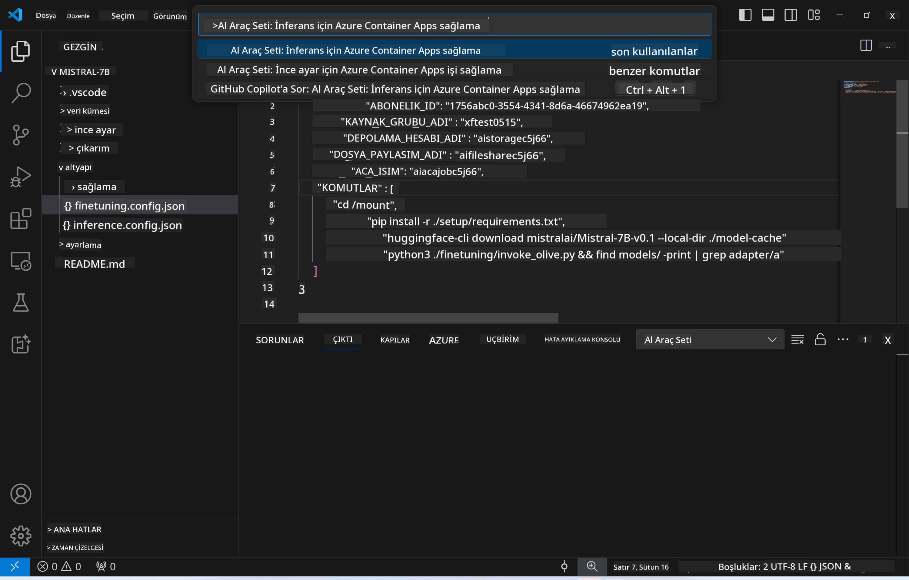
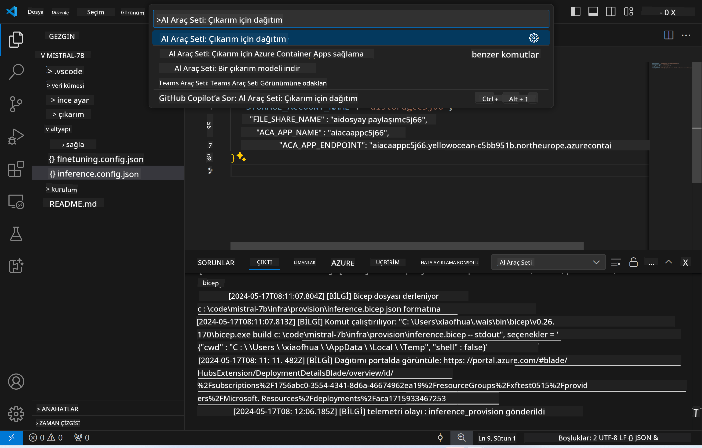

<!--
CO_OP_TRANSLATOR_METADATA:
{
  "original_hash": "a54cd3d65b6963e4e8ce21e143c3ab04",
  "translation_date": "2025-05-09T12:39:12+00:00",
  "source_file": "md/01.Introduction/03/Remote_Interence.md",
  "language_code": "tr"
}
-->
# İnce Ayarlı Model ile Uzaktan Çıkarım

Adaptörler uzak ortamda eğitildikten sonra, modelle etkileşim kurmak için basit bir Gradio uygulaması kullanın.


### Azure Kaynaklarının Sağlanması
Uzaktan çıkarım için Azure Kaynaklarını, komut paletinden `AI Toolkit: Provision Azure Container Apps for inference` komutunu çalıştırarak ayarlamanız gerekiyor. Bu işlem sırasında Azure Aboneliğinizi ve kaynak grubunuzu seçmeniz istenecek.  


Varsayılan olarak, çıkarım için abonelik ve kaynak grubu, ince ayar sırasında kullanılanlarla aynı olmalıdır. Çıkarım, aynı Azure Container App Ortamını kullanacak ve ince ayar adımında oluşturulan model ile model adaptörüne Azure Files üzerinden erişecektir.

## AI Toolkit Kullanımı

### Çıkarım için Dağıtım  
Çıkarım kodunu gözden geçirmek veya çıkarım modelini yeniden yüklemek isterseniz, `AI Toolkit: Deploy for inference` komutunu çalıştırın. Bu, en son kodunuzu ACA ile senkronize eder ve replikanın yeniden başlamasını sağlar.



Dağıtım başarıyla tamamlandıktan sonra, model bu endpoint üzerinden değerlendirmeye hazırdır.

### Çıkarım API'sine Erişim

VSCode bildiriminde görünen "*Go to Inference Endpoint*" butonuna tıklayarak çıkarım API'sine erişebilirsiniz. Alternatif olarak, web API endpoint'i `ACA_APP_ENDPOINT` altında `./infra/inference.config.json` ve çıktı panelinde bulunabilir.


> **Not:** Çıkarım endpoint'inin tam olarak çalışır hale gelmesi birkaç dakika sürebilir.

## Şablonda Bulunan Çıkarım Bileşenleri

| Klasör | İçerik |
| ------ |--------|
| `infra` | Uzaktan işlemler için gerekli tüm yapılandırmaları içerir. |
| `infra/provision/inference.parameters.json` | Çıkarım için Azure kaynaklarının sağlanmasında kullanılan bicep şablonlarının parametrelerini barındırır. |
| `infra/provision/inference.bicep` | Çıkarım için Azure kaynaklarının sağlanmasına yönelik şablonları içerir. |
| `infra/inference.config.json` | `AI Toolkit: Provision Azure Container Apps for inference` komutuyla oluşturulan yapılandırma dosyasıdır. Diğer uzak komut paletleri için giriş olarak kullanılır. |

### AI Toolkit ile Azure Kaynak Sağlama Yapılandırması
[AI Toolkit](https://marketplace.visualstudio.com/items?itemName=ms-windows-ai-studio.windows-ai-studio) yapılandırın.

Çıkarım için Azure Container Apps sağlayın` command.

You can find configuration parameters in `./infra/provision/inference.parameters.json` file. Here are the details:
| Parameter | Description |
| --------- |------------ |
| `defaultCommands` | This is the commands to initiate a web API. |
| `maximumInstanceCount` | This parameter sets the maximum capacity of GPU instances. |
| `location` | This is the location where Azure resources are provisioned. The default value is the same as the chosen resource group's location. |
| `storageAccountName`, `fileShareName` `acaEnvironmentName`, `acaEnvironmentStorageName`, `acaAppName`,  `acaLogAnalyticsName` | These parameters are used to name the Azure resources for provision. By default, they will be same to the fine-tuning resource name. You can input a new, unused resource name to create your own custom-named resources, or you can input the name of an already existing Azure resource if you'd prefer to use that. For details, refer to the section [Using existing Azure Resources](../../../../../md/01.Introduction/03). |

### Using Existing Azure Resources

By default, the inference provision use the same Azure Container App Environment, Storage Account, Azure File Share, and Azure Log Analytics that were used for fine-tuning. A separate Azure Container App is created solely for the inference API. 

If you have customized the Azure resources during the fine-tuning step or want to use your own existing Azure resources for inference, specify their names in the `./infra/inference.parameters.json dosyası. Ardından, komut paletinden `AI Toolkit: Provision Azure Container Apps for inference` komutunu çalıştırın. Bu, belirtilen kaynakları günceller ve eksik olanları oluşturur.

Örneğin, mevcut bir Azure konteyner ortamınız varsa, `./infra/finetuning.parameters.json` dosyanız şu şekilde olmalıdır:

```json
{
    "$schema": "https://schema.management.azure.com/schemas/2019-04-01/deploymentParameters.json#",
    "contentVersion": "1.0.0.0",
    "parameters": {
      ...
      "acaEnvironmentName": {
        "value": "<your-aca-env-name>"
      },
      "acaEnvironmentStorageName": {
        "value": null
      },
      ...
    }
  }
```

### Manuel Sağlama  
Azure kaynaklarını manuel yapılandırmayı tercih ederseniz, `./infra/provision` folders. If you have already set up and configured all the Azure resources without using the AI Toolkit command palette, you can simply enter the resource names in the `inference.config.json` dosyasındaki sağlanan bicep dosyalarını kullanabilirsiniz.

Örneğin:

```json
{
  "SUBSCRIPTION_ID": "<your-subscription-id>",
  "RESOURCE_GROUP_NAME": "<your-resource-group-name>",
  "STORAGE_ACCOUNT_NAME": "<your-storage-account-name>",
  "FILE_SHARE_NAME": "<your-file-share-name>",
  "ACA_APP_NAME": "<your-aca-name>",
  "ACA_APP_ENDPOINT": "<your-aca-endpoint>"
}
```

**Feragatname**:  
Bu belge, AI çeviri hizmeti [Co-op Translator](https://github.com/Azure/co-op-translator) kullanılarak çevrilmiştir. Doğruluk için çaba sarf etsek de, otomatik çevirilerin hatalar veya yanlışlıklar içerebileceğini lütfen unutmayınız. Orijinal belge, kendi dilinde yetkili kaynak olarak kabul edilmelidir. Kritik bilgiler için profesyonel insan çevirisi önerilir. Bu çevirinin kullanımı sonucu oluşabilecek yanlış anlamalar veya yanlış yorumlamalardan sorumlu değiliz.