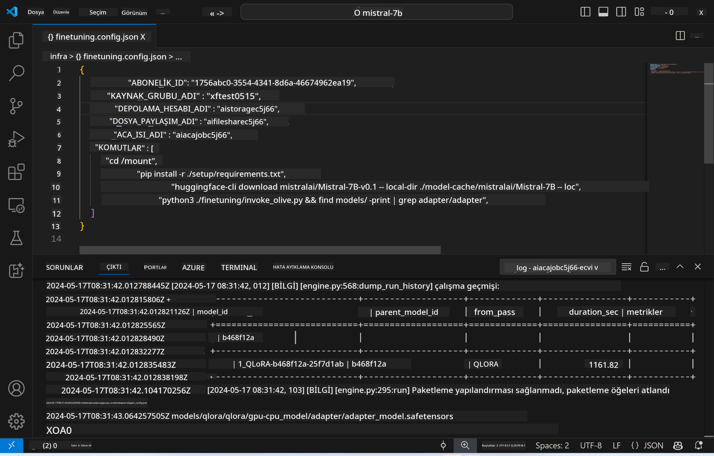
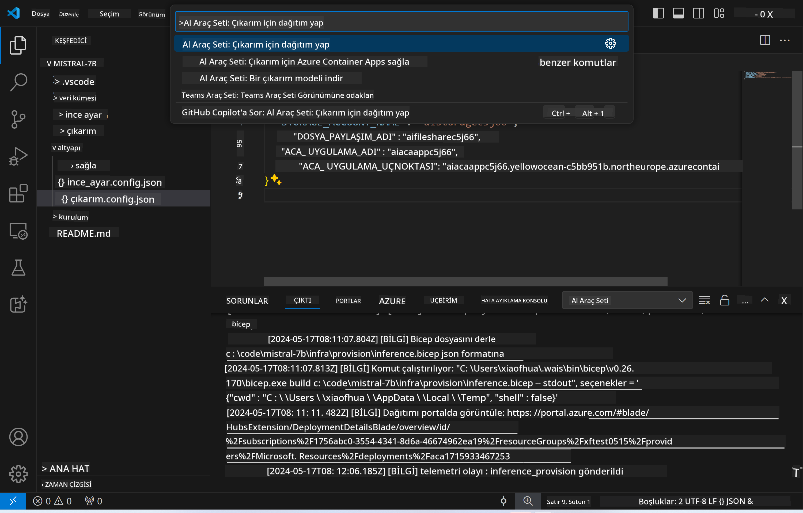

<!--
CO_OP_TRANSLATOR_METADATA:
{
  "original_hash": "a54cd3d65b6963e4e8ce21e143c3ab04",
  "translation_date": "2025-07-16T21:18:47+00:00",
  "source_file": "md/01.Introduction/03/Remote_Interence.md",
  "language_code": "tr"
}
-->
# İnce Ayarlı Model ile Uzaktan Çıkarım

Adaptörler uzaktaki ortamda eğitildikten sonra, modelle etkileşim kurmak için basit bir Gradio uygulaması kullanabilirsiniz.



### Azure Kaynaklarını Sağlama  
Uzaktan çıkarım için Azure Kaynaklarını ayarlamak üzere komut paletinden `AI Toolkit: Provision Azure Container Apps for inference` komutunu çalıştırmanız gerekir. Bu işlem sırasında Azure Aboneliğinizi ve kaynak grubunuzu seçmeniz istenecektir.  


Varsayılan olarak, çıkarım için kullanılan abonelik ve kaynak grubu, ince ayar için kullanılanlarla aynı olmalıdır. Çıkarım, aynı Azure Container App Ortamını kullanacak ve ince ayar adımında oluşturulan model ve model adaptörüne Azure Files üzerinden erişecektir.

## AI Toolkit Kullanımı

### Çıkarım için Dağıtım  
Çıkarım kodunu gözden geçirmek veya çıkarım modelini yeniden yüklemek isterseniz, `AI Toolkit: Deploy for inference` komutunu çalıştırın. Bu, en güncel kodunuzu ACA ile senkronize eder ve replika yeniden başlatılır.



Dağıtım başarıyla tamamlandıktan sonra, model bu uç nokta üzerinden değerlendirmeye hazırdır.

### Çıkarım API’sine Erişim

VSCode bildiriminde gösterilen "*Go to Inference Endpoint*" butonuna tıklayarak çıkarım API’sine erişebilirsiniz. Alternatif olarak, web API uç noktası `./infra/inference.config.json` dosyasındaki `ACA_APP_ENDPOINT` altında ve çıktı panelinde bulunabilir.


> **Not:** Çıkarım uç noktasının tam olarak çalışır hale gelmesi birkaç dakika sürebilir.

## Şablonda Bulunan Çıkarım Bileşenleri

| Klasör | İçerik |
| ------ |--------|
| `infra` | Uzaktan işlemler için gerekli tüm yapılandırmaları içerir. |
| `infra/provision/inference.parameters.json` | Azure kaynaklarını sağlamak için kullanılan bicep şablonları için parametreleri barındırır. |
| `infra/provision/inference.bicep` | Azure kaynaklarını sağlamak için kullanılan şablonları içerir. |
| `infra/inference.config.json` | `AI Toolkit: Provision Azure Container Apps for inference` komutu ile oluşturulan yapılandırma dosyasıdır. Diğer uzaktan komut paletleri için giriş olarak kullanılır. |

### AI Toolkit ile Azure Kaynak Sağlamayı Yapılandırma  
[AI Toolkit](https://marketplace.visualstudio.com/items?itemName=ms-windows-ai-studio.windows-ai-studio) yapılandırın.

`Provision Azure Container Apps for inference` komutunu çalıştırın.

Yapılandırma parametrelerini `./infra/provision/inference.parameters.json` dosyasında bulabilirsiniz. Detaylar aşağıdadır:  
| Parametre | Açıklama |
| --------- |----------|
| `defaultCommands` | Web API başlatmak için kullanılan komutlardır. |
| `maximumInstanceCount` | GPU örneklerinin maksimum kapasitesini belirler. |
| `location` | Azure kaynaklarının sağlanacağı konumdur. Varsayılan değer, seçilen kaynak grubunun konumuyla aynıdır. |
| `storageAccountName`, `fileShareName`, `acaEnvironmentName`, `acaEnvironmentStorageName`, `acaAppName`, `acaLogAnalyticsName` | Bu parametreler, sağlanacak Azure kaynaklarının isimlendirilmesinde kullanılır. Varsayılan olarak ince ayar kaynak adıyla aynı olur. Kendi özel isimlendirilmiş kaynaklarınızı oluşturmak için yeni ve kullanılmamış bir kaynak adı girebilir veya mevcut bir Azure kaynağının adını kullanabilirsiniz. Detaylar için [Mevcut Azure Kaynaklarını Kullanma](../../../../../md/01.Introduction/03) bölümüne bakınız. |

### Mevcut Azure Kaynaklarını Kullanma

Varsayılan olarak, çıkarım sağlama işlemi, ince ayar için kullanılan aynı Azure Container App Ortamı, Depolama Hesabı, Azure File Share ve Azure Log Analytics’i kullanır. Çıkarım API’si için ayrı bir Azure Container App oluşturulur.

Eğer ince ayar sırasında Azure kaynaklarını özelleştirdiyseniz veya çıkarım için kendi mevcut Azure kaynaklarınızı kullanmak istiyorsanız, bunların adlarını `./infra/inference.parameters.json` dosyasına belirtin. Ardından komut paletinden `AI Toolkit: Provision Azure Container Apps for inference` komutunu çalıştırın. Bu, belirtilen kaynakları günceller ve eksik olanları oluşturur.

Örneğin, mevcut bir Azure container ortamınız varsa, `./infra/finetuning.parameters.json` dosyanız şöyle görünmelidir:

```json
{
    "$schema": "https://schema.management.azure.com/schemas/2019-04-01/deploymentParameters.json#",
    "contentVersion": "1.0.0.0",
    "parameters": {
      ...
      "acaEnvironmentName": {
        "value": "<your-aca-env-name>"
      },
      "acaEnvironmentStorageName": {
        "value": null
      },
      ...
    }
  }
```

### Manuel Sağlama  
Azure kaynaklarını manuel olarak yapılandırmak isterseniz, `./infra/provision` klasöründeki bicep dosyalarını kullanabilirsiniz. AI Toolkit komut paletini kullanmadan tüm Azure kaynaklarını zaten kurup yapılandırdıysanız, kaynak adlarını `inference.config.json` dosyasına girebilirsiniz.

Örnek:

```json
{
  "SUBSCRIPTION_ID": "<your-subscription-id>",
  "RESOURCE_GROUP_NAME": "<your-resource-group-name>",
  "STORAGE_ACCOUNT_NAME": "<your-storage-account-name>",
  "FILE_SHARE_NAME": "<your-file-share-name>",
  "ACA_APP_NAME": "<your-aca-name>",
  "ACA_APP_ENDPOINT": "<your-aca-endpoint>"
}
```

**Feragatname**:  
Bu belge, AI çeviri servisi [Co-op Translator](https://github.com/Azure/co-op-translator) kullanılarak çevrilmiştir. Doğruluk için çaba gösterilse de, otomatik çevirilerin hatalar veya yanlışlıklar içerebileceğini lütfen unutmayınız. Orijinal belge, kendi dilinde yetkili kaynak olarak kabul edilmelidir. Kritik bilgiler için profesyonel insan çevirisi önerilir. Bu çevirinin kullanımı sonucu oluşabilecek yanlış anlamalar veya yorum hatalarından sorumlu değiliz.