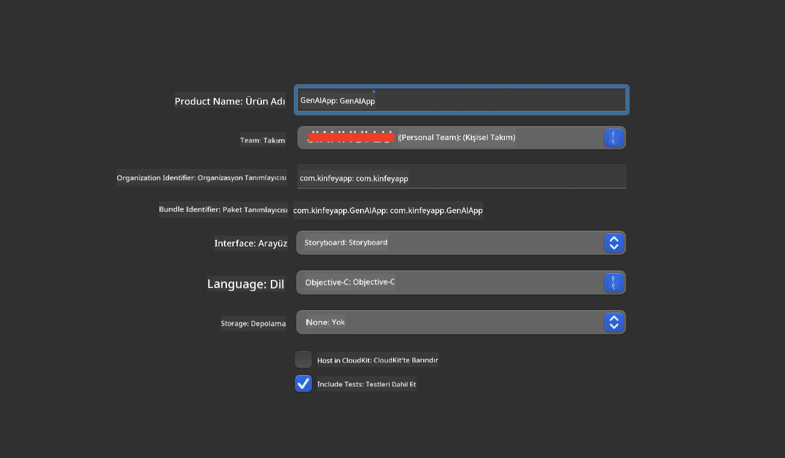
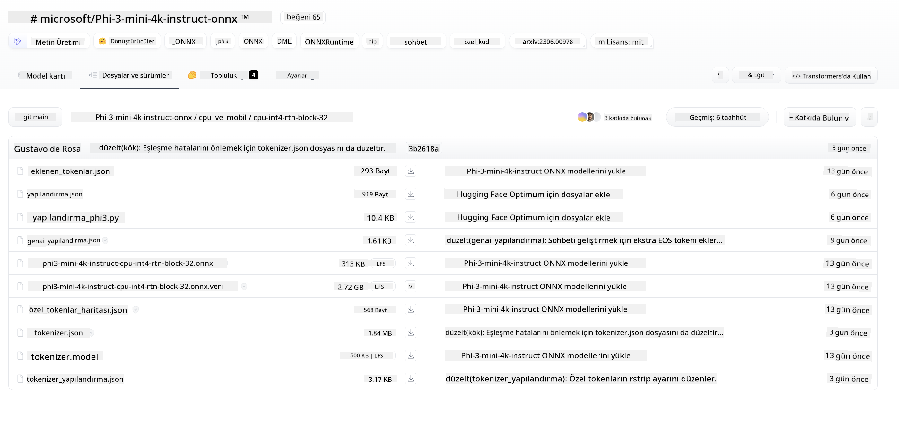
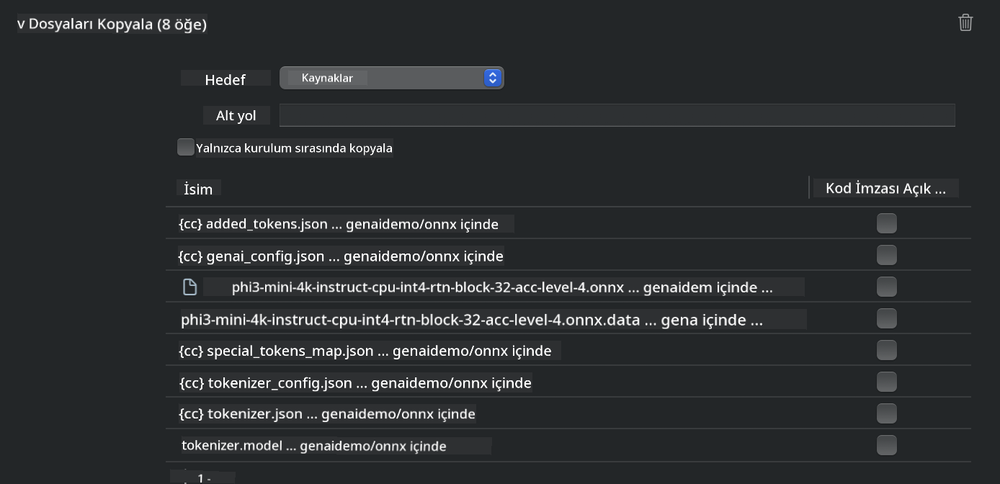
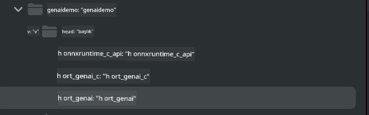
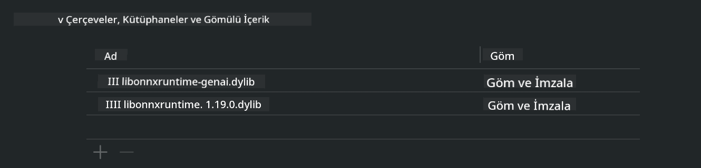
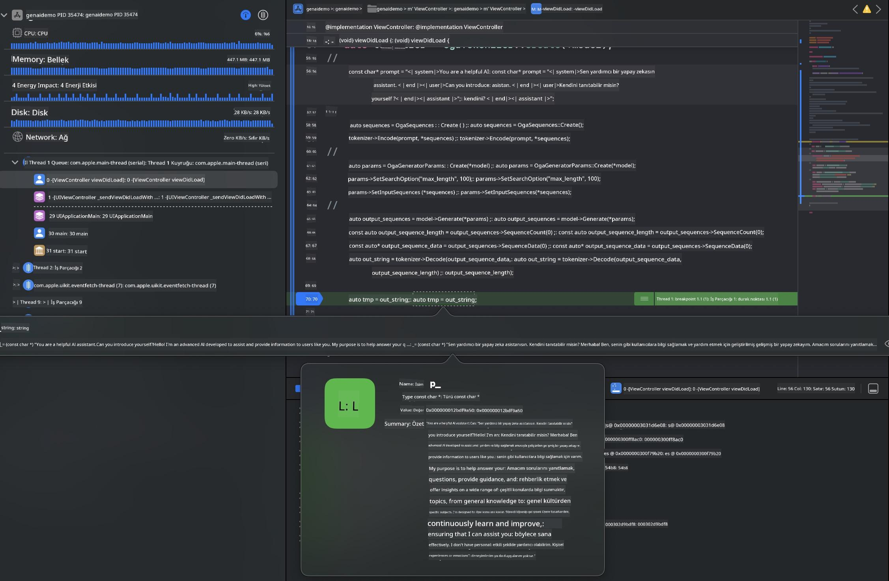

<!--
CO_OP_TRANSLATOR_METADATA:
{
  "original_hash": "82af197df38d25346a98f1f0e84d1698",
  "translation_date": "2025-05-09T10:57:40+00:00",
  "source_file": "md/01.Introduction/03/iOS_Inference.md",
  "language_code": "tr"
}
-->
# **iOS'ta Phi-3 Çıkarımı**

Phi-3-mini, Microsoft'un uç cihazlar ve IoT cihazlarında Büyük Dil Modelleri (LLM'ler) dağıtımını mümkün kılan yeni model serisidir. Phi-3-mini, iOS, Android ve Edge Cihaz dağıtımları için kullanılabilir ve BYOD ortamlarında üretken yapay zekanın kullanılmasını sağlar. Aşağıdaki örnek, Phi-3-mini'nin iOS'ta nasıl dağıtılacağını göstermektedir.

## **1. Hazırlık**

- **a.** macOS 14+
- **b.** Xcode 15+
- **c.** iOS SDK 17.x (iPhone 14 A16 veya üstü)
- **d.** Python 3.10+ yükleyin (Conda önerilir)
- **e.** Python kütüphanesini yükleyin: `python-flatbuffers`
- **f.** CMake yükleyin

### Semantic Kernel ve Çıkarım

Semantic Kernel, Azure OpenAI Service, OpenAI modelleri ve hatta yerel modellerle uyumlu uygulamalar oluşturmanızı sağlayan bir uygulama çerçevesidir. Semantic Kernel üzerinden yerel servislere erişmek, kendi barındırdığınız Phi-3-mini model sunucusu ile kolay entegrasyon sağlar.

### Ollama veya LlamaEdge ile Kuantize Modelleri Çağırma

Birçok kullanıcı, modelleri yerelde çalıştırmak için kuantize modelleri tercih eder. [Ollama](https://ollama.com) ve [LlamaEdge](https://llamaedge.com) farklı kuantize modelleri çağırmanızı sağlar:

#### **Ollama**

`ollama run phi3`'i doğrudan çalıştırabilir veya çevrimdışı olarak yapılandırabilirsiniz. `gguf` dosyanızın yolunu içeren bir Modelfile oluşturun. Phi-3-mini kuantize modelini çalıştırmak için örnek kod:

```gguf
FROM {Add your gguf file path}
TEMPLATE \"\"\"<|user|> .Prompt<|end|> <|assistant|>\"\"\"
PARAMETER stop <|end|>
PARAMETER num_ctx 4096
```

#### **LlamaEdge**

`gguf`'yi hem bulut hem de uç cihazlarda aynı anda kullanmak isterseniz, LlamaEdge harika bir seçenektir.

## **2. iOS için ONNX Runtime Derleme**

```bash

git clone https://github.com/microsoft/onnxruntime.git

cd onnxruntime

./build.sh --build_shared_lib --ios --skip_tests --parallel --build_dir ./build_ios --ios --apple_sysroot iphoneos --osx_arch arm64 --apple_deploy_target 17.5 --cmake_generator Xcode --config Release

cd ../

```

### **Dikkat**

- **a.** Derlemeden önce, Xcode'un doğru yapılandırıldığından emin olun ve terminalde aktif geliştirici dizini olarak ayarlayın:

    ```bash
    sudo xcode-select -switch /Applications/Xcode.app/Contents/Developer
    ```

- **b.** ONNX Runtime farklı platformlar için derlenmelidir. iOS için `arm64` or `x86_64` için derleme yapabilirsiniz.

- **c.** Derleme için en güncel iOS SDK'nın kullanılması önerilir. Ancak, önceki SDK'larla uyumluluk gerekiyorsa daha eski bir sürüm de kullanılabilir.

## **3. iOS için ONNX Runtime ile Üretken Yapay Zekayı Derleme**

> **Not:** ONNX Runtime ile Üretken Yapay Zeka henüz önizleme aşamasında olduğundan, değişiklikler olabileceğini unutmayın.

```bash

git clone https://github.com/microsoft/onnxruntime-genai
 
cd onnxruntime-genai
 
mkdir ort
 
cd ort
 
mkdir include
 
mkdir lib
 
cd ../
 
cp ../onnxruntime/include/onnxruntime/core/session/onnxruntime_c_api.h ort/include
 
cp ../onnxruntime/build_ios/Release/Release-iphoneos/libonnxruntime*.dylib* ort/lib
 
export OPENCV_SKIP_XCODEBUILD_FORCE_TRYCOMPILE_DEBUG=1
 
python3 build.py --parallel --build_dir ./build_ios --ios --ios_sysroot iphoneos --ios_arch arm64 --ios_deployment_target 17.5 --cmake_generator Xcode --cmake_extra_defines CMAKE_XCODE_ATTRIBUTE_CODE_SIGNING_ALLOWED=NO

```

## **4. Xcode'da Bir App Uygulaması Oluşturma**

App geliştirme yöntemi olarak Objective-C'yi seçtim çünkü ONNX Runtime C++ API ile Üretken Yapay Zeka kullanırken Objective-C daha uyumludur. Elbette, ilgili çağrıları Swift köprüsü ile de tamamlayabilirsiniz.



## **5. ONNX Kuantize INT4 Modelini App Projesine Kopyalama**

ONNX formatındaki INT4 kuantizasyon modelini projenize dahil etmeniz gerekiyor, önce indirmeniz gerekmektedir.



İndirdikten sonra, Xcode'daki projenin Resources dizinine eklemeniz gerekir.



## **6. ViewControllers İçinde C++ API Ekleme**

> **Dikkat:**

- **a.** İlgili C++ başlık dosyalarını projeye ekleyin.

  

- **b.** Objective-C++ desteği için `onnxruntime-genai` dynamic library in Xcode.

  

- **c.** Use the C Samples code for testing. You can also add additional features like ChatUI for more functionality.

- **d.** Since you need to use C++ in your project, rename `ViewController.m` to `ViewController.mm` dosyasını dahil edin.

```objc

    NSString *llmPath = [[NSBundle mainBundle] resourcePath];
    char const *modelPath = llmPath.cString;

    auto model =  OgaModel::Create(modelPath);

    auto tokenizer = OgaTokenizer::Create(*model);

    const char* prompt = "<|system|>You are a helpful AI assistant.<|end|><|user|>Can you introduce yourself?<|end|><|assistant|>";

    auto sequences = OgaSequences::Create();
    tokenizer->Encode(prompt, *sequences);

    auto params = OgaGeneratorParams::Create(*model);
    params->SetSearchOption("max_length", 100);
    params->SetInputSequences(*sequences);

    auto output_sequences = model->Generate(*params);
    const auto output_sequence_length = output_sequences->SequenceCount(0);
    const auto* output_sequence_data = output_sequences->SequenceData(0);
    auto out_string = tokenizer->Decode(output_sequence_data, output_sequence_length);
    
    auto tmp = out_string;

```

## **7. Uygulamayı Çalıştırma**

Kurulum tamamlandıktan sonra, Phi-3-mini model çıkarımının sonuçlarını görmek için uygulamayı çalıştırabilirsiniz.



Daha fazla örnek kod ve detaylı talimatlar için [Phi-3 Mini Samples deposunu](https://github.com/Azure-Samples/Phi-3MiniSamples/tree/main/ios) ziyaret edin.

**Feragatname**:  
Bu belge, AI çeviri hizmeti [Co-op Translator](https://github.com/Azure/co-op-translator) kullanılarak çevrilmiştir. Doğruluk için çaba göstersek de, otomatik çevirilerin hatalar veya yanlışlıklar içerebileceğini lütfen unutmayın. Orijinal belge, kendi dilinde yetkili kaynak olarak kabul edilmelidir. Kritik bilgiler için profesyonel insan çevirisi önerilir. Bu çevirinin kullanımı sonucu oluşabilecek yanlış anlamalar veya yorum hatalarından sorumlu değiliz.