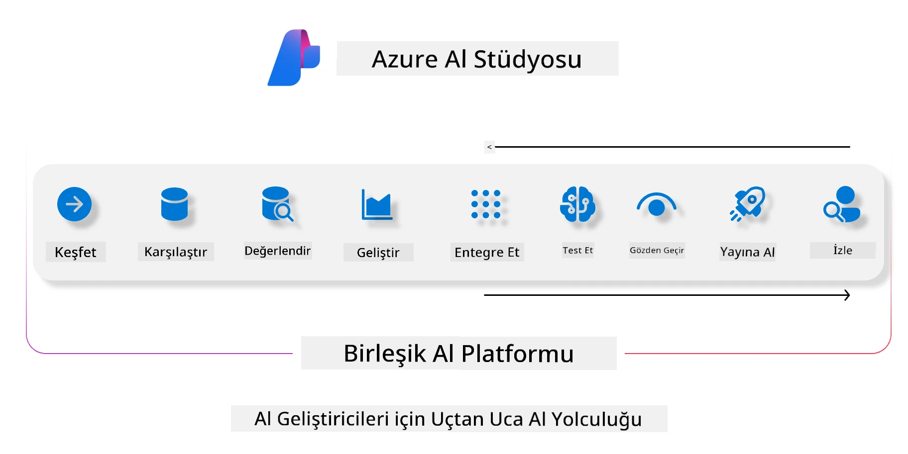
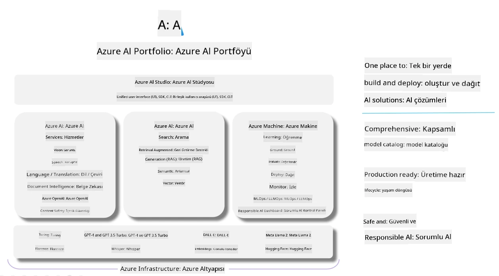

# **Azure AI Foundry ile Değerlendirme Yapmak**

[Azure AI Foundry](https://ai.azure.com?WT.mc_id=aiml-138114-kinfeylo) kullanarak üretken yapay zeka uygulamanızı nasıl değerlendireceğinizi öğrenin. Tek seferlik veya çok aşamalı sohbetleri değerlendiriyor olun, Azure AI Foundry model performansı ve güvenliği için araçlar sunar.

## Azure AI Foundry ile Üretken Yapay Zeka Uygulamalarını Değerlendirme
Daha ayrıntılı talimatlar için [Azure AI Foundry Dokümantasyonu](https://learn.microsoft.com/azure/ai-studio/how-to/evaluate-generative-ai-app?WT.mc_id=aiml-138114-kinfeylo) sayfasına bakabilirsiniz.

Başlamak için adımlar şunlardır:

## Azure AI Foundry'de Üretken Yapay Zeka Modellerini Değerlendirme

**Ön Koşullar**

- CSV veya JSON formatında bir test veri seti.
- Dağıtılmış bir üretken yapay zeka modeli (örneğin Phi-3, GPT 3.5, GPT 4 veya Davinci modelleri).
- Değerlendirmeyi çalıştırmak için bir compute instance içeren bir runtime.

## Dahili Değerlendirme Ölçütleri

Azure AI Foundry, hem tek seferlik hem de karmaşık çok aşamalı sohbetleri değerlendirmenize olanak tanır.  
Modelin belirli verilere dayandığı Retrieval Augmented Generation (RAG) senaryolarında, performansı dahili değerlendirme ölçütleriyle ölçebilirsiniz.  
Ayrıca, genel tek seferlik soru-cevap senaryolarını (RAG olmayan) da değerlendirebilirsiniz.

## Değerlendirme Çalıştırması Oluşturma

Azure AI Foundry arayüzünden Evaluate sayfasına veya Prompt Flow sayfasına gidin.  
Değerlendirme oluşturma sihirbazını takip ederek bir değerlendirme çalıştırması ayarlayın. Değerlendirmenize isteğe bağlı bir isim verin.  
Uygulamanızın hedeflerine uygun senaryoyu seçin.  
Model çıktısını değerlendirmek için bir veya daha fazla değerlendirme ölçütü seçin.

## Özel Değerlendirme Akışı (İsteğe Bağlı)

Daha fazla esneklik için özel bir değerlendirme akışı oluşturabilirsiniz. Değerlendirme sürecini özel ihtiyaçlarınıza göre özelleştirin.

## Sonuçları Görüntüleme

Değerlendirmeyi çalıştırdıktan sonra, Azure AI Foundry’de ayrıntılı değerlendirme ölçütlerini kaydedin, görüntüleyin ve analiz edin. Uygulamanızın yetenekleri ve sınırlamaları hakkında bilgi edinin.

**Note** Azure AI Foundry şu anda genel önizlemede olduğundan, deney ve geliştirme amaçlı kullanılması önerilir. Üretim iş yükleri için diğer seçenekleri değerlendirin. Daha fazla detay ve adım adım talimatlar için resmi [AI Foundry dokümantasyonunu](https://learn.microsoft.com/azure/ai-studio/?WT.mc_id=aiml-138114-kinfeylo) inceleyin.

**Feragatname**:  
Bu belge, AI çeviri servisi [Co-op Translator](https://github.com/Azure/co-op-translator) kullanılarak çevrilmiştir. Doğruluk için çaba göstersek de, otomatik çevirilerin hatalar veya yanlışlıklar içerebileceğini lütfen unutmayın. Orijinal belge, kendi dilinde yetkili kaynak olarak kabul edilmelidir. Kritik bilgiler için profesyonel insan çevirisi önerilir. Bu çevirinin kullanımı sonucu ortaya çıkabilecek yanlış anlamalar veya yorum hatalarından sorumlu değiliz.