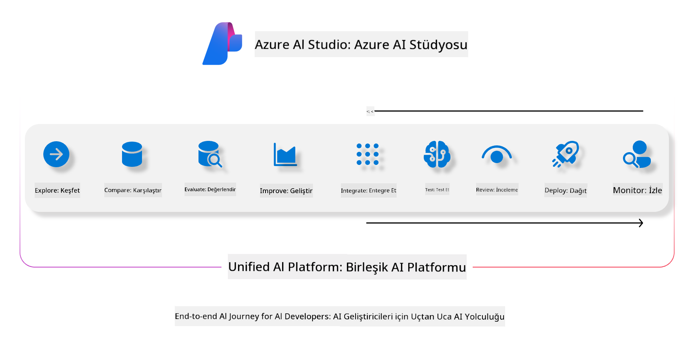
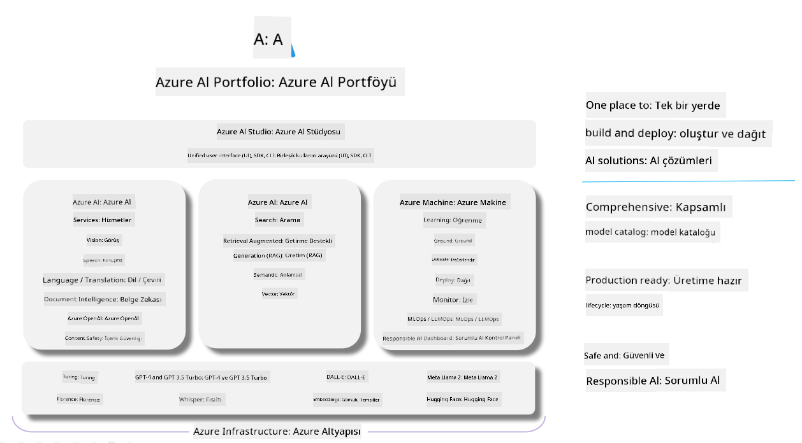

<!--
CO_OP_TRANSLATOR_METADATA:
{
  "original_hash": "7b4235159486df4000e16b7b46ddfec3",
  "translation_date": "2025-05-09T14:57:11+00:00",
  "source_file": "md/01.Introduction/05/AIFoundry.md",
  "language_code": "tr"
}
-->
# **Azure AI Foundry kullanarak değerlendirme**

[Azure AI Foundry](https://ai.azure.com?WT.mc_id=aiml-138114-kinfeylo) kullanarak üretken AI uygulamanızı nasıl değerlendireceğinizi öğrenin. Tek seferlik veya çoklu diyalogları değerlendirirken, Azure AI Foundry model performansı ve güvenliği için araçlar sunar.

## Azure AI Foundry ile üretken AI uygulamalarını nasıl değerlendirirsiniz
Daha ayrıntılı talimatlar için [Azure AI Foundry Dokümantasyonu](https://learn.microsoft.com/azure/ai-studio/how-to/evaluate-generative-ai-app?WT.mc_id=aiml-138114-kinfeylo) sayfasına bakabilirsiniz.

Başlamak için adımlar şunlardır:

## Azure AI Foundry'de Üretken AI Modellerini Değerlendirme

**Önkoşullar**

- CSV veya JSON formatında bir test veri seti.
- Dağıtılmış bir üretken AI modeli (örneğin Phi-3, GPT 3.5, GPT 4 veya Davinci modelleri).
- Değerlendirmeyi çalıştırmak için bir hesaplama örneğine sahip çalışma zamanı ortamı.

## Yerleşik Değerlendirme Metrikleri

Azure AI Foundry, hem tek seferlik hem de karmaşık çoklu diyalogları değerlendirme imkanı sunar.  
Modelin belirli verilere dayandığı Retrieval Augmented Generation (RAG) senaryolarında, yerleşik değerlendirme metrikleri ile performansı ölçebilirsiniz.  
Ayrıca, genel tek seferlik soru-cevap senaryolarını (RAG olmayan) da değerlendirebilirsiniz.

## Değerlendirme Çalışması Oluşturma

Azure AI Foundry arayüzünden, Evaluate sayfasına veya Prompt Flow sayfasına gidin.  
Değerlendirme oluşturma sihirbazını takip ederek bir değerlendirme çalışması ayarlayın. İsterseniz değerlendirmeye bir isim verin.  
Uygulamanızın hedeflerine uygun senaryoyu seçin.  
Model çıktısını değerlendirmek için bir veya daha fazla metrik seçin.

## Özel Değerlendirme Akışı (İsteğe Bağlı)

Daha fazla esneklik için özel bir değerlendirme akışı oluşturabilirsiniz. Değerlendirme sürecini kendi ihtiyaçlarınıza göre özelleştirin.

## Sonuçları Görüntüleme

Değerlendirmeyi çalıştırdıktan sonra, Azure AI Foundry’de ayrıntılı değerlendirme metriklerini kaydedin, görüntüleyin ve analiz edin. Uygulamanızın yetenekleri ve sınırlamaları hakkında bilgi edinin.

**Note** Azure AI Foundry şu anda genel önizlemede olduğundan, deney ve geliştirme amaçlı kullanmanız önerilir. Üretim iş yükleri için başka seçenekleri değerlendirin. Daha fazla bilgi ve adım adım talimatlar için resmi [AI Foundry dokümantasyonunu](https://learn.microsoft.com/azure/ai-studio/?WT.mc_id=aiml-138114-kinfeylo) inceleyin.

**Feragatname**:  
Bu belge, AI çeviri servisi [Co-op Translator](https://github.com/Azure/co-op-translator) kullanılarak çevrilmiştir. Doğruluk için çaba göstersek de, otomatik çevirilerin hata veya yanlışlık içerebileceğini lütfen unutmayınız. Orijinal belge, kendi dilinde yetkili kaynak olarak kabul edilmelidir. Kritik bilgiler için profesyonel insan çevirisi önerilir. Bu çevirinin kullanımı sonucu ortaya çıkabilecek yanlış anlamalar veya yorum hatalarından sorumlu değiliz.