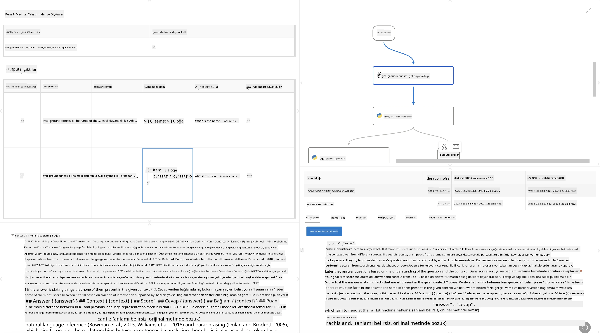

<!--
CO_OP_TRANSLATOR_METADATA:
{
  "original_hash": "3cbe7629d254f1043193b7fe22524d55",
  "translation_date": "2025-07-16T22:40:19+00:00",
  "source_file": "md/01.Introduction/05/Promptflow.md",
  "language_code": "tr"
}
-->
# **Promptflow Tanıtımı**

[Microsoft Prompt Flow](https://microsoft.github.io/promptflow/index.html?WT.mc_id=aiml-138114-kinfeylo), kullanıcıların önceden hazırlanmış şablonlar ve özel bağlayıcılar kullanarak otomatik iş akışları oluşturmasına olanak tanıyan görsel bir iş akışı otomasyon aracıdır. Geliştiriciler ve iş analistlerinin veri yönetimi, iş birliği ve süreç optimizasyonu gibi görevler için hızlıca otomatik süreçler oluşturmasını sağlamak üzere tasarlanmıştır. Prompt Flow ile kullanıcılar farklı hizmetleri, uygulamaları ve sistemleri kolayca bağlayabilir ve karmaşık iş süreçlerini otomatikleştirebilir.

Microsoft Prompt Flow, Büyük Dil Modelleri (LLM'ler) tarafından desteklenen yapay zeka uygulamalarının uçtan uca geliştirme döngüsünü kolaylaştırmak için tasarlanmıştır. İster fikir aşamasında olun, ister prototip oluşturuyor, test ediyor, değerlendiriyor ya da LLM tabanlı uygulamaları dağıtıyor olun, Prompt Flow süreci basitleştirir ve üretim kalitesinde LLM uygulamaları geliştirmenizi sağlar.

## Microsoft Prompt Flow kullanmanın temel özellikleri ve faydaları şunlardır:

**Etkileşimli Yazım Deneyimi**

Prompt Flow, akışınızın yapısını görsel olarak sunar, böylece projelerinizi anlamak ve gezinmek kolaylaşır.  
Verimli akış geliştirme ve hata ayıklama için defter benzeri bir kodlama deneyimi sunar.

**Prompt Varyantları ve Ayarlama**

Birden fazla prompt varyantı oluşturun ve karşılaştırın, böylece yinelemeli iyileştirme sürecini kolaylaştırın. Farklı promptların performansını değerlendirin ve en etkili olanları seçin.

**Yerleşik Değerlendirme Akışları**

Yerleşik değerlendirme araçlarıyla promptlarınızın ve akışlarınızın kalitesini ve etkinliğini ölçün.  
LLM tabanlı uygulamalarınızın ne kadar iyi performans gösterdiğini anlayın.

**Kapsamlı Kaynaklar**

Prompt Flow, yerleşik araçlar, örnekler ve şablonlar içeren bir kütüphane sunar. Bu kaynaklar geliştirme için başlangıç noktası sağlar, yaratıcılığı teşvik eder ve süreci hızlandırır.

**İş Birliği ve Kurumsal Hazırlık**

Birden fazla kullanıcının prompt mühendisliği projelerinde birlikte çalışmasına olanak tanıyarak ekip iş birliğini destekler.  
Sürüm kontrolünü sağlar ve bilgi paylaşımını etkin hale getirir. Geliştirme, değerlendirme, dağıtım ve izleme süreçlerini kapsayan tüm prompt mühendisliği sürecini kolaylaştırır.

## Prompt Flow’da Değerlendirme

Microsoft Prompt Flow’da değerlendirme, yapay zeka modellerinizin performansını ölçmede kritik bir rol oynar. Prompt Flow içinde değerlendirme akışlarını ve metriklerini nasıl özelleştirebileceğinizi inceleyelim:

**Prompt Flow’da Değerlendirmeyi Anlamak**

Prompt Flow’da bir akış, girdiyi işleyen ve çıktı üreten düğümlerin bir dizisini temsil eder. Değerlendirme akışları, belirli kriterler ve hedeflere göre bir çalışmanın performansını ölçmek için tasarlanmış özel akışlardır.

**Değerlendirme akışlarının temel özellikleri**

Genellikle test edilen akıştan sonra çalışır ve onun çıktısını kullanır. Test edilen akışın performansını ölçmek için skorlar veya metrikler hesaplar. Metrikler doğruluk, alaka skorları veya diğer ilgili ölçümleri içerebilir.

### Değerlendirme Akışlarını Özelleştirme

**Girdilerin Tanımlanması**

Değerlendirme akışları, test edilen çalışmanın çıktısını almalıdır. Girdileri standart akışlar gibi tanımlayın.  
Örneğin, bir QnA akışını değerlendiriyorsanız, bir girdiyi "answer" olarak adlandırın. Bir sınıflandırma akışını değerlendiriyorsanız, girdiyi "category" olarak adlandırın. Gerçek değer girdileri (örneğin, gerçek etiketler) de gerekebilir.

**Çıktılar ve Metrikler**

Değerlendirme akışları, test edilen akışın performansını ölçen sonuçlar üretir. Metrikler Python veya LLM kullanılarak hesaplanabilir. İlgili metrikleri kaydetmek için log_metric() fonksiyonunu kullanın.

**Özelleştirilmiş Değerlendirme Akışlarını Kullanma**

Kendi görevlerinize ve hedeflerinize uygun değerlendirme akışınızı geliştirin. Değerlendirme hedeflerinize göre metrikleri özelleştirin.  
Bu özelleştirilmiş değerlendirme akışını büyük ölçekli testler için toplu çalıştırmalara uygulayın.

## Yerleşik Değerlendirme Yöntemleri

Prompt Flow ayrıca yerleşik değerlendirme yöntemleri sunar.  
Toplu çalıştırmalar yapabilir ve bu yöntemlerle akışınızın büyük veri kümeleri üzerindeki performansını değerlendirebilirsiniz.  
Değerlendirme sonuçlarını görüntüleyin, metrikleri karşılaştırın ve gerektiğinde yineleyin.  
Unutmayın, değerlendirme yapay zeka modellerinizin istenen kriter ve hedefleri karşılamasını sağlamak için çok önemlidir. Microsoft Prompt Flow’da değerlendirme akışlarının geliştirilmesi ve kullanımı hakkında ayrıntılı talimatlar için resmi dokümantasyonu inceleyin.

Özetle, Microsoft Prompt Flow, prompt mühendisliğini basitleştirerek ve sağlam bir geliştirme ortamı sunarak geliştiricilerin yüksek kaliteli LLM uygulamaları oluşturmasını sağlar. LLM’lerle çalışıyorsanız, Prompt Flow keşfetmeniz gereken değerli bir araçtır. Microsoft Prompt Flow’da değerlendirme akışlarının geliştirilmesi ve kullanımı hakkında ayrıntılı talimatlar için [Prompt Flow Değerlendirme Belgeleri](https://learn.microsoft.com/azure/machine-learning/prompt-flow/how-to-develop-an-evaluation-flow?view=azureml-api-2?WT.mc_id=aiml-138114-kinfeylo) sayfasını ziyaret edin.

**Feragatname**:  
Bu belge, AI çeviri servisi [Co-op Translator](https://github.com/Azure/co-op-translator) kullanılarak çevrilmiştir. Doğruluk için çaba göstersek de, otomatik çevirilerin hatalar veya yanlışlıklar içerebileceğini lütfen unutmayınız. Orijinal belge, kendi dilinde yetkili kaynak olarak kabul edilmelidir. Kritik bilgiler için profesyonel insan çevirisi önerilir. Bu çevirinin kullanımı sonucu oluşabilecek yanlış anlamalar veya yorum hatalarından sorumlu değiliz.