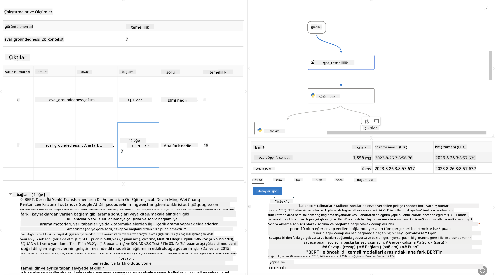

<!--
CO_OP_TRANSLATOR_METADATA:
{
  "original_hash": "3cbe7629d254f1043193b7fe22524d55",
  "translation_date": "2025-05-09T15:11:04+00:00",
  "source_file": "md/01.Introduction/05/Promptflow.md",
  "language_code": "tr"
}
-->
# **Promptflow Tanıtımı**

[Microsoft Prompt Flow](https://microsoft.github.io/promptflow/index.html?WT.mc_id=aiml-138114-kinfeylo), önceden hazırlanmış şablonlar ve özel bağlayıcılar kullanarak kullanıcıların otomatik iş akışları oluşturmasına olanak tanıyan görsel bir iş akışı otomasyon aracıdır. Geliştiricilerin ve iş analistlerinin veri yönetimi, iş birliği ve süreç optimizasyonu gibi görevler için hızlıca otomatik süreçler oluşturmasını sağlamak amacıyla tasarlanmıştır. Prompt Flow ile kullanıcılar farklı hizmetleri, uygulamaları ve sistemleri kolayca bağlayabilir ve karmaşık iş süreçlerini otomatikleştirebilir.

Microsoft Prompt Flow, Büyük Dil Modelleri (LLM'ler) destekli yapay zeka uygulamalarının uçtan uca geliştirme döngüsünü kolaylaştırmak için tasarlanmıştır. İster fikir aşamasında olun, ister prototip oluşturun, test edin, değerlendirin ya da LLM tabanlı uygulamaları devreye alın, Prompt Flow süreci basitleştirir ve üretim kalitesinde LLM uygulamaları geliştirmenize olanak tanır.

## Microsoft Prompt Flow’un temel özellikleri ve faydaları şunlardır:

**Etkileşimli Yazarlık Deneyimi**

Prompt Flow, akışınızın yapısını görsel olarak sunar, böylece projelerinizi anlamak ve gezinmek kolaylaşır.  
Verimli akış geliştirme ve hata ayıklama için defter benzeri bir kodlama deneyimi sunar.

**Prompt Varyantları ve Ayarlama**

Birden fazla prompt varyantı oluşturun ve karşılaştırın, yinelemeli iyileştirme sürecini kolaylaştırın. Farklı promptların performansını değerlendirin ve en etkili olanları seçin.

**Yerleşik Değerlendirme Akışları**  
Promptlarınızın ve akışlarınızın kalitesini ve etkinliğini yerleşik değerlendirme araçlarıyla ölçün.  
LLM tabanlı uygulamalarınızın performansını anlayın.

**Kapsamlı Kaynaklar**

Prompt Flow, yerleşik araçlar, örnekler ve şablonlar içeren bir kütüphane sunar. Bu kaynaklar geliştirme için başlangıç noktası sağlar, yaratıcılığı teşvik eder ve süreci hızlandırır.

**İş Birliği ve Kurumsal Hazırlık**

Birden çok kullanıcının prompt mühendisliği projelerinde birlikte çalışmasına destek vererek ekip iş birliğini kolaylaştırır.  
Sürüm kontrolü sağlar ve bilgi paylaşımını etkin kılar. Geliştirme, değerlendirme, dağıtım ve izleme süreçlerini kapsayan tüm prompt mühendisliği sürecini sadeleştirir.

## Prompt Flow’da Değerlendirme

Microsoft Prompt Flow’da değerlendirme, yapay zeka modellerinizin performansını ölçmede kritik bir rol oynar. Prompt Flow içinde değerlendirme akışlarını ve metriklerini nasıl özelleştirebileceğinizi keşfedelim:

**Prompt Flow’da Değerlendirmeyi Anlamak**

Prompt Flow’da bir akış, girdi işleyen ve çıktı üreten bir dizi düğümden oluşur. Değerlendirme akışları, belirli kriterler ve hedeflere göre bir çalıştırmanın performansını ölçmek için tasarlanmış özel akış türleridir.

**Değerlendirme akışlarının temel özellikleri**

Genellikle test edilen akıştan sonra çalışırlar ve onun çıktıları üzerinde işlem yaparlar. Test edilen akışın performansını ölçmek için skorlar veya metrikler hesaplarlar. Metrikler doğruluk, alaka puanları veya diğer ilgili ölçümler olabilir.

### Değerlendirme Akışlarını Özelleştirme

**Girdilerin Tanımlanması**

Değerlendirme akışlarının, test edilen çalıştırmanın çıktılarını alması gerekir. Girdileri standart akışlardaki gibi tanımlayın.  
Örneğin, bir QnA akışını değerlendiriyorsanız, bir girdi “answer” olarak adlandırılabilir. Bir sınıflandırma akışını değerlendiriyorsanız, girdi “category” olabilir. Gerçek değer girdileri (örneğin, gerçek etiketler) de gerekebilir.

**Çıktılar ve Metrikler**

Değerlendirme akışları, test edilen akışın performansını ölçen sonuçlar üretir. Metrikler Python veya LLM kullanılarak hesaplanabilir. İlgili metrikleri kaydetmek için log_metric() fonksiyonunu kullanın.

**Özelleştirilmiş Değerlendirme Akışlarının Kullanımı**

Kendi görevlerinize ve hedeflerinize uygun özel değerlendirme akışları geliştirin. Değerlendirme amaçlarınıza göre metrikleri özelleştirin.  
Bu özelleştirilmiş değerlendirme akışını büyük ölçekli testler için toplu çalıştırmalara uygulayın.

## Yerleşik Değerlendirme Yöntemleri

Prompt Flow ayrıca yerleşik değerlendirme yöntemleri sunar.  
Toplu çalıştırmalar gönderebilir ve büyük veri kümeleriyle akışınızın performansını bu yöntemlerle değerlendirebilirsiniz.  
Değerlendirme sonuçlarını görüntüleyin, metrikleri karşılaştırın ve gerektiğinde yineleyin.  
Unutmayın, değerlendirme yapay zeka modellerinizin istenen kriterlere ve hedeflere uygunluğunu sağlamak için önemlidir. Microsoft Prompt Flow’da değerlendirme akışları geliştirme ve kullanma hakkında ayrıntılı talimatlar için resmi dokümantasyonu inceleyin.

Özetle, Microsoft Prompt Flow, prompt mühendisliğini kolaylaştırarak ve güçlü bir geliştirme ortamı sağlayarak geliştiricilerin yüksek kaliteli LLM uygulamaları oluşturmasını sağlar. Eğer LLM’lerle çalışıyorsanız, Prompt Flow keşfetmeniz gereken değerli bir araçtır. Microsoft Prompt Flow’da değerlendirme akışları geliştirme ve kullanma hakkında detaylı talimatlar için [Prompt Flow Evaluation Documents](https://learn.microsoft.com/azure/machine-learning/prompt-flow/how-to-develop-an-evaluation-flow?view=azureml-api-2?WT.mc_id=aiml-138114-kinfeylo) sayfasını inceleyebilirsiniz.

**Feragatname**:  
Bu belge, AI çeviri hizmeti [Co-op Translator](https://github.com/Azure/co-op-translator) kullanılarak çevrilmiştir. Doğruluk için çaba göstersek de, otomatik çevirilerin hata veya yanlışlık içerebileceğini lütfen unutmayınız. Orijinal belge, kendi ana dilinde yetkili kaynak olarak kabul edilmelidir. Kritik bilgiler için profesyonel insan çevirisi önerilir. Bu çevirinin kullanımı sonucu ortaya çıkabilecek yanlış anlamalar veya yorum hatalarından sorumlu değiliz.