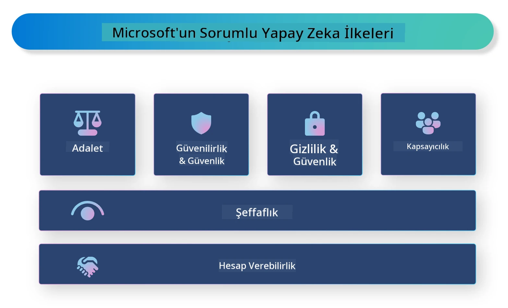

# **Sorumlu Yapay Zekayı Tanıtma**

[Microsoft Responsible AI](https://www.microsoft.com/ai/responsible-ai?WT.mc_id=aiml-138114-kinfeylo), geliştiricilerin ve kuruluşların şeffaf, güvenilir ve hesap verebilir yapay zeka sistemleri oluşturmasına yardımcı olmayı amaçlayan bir girişimdir. Bu girişim, gizlilik, adalet ve şeffaflık gibi etik ilkelere uygun sorumlu yapay zeka çözümleri geliştirmek için rehberlik ve kaynaklar sunar. Ayrıca, sorumlu yapay zeka sistemleri oluştururken karşılaşılan bazı zorlukları ve en iyi uygulamaları da inceleyeceğiz.

## Microsoft Responsible AI Genel Bakış

**Etik İlkeler**

Microsoft Responsible AI, gizlilik, adalet, şeffaflık, hesap verebilirlik ve güvenlik gibi bir dizi etik ilke tarafından yönlendirilir. Bu ilkeler, yapay zeka sistemlerinin etik ve sorumlu bir şekilde geliştirilmesini sağlamak için tasarlanmıştır.

**Şeffaf Yapay Zeka**

Microsoft Responsible AI, yapay zeka sistemlerinde şeffaflığın önemini vurgular. Bu, yapay zeka modellerinin nasıl çalıştığına dair net açıklamalar sunmayı ve veri kaynakları ile algoritmaların kamuya açık olmasını sağlamayı içerir.

**Hesap Verebilir Yapay Zeka**

[Microsoft Responsible AI](https://www.microsoft.com/ai/responsible-ai?WT.mc_id=aiml-138114-kinfeylo), yapay zeka modellerinin karar alma süreçlerine dair içgörüler sunabilen hesap verebilir yapay zeka sistemlerinin geliştirilmesini teşvik eder. Bu, kullanıcıların yapay zeka sistemlerinin çıktısını anlamalarına ve güvenmelerine yardımcı olabilir.

**Kapsayıcılık**

Yapay zeka sistemleri herkesin faydasına olacak şekilde tasarlanmalıdır. Microsoft, farklı bakış açılarını dikkate alan ve önyargı veya ayrımcılıktan kaçınan kapsayıcı yapay zeka yaratmayı hedefler.

**Güvenilirlik ve Güvenlik**

Yapay zeka sistemlerinin güvenilir ve güvenli olması çok önemlidir. Microsoft, tutarlı performans gösteren ve zararlı sonuçlardan kaçınan sağlam modeller geliştirmeye odaklanır.

**Yapay Zekada Adalet**

Microsoft Responsible AI, yapay zeka sistemlerinin önyargılı veri veya algoritmalarla eğitildiğinde önyargıları sürdürebileceğinin farkındadır. Girişim, ırk, cinsiyet veya yaş gibi faktörlere dayalı ayrımcılık yapmayan adil yapay zeka sistemleri geliştirmek için rehberlik sağlar.

**Gizlilik ve Güvenlik**

Microsoft Responsible AI, yapay zeka sistemlerinde kullanıcı gizliliği ve veri güvenliğinin korunmasının önemini vurgular. Bu, güçlü veri şifrelemesi ve erişim kontrollerinin uygulanmasını ve yapay zeka sistemlerinin düzenli olarak güvenlik açıkları açısından denetlenmesini içerir.

**Hesap Verebilirlik ve Sorumluluk**

Microsoft Responsible AI, yapay zeka geliştirme ve dağıtımında hesap verebilirlik ve sorumluluğu teşvik eder. Bu, geliştiricilerin ve kuruluşların yapay zeka sistemleriyle ilişkili potansiyel risklerin farkında olmalarını ve bu riskleri azaltmak için adımlar atmaları gerektiği anlamına gelir.

## Sorumlu Yapay Zeka Sistemleri Oluşturmak İçin En İyi Uygulamalar

**Çeşitli veri setleri kullanarak yapay zeka modelleri geliştirin**

Yapay zeka sistemlerinde önyargıyı önlemek için, farklı bakış açılarını ve deneyimleri temsil eden çeşitli veri setleri kullanmak önemlidir.

**Açıklanabilir yapay zeka teknikleri kullanın**

Açıklanabilir yapay zeka teknikleri, kullanıcıların yapay zeka modellerinin nasıl karar verdiğini anlamalarına yardımcı olabilir ve bu da sistemin güvenini artırır.

**Yapay zeka sistemlerini düzenli olarak güvenlik açıkları açısından denetleyin**

Yapay zeka sistemlerinin düzenli denetimleri, ele alınması gereken potansiyel riskleri ve güvenlik açıklarını belirlemeye yardımcı olabilir.

**Güçlü veri şifrelemesi ve erişim kontrolleri uygulayın**

Veri şifrelemesi ve erişim kontrolleri, yapay zeka sistemlerinde kullanıcı gizliliği ve güvenliğini korumaya yardımcı olur.

**Yapay zeka geliştirmede etik ilkelere uyun**

Adalet, şeffaflık ve hesap verebilirlik gibi etik ilkelere uymak, yapay zeka sistemlerine güven inşa etmeye ve bunların sorumlu bir şekilde geliştirilmesini sağlamaya yardımcı olur.

## Sorumlu Yapay Zeka İçin AI Foundry Kullanımı

[Azure AI Foundry](https://ai.azure.com?WT.mc_id=aiml-138114-kinfeylo), geliştiricilerin ve kuruluşların hızlıca zeki, yenilikçi, pazara hazır ve sorumlu uygulamalar oluşturmasını sağlayan güçlü bir platformdur. Azure AI Foundry’nin bazı temel özellikleri ve yetenekleri şunlardır:

**Hazır API’ler ve Modeller**

Azure AI Foundry, önceden oluşturulmuş ve özelleştirilebilir API’ler ve modeller sunar. Bunlar, üretken yapay zeka, doğal dil işleme (konuşmalar için), arama, izleme, çeviri, konuşma, görme ve karar verme gibi geniş bir yapay zeka görev yelpazesini kapsar.

**Prompt Flow**

Azure AI Foundry’deki prompt flow, konuşma tabanlı yapay zeka deneyimleri oluşturmanızı sağlar. Konuşma akışlarını tasarlayıp yönetmenize olanak tanır; böylece sohbet botları, sanal asistanlar ve diğer etkileşimli uygulamaları daha kolay geliştirebilirsiniz.

**Retrieval Augmented Generation (RAG)**

RAG, geri getirme tabanlı ve üretken tabanlı yaklaşımları birleştiren bir tekniktir. Hem önceden var olan bilgiyi (geri getirme) hem de yaratıcı üretimi (üretme) kullanarak oluşturulan yanıtların kalitesini artırır.

**Üretken Yapay Zeka için Değerlendirme ve İzleme Metrikleri**

Azure AI Foundry, üretken yapay zeka modellerini değerlendirmek ve izlemek için araçlar sağlar. Performanslarını, adaletini ve diğer önemli metrikleri ölçerek sorumlu dağıtımı garanti altına alabilirsiniz. Ayrıca, bir gösterge tablosu oluşturduysanız, Azure Machine Learning Studio’daki kodsuz kullanıcı arayüzünü kullanarak [Responsible AI Toolbox](https://responsibleaitoolbox.ai/?WT.mc_id=aiml-138114-kinfeylo) Python Kütüphaneleri temelinde bir Sorumlu Yapay Zeka Gösterge Tablosu ve ilgili skor kartı oluşturabilirsiniz. Bu skor kartı, teknik ve teknik olmayan paydaşlarla adalet, özellik önemi ve diğer sorumlu dağıtım konularına dair önemli içgörüleri paylaşmanıza yardımcı olur.

Sorumlu yapay zeka ile AI Foundry kullanmak için şu en iyi uygulamaları takip edebilirsiniz:

**Yapay zeka sisteminizin sorununu ve hedeflerini tanımlayın**

Geliştirme sürecine başlamadan önce, yapay zeka sisteminizin çözmeyi amaçladığı sorunu veya hedefi net bir şekilde tanımlamak önemlidir. Bu, etkili bir model oluşturmak için gereken veri, algoritma ve kaynakları belirlemenize yardımcı olur.

**İlgili verileri toplayın ve ön işleme tabi tutun**

Bir yapay zeka sisteminin eğitiminde kullanılan veri kalitesi ve miktarı performans üzerinde önemli bir etkiye sahiptir. Bu nedenle, ilgili verileri toplamak, temizlemek, ön işlemek ve çözmeye çalıştığınız nüfusu veya sorunu temsil ettiğinden emin olmak önemlidir.

**Uygun değerlendirme algoritmalarını seçin**

Çeşitli değerlendirme algoritmaları mevcuttur. Verinize ve sorununuzun doğasına göre en uygun algoritmayı seçmek önemlidir.

**Modeli değerlendirin ve yorumlayın**

Bir yapay zeka modeli oluşturduktan sonra, performansını uygun metriklerle değerlendirmek ve sonuçları şeffaf bir şekilde yorumlamak önemlidir. Bu, modeldeki önyargıları veya sınırlamaları belirlemenize ve gerekirse iyileştirmeler yapmanıza yardımcı olur.

**Şeffaflık ve açıklanabilirliği sağlayın**

Yapay zeka sistemleri, kullanıcıların nasıl çalıştığını ve kararların nasıl alındığını anlayabilmesi için şeffaf ve açıklanabilir olmalıdır. Bu, özellikle sağlık, finans ve hukuk gibi insan hayatı üzerinde önemli etkileri olan uygulamalar için çok önemlidir.

**Modeli izleyin ve güncelleyin**

Yapay zeka sistemleri, zaman içinde doğru ve etkili kalmalarını sağlamak için sürekli izlenmeli ve güncellenmelidir. Bu, modelin düzenli bakımı, test edilmesi ve yeniden eğitilmesini gerektirir.

Sonuç olarak, Microsoft Responsible AI, geliştiricilerin ve kuruluşların şeffaf, güvenilir ve hesap verebilir yapay zeka sistemleri oluşturmasına yardımcı olmayı amaçlayan bir girişimdir. Sorumlu yapay zeka uygulamasının kritik olduğunu unutmayın ve Azure AI Foundry, bunu kuruluşlar için pratik hale getirmeyi hedefler. Etik ilkelere ve en iyi uygulamalara uyarak, yapay zeka sistemlerinin toplumun tamamına fayda sağlayacak şekilde sorumlu bir biçimde geliştirilip dağıtılmasını sağlayabiliriz.

**Feragatname**:  
Bu belge, AI çeviri hizmeti [Co-op Translator](https://github.com/Azure/co-op-translator) kullanılarak çevrilmiştir. Doğruluk için çaba göstersek de, otomatik çevirilerin hatalar veya yanlışlıklar içerebileceğini lütfen unutmayınız. Orijinal belge, kendi dilinde yetkili kaynak olarak kabul edilmelidir. Kritik bilgiler için profesyonel insan çevirisi önerilir. Bu çevirinin kullanımı sonucu ortaya çıkabilecek yanlış anlamalar veya yanlış yorumlamalardan sorumlu değiliz.