<!--
CO_OP_TRANSLATOR_METADATA:
{
  "original_hash": "80a853c08e4ee25ef9b4bfcedd8990da",
  "translation_date": "2025-07-16T23:37:16+00:00",
  "source_file": "md/02.Application/01.TextAndChat/Phi3/E2E_Phi-3-Evaluation_AIFoundry.md",
  "language_code": "tr"
}
-->
# Azure AI Foundry'de Microsoft'un Sorumlu AI İlkelerine Odaklanarak İnce Ayarlı Phi-3 / Phi-3.5 Modelini Değerlendirme

Bu uçtan uca (E2E) örnek, Microsoft Tech Community'den "[Evaluate Fine-tuned Phi-3 / 3.5 Models in Azure AI Foundry Focusing on Microsoft's Responsible AI](https://techcommunity.microsoft.com/blog/educatordeveloperblog/evaluate-fine-tuned-phi-3--3-5-models-in-azure-ai-studio-focusing-on-microsofts-/4227850?WT.mc_id=aiml-137032-kinfeylo)" rehberine dayanmaktadır.

## Genel Bakış

### Azure AI Foundry'de ince ayarlı Phi-3 / Phi-3.5 modelinin güvenlik ve performansını nasıl değerlendirebilirsiniz?

Bir modeli ince ayarlamak bazen istenmeyen veya beklenmedik yanıtlar üretebilir. Modelin güvenli ve etkili kalmasını sağlamak için, modelin zararlı içerik üretme potansiyelini ve doğru, ilgili ve tutarlı yanıtlar verme yeteneğini değerlendirmek önemlidir. Bu eğitimde, Azure AI Foundry'de Prompt flow ile entegre edilmiş ince ayarlı Phi-3 / Phi-3.5 modelinin güvenlik ve performansını nasıl değerlendireceğinizi öğreneceksiniz.

İşte Azure AI Foundry'nin değerlendirme süreci.

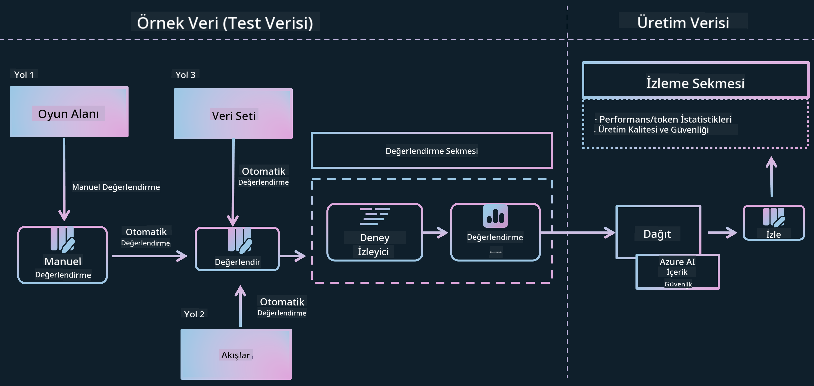

*Görsel Kaynağı: [Evaluation of generative AI applications](https://learn.microsoft.com/azure/ai-studio/concepts/evaluation-approach-gen-ai?wt.mc_id%3Dstudentamb_279723)*

> [!NOTE]
>
> Phi-3 / Phi-3.5 hakkında daha ayrıntılı bilgi ve ek kaynaklar için lütfen [Phi-3CookBook](https://github.com/microsoft/Phi-3CookBook?wt.mc_id=studentamb_279723) sayfasını ziyaret edin.

### Gereksinimler

- [Python](https://www.python.org/downloads)
- [Azure aboneliği](https://azure.microsoft.com/free?wt.mc_id=studentamb_279723)
- [Visual Studio Code](https://code.visualstudio.com)
- İnce ayarlı Phi-3 / Phi-3.5 modeli

### İçindekiler

1. [**Senaryo 1: Azure AI Foundry'nin Prompt flow değerlendirmesine giriş**](../../../../../../md/02.Application/01.TextAndChat/Phi3)

    - [Güvenlik değerlendirmesine giriş](../../../../../../md/02.Application/01.TextAndChat/Phi3)
    - [Performans değerlendirmesine giriş](../../../../../../md/02.Application/01.TextAndChat/Phi3)

1. [**Senaryo 2: Azure AI Foundry'de Phi-3 / Phi-3.5 modelini değerlendirme**](../../../../../../md/02.Application/01.TextAndChat/Phi3)

    - [Başlamadan önce](../../../../../../md/02.Application/01.TextAndChat/Phi3)
    - [Phi-3 / Phi-3.5 modelini değerlendirmek için Azure OpenAI'yi dağıtma](../../../../../../md/02.Application/01.TextAndChat/Phi3)
    - [Azure AI Foundry'nin Prompt flow değerlendirmesi ile ince ayarlı Phi-3 / Phi-3.5 modelini değerlendirme](../../../../../../md/02.Application/01.TextAndChat/Phi3)

1. [Tebrikler!](../../../../../../md/02.Application/01.TextAndChat/Phi3)

## **Senaryo 1: Azure AI Foundry'nin Prompt flow değerlendirmesine giriş**

### Güvenlik değerlendirmesine giriş

AI modelinizin etik ve güvenli olduğundan emin olmak için, Microsoft'un Sorumlu AI İlkeleri doğrultusunda değerlendirilmesi çok önemlidir. Azure AI Foundry'de güvenlik değerlendirmeleri, modelinizin jailbreak saldırılarına karşı savunmasızlığını ve zararlı içerik üretme potansiyelini değerlendirmenize olanak tanır; bu da doğrudan bu ilkelere uygundur.


*Görsel Kaynağı: [Evaluation of generative AI applications](https://learn.microsoft.com/azure/ai-studio/concepts/evaluation-approach-gen-ai?wt.mc_id%3Dstudentamb_279723)*

#### Microsoft’un Sorumlu AI İlkeleri

Teknik adımlara başlamadan önce, Microsoft’un Sorumlu AI İlkeleri’ni anlamak önemlidir. Bu ilkeler, AI sistemlerinin sorumlu şekilde geliştirilmesi, dağıtılması ve işletilmesi için etik bir çerçeve sunar. AI teknolojilerinin adil, şeffaf ve kapsayıcı bir şekilde inşa edilmesini sağlar. Bu ilkeler, AI modellerinin güvenliğini değerlendirmek için temel oluşturur.

Microsoft’un Sorumlu AI İlkeleri şunlardır:

- **Adalet ve Kapsayıcılık**: AI sistemleri herkese adil davranmalı ve benzer durumdaki insan gruplarını farklı şekillerde etkilemekten kaçınmalıdır. Örneğin, AI sistemleri tıbbi tedavi, kredi başvuruları veya işe alım konularında rehberlik sağlarken, benzer semptomlara, finansal durumlara veya mesleki niteliklere sahip herkese aynı önerileri sunmalıdır.

- **Güvenilirlik ve Güvenlik**: Güven oluşturmak için AI sistemlerinin güvenilir, güvenli ve tutarlı çalışması kritik önemdedir. Bu sistemler, tasarlandığı şekilde çalışabilmeli, beklenmedik durumlara güvenli yanıt verebilmeli ve zararlı manipülasyonlara karşı dirençli olmalıdır. Davranışları ve karşılayabildikleri durum çeşitliliği, geliştiricilerin tasarım ve test aşamasında öngördüğü senaryoları yansıtır.

- **Şeffaflık**: AI sistemleri insanların hayatlarını derinden etkileyen kararlar verirken, insanların bu kararların nasıl alındığını anlaması çok önemlidir. Örneğin, bir banka bir kişinin kredi değerliliğini AI sistemiyle değerlendirirken veya bir şirket en uygun adayları seçmek için AI kullanırken şeffaflık gereklidir.

- **Gizlilik ve Güvenlik**: AI yaygınlaştıkça, kişisel ve kurumsal bilgilerin gizliliğinin korunması ve güvenliğinin sağlanması daha önemli ve karmaşık hale gelmektedir. AI sistemlerinin doğru ve bilinçli tahminler yapabilmesi için verilere erişim gereklidir; bu nedenle gizlilik ve veri güvenliği yakından takip edilmelidir.

- **Hesap Verebilirlik**: AI sistemlerini tasarlayan ve dağıtan kişiler, sistemlerinin nasıl çalıştığından sorumlu olmalıdır. Kuruluşlar, hesap verebilirlik normları geliştirmek için sektör standartlarından yararlanmalıdır. Bu normlar, AI sistemlerinin insanların hayatını etkileyen kararların nihai otoritesi olmamasını ve insanların yüksek derecede otonom AI sistemleri üzerinde anlamlı kontrolü sürdürmesini sağlar.

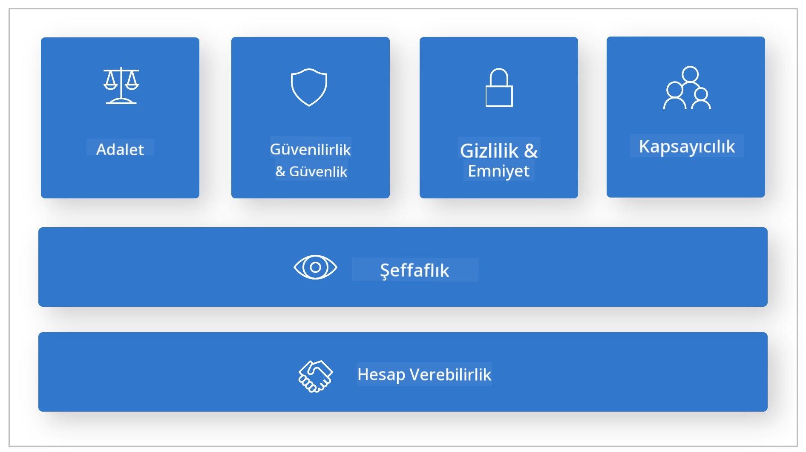

*Görsel Kaynağı: [What is Responsible AI?](https://learn.microsoft.com/azure/machine-learning/concept-responsible-ai?view=azureml-api-2&viewFallbackFrom=azureml-api-2%253fwt.mc_id%3Dstudentamb_279723)*

> [!NOTE]
> Microsoft’un Sorumlu AI İlkeleri hakkında daha fazla bilgi için [What is Responsible AI?](https://learn.microsoft.com/azure/machine-learning/concept-responsible-ai?view=azureml-api-2?wt.mc_id=studentamb_279723) sayfasını ziyaret edin.

#### Güvenlik metrikleri

Bu eğitimde, Azure AI Foundry'nin güvenlik metriklerini kullanarak ince ayarlı Phi-3 modelinin güvenliğini değerlendireceksiniz. Bu metrikler, modelin zararlı içerik üretme potansiyelini ve jailbreak saldırılarına karşı savunmasızlığını ölçmenize yardımcı olur. Güvenlik metrikleri şunlardır:

- **Kendine Zarar Verme İçeriği**: Modelin kendine zarar verme ile ilgili içerik üretme eğilimini değerlendirir.
- **Nefret ve Adaletsiz İçerik**: Modelin nefret dolu veya adaletsiz içerik üretme eğilimini değerlendirir.
- **Şiddet İçeriği**: Modelin şiddet içeren içerik üretme eğilimini değerlendirir.
- **Cinsel İçerik**: Modelin uygunsuz cinsel içerik üretme eğilimini değerlendirir.

Bu yönlerin değerlendirilmesi, AI modelinin zararlı veya saldırgan içerik üretmemesini sağlar ve toplumsal değerler ile düzenleyici standartlarla uyumlu hale getirir.

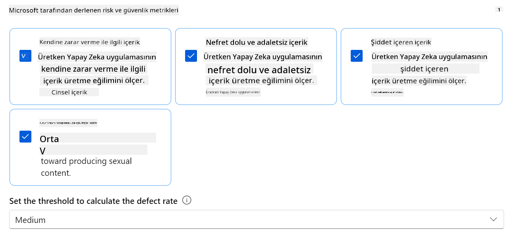

### Performans değerlendirmesine giriş

AI modelinizin beklendiği gibi çalıştığından emin olmak için, performans metriklerine göre değerlendirilmesi önemlidir. Azure AI Foundry'de performans değerlendirmeleri, modelinizin doğru, ilgili ve tutarlı yanıtlar üretme etkinliğini ölçmenize olanak tanır.


*Görsel Kaynağı: [Evaluation of generative AI applications](https://learn.microsoft.com/azure/ai-studio/concepts/evaluation-approach-gen-ai?wt.mc_id%3Dstudentamb_279723)*

#### Performans metrikleri

Bu eğitimde, Azure AI Foundry'nin performans metriklerini kullanarak ince ayarlı Phi-3 / Phi-3.5 modelinin performansını değerlendireceksiniz. Bu metrikler, modelin doğru, ilgili ve tutarlı yanıtlar üretme etkinliğini ölçmenize yardımcı olur. Performans metrikleri şunlardır:

- **Dayanaklılık (Groundedness)**: Üretilen yanıtların giriş kaynağındaki bilgilerle ne kadar uyumlu olduğunu değerlendirir.
- **Alaka Düzeyi (Relevance)**: Üretilen yanıtların verilen sorularla ne kadar ilgili olduğunu değerlendirir.
- **Tutarlılık (Coherence)**: Üretilen metnin akıcılığını, doğal okunabilirliğini ve insan benzeri dil özelliklerini değerlendirir.
- **Akıcılık (Fluency)**: Üretilen metnin dil yeterliliğini değerlendirir.
- **GPT Benzerliği (GPT Similarity)**: Üretilen yanıtı gerçek veriyle karşılaştırarak benzerliğini ölçer.
- **F1 Skoru**: Üretilen yanıt ile kaynak veri arasındaki ortak kelimelerin oranını hesaplar.

Bu metrikler, modelin doğru, ilgili ve tutarlı yanıtlar üretme etkinliğini değerlendirmenize yardımcı olur.


## **Senaryo 2: Azure AI Foundry'de Phi-3 / Phi-3.5 modelini değerlendirme**

### Başlamadan önce

Bu eğitim, önceki blog yazıları "[Fine-Tune and Integrate Custom Phi-3 Models with Prompt Flow: Step-by-Step Guide](https://techcommunity.microsoft.com/t5/educator-developer-blog/fine-tune-and-integrate-custom-phi-3-models-with-prompt-flow/ba-p/4178612?wt.mc_id=studentamb_279723)" ve "[Fine-Tune and Integrate Custom Phi-3 Models with Prompt Flow in Azure AI Foundry](https://techcommunity.microsoft.com/t5/educator-developer-blog/fine-tune-and-integrate-custom-phi-3-models-with-prompt-flow-in/ba-p/4191726?wt.mc_id=studentamb_279723)" yazılarının devamıdır. Bu yazılarda, Azure AI Foundry'de Phi-3 / Phi-3.5 modelinin ince ayar süreci ve Prompt flow ile entegrasyonu anlatılmıştır.

Bu eğitimde, Azure AI Foundry'de bir değerlendirici olarak Azure OpenAI modelini dağıtacak ve ince ayarlı Phi-3 / Phi-3.5 modelinizi değerlendirmek için kullanacaksınız.

Bu eğitime başlamadan önce, önceki eğitimlerde açıklandığı gibi aşağıdaki gereksinimlere sahip olduğunuzdan emin olun:

1. İnce ayarlı Phi-3 / Phi-3.5 modelini değerlendirmek için hazırlanmış bir veri seti.
1. Azure Machine Learning'e dağıtılmış ve ince ayarlı Phi-3 / Phi-3.5 modeli.
1. Azure AI Foundry'de ince ayarlı Phi-3 / Phi-3.5 modelinizle entegre edilmiş bir Prompt flow.

> [!NOTE]
> Önceki blog yazılarında indirilen **ULTRACHAT_200k** veri setindeki data klasöründe bulunan *test_data.jsonl* dosyasını, ince ayarlı Phi-3 / Phi-3.5 modelini değerlendirmek için veri seti olarak kullanacaksınız.

#### Azure AI Foundry'de Prompt flow ile özel Phi-3 / Phi-3.5 modelini entegre etme (Öncelikle kod yaklaşımı)
> [!NOTE]  
> "[Fine-Tune and Integrate Custom Phi-3 Models with Prompt Flow in Azure AI Foundry](https://techcommunity.microsoft.com/t5/educator-developer-blog/fine-tune-and-integrate-custom-phi-3-models-with-prompt-flow-in/ba-p/4191726?wt.mc_id=studentamb_279723)" başlığında anlatılan düşük kod yaklaşımını takip ettiyseniz, bu alıştırmayı atlayabilir ve bir sonrakine geçebilirsiniz.  
> Ancak, Phi-3 / Phi-3.5 modelinizi ince ayar yapmak ve dağıtmak için "[Fine-Tune and Integrate Custom Phi-3 Models with Prompt Flow: Step-by-Step Guide](https://techcommunity.microsoft.com/t5/educator-developer-blog/fine-tune-and-integrate-custom-phi-3-models-with-prompt-flow/ba-p/4178612?wt.mc_id=studentamb_279723)" başlığında anlatılan kod öncelikli yaklaşımı takip ettiyseniz, modelinizi Prompt flow’a bağlama süreci biraz farklıdır. Bu süreci bu alıştırmada öğreneceksiniz.
İlerlemeniz için, ince ayar yapılmış Phi-3 / Phi-3.5 modelinizi Azure AI Foundry'deki Prompt flow’a entegre etmeniz gerekiyor.

#### Azure AI Foundry Hub Oluşturma

Proje oluşturmadan önce bir Hub oluşturmanız gerekir. Hub, Azure AI Foundry içinde birden fazla Projeyi organize edip yönetmenizi sağlayan bir Kaynak Grubu gibi çalışır.

1. [Azure AI Foundry](https://ai.azure.com/?wt.mc_id=studentamb_279723) adresine giriş yapın.

1. Sol taraftaki sekmeden **All hubs** seçeneğini seçin.

1. Navigasyon menüsünden **+ New hub** seçeneğini seçin.

    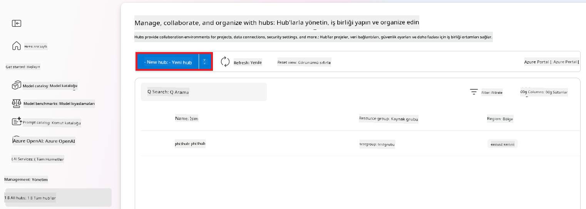

1. Aşağıdaki işlemleri yapın:

    - **Hub name** girin. Bu benzersiz bir değer olmalıdır.
    - Azure **Subscription**’ınızı seçin.
    - Kullanmak istediğiniz **Resource group**’u seçin (gerekirse yenisini oluşturun).
    - Kullanmak istediğiniz **Location**’ı seçin.
    - Kullanmak istediğiniz **Connect Azure AI Services**’i seçin (gerekirse yenisini oluşturun).
    - **Connect Azure AI Search** için **Skip connecting** seçeneğini seçin.

    

1. **Next** seçeneğini seçin.

#### Azure AI Foundry Projesi Oluşturma

1. Oluşturduğunuz Hub’da, sol taraftaki sekmeden **All projects** seçeneğini seçin.

1. Navigasyon menüsünden **+ New project** seçeneğini seçin.

    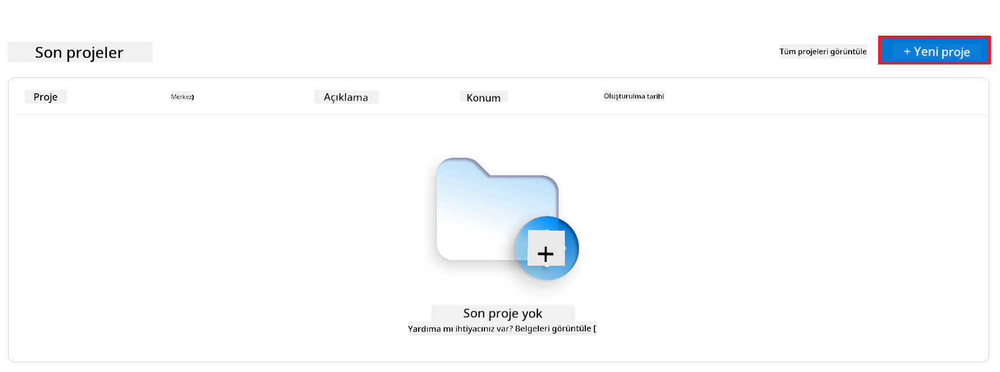

1. **Project name** girin. Bu benzersiz bir değer olmalıdır.

    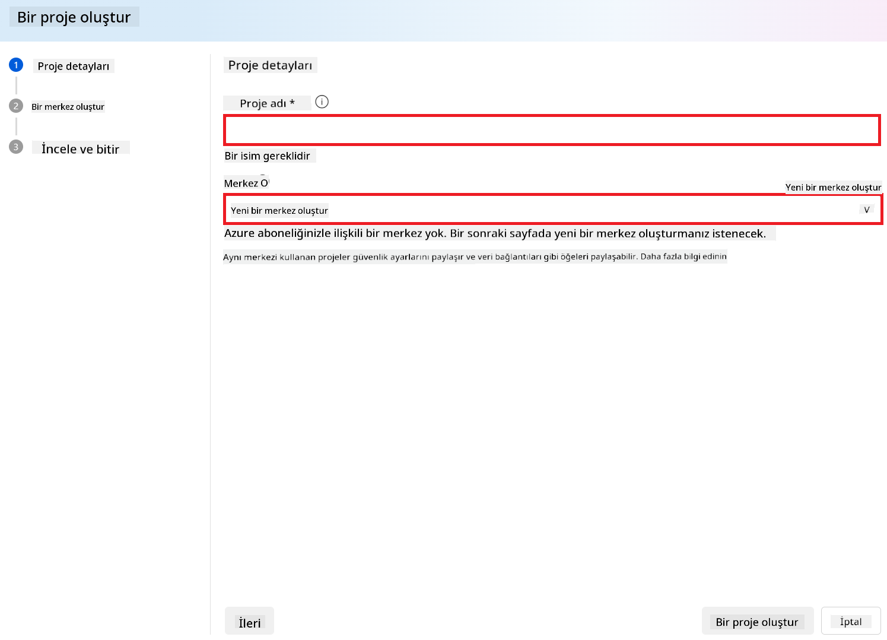

1. **Create a project** seçeneğini seçin.

#### İnce ayar yapılmış Phi-3 / Phi-3.5 modeli için özel bağlantı ekleme

Özel Phi-3 / Phi-3.5 modelinizi Prompt flow ile entegre etmek için modelin endpoint ve anahtarını özel bir bağlantı olarak kaydetmeniz gerekir. Bu ayar, Prompt flow içinde özel Phi-3 / Phi-3.5 modelinize erişimi sağlar.

#### İnce ayar yapılmış Phi-3 / Phi-3.5 modelinin api anahtarı ve endpoint uri’sini ayarlama

1. [Azure ML Studio](https://ml.azure.com/home?wt.mc_id=studentamb_279723) adresini ziyaret edin.

1. Oluşturduğunuz Azure Machine learning çalışma alanına gidin.

1. Sol taraftaki sekmeden **Endpoints** seçeneğini seçin.

    

1. Oluşturduğunuz endpoint’i seçin.

    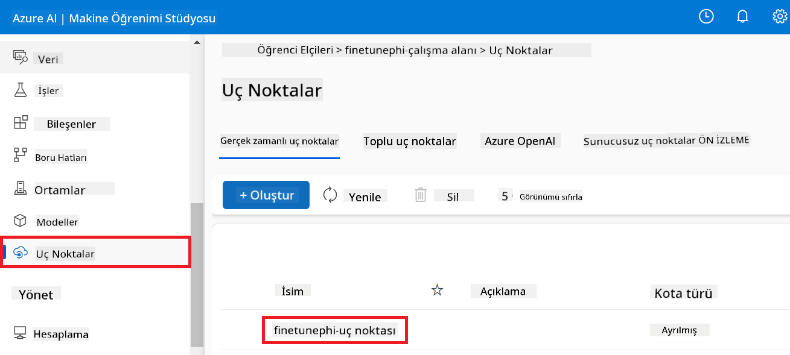

1. Navigasyon menüsünden **Consume** seçeneğini seçin.

1. **REST endpoint** ve **Primary key**’inizi kopyalayın.

    

#### Özel Bağlantı Ekleme

1. [Azure AI Foundry](https://ai.azure.com/?wt.mc_id=studentamb_279723) adresini ziyaret edin.

1. Oluşturduğunuz Azure AI Foundry projesine gidin.

1. Oluşturduğunuz Projede, sol taraftaki sekmeden **Settings** seçeneğini seçin.

1. **+ New connection** seçeneğini seçin.

    

1. Navigasyon menüsünden **Custom keys** seçeneğini seçin.

    

1. Aşağıdaki işlemleri yapın:

    - **+ Add key value pairs** seçeneğini seçin.
    - Anahtar adı olarak **endpoint** girin ve Azure ML Studio’dan kopyaladığınız endpoint’i değer alanına yapıştırın.
    - Tekrar **+ Add key value pairs** seçeneğini seçin.
    - Anahtar adı olarak **key** girin ve Azure ML Studio’dan kopyaladığınız anahtarı değer alanına yapıştırın.
    - Anahtarları ekledikten sonra, anahtarın görünmesini engellemek için **is secret** seçeneğini işaretleyin.

    

1. **Add connection** seçeneğini seçin.

#### Prompt flow Oluşturma

Azure AI Foundry’da özel bir bağlantı eklediniz. Şimdi aşağıdaki adımları izleyerek bir Prompt flow oluşturacağız. Daha sonra bu Prompt flow’u özel bağlantıya bağlayarak ince ayar yapılmış modeli Prompt flow içinde kullanacaksınız.

1. Oluşturduğunuz Azure AI Foundry projesine gidin.

1. Sol taraftaki sekmeden **Prompt flow** seçeneğini seçin.

1. Navigasyon menüsünden **+ Create** seçeneğini seçin.

    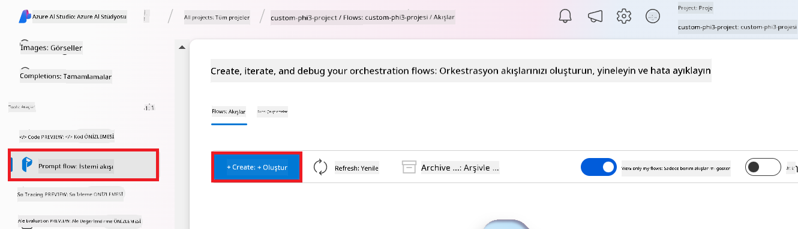

1. Navigasyon menüsünden **Chat flow** seçeneğini seçin.

    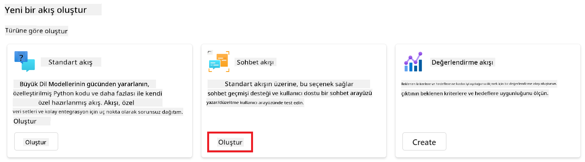

1. Kullanmak istediğiniz **Folder name**’i girin.

    

1. **Create** seçeneğini seçin.

#### İnce ayar yapılmış Phi-3 / Phi-3.5 modelinizle sohbet etmek için Prompt flow’u ayarlama

İnce ayar yapılmış Phi-3 / Phi-3.5 modelinizi Prompt flow’a entegre etmeniz gerekiyor. Ancak, mevcut Prompt flow bu amaç için tasarlanmamıştır. Bu nedenle, özel modelin entegrasyonunu sağlamak için Prompt flow’u yeniden tasarlamanız gerekir.

1. Prompt flow içinde, mevcut akışı yeniden oluşturmak için aşağıdaki işlemleri yapın:

    - **Raw file mode** seçeneğini seçin.
    - *flow.dag.yml* dosyasındaki tüm mevcut kodu silin.
    - *flow.dag.yml* dosyasına aşağıdaki kodu ekleyin.

        ```yml
        inputs:
          input_data:
            type: string
            default: "Who founded Microsoft?"

        outputs:
          answer:
            type: string
            reference: ${integrate_with_promptflow.output}

        nodes:
        - name: integrate_with_promptflow
          type: python
          source:
            type: code
            path: integrate_with_promptflow.py
          inputs:
            input_data: ${inputs.input_data}
        ```

    - **Save** seçeneğini seçin.

    

1. Prompt flow içinde özel Phi-3 / Phi-3.5 modelini kullanmak için *integrate_with_promptflow.py* dosyasına aşağıdaki kodu ekleyin.

    ```python
    import logging
    import requests
    from promptflow import tool
    from promptflow.connections import CustomConnection

    # Logging setup
    logging.basicConfig(
        format="%(asctime)s - %(levelname)s - %(name)s - %(message)s",
        datefmt="%Y-%m-%d %H:%M:%S",
        level=logging.DEBUG
    )
    logger = logging.getLogger(__name__)

    def query_phi3_model(input_data: str, connection: CustomConnection) -> str:
        """
        Send a request to the Phi-3 / Phi-3.5 model endpoint with the given input data using Custom Connection.
        """

        # "connection" is the name of the Custom Connection, "endpoint", "key" are the keys in the Custom Connection
        endpoint_url = connection.endpoint
        api_key = connection.key

        headers = {
            "Content-Type": "application/json",
            "Authorization": f"Bearer {api_key}"
        }
    data = {
        "input_data": [input_data],
        "params": {
            "temperature": 0.7,
            "max_new_tokens": 128,
            "do_sample": True,
            "return_full_text": True
            }
        }
        try:
            response = requests.post(endpoint_url, json=data, headers=headers)
            response.raise_for_status()
            
            # Log the full JSON response
            logger.debug(f"Full JSON response: {response.json()}")

            result = response.json()["output"]
            logger.info("Successfully received response from Azure ML Endpoint.")
            return result
        except requests.exceptions.RequestException as e:
            logger.error(f"Error querying Azure ML Endpoint: {e}")
            raise

    @tool
    def my_python_tool(input_data: str, connection: CustomConnection) -> str:
        """
        Tool function to process input data and query the Phi-3 / Phi-3.5 model.
        """
        return query_phi3_model(input_data, connection)

    ```

    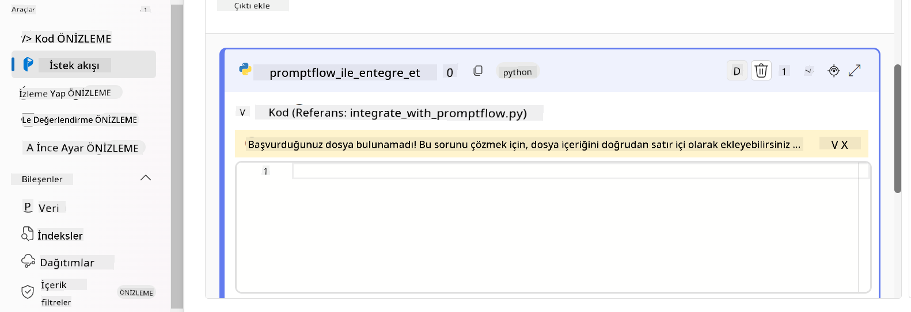

> [!NOTE]
> Azure AI Foundry’de Prompt flow kullanımı hakkında daha detaylı bilgi için [Prompt flow in Azure AI Foundry](https://learn.microsoft.com/azure/ai-studio/how-to/prompt-flow) sayfasına bakabilirsiniz.

1. Modelinizle sohbeti etkinleştirmek için **Chat input**, **Chat output** seçeneklerini seçin.

    

1. Artık özel Phi-3 / Phi-3.5 modelinizle sohbet etmeye hazırsınız. Sonraki alıştırmada, Prompt flow’u nasıl başlatacağınızı ve ince ayar yapılmış Phi-3 / Phi-3.5 modelinizle sohbet etmek için nasıl kullanacağınızı öğreneceksiniz.

> [!NOTE]
>
> Yeniden oluşturulan akış aşağıdaki görseldeki gibi olmalıdır:
>
> 
>

#### Prompt flow’u Başlatma

1. Prompt flow’u başlatmak için **Start compute sessions** seçeneğini seçin.

    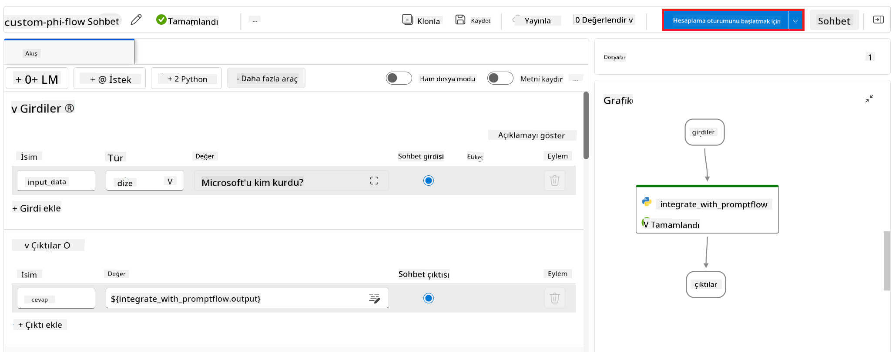

1. Parametreleri yenilemek için **Validate and parse input** seçeneğini seçin.

    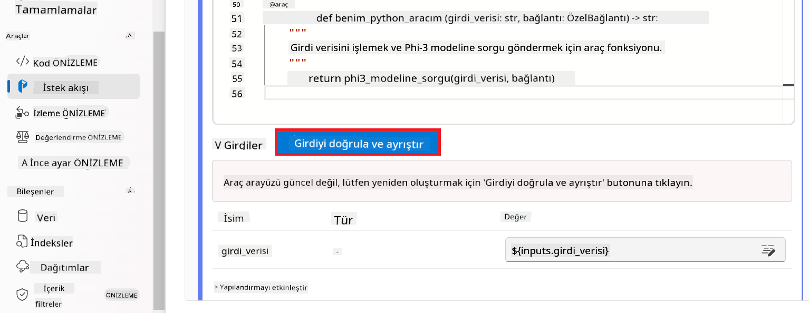

1. Oluşturduğunuz özel bağlantının **connection** değerini seçin. Örneğin, *connection*.

    

#### Özel Phi-3 / Phi-3.5 modelinizle sohbet etme

1. **Chat** seçeneğini seçin.

    

1. İşte sonuçlara bir örnek: Artık özel Phi-3 / Phi-3.5 modelinizle sohbet edebilirsiniz. İnce ayar için kullanılan verilere dayalı sorular sormanız önerilir.

    

### Phi-3 / Phi-3.5 modelini değerlendirmek için Azure OpenAI dağıtımı yapma

Phi-3 / Phi-3.5 modelini Azure AI Foundry’de değerlendirmek için bir Azure OpenAI modeli dağıtmanız gerekir. Bu model, Phi-3 / Phi-3.5 modelinin performansını değerlendirmek için kullanılacaktır.

#### Azure OpenAI Dağıtımı

1. [Azure AI Foundry](https://ai.azure.com/?wt.mc_id=studentamb_279723) adresine giriş yapın.

1. Oluşturduğunuz Azure AI Foundry projesine gidin.

    

1. Oluşturduğunuz Projede, sol taraftaki sekmeden **Deployments** seçeneğini seçin.

1. Navigasyon menüsünden **+ Deploy model** seçeneğini seçin.

1. **Deploy base model** seçeneğini seçin.

    

1. Kullanmak istediğiniz Azure OpenAI modelini seçin. Örneğin, **gpt-4o**.

    

1. **Confirm** seçeneğini seçin.

### Azure AI Foundry’nin Prompt flow değerlendirmesi ile ince ayar yapılmış Phi-3 / Phi-3.5 modelini değerlendirme

### Yeni bir değerlendirme başlatma

1. [Azure AI Foundry](https://ai.azure.com/?wt.mc_id=studentamb_279723) adresini ziyaret edin.

1. Oluşturduğunuz Azure AI Foundry projesine gidin.

    

1. Oluşturduğunuz Projede, sol taraftaki sekmeden **Evaluation** seçeneğini seçin.

1. Navigasyon menüsünden **+ New evaluation** seçeneğini seçin.

    

1. **Prompt flow** değerlendirmesini seçin.

    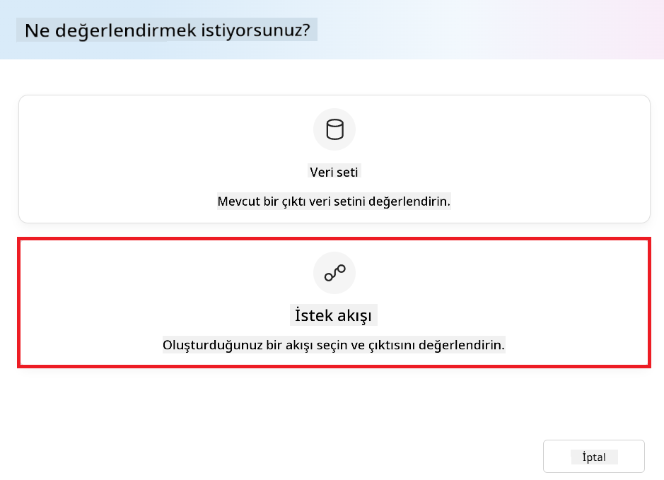

1. Aşağıdaki işlemleri yapın:

    - Değerlendirme adını girin. Bu benzersiz bir değer olmalıdır.
    - Görev türü olarak **Question and answer without context** seçin. Çünkü bu eğitimde kullanılan **ULTRACHAT_200k** veri seti bağlam içermemektedir.
    - Değerlendirmek istediğiniz prompt flow’u seçin.

    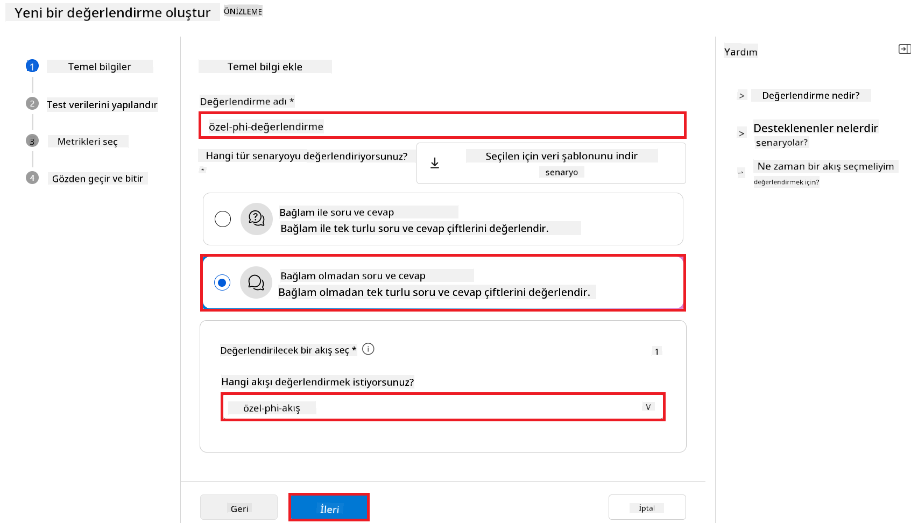

1. **Next** seçeneğini seçin.

1. Aşağıdaki işlemleri yapın:

    - Veri setini yüklemek için **Add your dataset** seçeneğini seçin. Örneğin, **ULTRACHAT_200k** veri setini indirirken dahil edilen *test_data.json1* test veri dosyasını yükleyebilirsiniz.
    - Veri setinize uygun **Dataset column**’u seçin. Örneğin, **ULTRACHAT_200k** veri setini kullanıyorsanız, **${data.prompt}** sütununu seçin.

    

1. **Next** seçeneğini seçin.

1. Performans ve kalite metriklerini yapılandırmak için aşağıdaki işlemleri yapın:

    - Kullanmak istediğiniz performans ve kalite metriklerini seçin.
    - Değerlendirme için oluşturduğunuz Azure OpenAI modelini seçin. Örneğin, **gpt-4o**.

    

1. Risk ve güvenlik metriklerini yapılandırmak için aşağıdaki işlemleri yapın:

    - Kullanmak istediğiniz risk ve güvenlik metriklerini seçin.
    - Hata oranını hesaplamak için kullanmak istediğiniz eşik değerini seçin. Örneğin, **Medium**.
    - **question** için **Data source** olarak **{$data.prompt}** seçin.
    - **answer** için **Data source** olarak **{$run.outputs.answer}** seçin.
    - **ground_truth** için **Data source** olarak **{$data.message}** seçin.

    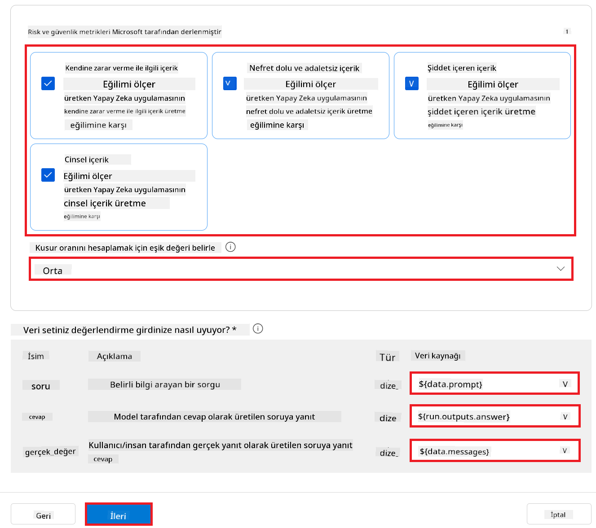

1. **Next** seçeneğini seçin.

1. Değerlendirmeyi başlatmak için **Submit** seçeneğini seçin.

1. Değerlendirme tamamlanana kadar biraz zaman alacaktır. İlerlemeyi **Evaluation** sekmesinden takip edebilirsiniz.

### Değerlendirme Sonuçlarını İnceleme
> [!NOTE]
> Aşağıda sunulan sonuçlar, değerlendirme sürecini göstermek amacıyla verilmiştir. Bu eğitimde, nispeten küçük bir veri seti üzerinde ince ayar yapılmış bir model kullanılmıştır; bu da optimal olmayan sonuçlara yol açabilir. Gerçek sonuçlar, kullanılan veri setinin boyutu, kalitesi ve çeşitliliği ile modelin özel yapılandırmasına bağlı olarak önemli ölçüde değişiklik gösterebilir.
Değerlendirme tamamlandıktan sonra, performans ve güvenlik metrikleri için sonuçları inceleyebilirsiniz.

1. Performans ve kalite metrikleri:

    - Modelin tutarlı, akıcı ve ilgili yanıtlar üretme etkinliğini değerlendirin.

    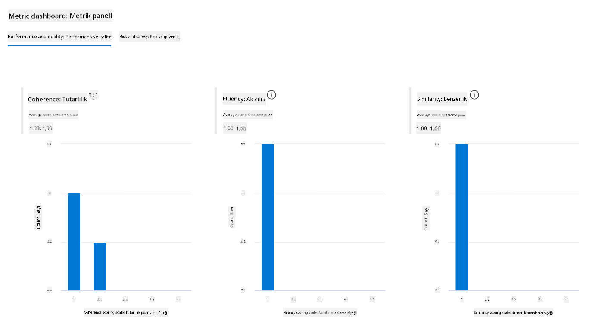

1. Risk ve güvenlik metrikleri:

    - Modelin çıktılarının güvenli olduğundan ve Sorumlu AI İlkeleri ile uyumlu olduğundan emin olun; zararlı veya saldırgan içeriklerden kaçının.

    

1. **Detaylı metrik sonuçlarını** görmek için aşağı kaydırabilirsiniz.

    

1. Özel Phi-3 / Phi-3.5 modelinizi hem performans hem de güvenlik metriklerine göre değerlendirerek, modelin sadece etkili olmadığını, aynı zamanda sorumlu AI uygulamalarına uygun olduğunu doğrulayabilir ve gerçek dünya kullanımı için hazır hale getirebilirsiniz.

## Tebrikler!

### Bu eğitimi tamamladınız

Azure AI Foundry’de Prompt flow ile entegre edilmiş ince ayarlı Phi-3 modelini başarıyla değerlendirdiniz. Bu, AI modellerinizin sadece iyi performans göstermesini değil, aynı zamanda Microsoft’un Sorumlu AI ilkelerine uygun olmasını sağlayarak güvenilir ve sağlam AI uygulamaları geliştirmenize yardımcı olacak önemli bir adımdır.


## Azure Kaynaklarını Temizleyin

Hesabınıza ek ücret yansımaması için Azure kaynaklarınızı temizleyin. Azure portalına gidip aşağıdaki kaynakları silin:

- Azure Machine learning kaynağı.
- Azure Machine learning model uç noktası.
- Azure AI Foundry Proje kaynağı.
- Azure AI Foundry Prompt flow kaynağı.

### Sonraki Adımlar

#### Dokümantasyon

- [Sorumlu AI panosunu kullanarak AI sistemlerini değerlendirin](https://learn.microsoft.com/azure/machine-learning/concept-responsible-ai-dashboard?view=azureml-api-2&source=recommendations?wt.mc_id=studentamb_279723)
- [Üretken AI için değerlendirme ve izleme metrikleri](https://learn.microsoft.com/azure/ai-studio/concepts/evaluation-metrics-built-in?tabs=definition?wt.mc_id=studentamb_279723)
- [Azure AI Foundry dokümantasyonu](https://learn.microsoft.com/azure/ai-studio/?wt.mc_id=studentamb_279723)
- [Prompt flow dokümantasyonu](https://microsoft.github.io/promptflow/?wt.mc_id=studentamb_279723)

#### Eğitim İçeriği

- [Microsoft’un Sorumlu AI Yaklaşımına Giriş](https://learn.microsoft.com/training/modules/introduction-to-microsofts-responsible-ai-approach/?source=recommendations?wt.mc_id=studentamb_279723)
- [Azure AI Foundry’e Giriş](https://learn.microsoft.com/training/modules/introduction-to-azure-ai-studio/?wt.mc_id=studentamb_279723)

### Referans

- [Sorumlu AI nedir?](https://learn.microsoft.com/azure/machine-learning/concept-responsible-ai?view=azureml-api-2?wt.mc_id=studentamb_279723)
- [Daha güvenli ve güvenilir üretken AI uygulamaları geliştirmenize yardımcı olacak Azure AI’daki yeni araçların duyurusu](https://azure.microsoft.com/blog/announcing-new-tools-in-azure-ai-to-help-you-build-more-secure-and-trustworthy-generative-ai-applications/?wt.mc_id=studentamb_279723)
- [Üretken AI uygulamalarının değerlendirilmesi](https://learn.microsoft.com/azure/ai-studio/concepts/evaluation-approach-gen-ai?wt.mc_id%3Dstudentamb_279723)

**Feragatname**:  
Bu belge, AI çeviri servisi [Co-op Translator](https://github.com/Azure/co-op-translator) kullanılarak çevrilmiştir. Doğruluk için çaba gösterilse de, otomatik çevirilerin hatalar veya yanlışlıklar içerebileceğini lütfen unutmayınız. Orijinal belge, kendi dilinde yetkili kaynak olarak kabul edilmelidir. Kritik bilgiler için profesyonel insan çevirisi önerilir. Bu çevirinin kullanımı sonucu oluşabilecek yanlış anlamalar veya yorum hatalarından sorumlu değiliz.