<!--
CO_OP_TRANSLATOR_METADATA:
{
  "original_hash": "7ca2c30fdb802664070e9cfbf92e24fe",
  "translation_date": "2026-01-05T14:29:25+00:00",
  "source_file": "md/02.Application/01.TextAndChat/Phi3/E2E_Phi-3-FineTuning_PromptFlow_Integration.md",
  "language_code": "tr"
}
-->
# Özel Phi-3 modellerini Prompt flow ile İnce Ayar Yapma ve Entegre Etme

Bu uçtan uca (E2E) örnek, Microsoft Tech Community'den "[Fine-Tune and Integrate Custom Phi-3 Models with Prompt Flow: Step-by-Step Guide](https://techcommunity.microsoft.com/t5/educator-developer-blog/fine-tune-and-integrate-custom-phi-3-models-with-prompt-flow/ba-p/4178612?WT.mc_id=aiml-137032-kinfeylo)" rehberine dayanmaktadır. Bu rehber, özel Phi-3 modellerinin ince ayar yapma, dağıtma ve Prompt flow ile entegre etme süreçlerini tanıtmaktadır.

## Genel Bakış

Bu E2E örnekte, Phi-3 modeline nasıl ince ayar yapılacağını ve Prompt flow ile nasıl entegre edileceğini öğreneceksiniz. Azure Machine Learning ve Prompt flow'u kullanarak özel AI modellerini dağıtmak ve kullanmak için bir iş akışı oluşturacaksınız. Bu E2E örnek üç senaryoya ayrılmıştır:

**Senaryo 1: Azure kaynaklarını kurun ve ince ayar için hazırlanın**

**Senaryo 2: Phi-3 modelini ince ayar yapın ve Azure Machine Learning Studio'da dağıtın**

**Senaryo 3: Prompt flow ile entegre edin ve özel modelinizle sohbet edin**

İşte bu E2E örneğin genel görünümü.

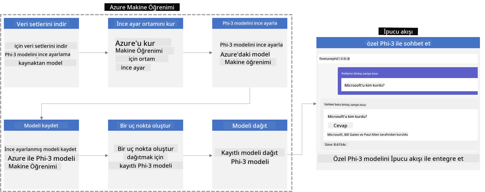

### İçindekiler

1. **[Senaryo 1: Azure kaynaklarını kurun ve ince ayar için hazırlanın](../../../../../../md/02.Application/01.TextAndChat/Phi3)**
    - [Bir Azure Machine Learning Çalışma Alanı Oluşturun](../../../../../../md/02.Application/01.TextAndChat/Phi3)
    - [Azure Aboneliğinde GPU kotalarını talep edin](../../../../../../md/02.Application/01.TextAndChat/Phi3)
    - [Rol ataması ekleyin](../../../../../../md/02.Application/01.TextAndChat/Phi3)
    - [Projeyi kurun](../../../../../../md/02.Application/01.TextAndChat/Phi3)
    - [İnce ayar için veri kümesi hazırlayın](../../../../../../md/02.Application/01.TextAndChat/Phi3)

1. **[Senaryo 2: Phi-3 modelini ince ayar yapın ve Azure Machine Learning Studio’da dağıtın](../../../../../../md/02.Application/01.TextAndChat/Phi3)**
    - [Azure CLI’yı kurun](../../../../../../md/02.Application/01.TextAndChat/Phi3)
    - [Phi-3 modeline ince ayar yapın](../../../../../../md/02.Application/01.TextAndChat/Phi3)
    - [İnce ayarlı modeli dağıtın](../../../../../../md/02.Application/01.TextAndChat/Phi3)

1. **[Senaryo 3: Prompt flow ile entegre edin ve özel modelinizle sohbet edin](../../../../../../md/02.Application/01.TextAndChat/Phi3)**
    - [Özel Phi-3 modelini Prompt flow ile entegre edin](../../../../../../md/02.Application/01.TextAndChat/Phi3)
    - [Özel modelinizle sohbet edin](../../../../../../md/02.Application/01.TextAndChat/Phi3)

## Senaryo 1: Azure kaynaklarını kurun ve ince ayar için hazırlanın

### Bir Azure Machine Learning Çalışma Alanı Oluşturun

1. Portal sayfasının en üstündeki **arama çubuğuna** *azure machine learning* yazın ve çıkan seçeneklerden **Azure Machine Learning**'i seçin.

    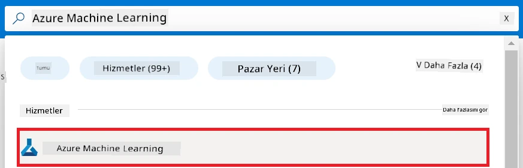

1. Navigasyon menüsünden **+ Oluştur** seçeneğini seçin.

1. Navigasyon menüsünden **Yeni çalışma alanı** seçeneğini seçin.

    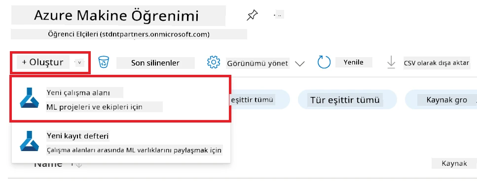

1. Aşağıdaki işlemleri yapın:

    - Azure **Aboneliğinizi** seçin.
    - Kullanmak istediğiniz **Kaynak grubunu** seçin (gerekirse yeni oluşturun).
    - **Çalışma Alanı Adı** girin. Benzersiz bir değer olmalıdır.
    - Kullanmak istediğiniz **Bölgeyi** seçin.
    - Kullanmak istediğiniz **Depolama hesabını** seçin (gerekirse yeni oluşturun).
    - Kullanmak istediğiniz **Anahtar kasasını** seçin (gerekirse yeni oluşturun).
    - Kullanmak istediğiniz **Application Insights**'ı seçin (gerekirse yeni oluşturun).
    - Kullanmak istediğiniz **Kapsayıcı kaydını** seçin (gerekirse yeni oluşturun).

    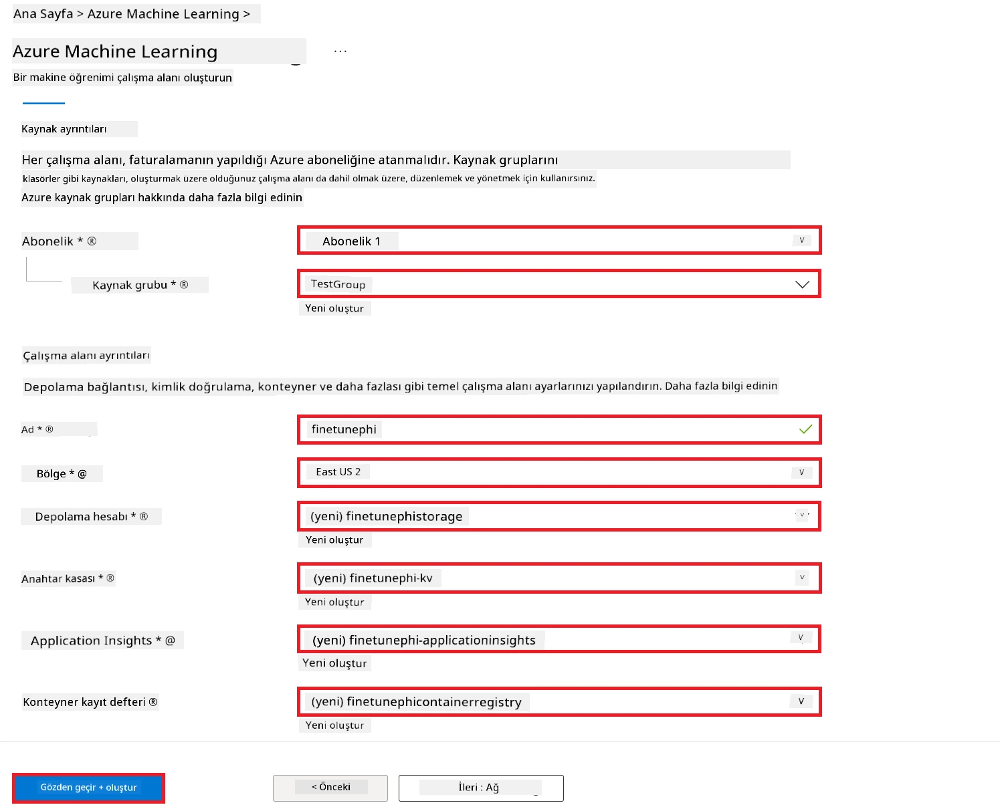

1. **İncele + Oluştur** seçeneğini seçin.

1. **Oluştur** seçeneğini seçin.

### Azure Aboneliğinde GPU kotalarını talep edin

Bu E2E örnekte ince ayar için *Standard_NC24ads_A100_v4 GPU* kullanacaksınız, bu nedenle kota talebinde bulunmanız gerekmektedir. Dağıtım için ise kota talebi gerektirmeyen *Standard_E4s_v3* CPU kullanılır.

> [!NOTE]
>
> Sadece Pay-As-You-Go abonelikleri (standart abonelik türü) GPU tahsisi için uygundur; fayda abonelikleri şu anda desteklenmemektedir.
>
> Fayda abonelikleri (örneğin Visual Studio Enterprise Aboneliği) kullananlar veya ince ayar ve dağıtım sürecini hızlıca test etmek isteyenler için, bu eğitim aynı zamanda CPU kullanarak minimum veri kümesi ile ince ayar yapılmasına yönelik rehberlik sağlar. Ancak GPU ve daha büyük veri kümeleri kullanıldığında ince ayar sonuçlarının çok daha iyi olduğuna dikkat etmek önemlidir.

1. [Azure ML Studio](https://ml.azure.com/home?wt.mc_id=studentamb_279723) sitesini ziyaret edin.

1. *Standard NCADSA100v4 Family* kotasını talep etmek için şu adımları uygulayın:

    - Sol taraftaki sekmeden **Quota** (Kota) seçeneğini seçin.
    - Kullanmak istediğiniz **Sanal makine ailesini** seçin. Örneğin, *Standard_NC24ads_A100_v4* GPU'nun dahil olduğu **Standard NCADSA100v4 Family Cluster Dedicated vCPU'ları** seçin.
    - Navigasyon menüsünden **Request quota** (Kota talebi) seçeneğini seçin.

        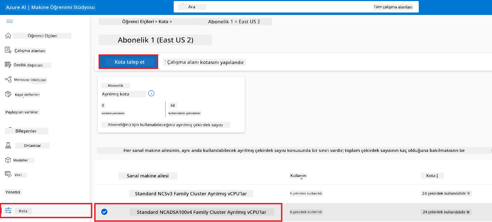

    - Talep kota sayfasında kullanmak istediğiniz **Yeni çekirdek limiti**'ni girin. Örneğin, 24.
    - Talep kota sayfasında GPU kotası talebinde bulunmak için **Submit** (Gönder) seçeneğini seçin.

> [!NOTE]
> İhtiyacınıza uygun GPU veya CPU'yu seçmek için [Azure’daki Sanal Makineler için Boyutlar](https://learn.microsoft.com/azure/virtual-machines/sizes/overview?tabs=breakdownseries%2Cgeneralsizelist%2Ccomputesizelist%2Cmemorysizelist%2Cstoragesizelist%2Cgpusizelist%2Cfpgasizelist%2Chpcsizelist) dokümanına bakabilirsiniz.

### Rol ataması ekleyin

Modellerinize ince ayar yapmak ve dağıtmak için önce Kullanıcı Atanmış Yönetilen Kimlik (UAI) oluşturmanız ve uygun izinleri vermeniz gerekir. Bu UAI dağıtım sırasında kimlik doğrulama için kullanılacaktır.

#### Kullanıcı Atanmış Yönetilen Kimlik (UAI) oluşturun

1. Portal sayfasının en üstündeki **arama çubuğuna** *managed identities* yazın ve çıkan seçeneklerden **Managed Identities**'i seçin.

    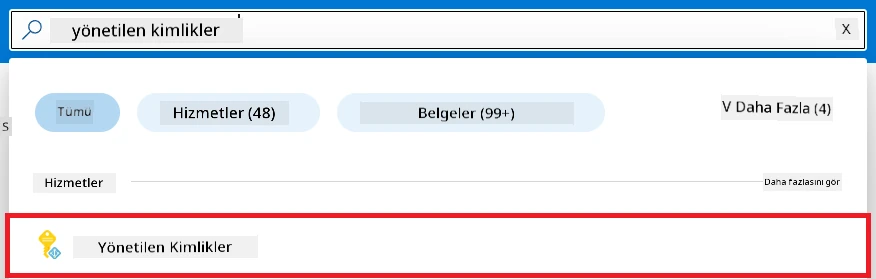

1. **+ Oluştur** seçeneğini seçin.

    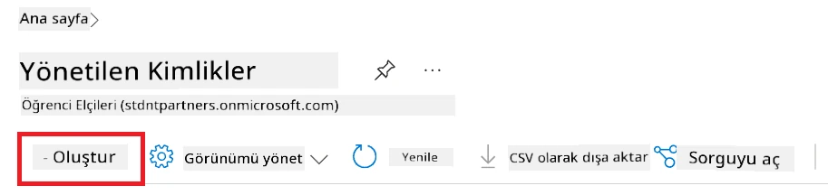

1. Aşağıdaki işlemleri yapın:

    - Azure **Aboneliğinizi** seçin.
    - Kullanmak istediğiniz **Kaynak grubunu** seçin (gerekirse yeni oluşturun).
    - Kullanmak istediğiniz **Bölgeyi** seçin.
    - **Adı** girin. Benzersiz bir değer olmalıdır.

1. **İncele + oluştur** seçeneğini seçin.

1. **+ Oluştur** seçeneğini seçin.

#### Yönetilen Kimliğe Katkıda Bulunan rol ataması ekleyin

1. Oluşturduğunuz Yönetilen Kimlik kaynağına gidin.

1. Sol taraftaki sekmeden **Azure role assignments** (Azure rol atamaları) seçeneğini seçin.

1. Navigasyon menüsünden **+Rol ataması ekle** seçeneğini seçin.

1. Rol ataması ekle sayfasında aşağıdaki işlemleri yapın:
    - **Kapsam** olarak **Kaynak grubu** seçin.
    - Azure **Aboneliğinizi** seçin.
    - Kullanmak istediğiniz **Kaynak grubunu** seçin.
    - **Rol** olarak **Katkıda Bulunan (Contributor)** seçin.

    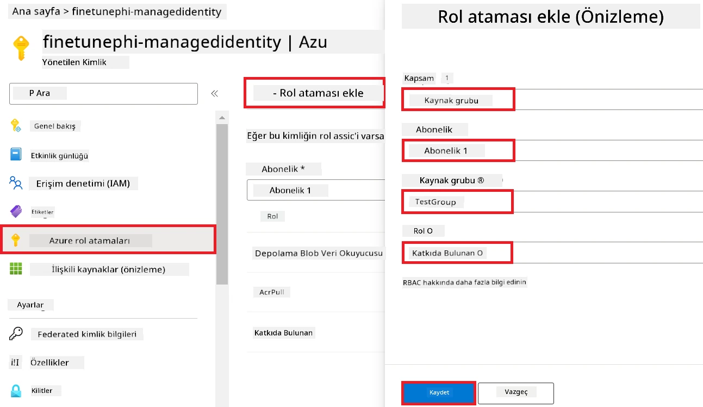

1. **Kaydet** seçeneğini seçin.

#### Yönetilen Kimliğe Storage Blob Data Reader rol ataması ekleyin

1. Portal sayfasının en üstündeki **arama çubuğuna** *storage accounts* yazın ve çıkan seçeneklerden **Storage accounts**'u seçin.

    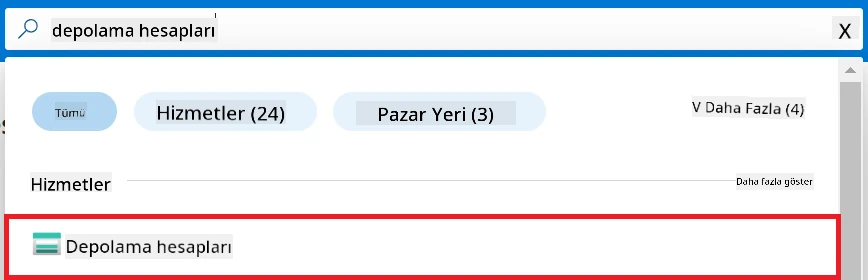

1. Oluşturduğunuz Azure Machine Learning çalışma alanı ile ilişkilendirilmiş depolama hesabını seçin. Örneğin, *finetunephistorage*.

1. Rol ataması ekleme sayfasına gitmek için aşağıdaki işlemleri yapın:

    - Oluşturduğunuz Azure Depolama hesabına gidin.
    - Sol taraftaki sekmeden **Erişim Kontrolü (IAM)** seçeneğini seçin.
    - Navigasyon menüsünden **+ Ekle** seçeneğini seçin.
    - Navigasyon menüsünden **Rol ataması ekle** seçeneğini seçin.

    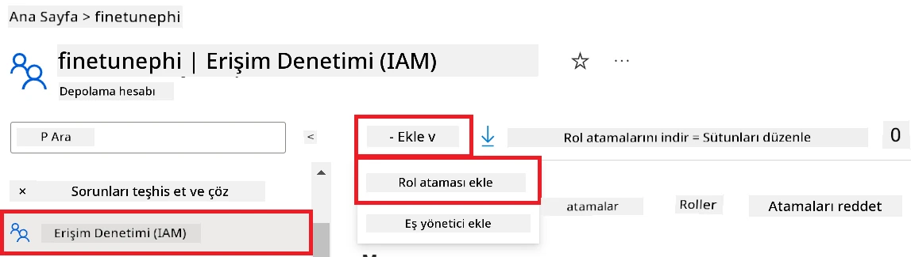

1. Rol ataması ekle sayfasında aşağıdaki işlemleri yapın:

    - Rol sayfasında **arama çubuğuna** *Storage Blob Data Reader* yazın ve çıkan seçeneklerden **Storage Blob Data Reader**'ı seçin.
    - Rol sayfasında **İleri** seçeneğini seçin.
    - Üyeler sayfasında **Erişimi ata** olarak **Yönetilen kimlik** seçeneğini seçin.
    - Üyeler sayfasında **+ Üye seç** seçeneğini seçin.
    - Yönetilen kimlikleri seç sayfasında Azure **Aboneliğinizi** seçin.
    - Yönetilen kimlikleri seç sayfasında **Yönetilen kimlik** olarak **Yönetilen Kimlik** seçeneğini seçin.
    - Yönetilen kimlikleri seç sayfasında oluşturduğunuz Yönetilen Kimliği seçin. Örneğin, *finetunephi-managedidentity*.
    - Yönetilen kimlikleri seç sayfasında **Seç** seçeneğini seçin.

    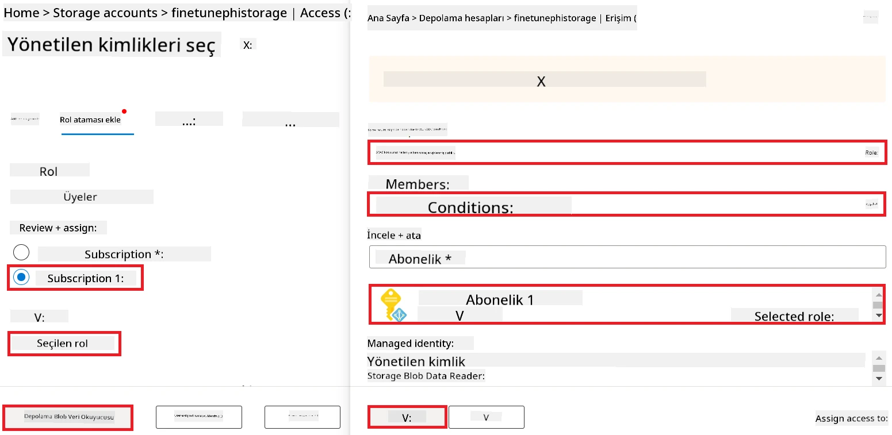

1. **İncele + ata** seçeneğini seçin.

#### Yönetilen Kimliğe AcrPull rol ataması ekleyin

1. Portal sayfasının en üstündeki **arama çubuğuna** *container registries* yazın ve çıkan seçeneklerden **Container registries**'i seçin.

    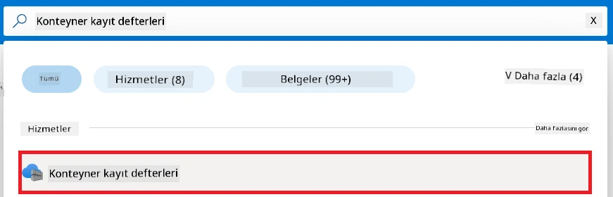

1. Azure Machine Learning çalışma alanınıza bağlı kapsayıcı kaydını seçin. Örneğin, *finetunephicontainerregistries*

1. Rol ataması ekleme sayfasına gitmek için aşağıdaki işlemleri yapın:

    - Sol taraftaki sekmeden **Erişim Kontrolü (IAM)** seçeneğini seçin.
    - Navigasyon menüsünden **+ Ekle** seçeneğini seçin.
    - Navigasyon menüsünden **Rol ataması ekle** seçeneğini seçin.

1. Rol ataması ekle sayfasında aşağıdaki işlemleri yapın:

    - Rol sayfasında **arama çubuğuna** *AcrPull* yazın ve çıkan seçeneklerden **AcrPull**'u seçin.
    - Rol sayfasında **İleri** seçeneğini seçin.
    - Üyeler sayfasında **Erişimi ata** olarak **Yönetilen kimlik** seçeneğini seçin.
    - Üyeler sayfasında **+ Üye seç** seçeneğini seçin.
    - Yönetilen kimlikleri seç sayfasında Azure **Aboneliğinizi** seçin.
    - Yönetilen kimlikleri seç sayfasında **Yönetilen kimlik** olarak **Yönetilen Kimlik** seçeneğini seçin.
    - Yönetilen kimlikleri seç sayfasında oluşturduğunuz Yönetilen Kimliği seçin. Örneğin, *finetunephi-managedidentity*.
    - Yönetilen kimlikleri seç sayfasında **Seç** seçeneğini seçin.
    - **İncele + ata** seçeneğini seçin.

### Projeyi kurun

Şimdi, üzerinde çalışmak için bir klasör oluşturacak ve kullanıcılarla etkileşim kuran ve Azure Cosmos DB'den saklanan sohbet geçmişini yanıtlarına dahil eden bir program geliştirmek için sanal bir ortam kuracaksınız.

#### İçinde çalışmak için bir klasör oluşturun

1. Bir terminal penceresi açın ve varsayılan dizinde *finetune-phi* adlı bir klasör oluşturmak için aşağıdaki komutu yazın.

    ```console
    mkdir finetune-phi
    ```

1. Terminalinizde aşağıdaki komutu yazarak oluşturduğunuz *finetune-phi* klasörüne gidin.

    ```console
    cd finetune-phi
    ```

#### Sanal ortam oluşturun

1. Terminalinizde aşağıdaki komutu yazarak *.venv* adlı bir sanal ortam oluşturun.

    ```console
    python -m venv .venv
    ```

1. Terminalinizde aşağıdaki komutu yazarak sanal ortamı etkinleştirin.

    ```console
    .venv\Scripts\activate.bat
    ```

> [!NOTE]
>
> Eğer başarılı olduysa, komut isteminin önünde *(.venv)* görmelisiniz.

#### Gerekli paketleri yükleyin

1. Terminalinizde aşağıdaki komutları yazarak gerekli paketleri yükleyin.

    ```console
    pip install datasets==2.19.1
    pip install transformers==4.41.1
    pip install azure-ai-ml==1.16.0
    pip install torch==2.3.1
    pip install trl==0.9.4
    pip install promptflow==1.12.0
    ```

#### Proje dosyalarını oluşturun
Bu alıştırmada, projemiz için gerekli dosyaları oluşturacaksınız. Bu dosyalar, veri setini indirmek, Azure Machine Learning ortamını kurmak, Phi-3 modelini ince ayar yapmak ve ince ayar yapılmış modeli dağıtmak için betikleri içermektedir. Ayrıca ince ayar ortamını kurmak için bir *conda.yml* dosyası oluşturacaksınız.

Bu alıştırmada şunları yapacaksınız:

- Veri setini indirmek için *download_dataset.py* dosyası oluşturun.
- Azure Machine Learning ortamını kurmak için *setup_ml.py* dosyasını oluşturun.
- *finetuning_dir* klasöründe Phi-3 modelini veri seti kullanarak ince ayar yapmak için *fine_tune.py* dosyasını oluşturun.
- İnce ayar ortamını kurmak için bir *conda.yml* dosyası oluşturun.
- İnce ayar yapılmış modeli dağıtmak için *deploy_model.py* dosyası oluşturun.
- İnce ayar yapılmış modeli entegre etmek ve Prompt flow kullanarak modeli çalıştırmak için *integrate_with_promptflow.py* dosyası oluşturun.
- Prompt flow için iş akışı yapısını ayarlamak üzere bir flow.dag.yml dosyası oluşturun.
- Azure bilgilerinizi girebilmek için *config.py* dosyasını oluşturun.

> [!NOTE]
>
> Tam klasör yapısı:
>
> ```text
> └── YourUserName
> .    └── finetune-phi
> .        ├── finetuning_dir
> .        │      └── fine_tune.py
> .        ├── conda.yml
> .        ├── config.py
> .        ├── deploy_model.py
> .        ├── download_dataset.py
> .        ├── flow.dag.yml
> .        ├── integrate_with_promptflow.py
> .        └── setup_ml.py
> ```

1. **Visual Studio Code**'u açın.

1. Menü çubuğundan **File** seçeneğini seçin.

1. **Open Folder** seçeneğini seçin.

1. Oluşturduğunuz *finetune-phi* klasörünü seçin, bu klasör *C:\Users\yourUserName\finetune-phi* konumunda bulunur.

    

1. Visual Studio Code'un sol panelinde sağ tıklayın ve *download_dataset.py* adlı yeni bir dosya oluşturmak için **New File** seçeneğini seçin.

1. Visual Studio Code'un sol panelinde sağ tıklayın ve *setup_ml.py* adlı yeni bir dosya oluşturmak için **New File** seçeneğini seçin.

1. Visual Studio Code'un sol panelinde sağ tıklayın ve *deploy_model.py* adlı yeni bir dosya oluşturmak için **New File** seçeneğini seçin.

    

1. Visual Studio Code'un sol panelinde sağ tıklayın ve *finetuning_dir* adında yeni bir klasör oluşturmak için **New Folder** seçeneğini seçin.

1. *finetuning_dir* klasöründe *fine_tune.py* adlı yeni bir dosya oluşturun.

#### *conda.yml* dosyasını oluşturma ve yapılandırma

1. Visual Studio Code'un sol panelinde sağ tıklayın ve *conda.yml* adlı yeni bir dosya oluşturmak için **New File** seçeneğini seçin.

1. *conda.yml* dosyasına Phi-3 modeli için ince ayar ortamını kurmak üzere aşağıdaki kodu ekleyin.

    ```yml
    name: phi-3-training-env
    channels:
      - defaults
      - conda-forge
    dependencies:
      - python=3.10
      - pip
      - numpy<2.0
      - pip:
          - torch==2.4.0
          - torchvision==0.19.0
          - trl==0.8.6
          - transformers==4.41
          - datasets==2.21.0
          - azureml-core==1.57.0
          - azure-storage-blob==12.19.0
          - azure-ai-ml==1.16
          - azure-identity==1.17.1
          - accelerate==0.33.0
          - mlflow==2.15.1
          - azureml-mlflow==1.57.0
    ```

#### *config.py* dosyasını oluşturma ve yapılandırma

1. Visual Studio Code'un sol panelinde sağ tıklayın ve *config.py* adlı yeni bir dosya oluşturmak için **New File** seçeneğini seçin.

1. Azure bilgilerinizi eklemek için *config.py* dosyasına aşağıdaki kodu ekleyin.

    ```python
    # Azure ayarları
    AZURE_SUBSCRIPTION_ID = "your_subscription_id"
    AZURE_RESOURCE_GROUP_NAME = "your_resource_group_name" # "TestGrubu"

    # Azure Makine Öğrenimi ayarları
    AZURE_ML_WORKSPACE_NAME = "your_workspace_name" # "finetunephi-çalışmaalanı"

    # Azure Yönetilen Kimlik ayarları
    AZURE_MANAGED_IDENTITY_CLIENT_ID = "your_azure_managed_identity_client_id"
    AZURE_MANAGED_IDENTITY_NAME = "your_azure_managed_identity_name" # "finetunephi-yönetilenkimlik"
    AZURE_MANAGED_IDENTITY_RESOURCE_ID = f"/subscriptions/{AZURE_SUBSCRIPTION_ID}/resourceGroups/{AZURE_RESOURCE_GROUP_NAME}/providers/Microsoft.ManagedIdentity/userAssignedIdentities/{AZURE_MANAGED_IDENTITY_NAME}"

    # Veri seti dosya yolları
    TRAIN_DATA_PATH = "data/train_data.jsonl"
    TEST_DATA_PATH = "data/test_data.jsonl"

    # İnce ayarlanmış model ayarları
    AZURE_MODEL_NAME = "your_fine_tuned_model_name" # "finetune-phi-modeli"
    AZURE_ENDPOINT_NAME = "your_fine_tuned_model_endpoint_name" # "finetune-phi-uçnoktası"
    AZURE_DEPLOYMENT_NAME = "your_fine_tuned_model_deployment_name" # "finetune-phi-dağıtımı"

    AZURE_ML_API_KEY = "your_fine_tuned_model_api_key"
    AZURE_ML_ENDPOINT = "your_fine_tuned_model_endpoint_uri" # "https://{uçnokta-adınız}.{bölgeniz}.inference.ml.azure.com/puan"
    ```

#### Azure ortam değişkenlerini ekleme

1. Azure Abonelik ID'sini eklemek için aşağıdaki görevleri yapın:

    - Portal sayfasının üstündeki **arama çubuğuna** *subscriptions* yazın ve çıkan seçeneklerden **Subscriptions**'ı seçin.
    - Şu anda kullandığınız Azure Aboneliğini seçin.
    - Abonelik ID'nizi kopyalayıp *config.py* dosyasına yapıştırın.

    

1. Azure Workspace Adını eklemek için aşağıdaki görevleri yapın:

    - Oluşturduğunuz Azure Machine Learning kaynağına gidin.
    - Hesap adınızı kopyalayıp *config.py* dosyasına yapıştırın.

    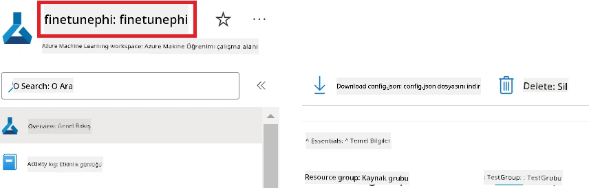

1. Azure Resource Group Adını eklemek için aşağıdaki görevleri yapın:

    - Oluşturduğunuz Azure Machine Learning kaynağına gidin.
    - Azure Resource Group adınızı kopyalayıp *config.py* dosyasına yapıştırın.

    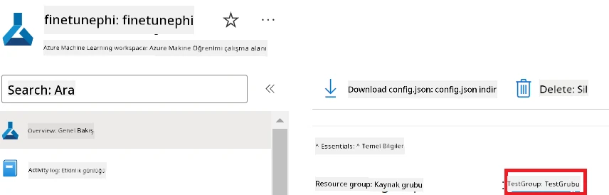

2. Azure Managed Identity adını eklemek için aşağıdaki görevleri yapın:

    - Oluşturduğunuz Managed Identities kaynağına gidin.
    - Azure Managed Identity adınızı kopyalayıp *config.py* dosyasına yapıştırın.

    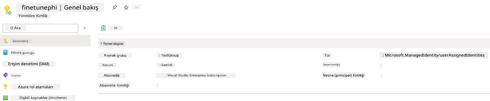

### İnce ayar için veri setini hazırlama

Bu alıştırmada, *download_dataset.py* dosyasını çalıştırarak *ULTRACHAT_200k* veri setlerini yerel ortamınıza indireceksiniz. Daha sonra bu veri setlerini kullanarak Phi-3 modeline Azure Machine Learning ortamında ince ayar yapacaksınız.

#### *download_dataset.py* ile veri setinizi indirin

1. Visual Studio Code'da *download_dataset.py* dosyasını açın.

1. *download_dataset.py* içine aşağıdaki kodu ekleyin.

    ```python
    import json
    import os
    from datasets import load_dataset
    from config import (
        TRAIN_DATA_PATH,
        TEST_DATA_PATH)

    def load_and_split_dataset(dataset_name, config_name, split_ratio):
        """
        Load and split a dataset.
        """
        # Belirtilen isim, yapılandırma ve bölünme oranıyla veri kümesini yükle
        dataset = load_dataset(dataset_name, config_name, split=split_ratio)
        print(f"Original dataset size: {len(dataset)}")
        
        # Veri kümesini eğitim ve test setlerine böl ( yüzde 80 eğitim, yüzde 20 test)
        split_dataset = dataset.train_test_split(test_size=0.2)
        print(f"Train dataset size: {len(split_dataset['train'])}")
        print(f"Test dataset size: {len(split_dataset['test'])}")
        
        return split_dataset

    def save_dataset_to_jsonl(dataset, filepath):
        """
        Save a dataset to a JSONL file.
        """
        # Dizin yoksa oluştur
        os.makedirs(os.path.dirname(filepath), exist_ok=True)
        
        # Dosyayı yazma modunda aç
        with open(filepath, 'w', encoding='utf-8') as f:
            # Veri kümesindeki her kayıt üzerinde yinele
            for record in dataset:
                # Kaydı JSON nesnesi olarak dök ve dosyaya yaz
                json.dump(record, f)
                # Kayıtları ayırmak için yeni satır karakteri yaz
                f.write('\n')
        
        print(f"Dataset saved to {filepath}")

    def main():
        """
        Main function to load, split, and save the dataset.
        """
        # ULTRACHAT_200k veri kümesini belirli bir yapılandırma ve bölünme oranıyla yükle ve böl
        dataset = load_and_split_dataset("HuggingFaceH4/ultrachat_200k", 'default', 'train_sft[:1%]')
        
        # Bölünmeden eğitim ve test veri kümelerini çıkar
        train_dataset = dataset['train']
        test_dataset = dataset['test']

        # Eğitim veri kümesini JSONL dosyasına kaydet
        save_dataset_to_jsonl(train_dataset, TRAIN_DATA_PATH)
        
        # Test veri kümesini ayrı bir JSONL dosyasına kaydet
        save_dataset_to_jsonl(test_dataset, TEST_DATA_PATH)

    if __name__ == "__main__":
        main()

    ```

> [!TIP]
>
> **CPU kullanarak minimal bir veri setiyle ince ayar yapmaya yönelik rehber**
>
> İnce ayar için CPU kullanmak istiyorsanız, bu yöntem özellikle Visual Studio Enterprise Subscription gibi avantaj aboneliklerine sahip olanlar veya ince ayar ve dağıtım sürecini hızlı test etmek isteyenler için uygundur.
>
> `dataset = load_and_split_dataset("HuggingFaceH4/ultrachat_200k", 'default', 'train_sft[:1%]')` ifadesini `dataset = load_and_split_dataset("HuggingFaceH4/ultrachat_200k", 'default', 'train_sft[:10]')` ile değiştirin.
>

1. Script'i çalıştırmak ve veri setini yerel ortamınıza indirmek için terminalinize aşağıdaki komutu yazın.

    ```console
    python download_data.py
    ```

1. Veri setlerinin *finetune-phi/data* dizinine başarıyla kaydedildiğini doğrulayın.

> [!NOTE]
>
> **Veri seti büyüklüğü ve ince ayar süresi**
>
> Bu uçtan uca (E2E) örnekte sadece veri setinin %1'i (`train_sft[:1%]`) kullanılmıştır. Bu, verinin miktarını önemli ölçüde azaltarak hem yükleme hem de ince ayar süreçlerini hızlandırır. Eğitim süresi ve model performansı arasında doğru dengeyi bulmak için bu yüzdeleri ayarlayabilirsiniz. Daha küçük bir veri seti alt kümesi kullanmak ince ayar için gereken süreyi azaltır, böylece süreç E2E örneği için daha yönetilebilir hale gelir.

## Senaryo 2: Phi-3 modelini ince ayar yap ve Azure Machine Learning Studio'da dağıt

### Azure CLI'yi kurun

Ortamınızı yetkilendirmek için Azure CLI'yi kurmanız gerekir. Azure CLI, Azure kaynaklarını doğrudan komut satırından yönetmenizi sağlar ve Azure Machine Learning'in bu kaynaklara erişimi için gerekli kimlik bilgilerini sağlar. Başlamak için [Azure CLI'yi](https://learn.microsoft.com/cli/azure/install-azure-cli) yükleyin.

1. Bir terminal penceresi açın ve Azure hesabınıza giriş yapmak için aşağıdaki komutu yazın.

    ```console
    az login
    ```

1. Kullanmak istediğiniz Azure hesabınızı seçin.

1. Kullanmak istediğiniz Azure aboneliğinizi seçin.

    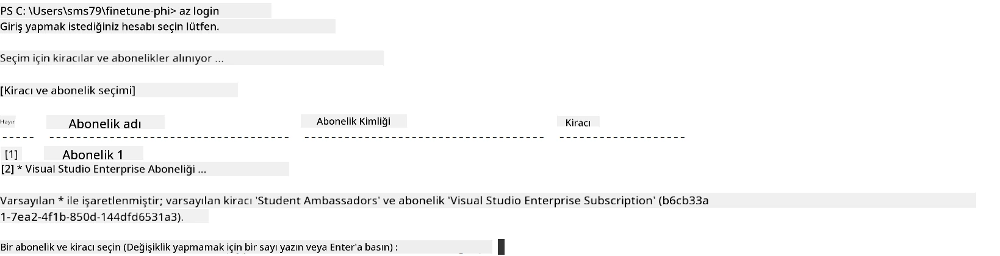

> [!TIP]
>
> Azure'a giriş yapmakta sorun yaşıyorsanız, cihaz kodu kullanmayı deneyin. Bir terminal penceresi açın ve Azure hesabınıza giriş yapmak için aşağıdaki komutu yazın:
>
> ```console
> az login --use-device-code
> ```
>

### Phi-3 modeline ince ayar yapma

Bu alıştırmada, verilen veri setini kullanarak Phi-3 modeline ince ayar yapacaksınız. İlk olarak, *fine_tune.py* dosyasında ince ayar işlemini tanımlayacaksınız. Ardından, Azure Machine Learning ortamını yapılandıracak ve *setup_ml.py* dosyasını çalıştırarak ince ayar sürecini başlatacaksınız. Bu betik, ince ayarın Azure Machine Learning ortamında gerçekleşmesini sağlar.

*setup_ml.py* dosyasını çalıştırarak, ince ayar işlemini Azure Machine Learning ortamında başlatacaksınız.

#### *fine_tune.py* dosyasına kod ekleyin

1. *finetuning_dir* klasörüne gidin ve Visual Studio Code'da *fine_tune.py* dosyasını açın.

1. *fine_tune.py* içine aşağıdaki kodu ekleyin.

    ```python
    import argparse
    import sys
    import logging
    import os
    from datasets import load_dataset
    import torch
    import mlflow
    from transformers import AutoModelForCausalLM, AutoTokenizer, TrainingArguments
    from trl import SFTTrainer

    # INVALID_PARAMETER_VALUE hatasından kaçınmak için MLflow entegrasyonunu devre dışı bırakın
    os.environ["DISABLE_MLFLOW_INTEGRATION"] = "True"

    # Kayıt ayarları
    logging.basicConfig(
        format="%(asctime)s - %(levelname)s - %(name)s - %(message)s",
        datefmt="%Y-%m-%d %H:%M:%S",
        handlers=[logging.StreamHandler(sys.stdout)],
        level=logging.WARNING
    )
    logger = logging.getLogger(__name__)

    def initialize_model_and_tokenizer(model_name, model_kwargs):
        """
        Initialize the model and tokenizer with the given pretrained model name and arguments.
        """
        model = AutoModelForCausalLM.from_pretrained(model_name, **model_kwargs)
        tokenizer = AutoTokenizer.from_pretrained(model_name)
        tokenizer.model_max_length = 2048
        tokenizer.pad_token = tokenizer.unk_token
        tokenizer.pad_token_id = tokenizer.convert_tokens_to_ids(tokenizer.pad_token)
        tokenizer.padding_side = 'right'
        return model, tokenizer

    def apply_chat_template(example, tokenizer):
        """
        Apply a chat template to tokenize messages in the example.
        """
        messages = example["messages"]
        if messages[0]["role"] != "system":
            messages.insert(0, {"role": "system", "content": ""})
        example["text"] = tokenizer.apply_chat_template(
            messages, tokenize=False, add_generation_prompt=False
        )
        return example

    def load_and_preprocess_data(train_filepath, test_filepath, tokenizer):
        """
        Load and preprocess the dataset.
        """
        train_dataset = load_dataset('json', data_files=train_filepath, split='train')
        test_dataset = load_dataset('json', data_files=test_filepath, split='train')
        column_names = list(train_dataset.features)

        train_dataset = train_dataset.map(
            apply_chat_template,
            fn_kwargs={"tokenizer": tokenizer},
            num_proc=10,
            remove_columns=column_names,
            desc="Applying chat template to train dataset",
        )

        test_dataset = test_dataset.map(
            apply_chat_template,
            fn_kwargs={"tokenizer": tokenizer},
            num_proc=10,
            remove_columns=column_names,
            desc="Applying chat template to test dataset",
        )

        return train_dataset, test_dataset

    def train_and_evaluate_model(train_dataset, test_dataset, model, tokenizer, output_dir):
        """
        Train and evaluate the model.
        """
        training_args = TrainingArguments(
            bf16=True,
            do_eval=True,
            output_dir=output_dir,
            eval_strategy="epoch",
            learning_rate=5.0e-06,
            logging_steps=20,
            lr_scheduler_type="cosine",
            num_train_epochs=3,
            overwrite_output_dir=True,
            per_device_eval_batch_size=4,
            per_device_train_batch_size=4,
            remove_unused_columns=True,
            save_steps=500,
            seed=0,
            gradient_checkpointing=True,
            gradient_accumulation_steps=1,
            warmup_ratio=0.2,
        )

        trainer = SFTTrainer(
            model=model,
            args=training_args,
            train_dataset=train_dataset,
            eval_dataset=test_dataset,
            max_seq_length=2048,
            dataset_text_field="text",
            tokenizer=tokenizer,
            packing=True
        )

        train_result = trainer.train()
        trainer.log_metrics("train", train_result.metrics)

        mlflow.transformers.log_model(
            transformers_model={"model": trainer.model, "tokenizer": tokenizer},
            artifact_path=output_dir,
        )

        tokenizer.padding_side = 'left'
        eval_metrics = trainer.evaluate()
        eval_metrics["eval_samples"] = len(test_dataset)
        trainer.log_metrics("eval", eval_metrics)

    def main(train_file, eval_file, model_output_dir):
        """
        Main function to fine-tune the model.
        """
        model_kwargs = {
            "use_cache": False,
            "trust_remote_code": True,
            "torch_dtype": torch.bfloat16,
            "device_map": None,
            "attn_implementation": "eager"
        }

        # pretrained_model_name = "microsoft/Phi-3-mini-4k-instruct"
        pretrained_model_name = "microsoft/Phi-3.5-mini-instruct"

        with mlflow.start_run():
            model, tokenizer = initialize_model_and_tokenizer(pretrained_model_name, model_kwargs)
            train_dataset, test_dataset = load_and_preprocess_data(train_file, eval_file, tokenizer)
            train_and_evaluate_model(train_dataset, test_dataset, model, tokenizer, model_output_dir)

    if __name__ == "__main__":
        parser = argparse.ArgumentParser()
        parser.add_argument("--train-file", type=str, required=True, help="Path to the training data")
        parser.add_argument("--eval-file", type=str, required=True, help="Path to the evaluation data")
        parser.add_argument("--model_output_dir", type=str, required=True, help="Directory to save the fine-tuned model")
        args = parser.parse_args()
        main(args.train_file, args.eval_file, args.model_output_dir)

    ```

1. *fine_tune.py* dosyasını kaydedin ve kapatın.

> [!TIP]
> **Phi-3.5 modeline de ince ayar yapabilirsiniz**
>
> *fine_tune.py* dosyasında `pretrained_model_name` değerini `"microsoft/Phi-3-mini-4k-instruct"`'den istediğiniz herhangi bir modele değiştirebilirsiniz. Örneğin, `"microsoft/Phi-3.5-mini-instruct"` olarak değiştirirseniz, ince ayar için Phi-3.5-mini-instruct modelini kullanıyor olursunuz. Tercih ettiğiniz model adını bulmak ve kullanmak için [Hugging Face](https://huggingface.co/) sitesini ziyaret edin, ilgili modeli arayın ve model adını `pretrained_model_name` alanına kopyalayıp betiğinize yapıştırın.
>
> <image type="content" src="../../../../imgs/02/FineTuning-PromptFlow/finetunephi3.5.png" alt-text="Phi-3.5 modeline ince ayar yapın.">
>

#### *setup_ml.py* dosyasına kod ekleyin

1. Visual Studio Code'da *setup_ml.py* dosyasını açın.

1. *setup_ml.py* içine aşağıdaki kodu ekleyin.

    ```python
    import logging
    from azure.ai.ml import MLClient, command, Input
    from azure.ai.ml.entities import Environment, AmlCompute
    from azure.identity import AzureCliCredential
    from config import (
        AZURE_SUBSCRIPTION_ID,
        AZURE_RESOURCE_GROUP_NAME,
        AZURE_ML_WORKSPACE_NAME,
        TRAIN_DATA_PATH,
        TEST_DATA_PATH
    )

    # Sabitler

    # Eğitim için bir CPU örneği kullanmak için aşağıdaki satırların yorumunu kaldırın
    # COMPUTE_INSTANCE_TYPE = "Standard_E16s_v3" # cpu
    # COMPUTE_NAME = "cpu-e16s-v3"
    # DOCKER_IMAGE_NAME = "mcr.microsoft.com/azureml/openmpi4.1.0-ubuntu20.04:latest"

    # Eğitim için bir GPU örneği kullanmak için aşağıdaki satırların yorumunu kaldırın
    COMPUTE_INSTANCE_TYPE = "Standard_NC24ads_A100_v4"
    COMPUTE_NAME = "gpu-nc24s-a100-v4"
    DOCKER_IMAGE_NAME = "mcr.microsoft.com/azureml/curated/acft-hf-nlp-gpu:59"

    CONDA_FILE = "conda.yml"
    LOCATION = "eastus2" # Hesap kümenizin konumuyla değiştirin
    FINETUNING_DIR = "./finetuning_dir" # İnce ayar betiğinin yolu
    TRAINING_ENV_NAME = "phi-3-training-environment" # Eğitim ortamının adı
    MODEL_OUTPUT_DIR = "./model_output" # Azure ml'deki model çıktı dizininin yolu

    # Süreci izlemek için günlük kaydı ayarı
    logger = logging.getLogger(__name__)
    logging.basicConfig(
        format="%(asctime)s - %(levelname)s - %(name)s - %(message)s",
        datefmt="%Y-%m-%d %H:%M:%S",
        level=logging.WARNING
    )

    def get_ml_client():
        """
        Initialize the ML Client using Azure CLI credentials.
        """
        credential = AzureCliCredential()
        return MLClient(credential, AZURE_SUBSCRIPTION_ID, AZURE_RESOURCE_GROUP_NAME, AZURE_ML_WORKSPACE_NAME)

    def create_or_get_environment(ml_client):
        """
        Create or update the training environment in Azure ML.
        """
        env = Environment(
            image=DOCKER_IMAGE_NAME,  # Ortam için Docker imajı
            conda_file=CONDA_FILE,  # Conda ortam dosyası
            name=TRAINING_ENV_NAME,  # Ortamın adı
        )
        return ml_client.environments.create_or_update(env)

    def create_or_get_compute_cluster(ml_client, compute_name, COMPUTE_INSTANCE_TYPE, location):
        """
        Create or update the compute cluster in Azure ML.
        """
        try:
            compute_cluster = ml_client.compute.get(compute_name)
            logger.info(f"Compute cluster '{compute_name}' already exists. Reusing it for the current run.")
        except Exception:
            logger.info(f"Compute cluster '{compute_name}' does not exist. Creating a new one with size {COMPUTE_INSTANCE_TYPE}.")
            compute_cluster = AmlCompute(
                name=compute_name,
                size=COMPUTE_INSTANCE_TYPE,
                location=location,
                tier="Dedicated",  # Hesap kümesinin seviyesi
                min_instances=0,  # Minimum örnek sayısı
                max_instances=1  # Maksimum örnek sayısı
            )
            ml_client.compute.begin_create_or_update(compute_cluster).wait()  # Kümenin oluşturulmasını bekleyin
        return compute_cluster

    def create_fine_tuning_job(env, compute_name):
        """
        Set up the fine-tuning job in Azure ML.
        """
        return command(
            code=FINETUNING_DIR,  # fine_tune.py'nin yolu
            command=(
                "python fine_tune.py "
                "--train-file ${{inputs.train_file}} "
                "--eval-file ${{inputs.eval_file}} "
                "--model_output_dir ${{inputs.model_output}}"
            ),
            environment=env,  # Eğitim ortamı
            compute=compute_name,  # Kullanılacak hesap kümesi
            inputs={
                "train_file": Input(type="uri_file", path=TRAIN_DATA_PATH),  # Eğitim veri dosyasının yolu
                "eval_file": Input(type="uri_file", path=TEST_DATA_PATH),  # Değerlendirme veri dosyasının yolu
                "model_output": MODEL_OUTPUT_DIR
            }
        )

    def main():
        """
        Main function to set up and run the fine-tuning job in Azure ML.
        """
        # ML İstemcisini başlat
        ml_client = get_ml_client()

        # Ortam oluştur
        env = create_or_get_environment(ml_client)
        
        # Var olan hesap kümesini oluştur veya al
        create_or_get_compute_cluster(ml_client, COMPUTE_NAME, COMPUTE_INSTANCE_TYPE, LOCATION)

        # İnce Ayar İşini oluştur ve gönder
        job = create_fine_tuning_job(env, COMPUTE_NAME)
        returned_job = ml_client.jobs.create_or_update(job)  # İşi gönder
        ml_client.jobs.stream(returned_job.name)  # İş günlüklerini akıt
        
        # İş adını yakala
        job_name = returned_job.name
        print(f"Job name: {job_name}")

    if __name__ == "__main__":
        main()

    ```

1. `COMPUTE_INSTANCE_TYPE`, `COMPUTE_NAME` ve `LOCATION` değerlerini kendi özel bilgilerinizle değiştirin.

    ```python
   # Eğitmek için bir GPU örneği kullanmak üzere aşağıdaki satırların yorumlarını kaldırın
    COMPUTE_INSTANCE_TYPE = "Standard_NC24ads_A100_v4"
    COMPUTE_NAME = "gpu-nc24s-a100-v4"
    ...
    LOCATION = "eastus2" # Bilgi işlem kümenizin konumu ile değiştirin
    ```

> [!TIP]
>
> **CPU kullanarak minimal veri setiyle ince ayar yapmaya yönelik rehber**
>
> CPU kullanmak istiyorsanız, bu yöntem avantaj aboneliklerine (örneğin Visual Studio Enterprise Subscription) sahip olanlar ya da ince ayar ve dağıtım sürecini hızlı test etmek isteyenler için idealdir.
>
> 1. *setup_ml* dosyasını açın.
> 1. `COMPUTE_INSTANCE_TYPE`, `COMPUTE_NAME` ve `DOCKER_IMAGE_NAME` değerlerini aşağıdaki ile değiştirin. Eğer *Standard_E16s_v3* erişiminiz yoksa, eşdeğer bir CPU örneği kullanabilir veya yeni kota talebinde bulunabilirsiniz.
> 1. `LOCATION` değerini kendi özel bilgilerinizle değiştirin.
>
>    ```python
>    # Uncomment the following lines to use a CPU instance for training
>    COMPUTE_INSTANCE_TYPE = "Standard_E16s_v3" # cpu
>    COMPUTE_NAME = "cpu-e16s-v3"
>    DOCKER_IMAGE_NAME = "mcr.microsoft.com/azureml/openmpi4.1.0-ubuntu20.04:latest"
>    LOCATION = "eastus2" # Replace with the location of your compute cluster
>    ```
>

1. *setup_ml.py* betiğini çalıştırmak ve Azure Machine Learning ortamında ince ayar sürecini başlatmak için aşağıdaki komutu yazın.

    ```python
    python setup_ml.py
    ```

1. Bu alıştırmada Phi-3 modeline Azure Machine Learning kullanarak başarıyla ince ayar yaptınız. *setup_ml.py* betiğini çalıştırarak Azure Machine Learning ortamını kurdunuz ve *fine_tune.py* dosyasında tanımlı ince ayar sürecini başlattınız. Lütfen ince ayar sürecinin önemli bir zaman alabileceğini unutmayın. `python setup_ml.py` komutunu çalıştırdıktan sonra işlemin tamamlanmasını beklemeniz gerekir. İnce ayar işinin durumunu, terminalde verilen bağlantıyı kullanarak Azure Machine Learning portalından takip edebilirsiniz.

    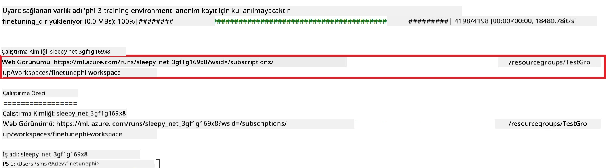

### İnce ayar yapılmış modeli dağıtma

İnce ayar yapılmış Phi-3 modelini Prompt Flow ile entegre etmek için modeli gerçek zamanlı çıkarım için erişilebilir hale getirmeniz gerekir. Bu süreç modelin kayıt edilmesini, çevrimiçi uç nokta oluşturulmasını ve modelin dağıtımını içerir.

#### Model adı, uç nokta adı ve dağıtım adını ayarlayın

1. *config.py* dosyasını açın.

1. `AZURE_MODEL_NAME = "your_fine_tuned_model_name"` ifadesini modeliniz için istediğiniz adla değiştirin.

1. `AZURE_ENDPOINT_NAME = "your_fine_tuned_model_endpoint_name"` ifadesini uç noktanız için istediğiniz adla değiştirin.

1. `AZURE_DEPLOYMENT_NAME = "your_fine_tuned_model_deployment_name"` ifadesini dağıtımınız için istediğiniz adla değiştirin.

#### *deploy_model.py* dosyasına kod ekleyin

*deploy_model.py* dosyasını çalıştırmak dağıtım sürecini otomatikleştirir. Bu dosya, modeli kayıt eder, bir uç nokta oluşturur ve *config.py* dosyasındaki ayarlara göre (model adı, uç nokta adı, dağıtım adı) dağıtımı gerçekleştirir.

1. Visual Studio Code'da *deploy_model.py* dosyasını açın.

1. *deploy_model.py* içine aşağıdaki kodu ekleyin.

    ```python
    import logging
    from azure.identity import AzureCliCredential
    from azure.ai.ml import MLClient
    from azure.ai.ml.entities import Model, ProbeSettings, ManagedOnlineEndpoint, ManagedOnlineDeployment, IdentityConfiguration, ManagedIdentityConfiguration, OnlineRequestSettings
    from azure.ai.ml.constants import AssetTypes

    # Yapılandırma ithalatları
    from config import (
        AZURE_SUBSCRIPTION_ID,
        AZURE_RESOURCE_GROUP_NAME,
        AZURE_ML_WORKSPACE_NAME,
        AZURE_MANAGED_IDENTITY_RESOURCE_ID,
        AZURE_MANAGED_IDENTITY_CLIENT_ID,
        AZURE_MODEL_NAME,
        AZURE_ENDPOINT_NAME,
        AZURE_DEPLOYMENT_NAME
    )

    # Sabitler
    JOB_NAME = "your-job-name"
    COMPUTE_INSTANCE_TYPE = "Standard_E4s_v3"

    deployment_env_vars = {
        "SUBSCRIPTION_ID": AZURE_SUBSCRIPTION_ID,
        "RESOURCE_GROUP_NAME": AZURE_RESOURCE_GROUP_NAME,
        "UAI_CLIENT_ID": AZURE_MANAGED_IDENTITY_CLIENT_ID,
    }

    # Kayıt ayarları
    logging.basicConfig(
        format="%(asctime)s - %(levelname)s - %(name)s - %(message)s",
        datefmt="%Y-%m-%d %H:%M:%S",
        level=logging.DEBUG
    )
    logger = logging.getLogger(__name__)

    def get_ml_client():
        """Initialize and return the ML Client."""
        credential = AzureCliCredential()
        return MLClient(credential, AZURE_SUBSCRIPTION_ID, AZURE_RESOURCE_GROUP_NAME, AZURE_ML_WORKSPACE_NAME)

    def register_model(ml_client, model_name, job_name):
        """Register a new model."""
        model_path = f"azureml://jobs/{job_name}/outputs/artifacts/paths/model_output"
        logger.info(f"Registering model {model_name} from job {job_name} at path {model_path}.")
        run_model = Model(
            path=model_path,
            name=model_name,
            description="Model created from run.",
            type=AssetTypes.MLFLOW_MODEL,
        )
        model = ml_client.models.create_or_update(run_model)
        logger.info(f"Registered model ID: {model.id}")
        return model

    def delete_existing_endpoint(ml_client, endpoint_name):
        """Delete existing endpoint if it exists."""
        try:
            endpoint_result = ml_client.online_endpoints.get(name=endpoint_name)
            logger.info(f"Deleting existing endpoint {endpoint_name}.")
            ml_client.online_endpoints.begin_delete(name=endpoint_name).result()
            logger.info(f"Deleted existing endpoint {endpoint_name}.")
        except Exception as e:
            logger.info(f"No existing endpoint {endpoint_name} found to delete: {e}")

    def create_or_update_endpoint(ml_client, endpoint_name, description=""):
        """Create or update an endpoint."""
        delete_existing_endpoint(ml_client, endpoint_name)
        logger.info(f"Creating new endpoint {endpoint_name}.")
        endpoint = ManagedOnlineEndpoint(
            name=endpoint_name,
            description=description,
            identity=IdentityConfiguration(
                type="user_assigned",
                user_assigned_identities=[ManagedIdentityConfiguration(resource_id=AZURE_MANAGED_IDENTITY_RESOURCE_ID)]
            )
        )
        endpoint_result = ml_client.online_endpoints.begin_create_or_update(endpoint).result()
        logger.info(f"Created new endpoint {endpoint_name}.")
        return endpoint_result

    def create_or_update_deployment(ml_client, endpoint_name, deployment_name, model):
        """Create or update a deployment."""

        logger.info(f"Creating deployment {deployment_name} for endpoint {endpoint_name}.")
        deployment = ManagedOnlineDeployment(
            name=deployment_name,
            endpoint_name=endpoint_name,
            model=model.id,
            instance_type=COMPUTE_INSTANCE_TYPE,
            instance_count=1,
            environment_variables=deployment_env_vars,
            request_settings=OnlineRequestSettings(
                max_concurrent_requests_per_instance=3,
                request_timeout_ms=180000,
                max_queue_wait_ms=120000
            ),
            liveness_probe=ProbeSettings(
                failure_threshold=30,
                success_threshold=1,
                period=100,
                initial_delay=500,
            ),
            readiness_probe=ProbeSettings(
                failure_threshold=30,
                success_threshold=1,
                period=100,
                initial_delay=500,
            ),
        )
        deployment_result = ml_client.online_deployments.begin_create_or_update(deployment).result()
        logger.info(f"Created deployment {deployment.name} for endpoint {endpoint_name}.")
        return deployment_result

    def set_traffic_to_deployment(ml_client, endpoint_name, deployment_name):
        """Set traffic to the specified deployment."""
        try:
            # Geçerli uç nokta detaylarını al
            endpoint = ml_client.online_endpoints.get(name=endpoint_name)
            
            # Hata ayıklama için mevcut trafik tahsisini kaydet
            logger.info(f"Current traffic allocation: {endpoint.traffic}")
            
            # Dağıtım için trafik tahsisini ayarla
            endpoint.traffic = {deployment_name: 100}
            
            # Uç noktayı yeni trafik tahsisi ile güncelle
            endpoint_poller = ml_client.online_endpoints.begin_create_or_update(endpoint)
            updated_endpoint = endpoint_poller.result()
            
            # Hata ayıklama için güncellenmiş trafik tahsisini kaydet
            logger.info(f"Updated traffic allocation: {updated_endpoint.traffic}")
            logger.info(f"Set traffic to deployment {deployment_name} at endpoint {endpoint_name}.")
            return updated_endpoint
        except Exception as e:
            # İşlem sırasında oluşan hataları kaydet
            logger.error(f"Failed to set traffic to deployment: {e}")
            raise


    def main():
        ml_client = get_ml_client()

        registered_model = register_model(ml_client, AZURE_MODEL_NAME, JOB_NAME)
        logger.info(f"Registered model ID: {registered_model.id}")

        endpoint = create_or_update_endpoint(ml_client, AZURE_ENDPOINT_NAME, "Endpoint for finetuned Phi-3 model")
        logger.info(f"Endpoint {AZURE_ENDPOINT_NAME} is ready.")

        try:
            deployment = create_or_update_deployment(ml_client, AZURE_ENDPOINT_NAME, AZURE_DEPLOYMENT_NAME, registered_model)
            logger.info(f"Deployment {AZURE_DEPLOYMENT_NAME} is created for endpoint {AZURE_ENDPOINT_NAME}.")

            set_traffic_to_deployment(ml_client, AZURE_ENDPOINT_NAME, AZURE_DEPLOYMENT_NAME)
            logger.info(f"Traffic is set to deployment {AZURE_DEPLOYMENT_NAME} at endpoint {AZURE_ENDPOINT_NAME}.")
        except Exception as e:
            logger.error(f"Failed to create or update deployment: {e}")

    if __name__ == "__main__":
        main()

    ```

1. `JOB_NAME` değerini almak için aşağıdaki işlemleri yapın:

    - Oluşturduğunuz Azure Machine Learning kaynağına gidin.
    - Azure Machine Learning çalışma alanını açmak için **Studio web URL** seçeneğini seçin.
    - Sol taraftaki sekmeden **Jobs** seçeneğini seçin.
    - İnce ayar için oluşturduğunuz deneyi seçin. Örneğin, *finetunephi*.
    - Oluşturduğunuz işi seçin.
- İşinizin Adını *deploy_model.py* dosyasındaki `JOB_NAME = "your-job-name"` kısmına kopyalayıp yapıştırın.

1. `COMPUTE_INSTANCE_TYPE` öğesini kendi özel bilgilerinizle değiştirin.

1. *deploy_model.py* betiğini çalıştırmak ve Azure Machine Learning'de dağıtım sürecini başlatmak için aşağıdaki komutu yazın.

    ```python
    python deploy_model.py
    ```

> [!WARNING]
> Hesabınıza ek ücretler yansımaması için Azure Machine Learning çalışma alanında oluşturulan uç noktayı silmeyi unutmayın.
>

#### Azure Machine Learning Çalışma Alanında dağıtım durumunu kontrol edin

1. [Azure ML Studio](https://ml.azure.com/home?wt.mc_id=studentamb_279723) sitesini ziyaret edin.

1. Oluşturduğunuz Azure Machine Learning çalışma alanına gidin.

1. Azure Machine Learning çalışma alanını açmak için **Studio web URL** seçeneğini seçin.

1. Sol taraftaki sekmeden **Endpoints** seçeneğini seçin.

    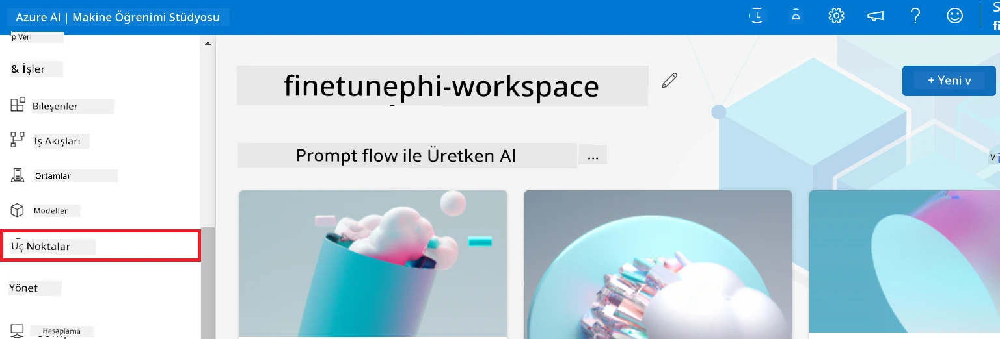

2. Oluşturduğunuz uç noktayı seçin.

    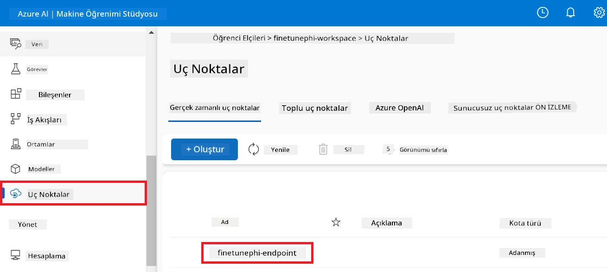

3. Bu sayfada, dağıtım sürecinde oluşturulan uç noktaları yönetebilirsiniz.

## Senaryo 3: Prompt flow ile entegrasyon ve özel modelinizle sohbet

### Özel Phi-3 modelini Prompt flow ile entegre edin

İnce ayar yapılmış modelinizi başarıyla dağıttıktan sonra, Prompt flow ile entegre edip modelinizi gerçek zamanlı uygulamalarda kullanabilir, özel Phi-3 modelinizle çeşitli etkileşimli görevler gerçekleştirebilirsiniz.

#### İnce ayar yapılmış Phi-3 modelinin API anahtarı ve uç nokta URI'sını ayarlayın

1. Oluşturduğunuz Azure Machine Learning çalışma alanına gidin.
1. Sol taraftaki sekmeden **Endpoints** seçeneğini seçin.
1. Oluşturduğunuz uç noktayı seçin.
1. Gezinti menüsünden **Consume** seçeneğini seçin.
1. **REST endpoint** adresinizi kopyalayıp *config.py* dosyasındaki `AZURE_ML_ENDPOINT = "your_fine_tuned_model_endpoint_uri"` ifadesinin yerine yapıştırın.
1. **Primary key** (Birincil anahtar) değerini kopyalayıp *config.py* dosyasındaki `AZURE_ML_API_KEY = "your_fine_tuned_model_api_key"` ifadesinin yerine yapıştırın.

    

#### *flow.dag.yml* dosyasına kod ekleyin

1. Visual Studio Code’da *flow.dag.yml* dosyasını açın.

1. Aşağıdaki kodu *flow.dag.yml* dosyasına ekleyin.

    ```yml
    inputs:
      input_data:
        type: string
        default: "Who founded Microsoft?"

    outputs:
      answer:
        type: string
        reference: ${integrate_with_promptflow.output}

    nodes:
    - name: integrate_with_promptflow
      type: python
      source:
        type: code
        path: integrate_with_promptflow.py
      inputs:
        input_data: ${inputs.input_data}
    ```

#### *integrate_with_promptflow.py* dosyasına kod ekleyin

1. Visual Studio Code’da *integrate_with_promptflow.py* dosyasını açın.

1. Aşağıdaki kodu *integrate_with_promptflow.py* dosyasına ekleyin.

    ```python
    import logging
    import requests
    from promptflow.core import tool
    import asyncio
    import platform
    from config import (
        AZURE_ML_ENDPOINT,
        AZURE_ML_API_KEY
    )

    # Günlük kaydı ayarları
    logging.basicConfig(
        format="%(asctime)s - %(levelname)s - %(name)s - %(message)s",
        datefmt="%Y-%m-%d %H:%M:%S",
        level=logging.DEBUG
    )
    logger = logging.getLogger(__name__)

    def query_azml_endpoint(input_data: list, endpoint_url: str, api_key: str) -> str:
        """
        Send a request to the Azure ML endpoint with the given input data.
        """
        headers = {
            "Content-Type": "application/json",
            "Authorization": f"Bearer {api_key}"
        }
        data = {
            "input_data": [input_data],
            "params": {
                "temperature": 0.7,
                "max_new_tokens": 128,
                "do_sample": True,
                "return_full_text": True
            }
        }
        try:
            response = requests.post(endpoint_url, json=data, headers=headers)
            response.raise_for_status()
            result = response.json()[0]
            logger.info("Successfully received response from Azure ML Endpoint.")
            return result
        except requests.exceptions.RequestException as e:
            logger.error(f"Error querying Azure ML Endpoint: {e}")
            raise

    def setup_asyncio_policy():
        """
        Setup asyncio event loop policy for Windows.
        """
        if platform.system() == 'Windows':
            asyncio.set_event_loop_policy(asyncio.WindowsSelectorEventLoopPolicy())
            logger.info("Set Windows asyncio event loop policy.")

    @tool
    def my_python_tool(input_data: str) -> str:
        """
        Tool function to process input data and query the Azure ML endpoint.
        """
        setup_asyncio_policy()
        return query_azml_endpoint(input_data, AZURE_ML_ENDPOINT, AZURE_ML_API_KEY)

    ```

### Özel modelinizle sohbet edin

1. *deploy_model.py* betiğini çalıştırmak ve Azure Machine Learning'de dağıtım sürecini başlatmak için aşağıdaki komutu yazın.

    ```python
    pf flow serve --source ./ --port 8080 --host localhost
    ```

1. İşte örnek bir sonuç: Artık özel Phi-3 modelinizle sohbet edebilirsiniz. İnce ayar için kullanılan verilerle ilişkili sorular sormanız önerilir.

    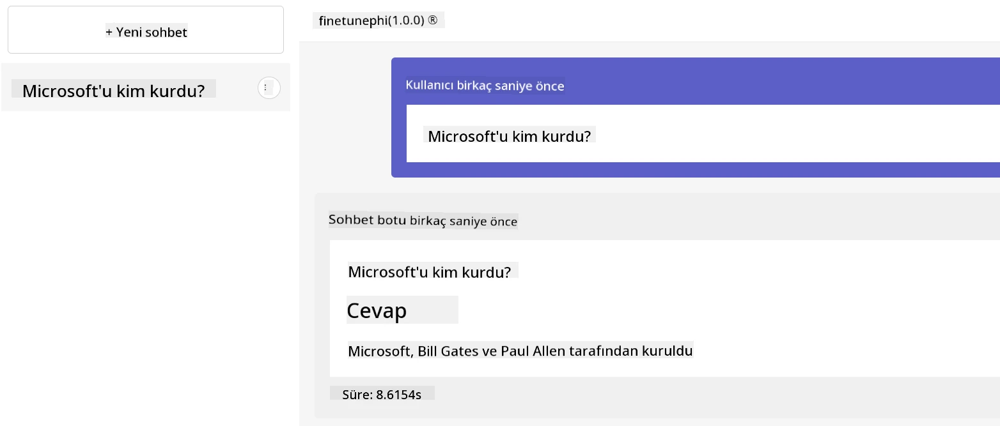

---

<!-- CO-OP TRANSLATOR DISCLAIMER START -->
**Feragatname**:
Bu belge, AI çeviri hizmeti [Co-op Translator](https://github.com/Azure/co-op-translator) kullanılarak çevrilmiştir. Doğruluk için çaba göstersek de, otomatik çevirilerin hatalar veya yanlışlıklar içerebileceğinin farkında olunuz. Orijinal belge, kendi dilinde yetkili kaynak olarak kabul edilmelidir. Kritik bilgiler için profesyonel insan çevirisi önerilir. Bu çevirinin kullanımı sonucu oluşabilecek yanlış anlamalar veya yorumlamalardan dolayı sorumluluk kabul edilmemektedir.
<!-- CO-OP TRANSLATOR DISCLAIMER END -->