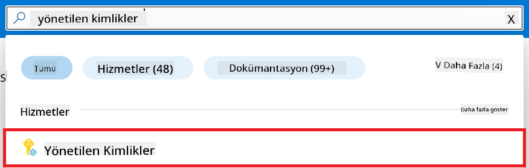
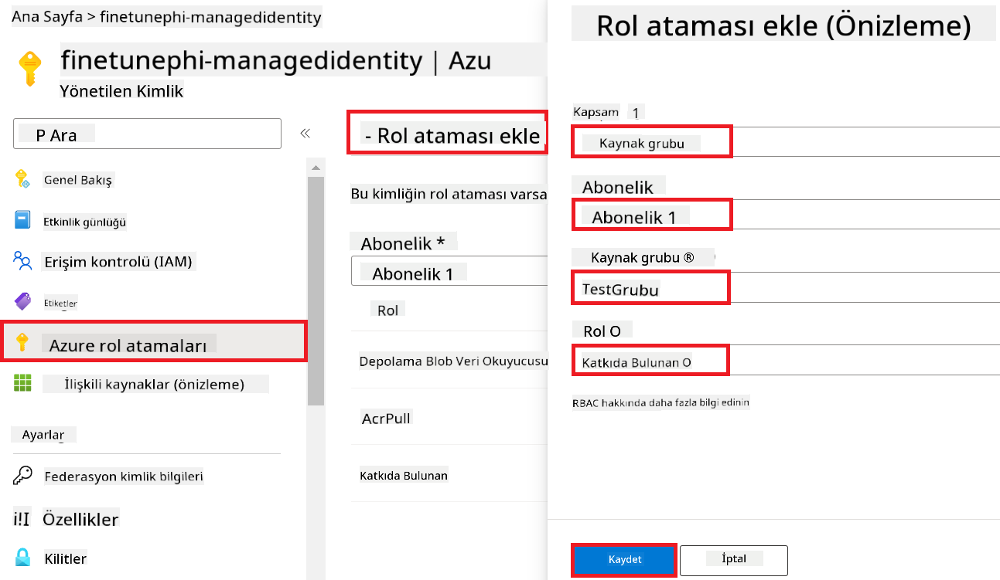
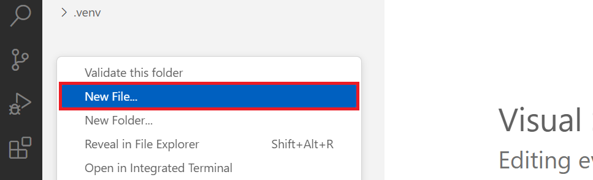
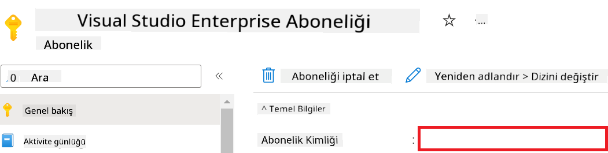
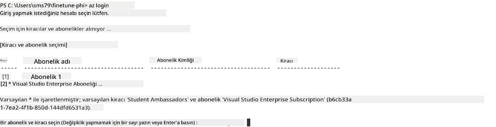
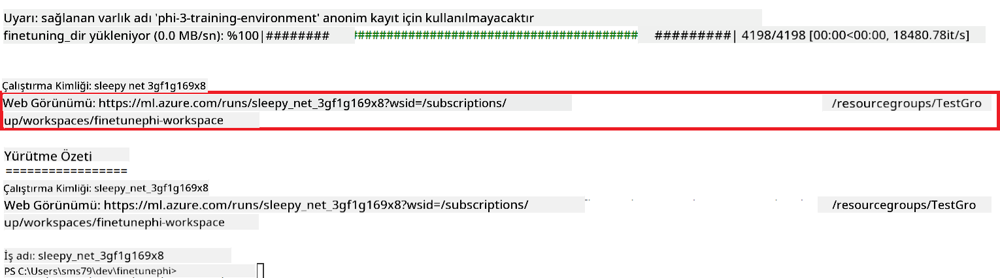
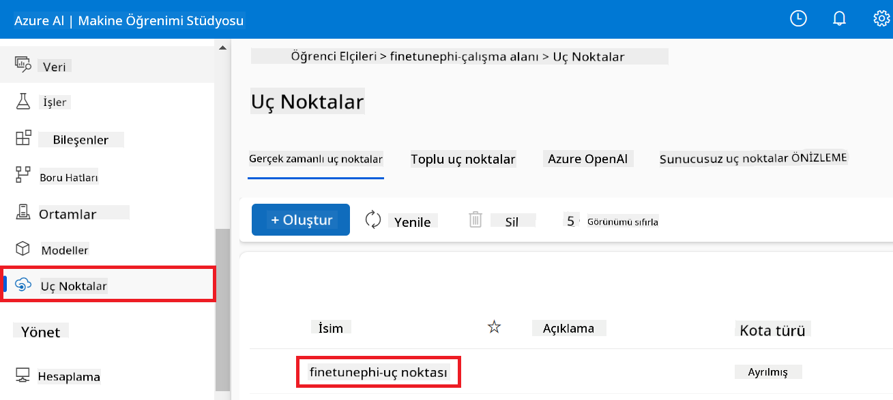
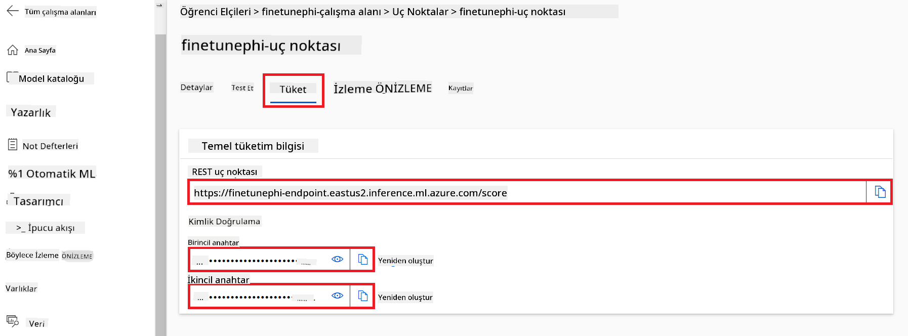

<!--
CO_OP_TRANSLATOR_METADATA:
{
  "original_hash": "7ca2c30fdb802664070e9cfbf92e24fe",
  "translation_date": "2026-01-05T03:38:21+00:00",
  "source_file": "md/02.Application/01.TextAndChat/Phi3/E2E_Phi-3-FineTuning_PromptFlow_Integration.md",
  "language_code": "tr"
}
-->
# Özel Phi-3 modellerini Prompt flow ile İnce Ayar Yapma ve Entegre Etme

Bu uçtan uca (E2E) örnek, Microsoft Tech Community'deki "[Phi-3 Özel Modellerini Prompt Flow ile İnce Ayar Yapma ve Entegre Etme: Adım Adım Kılavuz](https://techcommunity.microsoft.com/t5/educator-developer-blog/fine-tune-and-integrate-custom-phi-3-models-with-prompt-flow/ba-p/4178612?WT.mc_id=aiml-137032-kinfeylo)" rehberine dayanmaktadır. Bu rehber, Phi-3 özel modellerinin ince ayar yapılması, dağıtılması ve Prompt flow ile entegrasyon süreçlerini tanıtır.

## Genel Bakış

Bu E2E örneğinde, Phi-3 modelini nasıl ince ayar yapacağınızı ve Prompt flow ile nasıl entegre edeceğinizi öğreneceksiniz. Azure Machine Learning ve Prompt flow'dan yararlanarak özel Yapay Zeka modellerini dağıtmak ve kullanmak için bir iş akışı oluşturacaksınız. Bu E2E örneği üç senaryoya ayrılmıştır:

**Senaryo 1: Azure kaynaklarını kurma ve ince ayara hazırlık**

**Senaryo 2: Phi-3 modelini ince ayar yapma ve Azure Machine Learning Studio'da dağıtma**

**Senaryo 3: Prompt flow ile entegrasyon ve özel modelinizle sohbet etme**

İşte bu E2E örneğinin genel bir görünümü.


### İçindekiler

1. **[Senaryo 1: Azure kaynaklarını kurma ve ince ayara hazırlık](../../../../../../md/02.Application/01.TextAndChat/Phi3)**
    - [Bir Azure Machine Learning Çalışma Alanı Oluşturma](../../../../../../md/02.Application/01.TextAndChat/Phi3)
    - [Azure Aboneliğinde GPU kota talep etme](../../../../../../md/02.Application/01.TextAndChat/Phi3)
    - [Rol ataması ekleme](../../../../../../md/02.Application/01.TextAndChat/Phi3)
    - [Projeyi kurma](../../../../../../md/02.Application/01.TextAndChat/Phi3)
    - [İnce ayar için veri setini hazırlama](../../../../../../md/02.Application/01.TextAndChat/Phi3)

1. **[Senaryo 2: Phi-3 modelini ince ayar yapma ve Azure Machine Learning Studio'da dağıtma](../../../../../../md/02.Application/01.TextAndChat/Phi3)**
    - [Azure CLI'yi kurma](../../../../../../md/02.Application/01.TextAndChat/Phi3)
    - [Phi-3 modelini ince ayar yapma](../../../../../../md/02.Application/01.TextAndChat/Phi3)
    - [İnce ayarlı modeli dağıtma](../../../../../../md/02.Application/01.TextAndChat/Phi3)

1. **[Senaryo 3: Prompt flow ile entegrasyon ve özel modelinizle sohbet etme](../../../../../../md/02.Application/01.TextAndChat/Phi3)**
    - [Özel Phi-3 modelini Prompt flow ile entegre etme](../../../../../../md/02.Application/01.TextAndChat/Phi3)
    - [Özel modelinizle sohbet etme](../../../../../../md/02.Application/01.TextAndChat/Phi3)

## Senaryo 1: Azure kaynaklarını kurma ve ince ayara hazırlık

### Bir Azure Machine Learning Çalışma Alanı Oluşturma

1. Portal sayfasının üst kısmındaki **arama çubuğuna** *azure machine learning* yazın ve görüntülenen seçeneklerden **Azure Machine Learning** öğesini seçin.

    

1. Gezinti menüsünden **+ Create**'i seçin.

1. Gezinti menüsünden **New workspace**'i seçin.

    

1. Aşağıdaki görevleri gerçekleştirin:

    - Azure **Aboneliğinizi** seçin.
    - Kullanılacak **Kaynak grubunu** seçin (gerekirse yenisini oluşturun).
    - **Çalışma Alanı Adı** girin. Benzersiz bir değer olmalıdır.
    - Kullanmak istediğiniz **Bölgeyi** seçin.
    - Kullanılacak **Depolama hesabını** seçin (gerekirse yenisini oluşturun).
    - Kullanılacak **Key vault**'u seçin (gerekirse yenisini oluşturun).
    - Kullanılacak **Application Insights** öğesini seçin (gerekirse yenisini oluşturun).
    - Kullanılacak **Container registry**'i seçin (gerekirse yenisini oluşturun).

    

1. **Review + Create**'i seçin.

1. **Create**'i seçin.

### Azure Aboneliğinde GPU kota talep etme

Bu E2E örneğinde ince ayar için kota talebi gerektiren *Standard_NC24ads_A100_v4 GPU* kullanılacak, dağıtım için ise kota talebi gerektirmeyen *Standard_E4s_v3* CPU kullanılacaktır.

> [!NOTE]
>
> Sadece Pay-As-You-Go abonelikleri (standart abonelik türü) GPU tahsisi için uygundur; avantaj abonelikleri şu an desteklenmemektedir.
>
> Visual Studio Enterprise Subscription gibi avantaj abonelikleri kullananlar veya ince ayar ve dağıtım sürecini hızlıca test etmek isteyenler için bu öğreticide CPU kullanarak minimal bir veri setiyle ince ayar yapmaya yönelik de yönlendirme bulunmaktadır. Ancak, ince ayar sonuçlarının daha büyük veri setleriyle ve GPU kullanıldığında önemli ölçüde daha iyi olduğunu belirtmek önemlidir.

1. [Azure ML Studio](https://ml.azure.com/home?wt.mc_id=studentamb_279723) adresini ziyaret edin.

1. *Standard NCADSA100v4 Family* kotasını talep etmek için aşağıdaki görevleri gerçekleştirin:

    - Sol taraftaki sekmeden **Quota**'yı seçin.
    - Kullanılacak **Virtual machine family**'yi seçin. Örneğin, *Standard NCADSA100v4 Family Cluster Dedicated vCPUs*'u seçin; bu seçenek *Standard_NC24ads_A100_v4* GPU'yu içerir.
    - Gezinti menüsünden **Request quota**'yı seçin.

        

    - Request quota sayfasında kullanmak istediğiniz **New cores limit** değerini girin. Örneğin, 24.
    - Request quota sayfasında GPU kotası talep etmek için **Submit**'i seçin.

> [!NOTE]
> Kendi ihtiyaçlarınıza uygun GPU veya CPU'yu seçmek için [Sizes for Virtual Machines in Azure](https://learn.microsoft.com/azure/virtual-machines/sizes/overview?tabs=breakdownseries%2Cgeneralsizelist%2Ccomputesizelist%2Cmemorysizelist%2Cstoragesizelist%2Cgpusizelist%2Cfpgasizelist%2Chpcsizelist) belgesine başvurabilirsiniz.

### Rol ataması ekleme

Modellerinizi ince ayar yapmak ve dağıtmak için önce bir Kullanıcı Atanmış Yönetilen Kimlik (UAI) oluşturmanız ve buna uygun izinleri atamanız gerekir. Bu UAI dağıtım sırasında kimlik doğrulama için kullanılacaktır

#### Kullanıcı Atanmış Yönetilen Kimlik (UAI) Oluşturma

1. Portal sayfasının üst kısmındaki **arama çubuğuna** *managed identities* yazın ve görüntülenen seçeneklerden **Managed Identities**'i seçin.

    

1. **+ Create**'i seçin.

    

1. Aşağıdaki görevleri gerçekleştirin:

    - Azure **Aboneliğinizi** seçin.
    - Kullanılacak **Kaynak grubunu** seçin (gerekirse yenisini oluşturun).
    - Kullanmak istediğiniz **Bölgeyi** seçin.
    - **Ad** girin. Benzersiz bir değer olmalıdır.

1. **Review + create**'i seçin.

1. **+ Create**'i seçin.

#### Yönetilen Kimliğe Contributor rolü atama

1. Oluşturduğunuz Yönetilen Kimlik kaynağına gidin.

1. Sol taraftaki sekmeden **Azure rol atamalarını** seçin.

1. Gezinti menüsünden **+Rol ataması ekle**'yi seçin.

1. Add role assignment sayfasında aşağıdaki görevleri gerçekleştirin:
    - **Kapsam**'ı **Kaynak grubu** olarak seçin.
    - Azure **Aboneliğinizi** seçin.
    - Kullanılacak **Kaynak grubunu** seçin.
    - **Role**'ü **Contributor** olarak seçin.

    

1. **Kaydet**'i seçin.

#### Yönetilen Kimliğe Storage Blob Data Reader rolü atama

1. Portal sayfasının üst kısmındaki **arama çubuğuna** *storage accounts* yazın ve görüntülenen seçeneklerden **Storage accounts**'ı seçin.

    

1. Oluşturduğunuz Azure Machine Learning çalışma alanıyla ilişkili depolama hesabını seçin. Örneğin, *finetunephistorage*.

1. Add role assignment sayfasına gitmek için aşağıdaki görevleri gerçekleştirin:

    - Oluşturduğunuz Azure Storage hesabına gidin.
    - Sol taraftaki sekmeden **Access Control (IAM)**'ı seçin.
    - Gezinti menüsünden **+ Add**'i seçin.
    - Gezinti menüsünden **Add role assignment**'ı seçin.

    

1. Add role assignment sayfasında aşağıdaki görevleri gerçekleştirin:

    - Role sayfasında **arama çubuğuna** *Storage Blob Data Reader* yazın ve görüntülenen seçeneklerden **Storage Blob Data Reader**'ı seçin.
    - Role sayfasında **Next**'i seçin.
    - Members sayfasında **Assign access to** olarak **Managed identity**'yi seçin.
    - Members sayfasında **+ Select members**'i seçin.
    - Select managed identities sayfasında Azure **Aboneliğinizi** seçin.
    - Select managed identities sayfasında **Manage Identity** seçeneğini seçin.
    - Select managed identities sayfasında oluşturduğunuz Manage Identity'yi seçin. Örneğin, *finetunephi-managedidentity*.
    - Select managed identities sayfasında **Select**'i seçin.

    

1. **Review + assign**'i seçin.

#### Yönetilen Kimliğe AcrPull rolü atama

1. Portal sayfasının üst kısmındaki **arama çubuğuna** *container registries* yazın ve görüntülenen seçeneklerden **Container registries**'i seçin.

    

1. Azure Machine Learning çalışma alanıyla ilişkili container registry'yi seçin. Örneğin, *finetunephicontainerregistries*

1. Add role assignment sayfasına gitmek için aşağıdaki görevleri gerçekleştirin:

    - Sol taraftaki sekmeden **Access Control (IAM)**'ı seçin.
    - Gezinti menüsünden **+ Add**'i seçin.
    - Gezinti menüsünden **Add role assignment**'ı seçin.

1. Add role assignment sayfasında aşağıdaki görevleri gerçekleştirin:

    - Role sayfasında **arama çubuğuna** *AcrPull* yazın ve görüntülenen seçeneklerden **AcrPull**'ü seçin.
    - Role sayfasında **Next**'i seçin.
    - Members sayfasında **Assign access to** olarak **Managed identity**'yi seçin.
    - Members sayfasında **+ Select members**'i seçin.
    - Select managed identities sayfasında Azure **Aboneliğinizi** seçin.
    - Select managed identities sayfasında **Manage Identity** seçeneğini seçin.
    - Select managed identities sayfasında oluşturduğunuz Manage Identity'yi seçin. Örneğin, *finetunephi-managedidentity*.
    - Select managed identities sayfasında **Select**'i seçin.
    - **Review + assign**'i seçin.

### Projeyi kurma

Şimdi, içinde çalışacağınız bir klasör oluşturacak ve kullanıcılarla etkileşimde bulunan ve yanıtlarını bilgilendirmek için Azure Cosmos DB'de saklanan sohbet geçmişini kullanan bir program geliştirmek için bir sanal ortam kuracaksınız.

#### Çalışmak için bir klasör oluşturma

1. Bir terminal penceresi açın ve varsayılan yol içinde *finetune-phi* adlı bir klasör oluşturmak için aşağıdaki komutu yazın.

    ```console
    mkdir finetune-phi
    ```

1. Oluşturduğunuz *finetune-phi* klasörüne gitmek için terminalinize aşağıdaki komutu yazın.

    ```console
    cd finetune-phi
    ```

#### Sanal ortam oluşturma

1. *.venv* adlı bir sanal ortam oluşturmak için terminalinize aşağıdaki komutu yazın.

    ```console
    python -m venv .venv
    ```

1. Sanal ortamı etkinleştirmek için terminalinize aşağıdaki komutu yazın.

    ```console
    .venv\Scripts\activate.bat
    ```

> [!NOTE]
>
> Çalıştıysa, komut isteminin önünde *(.venv)* görmelisiniz.

#### Gerekli paketleri yükleme

1. Gerekli paketleri yüklemek için terminalinize aşağıdaki komutları yazın.

    ```console
    pip install datasets==2.19.1
    pip install transformers==4.41.1
    pip install azure-ai-ml==1.16.0
    pip install torch==2.3.1
    pip install trl==0.9.4
    pip install promptflow==1.12.0
    ```

#### Proje dosyalarını oluşturma
Bu egzersizde, projemiz için gerekli dosyaları oluşturacaksınız. Bu dosyalar, veri kümesini indirmek, Azure Machine Learning ortamını kurmak, Phi-3 modelini ince ayar yapmak ve ince ayarlı modeli dağıtmak için betikleri içerir. Ayrıca ince ayar ortamını kurmak için bir *conda.yml* dosyası oluşturacaksınız.

Bu egzersizde şunları yapacaksınız:

- Bir veri kümesini indirmek için *download_dataset.py* dosyası oluşturun.
- Azure Machine Learning ortamını kurmak için *setup_ml.py* dosyası oluşturun.
- Veri kümesini kullanarak Phi-3 modelini ince ayar yapmak için *finetuning_dir* klasöründe *fine_tune.py* dosyası oluşturun.
- İnce ayar ortamını kurmak için bir *conda.yml* dosyası oluşturun.
- İnce ayarlı modeli dağıtmak için *deploy_model.py* dosyası oluşturun.
- İnce ayarlı modeli Prompt Flow ile entegre etmek ve modeli çalıştırmak için *integrate_with_promptflow.py* dosyası oluşturun.
- Prompt Flow için iş akışı yapısını ayarlamak üzere flow.dag.yml dosyası oluşturun.
- Azure bilgilerinizi girmek için *config.py* dosyası oluşturun.

> [!NOTE]
>
> Tam klasör yapısı:
>
> ```text
> └── YourUserName
> .    └── finetune-phi
> .        ├── finetuning_dir
> .        │      └── fine_tune.py
> .        ├── conda.yml
> .        ├── config.py
> .        ├── deploy_model.py
> .        ├── download_dataset.py
> .        ├── flow.dag.yml
> .        ├── integrate_with_promptflow.py
> .        └── setup_ml.py
> ```

1. Open **Visual Studio Code**.

1. Select **File** from the menu bar.

1. Select **Open Folder**.

1. Select the *finetune-phi* folder that you created, which is located at *C:\Users\yourUserName\finetune-phi*.

    

1. In the left pane of Visual Studio Code, right-click and select **New File** to create a new file named *download_dataset.py*.

1. In the left pane of Visual Studio Code, right-click and select **New File** to create a new file named *setup_ml.py*.

1. In the left pane of Visual Studio Code, right-click and select **New File** to create a new file named *deploy_model.py*.

    

1. In the left pane of Visual Studio Code, right-click and select **New Folder** to create a new forder named *finetuning_dir*.

1. In the *finetuning_dir* folder, create a new file named *fine_tune.py*.

#### Create and Configure *conda.yml* file

1. In the left pane of Visual Studio Code, right-click and select **New File** to create a new file named *conda.yml*.

1. Add the following code to the *conda.yml* file to set up the fine-tuning environment for the Phi-3 model.

    ```yml
    name: phi-3-training-env
    channels:
      - defaults
      - conda-forge
    dependencies:
      - python=3.10
      - pip
      - numpy<2.0
      - pip:
          - torch==2.4.0
          - torchvision==0.19.0
          - trl==0.8.6
          - transformers==4.41
          - datasets==2.21.0
          - azureml-core==1.57.0
          - azure-storage-blob==12.19.0
          - azure-ai-ml==1.16
          - azure-identity==1.17.1
          - accelerate==0.33.0
          - mlflow==2.15.1
          - azureml-mlflow==1.57.0
    ```

#### Create and Configure *config.py* file

1. In the left pane of Visual Studio Code, right-click and select **New File** to create a new file named *config.py*.

1. Add the following code to the *config.py* file to include your Azure information.

    ```python
    # Azure ayarları
    AZURE_SUBSCRIPTION_ID = "your_subscription_id"
    AZURE_RESOURCE_GROUP_NAME = "your_resource_group_name" # "TestGrubu"

    # Azure Makine Öğrenimi ayarları
    AZURE_ML_WORKSPACE_NAME = "your_workspace_name" # "finetunephi-çalışma-alanı"

    # Azure Yönetilen Kimlik ayarları
    AZURE_MANAGED_IDENTITY_CLIENT_ID = "your_azure_managed_identity_client_id"
    AZURE_MANAGED_IDENTITY_NAME = "your_azure_managed_identity_name" # "finetunephi-yönetilen-kimlik"
    AZURE_MANAGED_IDENTITY_RESOURCE_ID = f"/subscriptions/{AZURE_SUBSCRIPTION_ID}/resourceGroups/{AZURE_RESOURCE_GROUP_NAME}/providers/Microsoft.ManagedIdentity/userAssignedIdentities/{AZURE_MANAGED_IDENTITY_NAME}"

    # Veri kümesi dosya yolları
    TRAIN_DATA_PATH = "data/train_data.jsonl"
    TEST_DATA_PATH = "data/test_data.jsonl"

    # İnce ayarlanmış model ayarları
    AZURE_MODEL_NAME = "your_fine_tuned_model_name" # "inceayarlanmış-phi-model"
    AZURE_ENDPOINT_NAME = "your_fine_tuned_model_endpoint_name" # "inceayarlanmış-phi-uç-noktası"
    AZURE_DEPLOYMENT_NAME = "your_fine_tuned_model_deployment_name" # "inceayarlanmış-phi-dağıtım"

    AZURE_ML_API_KEY = "your_fine_tuned_model_api_key"
    AZURE_ML_ENDPOINT = "your_fine_tuned_model_endpoint_uri" # "https://{your-endpoint-name}.{your-region}.inference.ml.azure.com/score"
    ```

#### Add Azure environment variables

1. Perform the following tasks to add the Azure Subscription ID:

    - Type *subscriptions* in the **search bar** at the top of the portal page and select **Subscriptions** from the options that appear.
    - Select the Azure Subscription you are currently using.
    - Copy and paste your Subscription ID into the *config.py* file.

    

1. Perform the following tasks to add the Azure Workspace Name:

    - Navigate to the Azure Machine Learning resource that you created.
    - Copy and paste your account name into the *config.py* file.

    

1. Perform the following tasks to add the Azure Resource Group Name:

    - Navigate to the Azure Machine Learning resource that you created.
    - Copy and paste your Azure Resource Group Name into the *config.py* file.

    

2. Perform the following tasks to add the Azure Managed Identity name

    - Navigate to the Managed Identities resource that you created.
    - Copy and paste your Azure Managed Identity name into the *config.py* file.

    

### Prepare dataset for fine-tuning

In this exercise, you will run the *download_dataset.py* file to download the *ULTRACHAT_200k* datasets to your local environment. You will then use this datasets to fine-tune the Phi-3 model in Azure Machine Learning.

#### Download your dataset using *download_dataset.py*

1. Open the *download_dataset.py* file in Visual Studio Code.

1. Add the following code into *download_dataset.py*.

    ```python
    import json
    import os
    from datasets import load_dataset
    from config import (
        TRAIN_DATA_PATH,
        TEST_DATA_PATH)

    def load_and_split_dataset(dataset_name, config_name, split_ratio):
        """
        Load and split a dataset.
        """
        # Belirtilen ad, yapılandırma ve bölme oranıyla veri kümesini yükle
        dataset = load_dataset(dataset_name, config_name, split=split_ratio)
        print(f"Original dataset size: {len(dataset)}")
        
        # Veri kümesini eğitim ve test setlerine ayır (%80 eğitim, %20 test)
        split_dataset = dataset.train_test_split(test_size=0.2)
        print(f"Train dataset size: {len(split_dataset['train'])}")
        print(f"Test dataset size: {len(split_dataset['test'])}")
        
        return split_dataset

    def save_dataset_to_jsonl(dataset, filepath):
        """
        Save a dataset to a JSONL file.
        """
        # Dizin mevcut değilse oluştur
        os.makedirs(os.path.dirname(filepath), exist_ok=True)
        
        # Dosyayı yazma modunda aç
        with open(filepath, 'w', encoding='utf-8') as f:
            # Veri kümesindeki her kayıt üzerinde yinele
            for record in dataset:
                # Kaydı bir JSON nesnesi olarak serileştir ve dosyaya yaz
                json.dump(record, f)
                # Kayıtları ayırmak için yeni satır karakteri yaz
                f.write('\n')
        
        print(f"Dataset saved to {filepath}")

    def main():
        """
        Main function to load, split, and save the dataset.
        """
        # ULTRACHAT_200k veri kümesini belirli bir yapılandırma ve bölme oranıyla yükle ve böl
        dataset = load_and_split_dataset("HuggingFaceH4/ultrachat_200k", 'default', 'train_sft[:1%]')
        
        # Bölmeden eğitim ve test veri kümelerini çıkar
        train_dataset = dataset['train']
        test_dataset = dataset['test']

        # Eğitim veri kümesini bir JSONL dosyasına kaydet
        save_dataset_to_jsonl(train_dataset, TRAIN_DATA_PATH)
        
        # Test veri kümesini ayrı bir JSONL dosyasına kaydet
        save_dataset_to_jsonl(test_dataset, TEST_DATA_PATH)

    if __name__ == "__main__":
        main()

    ```

> [!TIP]
>
> **Guidance for fine-tuning with a minimal dataset using a CPU**
>
> If you want to use a CPU for fine-tuning, this approach is ideal for those with benefit subscriptions (such as Visual Studio Enterprise Subscription) or to quickly test the fine-tuning and deployment process.
>
> Replace `dataset = load_and_split_dataset("HuggingFaceH4/ultrachat_200k", 'default', 'train_sft[:1%]')` with `dataset = load_and_split_dataset("HuggingFaceH4/ultrachat_200k", 'default', 'train_sft[:10]')`
>

1. Type the following command inside your terminal to run the script and download the dataset to your local environment.

    ```console
    python download_data.py
    ```

1. Verify that the datasets were saved successfully to your local *finetune-phi/data* directory.

> [!NOTE]
>
> **Dataset size and fine-tuning time**
>
> In this E2E sample, you use only 1% of the dataset (`train_sft[:1%]`). This significantly reduces the amount of data, speeding up both the upload and fine-tuning processes. You can adjust the percentage to find the right balance between training time and model performance. Using a smaller subset of the dataset reduces the time required for fine-tuning, making the process more manageable for a E2E sample.

## Scenario 2: Fine-tune Phi-3 model and Deploy in Azure Machine Learning Studio

### Set up Azure CLI

You need to set up Azure CLI to authenticate your environment. Azure CLI allows you to manage Azure resources directly from the command line and provides the credentials necessary for Azure Machine Learning to access these resources. To get started install [Azure CLI](https://learn.microsoft.com/cli/azure/install-azure-cli)

1. Open a terminal window and type the following command to log in to your Azure account.

    ```console
    az login
    ```

1. Select your Azure account to use.

1. Select your Azure subscription to use.

    

> [!TIP]
>
> If you're having trouble signing in to Azure, try using a device code. Open a terminal window and type the following command to sign in to your Azure account:
>
> ```console
> az login --use-device-code
> ```
>

### Fine-tune the Phi-3 model

In this exercise, you will fine-tune the Phi-3 model using the provided dataset. First, you will define the fine-tuning process in the *fine_tune.py* file. Then, you will configure the Azure Machine Learning environment and initiate the fine-tuning process by running the *setup_ml.py* file. This script ensures that the fine-tuning occurs within the Azure Machine Learning environment.

By running *setup_ml.py*, you will run the fine-tuning process in the Azure Machine Learning environment.

#### Add code to the *fine_tune.py* file

1. Navigate to the *finetuning_dir* folder and Open the *fine_tune.py* file in Visual Studio Code.

1. Add the following code into *fine_tune.py*.

    ```python
    import argparse
    import sys
    import logging
    import os
    from datasets import load_dataset
    import torch
    import mlflow
    from transformers import AutoModelForCausalLM, AutoTokenizer, TrainingArguments
    from trl import SFTTrainer

    # MLflow'da INVALID_PARAMETER_VALUE hatasını önlemek için MLflow entegrasyonunu devre dışı bırakın
    os.environ["DISABLE_MLFLOW_INTEGRATION"] = "True"

    # Günlükleme kurulumu
    logging.basicConfig(
        format="%(asctime)s - %(levelname)s - %(name)s - %(message)s",
        datefmt="%Y-%m-%d %H:%M:%S",
        handlers=[logging.StreamHandler(sys.stdout)],
        level=logging.WARNING
    )
    logger = logging.getLogger(__name__)

    def initialize_model_and_tokenizer(model_name, model_kwargs):
        """
        Initialize the model and tokenizer with the given pretrained model name and arguments.
        """
        model = AutoModelForCausalLM.from_pretrained(model_name, **model_kwargs)
        tokenizer = AutoTokenizer.from_pretrained(model_name)
        tokenizer.model_max_length = 2048
        tokenizer.pad_token = tokenizer.unk_token
        tokenizer.pad_token_id = tokenizer.convert_tokens_to_ids(tokenizer.pad_token)
        tokenizer.padding_side = 'right'
        return model, tokenizer

    def apply_chat_template(example, tokenizer):
        """
        Apply a chat template to tokenize messages in the example.
        """
        messages = example["messages"]
        if messages[0]["role"] != "system":
            messages.insert(0, {"role": "system", "content": ""})
        example["text"] = tokenizer.apply_chat_template(
            messages, tokenize=False, add_generation_prompt=False
        )
        return example

    def load_and_preprocess_data(train_filepath, test_filepath, tokenizer):
        """
        Load and preprocess the dataset.
        """
        train_dataset = load_dataset('json', data_files=train_filepath, split='train')
        test_dataset = load_dataset('json', data_files=test_filepath, split='train')
        column_names = list(train_dataset.features)

        train_dataset = train_dataset.map(
            apply_chat_template,
            fn_kwargs={"tokenizer": tokenizer},
            num_proc=10,
            remove_columns=column_names,
            desc="Applying chat template to train dataset",
        )

        test_dataset = test_dataset.map(
            apply_chat_template,
            fn_kwargs={"tokenizer": tokenizer},
            num_proc=10,
            remove_columns=column_names,
            desc="Applying chat template to test dataset",
        )

        return train_dataset, test_dataset

    def train_and_evaluate_model(train_dataset, test_dataset, model, tokenizer, output_dir):
        """
        Train and evaluate the model.
        """
        training_args = TrainingArguments(
            bf16=True,
            do_eval=True,
            output_dir=output_dir,
            eval_strategy="epoch",
            learning_rate=5.0e-06,
            logging_steps=20,
            lr_scheduler_type="cosine",
            num_train_epochs=3,
            overwrite_output_dir=True,
            per_device_eval_batch_size=4,
            per_device_train_batch_size=4,
            remove_unused_columns=True,
            save_steps=500,
            seed=0,
            gradient_checkpointing=True,
            gradient_accumulation_steps=1,
            warmup_ratio=0.2,
        )

        trainer = SFTTrainer(
            model=model,
            args=training_args,
            train_dataset=train_dataset,
            eval_dataset=test_dataset,
            max_seq_length=2048,
            dataset_text_field="text",
            tokenizer=tokenizer,
            packing=True
        )

        train_result = trainer.train()
        trainer.log_metrics("train", train_result.metrics)

        mlflow.transformers.log_model(
            transformers_model={"model": trainer.model, "tokenizer": tokenizer},
            artifact_path=output_dir,
        )

        tokenizer.padding_side = 'left'
        eval_metrics = trainer.evaluate()
        eval_metrics["eval_samples"] = len(test_dataset)
        trainer.log_metrics("eval", eval_metrics)

    def main(train_file, eval_file, model_output_dir):
        """
        Main function to fine-tune the model.
        """
        model_kwargs = {
            "use_cache": False,
            "trust_remote_code": True,
            "torch_dtype": torch.bfloat16,
            "device_map": None,
            "attn_implementation": "eager"
        }

        # önceden_eğitilmiş_model_adı = "microsoft/Phi-3-mini-4k-instruct"
        pretrained_model_name = "microsoft/Phi-3.5-mini-instruct"

        with mlflow.start_run():
            model, tokenizer = initialize_model_and_tokenizer(pretrained_model_name, model_kwargs)
            train_dataset, test_dataset = load_and_preprocess_data(train_file, eval_file, tokenizer)
            train_and_evaluate_model(train_dataset, test_dataset, model, tokenizer, model_output_dir)

    if __name__ == "__main__":
        parser = argparse.ArgumentParser()
        parser.add_argument("--train-file", type=str, required=True, help="Path to the training data")
        parser.add_argument("--eval-file", type=str, required=True, help="Path to the evaluation data")
        parser.add_argument("--model_output_dir", type=str, required=True, help="Directory to save the fine-tuned model")
        args = parser.parse_args()
        main(args.train_file, args.eval_file, args.model_output_dir)

    ```

1. Save and close the *fine_tune.py* file.

> [!TIP]
> **You can fine-tune Phi-3.5 model**
>
> In *fine_tune.py* file, you can change the `pretrained_model_name` from `"microsoft/Phi-3-mini-4k-instruct"` to any model you want to fine-tune. For example, if you change it to `"microsoft/Phi-3.5-mini-instruct"`, you'll be using the Phi-3.5-mini-instruct model for fine-tuning. To find and use the model name you prefer, visit [Hugging Face](https://huggingface.co/), search for the model you're interested in, and then copy and paste its name into the `pretrained_model_name` field in your script.
>
> <image type="content" src="../../../../imgs/02/FineTuning-PromptFlow/finetunephi3.5.png" alt-text="Phi-3.5'i ince ayarlama.">
>

#### Add code to the *setup_ml.py* file

1. Open the *setup_ml.py* file in Visual Studio Code.

1. Add the following code into *setup_ml.py*.

    ```python
    import logging
    from azure.ai.ml import MLClient, command, Input
    from azure.ai.ml.entities import Environment, AmlCompute
    from azure.identity import AzureCliCredential
    from config import (
        AZURE_SUBSCRIPTION_ID,
        AZURE_RESOURCE_GROUP_NAME,
        AZURE_ML_WORKSPACE_NAME,
        TRAIN_DATA_PATH,
        TEST_DATA_PATH
    )

    # Sabitler

    # Eğitim için CPU örneği kullanmak üzere aşağıdaki satırların yorumunu kaldırın
    # COMPUTE_INSTANCE_TYPE = "Standard_E16s_v3" # cpu
    # COMPUTE_NAME = "cpu-e16s-v3"
    # DOCKER_IMAGE_NAME = "mcr.microsoft.com/azureml/openmpi4.1.0-ubuntu20.04:latest"

    # Eğitim için GPU örneği kullanmak üzere aşağıdaki satırların yorumunu kaldırın
    COMPUTE_INSTANCE_TYPE = "Standard_NC24ads_A100_v4"
    COMPUTE_NAME = "gpu-nc24s-a100-v4"
    DOCKER_IMAGE_NAME = "mcr.microsoft.com/azureml/curated/acft-hf-nlp-gpu:59"

    CONDA_FILE = "conda.yml"
    LOCATION = "eastus2" # Hesaplama kümenizin konumuyla değiştirin
    FINETUNING_DIR = "./finetuning_dir" # İnce ayar betiğinin yolu
    TRAINING_ENV_NAME = "phi-3-training-environment" # Eğitim ortamının adı
    MODEL_OUTPUT_DIR = "./model_output" # Azure ML'deki model çıktı dizininin yolu

    # Süreci izlemek için günlükleme yapılandırması
    logger = logging.getLogger(__name__)
    logging.basicConfig(
        format="%(asctime)s - %(levelname)s - %(name)s - %(message)s",
        datefmt="%Y-%m-%d %H:%M:%S",
        level=logging.WARNING
    )

    def get_ml_client():
        """
        Initialize the ML Client using Azure CLI credentials.
        """
        credential = AzureCliCredential()
        return MLClient(credential, AZURE_SUBSCRIPTION_ID, AZURE_RESOURCE_GROUP_NAME, AZURE_ML_WORKSPACE_NAME)

    def create_or_get_environment(ml_client):
        """
        Create or update the training environment in Azure ML.
        """
        env = Environment(
            image=DOCKER_IMAGE_NAME,  # Ortam için Docker görüntüsü
            conda_file=CONDA_FILE,  # Conda ortam dosyası
            name=TRAINING_ENV_NAME,  # Ortamın adı
        )
        return ml_client.environments.create_or_update(env)

    def create_or_get_compute_cluster(ml_client, compute_name, COMPUTE_INSTANCE_TYPE, location):
        """
        Create or update the compute cluster in Azure ML.
        """
        try:
            compute_cluster = ml_client.compute.get(compute_name)
            logger.info(f"Compute cluster '{compute_name}' already exists. Reusing it for the current run.")
        except Exception:
            logger.info(f"Compute cluster '{compute_name}' does not exist. Creating a new one with size {COMPUTE_INSTANCE_TYPE}.")
            compute_cluster = AmlCompute(
                name=compute_name,
                size=COMPUTE_INSTANCE_TYPE,
                location=location,
                tier="Dedicated",  # Hesaplama kümesinin katmanı
                min_instances=0,  # Minimum örnek sayısı
                max_instances=1  # Maksimum örnek sayısı
            )
            ml_client.compute.begin_create_or_update(compute_cluster).wait()  # Kümenin oluşturulmasını bekleyin
        return compute_cluster

    def create_fine_tuning_job(env, compute_name):
        """
        Set up the fine-tuning job in Azure ML.
        """
        return command(
            code=FINETUNING_DIR,  # fine_tune.py dosyasının yolu
            command=(
                "python fine_tune.py "
                "--train-file ${{inputs.train_file}} "
                "--eval-file ${{inputs.eval_file}} "
                "--model_output_dir ${{inputs.model_output}}"
            ),
            environment=env,  # Eğitim ortamı
            compute=compute_name,  # Kullanılacak hesaplama kümesi
            inputs={
                "train_file": Input(type="uri_file", path=TRAIN_DATA_PATH),  # Eğitim veri dosyasının yolu
                "eval_file": Input(type="uri_file", path=TEST_DATA_PATH),  # Değerlendirme veri dosyasının yolu
                "model_output": MODEL_OUTPUT_DIR
            }
        )

    def main():
        """
        Main function to set up and run the fine-tuning job in Azure ML.
        """
        # ML İstemcisini başlatın
        ml_client = get_ml_client()

        # Ortam oluşturun
        env = create_or_get_environment(ml_client)
        
        # Mevcut hesaplama kümesini oluşturun veya alın
        create_or_get_compute_cluster(ml_client, COMPUTE_NAME, COMPUTE_INSTANCE_TYPE, LOCATION)

        # İnce ayar işini oluşturun ve gönderin
        job = create_fine_tuning_job(env, COMPUTE_NAME)
        returned_job = ml_client.jobs.create_or_update(job)  # İşi gönderin
        ml_client.jobs.stream(returned_job.name)  # İş günlüklerini akış olarak izleyin
        
        # İş adını yakalayın
        job_name = returned_job.name
        print(f"Job name: {job_name}")

    if __name__ == "__main__":
        main()

    ```

1. Replace `COMPUTE_INSTANCE_TYPE`, `COMPUTE_NAME`, and `LOCATION` with your specific details.

    ```python
   # Eğitim için bir GPU örneği kullanmak üzere aşağıdaki satırların yorumunu kaldırın
    COMPUTE_INSTANCE_TYPE = "Standard_NC24ads_A100_v4"
    COMPUTE_NAME = "gpu-nc24s-a100-v4"
    ...
    LOCATION = "eastus2" # Hesaplama kümenizin konumuyla değiştirin
    ```

> [!TIP]
>
> **Guidance for fine-tuning with a minimal dataset using a CPU**
>
> If you want to use a CPU for fine-tuning, this approach is ideal for those with benefit subscriptions (such as Visual Studio Enterprise Subscription) or to quickly test the fine-tuning and deployment process.
>
> 1. Open the *setup_ml* file.
> 1. Replace `COMPUTE_INSTANCE_TYPE`, `COMPUTE_NAME`, and `DOCKER_IMAGE_NAME` with the following. If you do not have access to *Standard_E16s_v3*, you can use an equivalent CPU instance or request a new quota.
> 1. Replace `LOCATION` with your specific details.
>
>    ```python
>    # Uncomment the following lines to use a CPU instance for training
>    COMPUTE_INSTANCE_TYPE = "Standard_E16s_v3" # cpu
>    COMPUTE_NAME = "cpu-e16s-v3"
>    DOCKER_IMAGE_NAME = "mcr.microsoft.com/azureml/openmpi4.1.0-ubuntu20.04:latest"
>    LOCATION = "eastus2" # Replace with the location of your compute cluster
>    ```
>

1. Type the following command to run the *setup_ml.py* script and start the fine-tuning process in Azure Machine Learning.

    ```python
    python setup_ml.py
    ```

1. In this exercise, you successfully fine-tuned the Phi-3 model using Azure Machine Learning. By running the *setup_ml.py* script, you have set up the Azure Machine Learning environment and initiated the fine-tuning process defined in *fine_tune.py* file. Please note that the fine-tuning process can take a considerable amount of time. After running the `python setup_ml.py` command, you need to wait for the process to complete. You can monitor the status of the fine-tuning job by following the link provided in the terminal to the Azure Machine Learning portal.

    

### Deploy the fine-tuned model

To integrate the fine-tuned Phi-3 model with Prompt Flow, you need to deploy the model to make it accessible for real-time inference. This process involves registering the model, creating an online endpoint, and deploying the model.

#### Set the model name, endpoint name, and deployment name for deployment

1. Open *config.py* file.

1. Replace `AZURE_MODEL_NAME = "your_fine_tuned_model_name"` with the desired name for your model.

1. Replace `AZURE_ENDPOINT_NAME = "your_fine_tuned_model_endpoint_name"` with the desired name for your endpoint.

1. Replace `AZURE_DEPLOYMENT_NAME = "your_fine_tuned_model_deployment_name"` with the desired name for your deployment.

#### Add code to the *deploy_model.py* file

Running the *deploy_model.py* file automates the entire deployment process. It registers the model, creates an endpoint, and executes the deployment based on the settings specified in the config.py file, which includes the model name, endpoint name, and deployment name.

1. Open the *deploy_model.py* file in Visual Studio Code.

1. Add the following code into *deploy_model.py*.

    ```python
    import logging
    from azure.identity import AzureCliCredential
    from azure.ai.ml import MLClient
    from azure.ai.ml.entities import Model, ProbeSettings, ManagedOnlineEndpoint, ManagedOnlineDeployment, IdentityConfiguration, ManagedIdentityConfiguration, OnlineRequestSettings
    from azure.ai.ml.constants import AssetTypes

    # Yapılandırma içe aktarımları
    from config import (
        AZURE_SUBSCRIPTION_ID,
        AZURE_RESOURCE_GROUP_NAME,
        AZURE_ML_WORKSPACE_NAME,
        AZURE_MANAGED_IDENTITY_RESOURCE_ID,
        AZURE_MANAGED_IDENTITY_CLIENT_ID,
        AZURE_MODEL_NAME,
        AZURE_ENDPOINT_NAME,
        AZURE_DEPLOYMENT_NAME
    )

    # Sabitler
    JOB_NAME = "your-job-name"
    COMPUTE_INSTANCE_TYPE = "Standard_E4s_v3"

    deployment_env_vars = {
        "SUBSCRIPTION_ID": AZURE_SUBSCRIPTION_ID,
        "RESOURCE_GROUP_NAME": AZURE_RESOURCE_GROUP_NAME,
        "UAI_CLIENT_ID": AZURE_MANAGED_IDENTITY_CLIENT_ID,
    }

    # Loglama kurulumu
    logging.basicConfig(
        format="%(asctime)s - %(levelname)s - %(name)s - %(message)s",
        datefmt="%Y-%m-%d %H:%M:%S",
        level=logging.DEBUG
    )
    logger = logging.getLogger(__name__)

    def get_ml_client():
        """Initialize and return the ML Client."""
        credential = AzureCliCredential()
        return MLClient(credential, AZURE_SUBSCRIPTION_ID, AZURE_RESOURCE_GROUP_NAME, AZURE_ML_WORKSPACE_NAME)

    def register_model(ml_client, model_name, job_name):
        """Register a new model."""
        model_path = f"azureml://jobs/{job_name}/outputs/artifacts/paths/model_output"
        logger.info(f"Registering model {model_name} from job {job_name} at path {model_path}.")
        run_model = Model(
            path=model_path,
            name=model_name,
            description="Model created from run.",
            type=AssetTypes.MLFLOW_MODEL,
        )
        model = ml_client.models.create_or_update(run_model)
        logger.info(f"Registered model ID: {model.id}")
        return model

    def delete_existing_endpoint(ml_client, endpoint_name):
        """Delete existing endpoint if it exists."""
        try:
            endpoint_result = ml_client.online_endpoints.get(name=endpoint_name)
            logger.info(f"Deleting existing endpoint {endpoint_name}.")
            ml_client.online_endpoints.begin_delete(name=endpoint_name).result()
            logger.info(f"Deleted existing endpoint {endpoint_name}.")
        except Exception as e:
            logger.info(f"No existing endpoint {endpoint_name} found to delete: {e}")

    def create_or_update_endpoint(ml_client, endpoint_name, description=""):
        """Create or update an endpoint."""
        delete_existing_endpoint(ml_client, endpoint_name)
        logger.info(f"Creating new endpoint {endpoint_name}.")
        endpoint = ManagedOnlineEndpoint(
            name=endpoint_name,
            description=description,
            identity=IdentityConfiguration(
                type="user_assigned",
                user_assigned_identities=[ManagedIdentityConfiguration(resource_id=AZURE_MANAGED_IDENTITY_RESOURCE_ID)]
            )
        )
        endpoint_result = ml_client.online_endpoints.begin_create_or_update(endpoint).result()
        logger.info(f"Created new endpoint {endpoint_name}.")
        return endpoint_result

    def create_or_update_deployment(ml_client, endpoint_name, deployment_name, model):
        """Create or update a deployment."""

        logger.info(f"Creating deployment {deployment_name} for endpoint {endpoint_name}.")
        deployment = ManagedOnlineDeployment(
            name=deployment_name,
            endpoint_name=endpoint_name,
            model=model.id,
            instance_type=COMPUTE_INSTANCE_TYPE,
            instance_count=1,
            environment_variables=deployment_env_vars,
            request_settings=OnlineRequestSettings(
                max_concurrent_requests_per_instance=3,
                request_timeout_ms=180000,
                max_queue_wait_ms=120000
            ),
            liveness_probe=ProbeSettings(
                failure_threshold=30,
                success_threshold=1,
                period=100,
                initial_delay=500,
            ),
            readiness_probe=ProbeSettings(
                failure_threshold=30,
                success_threshold=1,
                period=100,
                initial_delay=500,
            ),
        )
        deployment_result = ml_client.online_deployments.begin_create_or_update(deployment).result()
        logger.info(f"Created deployment {deployment.name} for endpoint {endpoint_name}.")
        return deployment_result

    def set_traffic_to_deployment(ml_client, endpoint_name, deployment_name):
        """Set traffic to the specified deployment."""
        try:
            # Mevcut uç nokta ayrıntılarını al
            endpoint = ml_client.online_endpoints.get(name=endpoint_name)
            
            # Hata ayıklama için mevcut trafik dağılımını kaydet
            logger.info(f"Current traffic allocation: {endpoint.traffic}")
            
            # Dağıtım için trafik dağılımını ayarla
            endpoint.traffic = {deployment_name: 100}
            
            # Uç noktayı yeni trafik dağılımı ile güncelle
            endpoint_poller = ml_client.online_endpoints.begin_create_or_update(endpoint)
            updated_endpoint = endpoint_poller.result()
            
            # Hata ayıklama için güncellenen trafik dağılımını kaydet
            logger.info(f"Updated traffic allocation: {updated_endpoint.traffic}")
            logger.info(f"Set traffic to deployment {deployment_name} at endpoint {endpoint_name}.")
            return updated_endpoint
        except Exception as e:
            # İşlem sırasında oluşan hataları kaydet
            logger.error(f"Failed to set traffic to deployment: {e}")
            raise


    def main():
        ml_client = get_ml_client()

        registered_model = register_model(ml_client, AZURE_MODEL_NAME, JOB_NAME)
        logger.info(f"Registered model ID: {registered_model.id}")

        endpoint = create_or_update_endpoint(ml_client, AZURE_ENDPOINT_NAME, "Endpoint for finetuned Phi-3 model")
        logger.info(f"Endpoint {AZURE_ENDPOINT_NAME} is ready.")

        try:
            deployment = create_or_update_deployment(ml_client, AZURE_ENDPOINT_NAME, AZURE_DEPLOYMENT_NAME, registered_model)
            logger.info(f"Deployment {AZURE_DEPLOYMENT_NAME} is created for endpoint {AZURE_ENDPOINT_NAME}.")

            set_traffic_to_deployment(ml_client, AZURE_ENDPOINT_NAME, AZURE_DEPLOYMENT_NAME)
            logger.info(f"Traffic is set to deployment {AZURE_DEPLOYMENT_NAME} at endpoint {AZURE_ENDPOINT_NAME}.")
        except Exception as e:
            logger.error(f"Failed to create or update deployment: {e}")

    if __name__ == "__main__":
        main()

    ```

1. Perform the following tasks to get the `JOB_NAME`:

    - Navigate to Azure Machine Learning resource that you created.
    - Select **Studio web URL** to open the Azure Machine Learning workspace.
    - Select **Jobs** from the left side tab.
    - Select the experiment for fine-tuning. For example, *finetunephi*.
    - Select the job that you created.
    - İş adınızı `JOB_NAME = "your-job-name"` içinde *deploy_model.py* dosyasına kopyalayıp yapıştırın.

1. Replace `COMPUTE_INSTANCE_TYPE` with your specific details.

1. Aşağıdaki komutu yazarak *deploy_model.py* betiğini çalıştırın ve Azure Machine Learning'de dağıtım sürecini başlatın.

    ```python
    python deploy_model.py
    ```

> [!WARNING]
> Hesabınıza ek ücret yansımaması için, Azure Machine Learning çalışma alanında oluşturulan uç noktayı silmeyi unutmayın.
>

#### Check deployment status in Azure Machine Learning Workspace

1. Visit [Azure ML Studio](https://ml.azure.com/home?wt.mc_id=studentamb_279723).

1. Oluşturduğunuz Azure Machine Learning çalışma alanına gidin.

1. Azure Machine Learning çalışma alanını açmak için **Studio web URL** öğesini seçin.

1. Sol taraftaki sekmeden **Endpoints** öğesini seçin.

    

2. Oluşturduğunuz uç noktayı seçin.

    

3. Bu sayfada, dağıtım işlemi sırasında oluşturulan uç noktaları yönetebilirsiniz.

## Scenario 3: Integrate with Prompt flow and Chat with your custom model

### Integrate the custom Phi-3 model with Prompt flow

İnce ayarlı modelinizi başarıyla dağıttıktan sonra, modelinizi gerçek zamanlı uygulamalarda kullanmak için Prompt flow ile entegre edebilir ve özel Phi-3 modelinizle çeşitli etkileşimli görevleri gerçekleştirebilirsiniz.

#### Set api key and endpoint uri of the fine-tuned Phi-3 model

1. Oluşturduğunuz Azure Machine Learning çalışma alanına gidin.
1. Sol taraftaki sekmeden **Endpoints** öğesini seçin.
1. Oluşturduğunuz uç noktasını seçin.
1. Gezinti menüsünden **Consume** öğesini seçin.
1. **REST endpoint**'inizi *config.py* dosyasına kopyalayıp yapıştırın; `AZURE_ML_ENDPOINT = "your_fine_tuned_model_endpoint_uri"` değerini kendi **REST endpoint**'inizle değiştirin.
1. **Primary key**'inizi *config.py* dosyasına kopyalayıp yapıştırın; `AZURE_ML_API_KEY = "your_fine_tuned_model_api_key"` değerini kendi **Primary key**'inizle değiştirin.

    

#### Add code to the *flow.dag.yml* file

1. *flow.dag.yml* dosyasını Visual Studio Code'da açın.

1. Aşağıdaki kodu *flow.dag.yml* dosyasına ekleyin.

    ```yml
    inputs:
      input_data:
        type: string
        default: "Who founded Microsoft?"

    outputs:
      answer:
        type: string
        reference: ${integrate_with_promptflow.output}

    nodes:
    - name: integrate_with_promptflow
      type: python
      source:
        type: code
        path: integrate_with_promptflow.py
      inputs:
        input_data: ${inputs.input_data}
    ```

#### Add code to the *integrate_with_promptflow.py* file

1. *integrate_with_promptflow.py* dosyasını Visual Studio Code'da açın.

1. Aşağıdaki kodu *integrate_with_promptflow.py* dosyasına ekleyin.

    ```python
    import logging
    import requests
    from promptflow.core import tool
    import asyncio
    import platform
    from config import (
        AZURE_ML_ENDPOINT,
        AZURE_ML_API_KEY
    )

    # Günlükleme kurulumu
    logging.basicConfig(
        format="%(asctime)s - %(levelname)s - %(name)s - %(message)s",
        datefmt="%Y-%m-%d %H:%M:%S",
        level=logging.DEBUG
    )
    logger = logging.getLogger(__name__)

    def query_azml_endpoint(input_data: list, endpoint_url: str, api_key: str) -> str:
        """
        Send a request to the Azure ML endpoint with the given input data.
        """
        headers = {
            "Content-Type": "application/json",
            "Authorization": f"Bearer {api_key}"
        }
        data = {
            "input_data": [input_data],
            "params": {
                "temperature": 0.7,
                "max_new_tokens": 128,
                "do_sample": True,
                "return_full_text": True
            }
        }
        try:
            response = requests.post(endpoint_url, json=data, headers=headers)
            response.raise_for_status()
            result = response.json()[0]
            logger.info("Successfully received response from Azure ML Endpoint.")
            return result
        except requests.exceptions.RequestException as e:
            logger.error(f"Error querying Azure ML Endpoint: {e}")
            raise

    def setup_asyncio_policy():
        """
        Setup asyncio event loop policy for Windows.
        """
        if platform.system() == 'Windows':
            asyncio.set_event_loop_policy(asyncio.WindowsSelectorEventLoopPolicy())
            logger.info("Set Windows asyncio event loop policy.")

    @tool
    def my_python_tool(input_data: str) -> str:
        """
        Tool function to process input data and query the Azure ML endpoint.
        """
        setup_asyncio_policy()
        return query_azml_endpoint(input_data, AZURE_ML_ENDPOINT, AZURE_ML_API_KEY)

    ```

### Chat with your custom model

1. Aşağıdaki komutu yazarak *deploy_model.py* betiğini çalıştırın ve Azure Machine Learning'de dağıtım sürecini başlatın.

    ```python
    pf flow serve --source ./ --port 8080 --host localhost
    ```

1. Sonuçlara bir örnek: Artık özel Phi-3 modelinizle sohbet edebilirsiniz. İnce ayar için kullanılan verilere dayalı sorular sormanızı öneririz.

    

---

<!-- CO-OP TRANSLATOR DISCLAIMER START -->
Feragatname:
Bu belge, yapay zekâ çeviri hizmeti [Co-op Translator](https://github.com/Azure/co-op-translator) kullanılarak çevrilmiştir. Doğruluk için özen göstersek de otomatik çevirilerin hatalar veya yanlışlıklar içerebileceğini lütfen unutmayın. Orijinal belgenin kendi dilindeki nüshası yetkili kaynak olarak kabul edilmelidir. Kritik bilgiler için profesyonel insan çevirisi önerilir. Bu çevirinin kullanılmasından kaynaklanan herhangi bir yanlış anlama veya yanlış yorumlamadan sorumlu değiliz.
<!-- CO-OP TRANSLATOR DISCLAIMER END -->