<!--
CO_OP_TRANSLATOR_METADATA:
{
  "original_hash": "455be2b7b9c3390d367d528f8fab2aa0",
  "translation_date": "2025-05-09T17:30:50+00:00",
  "source_file": "md/02.Application/01.TextAndChat/Phi3/E2E_Phi-3-FineTuning_PromptFlow_Integration.md",
  "language_code": "tr"
}
-->
# Özel Phi-3 Modellerini Prompt Flow ile İnce Ayar Yapma ve Entegre Etme

Bu uçtan uca (E2E) örnek, Microsoft Tech Community'den "[Fine-Tune and Integrate Custom Phi-3 Models with Prompt Flow: Step-by-Step Guide](https://techcommunity.microsoft.com/t5/educator-developer-blog/fine-tune-and-integrate-custom-phi-3-models-with-prompt-flow/ba-p/4178612?WT.mc_id=aiml-137032-kinfeylo)" rehberine dayanmaktadır. Bu rehber, özel Phi-3 modellerinin ince ayar, dağıtım ve Prompt flow ile entegrasyon süreçlerini tanıtmaktadır.

## Genel Bakış

Bu E2E örnekte, Phi-3 modelini nasıl ince ayar yapacağınızı ve Prompt flow ile nasıl entegre edeceğinizi öğreneceksiniz. Azure Machine Learning ve Prompt flow kullanarak, özel yapay zeka modellerini dağıtmak ve kullanmak için bir iş akışı oluşturacaksınız. Bu E2E örnek üç senaryoya ayrılmıştır:

**Senaryo 1: Azure kaynaklarını kurma ve ince ayar için hazırlık**

**Senaryo 2: Phi-3 modelini ince ayar yapma ve Azure Machine Learning Studio'da dağıtma**

**Senaryo 3: Prompt flow ile entegrasyon ve özel modelinizle sohbet etme**

İşte bu E2E örneğin genel görünümü.

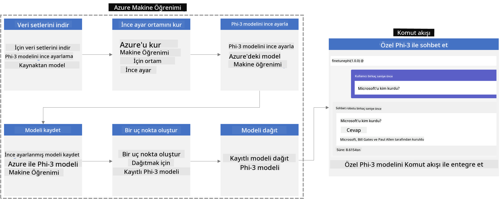

### İçindekiler

1. **[Senaryo 1: Azure kaynaklarını kurma ve ince ayar için hazırlık](../../../../../../md/02.Application/01.TextAndChat/Phi3)**
    - [Azure Machine Learning Workspace oluşturma](../../../../../../md/02.Application/01.TextAndChat/Phi3)
    - [Azure Aboneliğinde GPU kotası talep etme](../../../../../../md/02.Application/01.TextAndChat/Phi3)
    - [Rol ataması ekleme](../../../../../../md/02.Application/01.TextAndChat/Phi3)
    - [Projeyi kurma](../../../../../../md/02.Application/01.TextAndChat/Phi3)
    - [İnce ayar için veri setini hazırlama](../../../../../../md/02.Application/01.TextAndChat/Phi3)

1. **[Senaryo 2: Phi-3 modelini ince ayar yapma ve Azure Machine Learning Studio'da dağıtma](../../../../../../md/02.Application/01.TextAndChat/Phi3)**
    - [Azure CLI kurulumu](../../../../../../md/02.Application/01.TextAndChat/Phi3)
    - [Phi-3 modelini ince ayar yapma](../../../../../../md/02.Application/01.TextAndChat/Phi3)
    - [İnce ayar yapılmış modeli dağıtma](../../../../../../md/02.Application/01.TextAndChat/Phi3)

1. **[Senaryo 3: Prompt flow ile entegrasyon ve özel modelinizle sohbet etme](../../../../../../md/02.Application/01.TextAndChat/Phi3)**
    - [Özel Phi-3 modelini Prompt flow ile entegre etme](../../../../../../md/02.Application/01.TextAndChat/Phi3)
    - [Özel modelinizle sohbet etme](../../../../../../md/02.Application/01.TextAndChat/Phi3)

## Senaryo 1: Azure kaynaklarını kurma ve ince ayar için hazırlık

### Azure Machine Learning Workspace oluşturma

1. Portal sayfasının üst kısmındaki **arama çubuğuna** *azure machine learning* yazın ve çıkan seçeneklerden **Azure Machine Learning**'i seçin.

    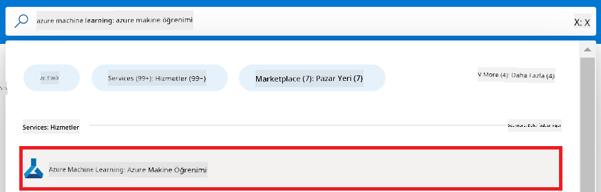

1. Navigasyon menüsünden **+ Create** seçeneğini seçin.

1. Navigasyon menüsünden **New workspace** seçeneğini seçin.

    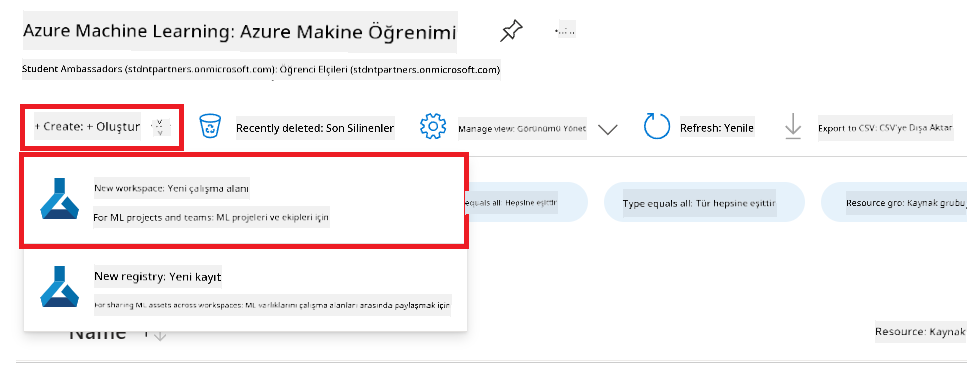

1. Aşağıdaki işlemleri gerçekleştirin:

    - Azure **Subscription**'ınızı seçin.
    - Kullanılacak **Resource group**'u seçin (gerekirse yeni oluşturun).
    - **Workspace Name** girin. Bu benzersiz bir değer olmalı.
    - Kullanmak istediğiniz **Region**'u seçin.
    - Kullanılacak **Storage account**'u seçin (gerekirse yeni oluşturun).
    - Kullanılacak **Key vault**'u seçin (gerekirse yeni oluşturun).
    - Kullanılacak **Application insights**'ı seçin (gerekirse yeni oluşturun).
    - Kullanılacak **Container registry**'yi seçin (gerekirse yeni oluşturun).

    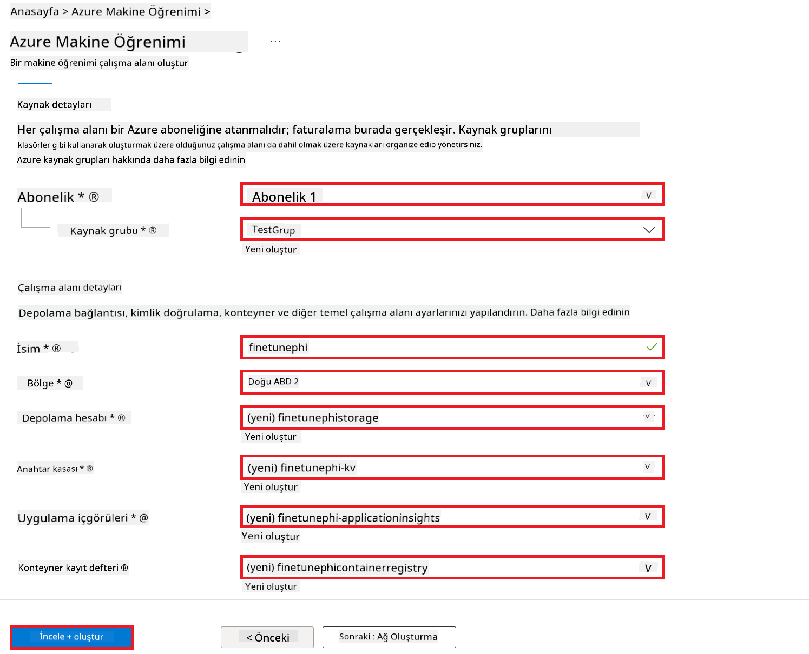

1. **Review + Create** seçeneğini seçin.

1. **Create** seçeneğini seçin.

### Azure Aboneliğinde GPU kotası talep etme

Bu E2E örnekte, ince ayar için *Standard_NC24ads_A100_v4 GPU* kullanılacak ve bu bir kota talebi gerektirir; dağıtım için ise kota talebi gerektirmeyen *Standard_E4s_v3* CPU kullanılacaktır.

> [!NOTE]
>
> Sadece Pay-As-You-Go abonelikleri (standart abonelik türü) GPU tahsisi için uygundur; avantaj abonelikleri şu anda desteklenmemektedir.
>
> Avantaj abonelikleri (örneğin Visual Studio Enterprise Subscription) kullananlar veya ince ayar ve dağıtım sürecini hızlıca test etmek isteyenler için, bu eğitim aynı zamanda CPU kullanarak minimal veri seti ile ince ayar yapma rehberi de sunmaktadır. Ancak, GPU ve daha büyük veri setleri kullanıldığında ince ayar sonuçlarının çok daha iyi olduğunu belirtmek önemlidir.

1. [Azure ML Studio](https://ml.azure.com/home?wt.mc_id=studentamb_279723) sitesini ziyaret edin.

1. *Standard NCADSA100v4 Family* kotası talebi için aşağıdaki işlemleri yapın:

    - Sol taraftaki sekmeden **Quota**'yı seçin.
    - Kullanmak istediğiniz **Virtual machine family**'yi seçin. Örneğin, *Standard NCADSA100v4 Family Cluster Dedicated vCPUs* seçin, bu *Standard_NC24ads_A100_v4* GPU'yu içerir.
    - Navigasyon menüsünden **Request quota**'yı seçin.

        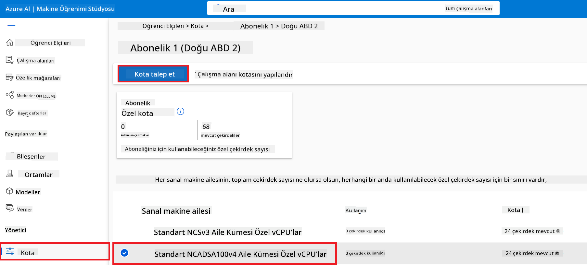

    - Request quota sayfasında, kullanmak istediğiniz **New cores limit** değerini girin. Örneğin, 24.
    - Request quota sayfasında **Submit** seçeneğini seçerek GPU kotası talebinde bulunun.

> [!NOTE]
> İhtiyacınıza uygun GPU veya CPU'yu seçmek için [Sizes for Virtual Machines in Azure](https://learn.microsoft.com/azure/virtual-machines/sizes/overview?tabs=breakdownseries%2Cgeneralsizelist%2Ccomputesizelist%2Cmemorysizelist%2Cstoragesizelist%2Cgpusizelist%2Cfpgasizelist%2Chpcsizelist) dokümanına bakabilirsiniz.

### Rol ataması ekleme

Modellerinizi ince ayar yapmak ve dağıtmak için önce bir User Assigned Managed Identity (UAI) oluşturmalı ve ona uygun izinleri atamalısınız. Bu UAI, dağıtım sırasında kimlik doğrulama için kullanılacaktır.

#### User Assigned Managed Identity (UAI) oluşturma

1. Portal sayfasının üst kısmındaki **arama çubuğuna** *managed identities* yazın ve çıkan seçeneklerden **Managed Identities**'i seçin.

    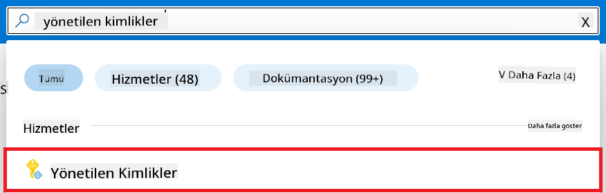

1. **+ Create** seçeneğini seçin.

    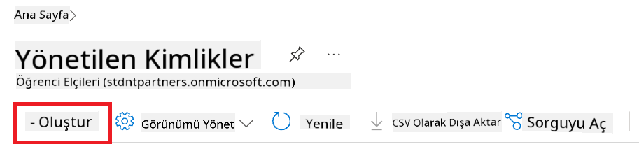

1. Aşağıdaki işlemleri yapın:

    - Azure **Subscription**'ınızı seçin.
    - Kullanılacak **Resource group**'u seçin (gerekirse yeni oluşturun).
    - Kullanmak istediğiniz **Region**'u seçin.
    - **Name** girin. Benzersiz bir değer olmalı.

1. **Review + create** seçeneğini seçin.

1. **+ Create** seçeneğini seçin.

#### Managed Identity'ye Contributor rolü atama

1. Oluşturduğunuz Managed Identity kaynağına gidin.

1. Sol taraftaki sekmeden **Azure role assignments**'ı seçin.

1. Navigasyon menüsünden **+Add role assignment** seçeneğini seçin.

1. Add role assignment sayfasında aşağıdakileri yapın:
    - **Scope** olarak **Resource group**'u seçin.
    - Azure **Subscription**'ınızı seçin.
    - Kullanılacak **Resource group**'u seçin.
    - **Role** olarak **Contributor**'ı seçin.

    

1. **Save** seçeneğini seçin.

#### Managed Identity'ye Storage Blob Data Reader rolü atama

1. Portal sayfasının üst kısmındaki **arama çubuğuna** *storage accounts* yazın ve çıkan seçeneklerden **Storage accounts**'u seçin.

    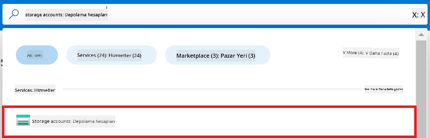

1. Oluşturduğunuz Azure Machine Learning workspace ile ilişkili storage account'u seçin. Örneğin, *finetunephistorage*.

1. Add role assignment sayfasına gitmek için şu adımları izleyin:

    - Oluşturduğunuz Azure Storage hesabına gidin.
    - Sol taraftan **Access Control (IAM)** sekmesini seçin.
    - Navigasyon menüsünden **+ Add** seçeneğini seçin.
    - **Add role assignment** seçeneğini seçin.

    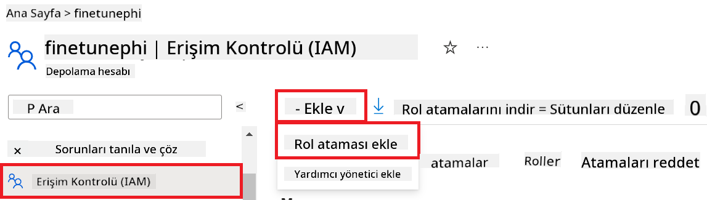

1. Add role assignment sayfasında aşağıdakileri yapın:

    - Rol sayfasında **Storage Blob Data Reader** yazıp çıkan seçeneklerden **Storage Blob Data Reader**'ı seçin.
    - Rol sayfasında **Next**'i seçin.
    - Üyeler sayfasında **Assign access to** olarak **Managed identity**'yi seçin.
    - Üyeler sayfasında **+ Select members**'ı seçin.
    - Managed identities seçme sayfasında Azure **Subscription**'ınızı seçin.
    - Managed identities seçme sayfasında **Managed identity** olarak **Manage Identity**'yi seçin.
    - Oluşturduğunuz Manage Identity'yi seçin. Örneğin, *finetunephi-managedidentity*.
    - **Select**'i seçin.

    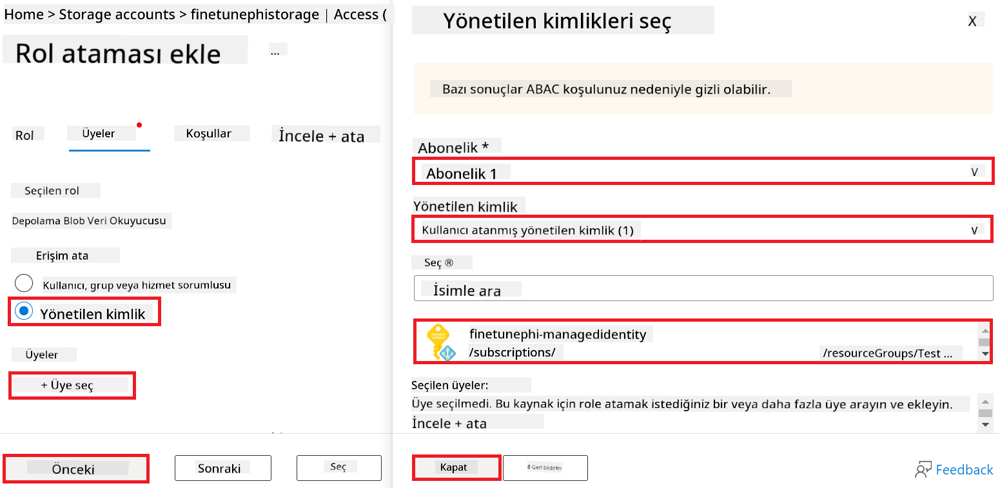

1. **Review + assign** seçeneğini seçin.

#### Managed Identity'ye AcrPull rolü atama

1. Portal sayfasının üst kısmındaki **arama çubuğuna** *container registries* yazın ve çıkan seçeneklerden **Container registries**'i seçin.

    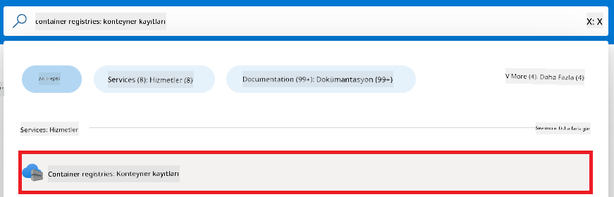

1. Azure Machine Learning workspace ile ilişkili container registry'yi seçin. Örneğin, *finetunephicontainerregistries*.

1. Add role assignment sayfasına gitmek için şu adımları izleyin:

    - Sol taraftan **Access Control (IAM)** sekmesini seçin.
    - Navigasyon menüsünden **+ Add**'i seçin.
    - **Add role assignment**'ı seçin.

1. Add role assignment sayfasında aşağıdakileri yapın:

    - Rol sayfasında *AcrPull* yazıp çıkan seçeneklerden **AcrPull**'u seçin.
    - Rol sayfasında **Next**'i seçin.
    - Üyeler sayfasında **Assign access to** olarak **Managed identity**'yi seçin.
    - Üyeler sayfasında **+ Select members**'ı seçin.
    - Managed identities seçme sayfasında Azure **Subscription**'ınızı seçin.
    - Managed identities seçme sayfasında **Managed identity** olarak **Manage Identity**'yi seçin.
    - Oluşturduğunuz Manage Identity'yi seçin. Örneğin, *finetunephi-managedidentity*.
    - **Select**'i seçin.
    - **Review + assign**'ı seçin.

### Projeyi kurma

Şimdi, içinde çalışacağınız bir klasör oluşturacak ve kullanıcılarla etkileşimde bulunan, Azure Cosmos DB'den alınan sohbet geçmişini kullanarak yanıtlarını şekillendiren bir program geliştirmek için sanal bir ortam kuracaksınız.

#### Çalışmak için bir klasör oluşturma

1. Bir terminal penceresi açın ve varsayılan yol altında *finetune-phi* adında bir klasör oluşturmak için aşağıdaki komutu yazın.

    ```console
    mkdir finetune-phi
    ```

1. Terminalde aşağıdaki komutu yazarak oluşturduğunuz *finetune-phi* klasörüne gidin.

    ```console
    cd finetune-phi
    ```

#### Sanal ortam oluşturma

1. Terminalde aşağıdaki komutu yazarak *.venv* adında bir sanal ortam oluşturun.

    ```console
    python -m venv .venv
    ```

1. Sanal ortamı etkinleştirmek için terminalde aşağıdaki komutu yazın.

    ```console
    .venv\Scripts\activate.bat
    ```

> [!NOTE]
>
> Eğer başarılı olduysa, komut isteminin önünde *(.venv)* görmelisiniz.

#### Gerekli paketleri yükleme

1. Gerekli paketleri yüklemek için terminalde aşağıdaki komutları yazın.

    ```console
    pip install datasets==2.19.1
    pip install transformers==4.41.1
    pip install azure-ai-ml==1.16.0
    pip install torch==2.3.1
    pip install trl==0.9.4
    pip install promptflow==1.12.0
    ```

#### Proje dosyalarını oluşturma

Bu egzersizde, projemiz için gerekli temel dosyaları oluşturacaksınız. Bu dosyalar, veri setini indirmek, Azure Machine Learning ortamını kurmak, Phi-3 modelini ince ayar yapmak ve ince ayar yapılmış modeli dağıtmak için betikler içerecek. Ayrıca, ince ayar ortamını kurmak için bir *conda.yml* dosyası oluşturacaksınız.

Bu egzersizde yapacaklarınız:

- Veri setini indirmek için *download_dataset.py* dosyasını oluşturun.
- Azure Machine Learning ortamını kurmak için *setup_ml.py* dosyasını oluşturun.
- *finetuning_dir* klasöründe, veri setini kullanarak Phi-3 modelini ince ayar yapmak için *fine_tune.py* dosyasını oluşturun.
- İnce ayar ortamını kurmak için *conda.yml* dosyasını oluşturun.
- İnce ayar yapılmış modeli dağıtmak için *deploy_model.py* dosyasını oluşturun.
- İnce ayar yapılmış modeli Prompt flow ile entegre etmek ve modeli çalıştırmak için *integrate_with_promptflow.py* dosyasını oluşturun.
- Prompt flow için iş akışı yapısını kurmak amacıyla *flow.dag.yml* dosyasını oluşturun.
- Azure bilgilerinizi girmek için *config.py* dosyasını oluşturun.

> [!NOTE]
>
> Tam klasör yapısı:
>
> ```text
> └── YourUserName
> .    └── finetune-phi
> .        ├── finetuning_dir
> .        │      └── fine_tune.py
> .        ├── conda.yml
> .        ├── config.py
> .        ├── deploy_model.py
> .        ├── download_dataset.py
> .        ├── flow.dag.yml
> .        ├── integrate_with_promptflow.py
> .        └── setup_ml.py
> ```

1. **Visual Studio Code**'u açın.

1. Menü çubuğundan **File**'ı seçin.

1. **Open Folder**'ı seçin.

1. Oluşturduğunuz *finetune-phi* klasörünü seçin, örneğin *C:\Users\yourUserName\finetune-phi*.

    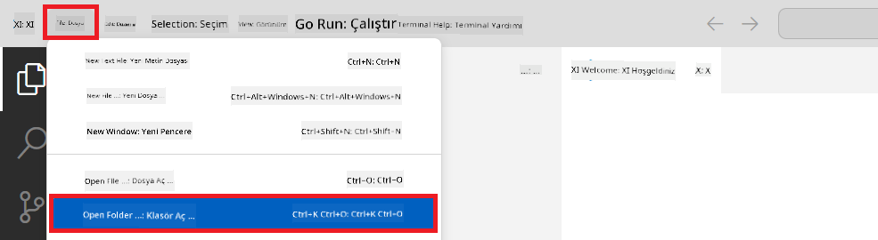

1. Visual Studio Code'un sol panelinde sağ tıklayıp **New File** seçeneği ile *download_dataset.py* adlı yeni bir dosya oluşturun.

1. Aynı şekilde *setup_ml.py* adlı yeni bir dosya oluşturun.

1. Aynı şekilde *deploy_model.py* adlı yeni bir dosya oluşturun.

    

1. Sol panelde sağ tıklayıp **New Folder** seçeneği ile *finetuning_dir* adlı yeni bir klasör oluşturun.

1. *finetuning_dir* klasöründe *fine_tune.py* adlı yeni bir dosya oluşturun.

#### *conda.yml* dosyasını oluşturma ve yapılandırma

1. Sol panelde sağ tıklayıp *conda.yml* adlı yeni bir dosya oluşturun.

1. *conda.yml* dosyasına Phi-3 modeli için ince ayar ortamını kuracak aşağıdaki kodu ekleyin.

    ```yml
    name: phi-3-training-env
    channels:
      - defaults
      - conda-forge
    dependencies:
      - python=3.10
      - pip
      - numpy<2.0
      - pip:
          - torch==2.4.0
          - torchvision==0.19.0
          - trl==0.8.6
          - transformers==4.41
          - datasets==2.21.0
          - azureml-core==1.57.0
          - azure-storage-blob==12.19.0
          - azure-ai-ml==1.16
          - azure-identity==1.17.1
          - accelerate==0.33.0
          - mlflow==2.15.1
          - azureml-mlflow==1.57.0
    ```

#### *config.py* dosyasını oluşturma ve yapılandırma

1. Sol panelde sağ tıklayıp *config.py* adlı yeni bir dosya oluşturun.

1. *config.py* dosyasına Azure bilgilerinizi eklemek için aşağıdaki kodu ekleyin.

    ```python
    # Azure settings
    AZURE_SUBSCRIPTION_ID = "your_subscription_id"
    AZURE_RESOURCE_GROUP_NAME = "your_resource_group_name" # "TestGroup"

    # Azure Machine Learning settings
    AZURE_ML_WORKSPACE_NAME = "your_workspace_name" # "finetunephi-workspace"

    # Azure Managed Identity settings
    AZURE_MANAGED_IDENTITY_CLIENT_ID = "your_azure_managed_identity_client_id"
    AZURE_MANAGED_IDENTITY_NAME = "your_azure_managed_identity_name" # "finetunephi-mangedidentity"
    AZURE_MANAGED_IDENTITY_RESOURCE_ID = f"/subscriptions/{AZURE_SUBSCRIPTION_ID}/resourceGroups/{AZURE_RESOURCE_GROUP_NAME}/providers/Microsoft.ManagedIdentity/userAssignedIdentities/{AZURE_MANAGED_IDENTITY_NAME}"

    # Dataset file paths
    TRAIN_DATA_PATH = "data/train_data.jsonl"
    TEST_DATA_PATH = "data/test_data.jsonl"

    # Fine-tuned model settings
    AZURE_MODEL_NAME = "your_fine_tuned_model_name" # "finetune-phi-model"
    AZURE_ENDPOINT_NAME = "your_fine_tuned_model_endpoint_name" # "finetune-phi-endpoint"
    AZURE_DEPLOYMENT_NAME = "your_fine_tuned_model_deployment_name" # "finetune-phi-deployment"

    AZURE_ML_API_KEY = "your_fine_tuned_model_api_key"
    AZURE_ML_ENDPOINT = "your_fine_tuned_model_endpoint_uri" # "https://{your-endpoint-name}.{your-region}.inference.ml.azure.com/score"
    ```

#### Azure ortam değişkenlerini ekleme

1. Azure Subscription ID'yi eklemek için aşağıdaki adımları izleyin:

    - Portal sayfasının üst kısmındaki **arama çubuğuna** *subscriptions* yazın ve çıkan seçeneklerden **Subscriptions**'ı seçin.
    - Şu anda kullandığınız Azure Subscription'ı seçin.
    - Abonelik ID'nizi kopyalayıp *config.py* dosyasına yapıştırın.


1. Azure Workspace Adını eklemek için aşağıdaki adımları gerçekleştirin:

    - Oluşturduğunuz Azure Machine Learning kaynağına gidin.
    - Hesap adınızı *config.py* dosyasına kopyalayıp yapıştırın.

    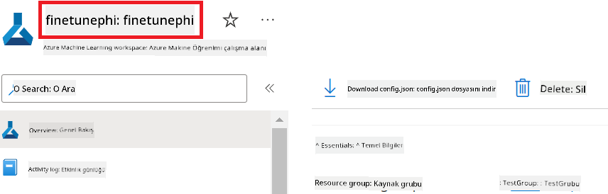

1. Azure Kaynak Grubu Adını eklemek için aşağıdaki adımları gerçekleştirin:

    - Oluşturduğunuz Azure Machine Learning kaynağına gidin.
    - Azure Kaynak Grubu Adınızı *config.py* dosyasına kopyalayıp yapıştırın.

    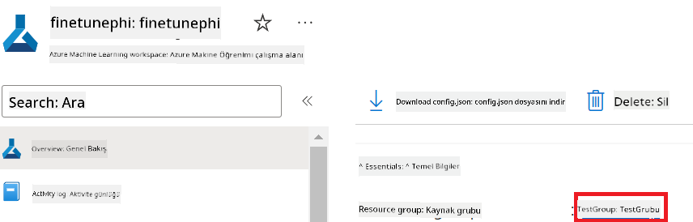

2. Azure Managed Identity adını eklemek için aşağıdaki adımları gerçekleştirin:

    - Oluşturduğunuz Managed Identities kaynağına gidin.
    - Azure Managed Identity adınızı *config.py* dosyasına kopyalayıp yapıştırın.

    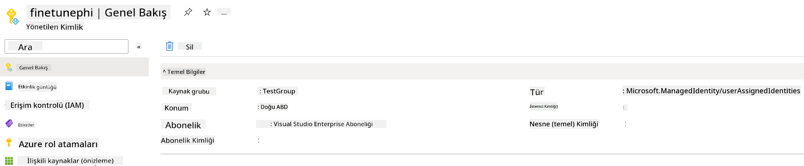

### İnce ayar için veri setini hazırlama

Bu alıştırmada, *download_dataset.py* dosyasını çalıştırarak *ULTRACHAT_200k* veri setlerini yerel ortamınıza indireceksiniz. Ardından, bu veri setlerini Azure Machine Learning'de Phi-3 modelini ince ayar yapmak için kullanacaksınız.

#### *download_dataset.py* dosyasını kullanarak veri setinizi indirin

1. Visual Studio Code’da *download_dataset.py* dosyasını açın.

1. *download_dataset.py* dosyasına aşağıdaki kodu ekleyin.

    ```python
    import json
    import os
    from datasets import load_dataset
    from config import (
        TRAIN_DATA_PATH,
        TEST_DATA_PATH)

    def load_and_split_dataset(dataset_name, config_name, split_ratio):
        """
        Load and split a dataset.
        """
        # Load the dataset with the specified name, configuration, and split ratio
        dataset = load_dataset(dataset_name, config_name, split=split_ratio)
        print(f"Original dataset size: {len(dataset)}")
        
        # Split the dataset into train and test sets (80% train, 20% test)
        split_dataset = dataset.train_test_split(test_size=0.2)
        print(f"Train dataset size: {len(split_dataset['train'])}")
        print(f"Test dataset size: {len(split_dataset['test'])}")
        
        return split_dataset

    def save_dataset_to_jsonl(dataset, filepath):
        """
        Save a dataset to a JSONL file.
        """
        # Create the directory if it does not exist
        os.makedirs(os.path.dirname(filepath), exist_ok=True)
        
        # Open the file in write mode
        with open(filepath, 'w', encoding='utf-8') as f:
            # Iterate over each record in the dataset
            for record in dataset:
                # Dump the record as a JSON object and write it to the file
                json.dump(record, f)
                # Write a newline character to separate records
                f.write('\n')
        
        print(f"Dataset saved to {filepath}")

    def main():
        """
        Main function to load, split, and save the dataset.
        """
        # Load and split the ULTRACHAT_200k dataset with a specific configuration and split ratio
        dataset = load_and_split_dataset("HuggingFaceH4/ultrachat_200k", 'default', 'train_sft[:1%]')
        
        # Extract the train and test datasets from the split
        train_dataset = dataset['train']
        test_dataset = dataset['test']

        # Save the train dataset to a JSONL file
        save_dataset_to_jsonl(train_dataset, TRAIN_DATA_PATH)
        
        # Save the test dataset to a separate JSONL file
        save_dataset_to_jsonl(test_dataset, TEST_DATA_PATH)

    if __name__ == "__main__":
        main()

    ```

> [!TIP]
>
> **CPU kullanarak minimal veri seti ile ince ayar yapma rehberi**
>
> İnce ayar için CPU kullanmak istiyorsanız, bu yöntem özellikle avantajlı aboneliklere sahip olanlar (örneğin Visual Studio Enterprise Subscription) veya ince ayar ve dağıtım sürecini hızlıca test etmek isteyenler için idealdir.
>
> `dataset = load_and_split_dataset("HuggingFaceH4/ultrachat_200k", 'default', 'train_sft[:1%]')` with `dataset = load_and_split_dataset("HuggingFaceH4/ultrachat_200k", 'default', 'train_sft[:10]')` ile değiştirin
>

1. Terminalinize aşağıdaki komutu yazarak scripti çalıştırın ve veri setini yerel ortamınıza indirin.

    ```console
    python download_data.py
    ```

1. Veri setlerinin yerel *finetune-phi/data* dizinine başarıyla kaydedildiğini doğrulayın.

> [!NOTE]
>
> **Veri seti boyutu ve ince ayar süresi**
>
> Bu uçtan uca örnekte, veri setinin sadece %1’ini (`train_sft[:1%]`) kullanıyorsunuz. Bu, veri miktarını önemli ölçüde azaltarak hem yükleme hem de ince ayar süreçlerini hızlandırır. Eğitim süresi ile model performansı arasında doğru dengeyi bulmak için yüzdelik oranı ayarlayabilirsiniz. Veri setinin daha küçük bir alt kümesini kullanmak, ince ayar süresini kısaltarak uçtan uca örnek için süreci daha yönetilebilir hale getirir.

## Senaryo 2: Phi-3 modelini ince ayar yapma ve Azure Machine Learning Studio’da dağıtma

### Azure CLI Kurulumu

Ortamınızı doğrulamak için Azure CLI’yı kurmanız gerekir. Azure CLI, Azure kaynaklarını doğrudan komut satırından yönetmenizi sağlar ve Azure Machine Learning’in bu kaynaklara erişimi için gerekli kimlik bilgilerini sağlar. Başlamak için [Azure CLI](https://learn.microsoft.com/cli/azure/install-azure-cli) kurulumunu yapın.

1. Bir terminal penceresi açın ve Azure hesabınıza giriş yapmak için aşağıdaki komutu yazın.

    ```console
    az login
    ```

1. Kullanmak istediğiniz Azure hesabınızı seçin.

1. Kullanmak istediğiniz Azure aboneliğinizi seçin.

    

> [!TIP]
>
> Azure’a giriş yaparken sorun yaşıyorsanız, cihaz kodu kullanmayı deneyin. Bir terminal penceresi açın ve Azure hesabınıza giriş yapmak için aşağıdaki komutu yazın:
>
> ```console
> az login --use-device-code
> ```
>

### Phi-3 modelini ince ayar yapma

Bu alıştırmada, verilen veri setini kullanarak Phi-3 modelini ince ayar yapacaksınız. Öncelikle *fine_tune.py* dosyasında ince ayar sürecini tanımlayacaksınız. Ardından, Azure Machine Learning ortamını yapılandıracak ve *setup_ml.py* dosyasını çalıştırarak ince ayar sürecini başlatacaksınız. Bu script, ince ayarın Azure Machine Learning ortamında gerçekleşmesini sağlar.

*setup_ml.py* dosyasını çalıştırarak Azure Machine Learning ortamında ince ayar sürecini başlatacaksınız.

#### *fine_tune.py* dosyasına kod ekleyin

1. *finetuning_dir* klasörüne gidin ve Visual Studio Code’da *fine_tune.py* dosyasını açın.

1. *fine_tune.py* dosyasına aşağıdaki kodu ekleyin.

    ```python
    import argparse
    import sys
    import logging
    import os
    from datasets import load_dataset
    import torch
    import mlflow
    from transformers import AutoModelForCausalLM, AutoTokenizer, TrainingArguments
    from trl import SFTTrainer

    # To avoid the INVALID_PARAMETER_VALUE error in MLflow, disable MLflow integration
    os.environ["DISABLE_MLFLOW_INTEGRATION"] = "True"

    # Logging setup
    logging.basicConfig(
        format="%(asctime)s - %(levelname)s - %(name)s - %(message)s",
        datefmt="%Y-%m-%d %H:%M:%S",
        handlers=[logging.StreamHandler(sys.stdout)],
        level=logging.WARNING
    )
    logger = logging.getLogger(__name__)

    def initialize_model_and_tokenizer(model_name, model_kwargs):
        """
        Initialize the model and tokenizer with the given pretrained model name and arguments.
        """
        model = AutoModelForCausalLM.from_pretrained(model_name, **model_kwargs)
        tokenizer = AutoTokenizer.from_pretrained(model_name)
        tokenizer.model_max_length = 2048
        tokenizer.pad_token = tokenizer.unk_token
        tokenizer.pad_token_id = tokenizer.convert_tokens_to_ids(tokenizer.pad_token)
        tokenizer.padding_side = 'right'
        return model, tokenizer

    def apply_chat_template(example, tokenizer):
        """
        Apply a chat template to tokenize messages in the example.
        """
        messages = example["messages"]
        if messages[0]["role"] != "system":
            messages.insert(0, {"role": "system", "content": ""})
        example["text"] = tokenizer.apply_chat_template(
            messages, tokenize=False, add_generation_prompt=False
        )
        return example

    def load_and_preprocess_data(train_filepath, test_filepath, tokenizer):
        """
        Load and preprocess the dataset.
        """
        train_dataset = load_dataset('json', data_files=train_filepath, split='train')
        test_dataset = load_dataset('json', data_files=test_filepath, split='train')
        column_names = list(train_dataset.features)

        train_dataset = train_dataset.map(
            apply_chat_template,
            fn_kwargs={"tokenizer": tokenizer},
            num_proc=10,
            remove_columns=column_names,
            desc="Applying chat template to train dataset",
        )

        test_dataset = test_dataset.map(
            apply_chat_template,
            fn_kwargs={"tokenizer": tokenizer},
            num_proc=10,
            remove_columns=column_names,
            desc="Applying chat template to test dataset",
        )

        return train_dataset, test_dataset

    def train_and_evaluate_model(train_dataset, test_dataset, model, tokenizer, output_dir):
        """
        Train and evaluate the model.
        """
        training_args = TrainingArguments(
            bf16=True,
            do_eval=True,
            output_dir=output_dir,
            eval_strategy="epoch",
            learning_rate=5.0e-06,
            logging_steps=20,
            lr_scheduler_type="cosine",
            num_train_epochs=3,
            overwrite_output_dir=True,
            per_device_eval_batch_size=4,
            per_device_train_batch_size=4,
            remove_unused_columns=True,
            save_steps=500,
            seed=0,
            gradient_checkpointing=True,
            gradient_accumulation_steps=1,
            warmup_ratio=0.2,
        )

        trainer = SFTTrainer(
            model=model,
            args=training_args,
            train_dataset=train_dataset,
            eval_dataset=test_dataset,
            max_seq_length=2048,
            dataset_text_field="text",
            tokenizer=tokenizer,
            packing=True
        )

        train_result = trainer.train()
        trainer.log_metrics("train", train_result.metrics)

        mlflow.transformers.log_model(
            transformers_model={"model": trainer.model, "tokenizer": tokenizer},
            artifact_path=output_dir,
        )

        tokenizer.padding_side = 'left'
        eval_metrics = trainer.evaluate()
        eval_metrics["eval_samples"] = len(test_dataset)
        trainer.log_metrics("eval", eval_metrics)

    def main(train_file, eval_file, model_output_dir):
        """
        Main function to fine-tune the model.
        """
        model_kwargs = {
            "use_cache": False,
            "trust_remote_code": True,
            "torch_dtype": torch.bfloat16,
            "device_map": None,
            "attn_implementation": "eager"
        }

        # pretrained_model_name = "microsoft/Phi-3-mini-4k-instruct"
        pretrained_model_name = "microsoft/Phi-3.5-mini-instruct"

        with mlflow.start_run():
            model, tokenizer = initialize_model_and_tokenizer(pretrained_model_name, model_kwargs)
            train_dataset, test_dataset = load_and_preprocess_data(train_file, eval_file, tokenizer)
            train_and_evaluate_model(train_dataset, test_dataset, model, tokenizer, model_output_dir)

    if __name__ == "__main__":
        parser = argparse.ArgumentParser()
        parser.add_argument("--train-file", type=str, required=True, help="Path to the training data")
        parser.add_argument("--eval-file", type=str, required=True, help="Path to the evaluation data")
        parser.add_argument("--model_output_dir", type=str, required=True, help="Directory to save the fine-tuned model")
        args = parser.parse_args()
        main(args.train_file, args.eval_file, args.model_output_dir)

    ```

1. *fine_tune.py* dosyasını kaydedip kapatın.

> [!TIP]
> **Phi-3.5 modelini de ince ayar yapabilirsiniz**
>
> *fine_tune.py* dosyasında, `pretrained_model_name` from `"microsoft/Phi-3-mini-4k-instruct"` to any model you want to fine-tune. For example, if you change it to `"microsoft/Phi-3.5-mini-instruct"`, you'll be using the Phi-3.5-mini-instruct model for fine-tuning. To find and use the model name you prefer, visit [Hugging Face](https://huggingface.co/), search for the model you're interested in, and then copy and paste its name into the `pretrained_model_name` alanını değiştirebilirsiniz.
>
> :::image type="content" source="../../imgs/03/FineTuning-PromptFlow/finetunephi3.5.png" alt-text="Phi-3.5 modelini ince ayar yapın.":::
>

#### *setup_ml.py* dosyasına kod ekleyin

1. Visual Studio Code’da *setup_ml.py* dosyasını açın.

1. *setup_ml.py* dosyasına aşağıdaki kodu ekleyin.

    ```python
    import logging
    from azure.ai.ml import MLClient, command, Input
    from azure.ai.ml.entities import Environment, AmlCompute
    from azure.identity import AzureCliCredential
    from config import (
        AZURE_SUBSCRIPTION_ID,
        AZURE_RESOURCE_GROUP_NAME,
        AZURE_ML_WORKSPACE_NAME,
        TRAIN_DATA_PATH,
        TEST_DATA_PATH
    )

    # Constants

    # Uncomment the following lines to use a CPU instance for training
    # COMPUTE_INSTANCE_TYPE = "Standard_E16s_v3" # cpu
    # COMPUTE_NAME = "cpu-e16s-v3"
    # DOCKER_IMAGE_NAME = "mcr.microsoft.com/azureml/openmpi4.1.0-ubuntu20.04:latest"

    # Uncomment the following lines to use a GPU instance for training
    COMPUTE_INSTANCE_TYPE = "Standard_NC24ads_A100_v4"
    COMPUTE_NAME = "gpu-nc24s-a100-v4"
    DOCKER_IMAGE_NAME = "mcr.microsoft.com/azureml/curated/acft-hf-nlp-gpu:59"

    CONDA_FILE = "conda.yml"
    LOCATION = "eastus2" # Replace with the location of your compute cluster
    FINETUNING_DIR = "./finetuning_dir" # Path to the fine-tuning script
    TRAINING_ENV_NAME = "phi-3-training-environment" # Name of the training environment
    MODEL_OUTPUT_DIR = "./model_output" # Path to the model output directory in azure ml

    # Logging setup to track the process
    logger = logging.getLogger(__name__)
    logging.basicConfig(
        format="%(asctime)s - %(levelname)s - %(name)s - %(message)s",
        datefmt="%Y-%m-%d %H:%M:%S",
        level=logging.WARNING
    )

    def get_ml_client():
        """
        Initialize the ML Client using Azure CLI credentials.
        """
        credential = AzureCliCredential()
        return MLClient(credential, AZURE_SUBSCRIPTION_ID, AZURE_RESOURCE_GROUP_NAME, AZURE_ML_WORKSPACE_NAME)

    def create_or_get_environment(ml_client):
        """
        Create or update the training environment in Azure ML.
        """
        env = Environment(
            image=DOCKER_IMAGE_NAME,  # Docker image for the environment
            conda_file=CONDA_FILE,  # Conda environment file
            name=TRAINING_ENV_NAME,  # Name of the environment
        )
        return ml_client.environments.create_or_update(env)

    def create_or_get_compute_cluster(ml_client, compute_name, COMPUTE_INSTANCE_TYPE, location):
        """
        Create or update the compute cluster in Azure ML.
        """
        try:
            compute_cluster = ml_client.compute.get(compute_name)
            logger.info(f"Compute cluster '{compute_name}' already exists. Reusing it for the current run.")
        except Exception:
            logger.info(f"Compute cluster '{compute_name}' does not exist. Creating a new one with size {COMPUTE_INSTANCE_TYPE}.")
            compute_cluster = AmlCompute(
                name=compute_name,
                size=COMPUTE_INSTANCE_TYPE,
                location=location,
                tier="Dedicated",  # Tier of the compute cluster
                min_instances=0,  # Minimum number of instances
                max_instances=1  # Maximum number of instances
            )
            ml_client.compute.begin_create_or_update(compute_cluster).wait()  # Wait for the cluster to be created
        return compute_cluster

    def create_fine_tuning_job(env, compute_name):
        """
        Set up the fine-tuning job in Azure ML.
        """
        return command(
            code=FINETUNING_DIR,  # Path to fine_tune.py
            command=(
                "python fine_tune.py "
                "--train-file ${{inputs.train_file}} "
                "--eval-file ${{inputs.eval_file}} "
                "--model_output_dir ${{inputs.model_output}}"
            ),
            environment=env,  # Training environment
            compute=compute_name,  # Compute cluster to use
            inputs={
                "train_file": Input(type="uri_file", path=TRAIN_DATA_PATH),  # Path to the training data file
                "eval_file": Input(type="uri_file", path=TEST_DATA_PATH),  # Path to the evaluation data file
                "model_output": MODEL_OUTPUT_DIR
            }
        )

    def main():
        """
        Main function to set up and run the fine-tuning job in Azure ML.
        """
        # Initialize ML Client
        ml_client = get_ml_client()

        # Create Environment
        env = create_or_get_environment(ml_client)
        
        # Create or get existing compute cluster
        create_or_get_compute_cluster(ml_client, COMPUTE_NAME, COMPUTE_INSTANCE_TYPE, LOCATION)

        # Create and Submit Fine-Tuning Job
        job = create_fine_tuning_job(env, COMPUTE_NAME)
        returned_job = ml_client.jobs.create_or_update(job)  # Submit the job
        ml_client.jobs.stream(returned_job.name)  # Stream the job logs
        
        # Capture the job name
        job_name = returned_job.name
        print(f"Job name: {job_name}")

    if __name__ == "__main__":
        main()

    ```

1. `COMPUTE_INSTANCE_TYPE`, `COMPUTE_NAME`, and `LOCATION` yerlerini kendi bilgilerinizle değiştirin.

    ```python
   # Uncomment the following lines to use a GPU instance for training
    COMPUTE_INSTANCE_TYPE = "Standard_NC24ads_A100_v4"
    COMPUTE_NAME = "gpu-nc24s-a100-v4"
    ...
    LOCATION = "eastus2" # Replace with the location of your compute cluster
    ```

> [!TIP]
>
> **CPU kullanarak minimal veri seti ile ince ayar yapma rehberi**
>
> İnce ayar için CPU kullanmak istiyorsanız, bu yöntem özellikle avantajlı aboneliklere sahip olanlar (örneğin Visual Studio Enterprise Subscription) veya ince ayar ve dağıtım sürecini hızlıca test etmek isteyenler için idealdir.
>
> 1. *setup_ml* dosyasını açın.
> 2. `COMPUTE_INSTANCE_TYPE`, `COMPUTE_NAME`, and `DOCKER_IMAGE_NAME` with the following. If you do not have access to *Standard_E16s_v3*, you can use an equivalent CPU instance or request a new quota.
> 1. Replace `LOCATION` yerlerini kendi bilgilerinizle değiştirin.
>
>    ```python
>    # Uncomment the following lines to use a CPU instance for training
>    COMPUTE_INSTANCE_TYPE = "Standard_E16s_v3" # cpu
>    COMPUTE_NAME = "cpu-e16s-v3"
>    DOCKER_IMAGE_NAME = "mcr.microsoft.com/azureml/openmpi4.1.0-ubuntu20.04:latest"
>    LOCATION = "eastus2" # Replace with the location of your compute cluster
>    ```
>

1. *setup_ml.py* scriptini çalıştırmak ve Azure Machine Learning’de ince ayar sürecini başlatmak için aşağıdaki komutu yazın.

    ```python
    python setup_ml.py
    ```

1. Bu alıştırmada, Azure Machine Learning kullanarak Phi-3 modelini başarıyla ince ayar yaptınız. *setup_ml.py* scriptini çalıştırarak Azure Machine Learning ortamını kurdunuz ve *fine_tune.py* dosyasında tanımlı ince ayar sürecini başlattınız. İnce ayar sürecinin önemli ölçüde zaman alabileceğini unutmayın. `python setup_ml.py` command, you need to wait for the process to complete. You can monitor the status of the fine-tuning job by following the link provided in the terminal to the Azure Machine Learning portal.

    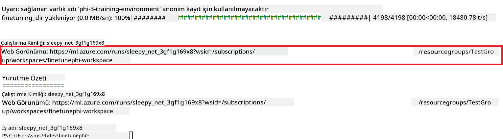

### Deploy the fine-tuned model

To integrate the fine-tuned Phi-3 model with Prompt Flow, you need to deploy the model to make it accessible for real-time inference. This process involves registering the model, creating an online endpoint, and deploying the model.

#### Set the model name, endpoint name, and deployment name for deployment

1. Open *config.py* file.

1. Replace `AZURE_MODEL_NAME = "your_fine_tuned_model_name"` with the desired name for your model.

1. Replace `AZURE_ENDPOINT_NAME = "your_fine_tuned_model_endpoint_name"` with the desired name for your endpoint.

1. Replace `AZURE_DEPLOYMENT_NAME = "your_fine_tuned_model_deployment_name"` komutunu, dağıtımınız için istediğiniz isimlerle çalıştırın.

#### *deploy_model.py* dosyasına kod ekleyin

*deploy_model.py* dosyasını çalıştırmak, tüm dağıtım sürecini otomatikleştirir. Modeli kaydeder, bir endpoint oluşturur ve config.py dosyasında belirtilen ayarlara göre dağıtımı gerçekleştirir. Bu ayarlar model adı, endpoint adı ve dağıtım adını içerir.

1. Visual Studio Code’da *deploy_model.py* dosyasını açın.

1. *deploy_model.py* dosyasına aşağıdaki kodu ekleyin.

    ```python
    import logging
    from azure.identity import AzureCliCredential
    from azure.ai.ml import MLClient
    from azure.ai.ml.entities import Model, ProbeSettings, ManagedOnlineEndpoint, ManagedOnlineDeployment, IdentityConfiguration, ManagedIdentityConfiguration, OnlineRequestSettings
    from azure.ai.ml.constants import AssetTypes

    # Configuration imports
    from config import (
        AZURE_SUBSCRIPTION_ID,
        AZURE_RESOURCE_GROUP_NAME,
        AZURE_ML_WORKSPACE_NAME,
        AZURE_MANAGED_IDENTITY_RESOURCE_ID,
        AZURE_MANAGED_IDENTITY_CLIENT_ID,
        AZURE_MODEL_NAME,
        AZURE_ENDPOINT_NAME,
        AZURE_DEPLOYMENT_NAME
    )

    # Constants
    JOB_NAME = "your-job-name"
    COMPUTE_INSTANCE_TYPE = "Standard_E4s_v3"

    deployment_env_vars = {
        "SUBSCRIPTION_ID": AZURE_SUBSCRIPTION_ID,
        "RESOURCE_GROUP_NAME": AZURE_RESOURCE_GROUP_NAME,
        "UAI_CLIENT_ID": AZURE_MANAGED_IDENTITY_CLIENT_ID,
    }

    # Logging setup
    logging.basicConfig(
        format="%(asctime)s - %(levelname)s - %(name)s - %(message)s",
        datefmt="%Y-%m-%d %H:%M:%S",
        level=logging.DEBUG
    )
    logger = logging.getLogger(__name__)

    def get_ml_client():
        """Initialize and return the ML Client."""
        credential = AzureCliCredential()
        return MLClient(credential, AZURE_SUBSCRIPTION_ID, AZURE_RESOURCE_GROUP_NAME, AZURE_ML_WORKSPACE_NAME)

    def register_model(ml_client, model_name, job_name):
        """Register a new model."""
        model_path = f"azureml://jobs/{job_name}/outputs/artifacts/paths/model_output"
        logger.info(f"Registering model {model_name} from job {job_name} at path {model_path}.")
        run_model = Model(
            path=model_path,
            name=model_name,
            description="Model created from run.",
            type=AssetTypes.MLFLOW_MODEL,
        )
        model = ml_client.models.create_or_update(run_model)
        logger.info(f"Registered model ID: {model.id}")
        return model

    def delete_existing_endpoint(ml_client, endpoint_name):
        """Delete existing endpoint if it exists."""
        try:
            endpoint_result = ml_client.online_endpoints.get(name=endpoint_name)
            logger.info(f"Deleting existing endpoint {endpoint_name}.")
            ml_client.online_endpoints.begin_delete(name=endpoint_name).result()
            logger.info(f"Deleted existing endpoint {endpoint_name}.")
        except Exception as e:
            logger.info(f"No existing endpoint {endpoint_name} found to delete: {e}")

    def create_or_update_endpoint(ml_client, endpoint_name, description=""):
        """Create or update an endpoint."""
        delete_existing_endpoint(ml_client, endpoint_name)
        logger.info(f"Creating new endpoint {endpoint_name}.")
        endpoint = ManagedOnlineEndpoint(
            name=endpoint_name,
            description=description,
            identity=IdentityConfiguration(
                type="user_assigned",
                user_assigned_identities=[ManagedIdentityConfiguration(resource_id=AZURE_MANAGED_IDENTITY_RESOURCE_ID)]
            )
        )
        endpoint_result = ml_client.online_endpoints.begin_create_or_update(endpoint).result()
        logger.info(f"Created new endpoint {endpoint_name}.")
        return endpoint_result

    def create_or_update_deployment(ml_client, endpoint_name, deployment_name, model):
        """Create or update a deployment."""

        logger.info(f"Creating deployment {deployment_name} for endpoint {endpoint_name}.")
        deployment = ManagedOnlineDeployment(
            name=deployment_name,
            endpoint_name=endpoint_name,
            model=model.id,
            instance_type=COMPUTE_INSTANCE_TYPE,
            instance_count=1,
            environment_variables=deployment_env_vars,
            request_settings=OnlineRequestSettings(
                max_concurrent_requests_per_instance=3,
                request_timeout_ms=180000,
                max_queue_wait_ms=120000
            ),
            liveness_probe=ProbeSettings(
                failure_threshold=30,
                success_threshold=1,
                period=100,
                initial_delay=500,
            ),
            readiness_probe=ProbeSettings(
                failure_threshold=30,
                success_threshold=1,
                period=100,
                initial_delay=500,
            ),
        )
        deployment_result = ml_client.online_deployments.begin_create_or_update(deployment).result()
        logger.info(f"Created deployment {deployment.name} for endpoint {endpoint_name}.")
        return deployment_result

    def set_traffic_to_deployment(ml_client, endpoint_name, deployment_name):
        """Set traffic to the specified deployment."""
        try:
            # Fetch the current endpoint details
            endpoint = ml_client.online_endpoints.get(name=endpoint_name)
            
            # Log the current traffic allocation for debugging
            logger.info(f"Current traffic allocation: {endpoint.traffic}")
            
            # Set the traffic allocation for the deployment
            endpoint.traffic = {deployment_name: 100}
            
            # Update the endpoint with the new traffic allocation
            endpoint_poller = ml_client.online_endpoints.begin_create_or_update(endpoint)
            updated_endpoint = endpoint_poller.result()
            
            # Log the updated traffic allocation for debugging
            logger.info(f"Updated traffic allocation: {updated_endpoint.traffic}")
            logger.info(f"Set traffic to deployment {deployment_name} at endpoint {endpoint_name}.")
            return updated_endpoint
        except Exception as e:
            # Log any errors that occur during the process
            logger.error(f"Failed to set traffic to deployment: {e}")
            raise


    def main():
        ml_client = get_ml_client()

        registered_model = register_model(ml_client, AZURE_MODEL_NAME, JOB_NAME)
        logger.info(f"Registered model ID: {registered_model.id}")

        endpoint = create_or_update_endpoint(ml_client, AZURE_ENDPOINT_NAME, "Endpoint for finetuned Phi-3 model")
        logger.info(f"Endpoint {AZURE_ENDPOINT_NAME} is ready.")

        try:
            deployment = create_or_update_deployment(ml_client, AZURE_ENDPOINT_NAME, AZURE_DEPLOYMENT_NAME, registered_model)
            logger.info(f"Deployment {AZURE_DEPLOYMENT_NAME} is created for endpoint {AZURE_ENDPOINT_NAME}.")

            set_traffic_to_deployment(ml_client, AZURE_ENDPOINT_NAME, AZURE_DEPLOYMENT_NAME)
            logger.info(f"Traffic is set to deployment {AZURE_DEPLOYMENT_NAME} at endpoint {AZURE_ENDPOINT_NAME}.")
        except Exception as e:
            logger.error(f"Failed to create or update deployment: {e}")

    if __name__ == "__main__":
        main()

    ```

1. `JOB_NAME`:

    - Navigate to Azure Machine Learning resource that you created.
    - Select **Studio web URL** to open the Azure Machine Learning workspace.
    - Select **Jobs** from the left side tab.
    - Select the experiment for fine-tuning. For example, *finetunephi*.
    - Select the job that you created.
    - Copy and paste your job Name into the `JOB_NAME = "your-job-name"` in *deploy_model.py* file.

1. Replace `COMPUTE_INSTANCE_TYPE` alanlarını kendi bilgilerinizle doldurun.

1. *deploy_model.py* scriptini çalıştırmak ve Azure Machine Learning’de dağıtım sürecini başlatmak için aşağıdaki komutu yazın.

    ```python
    python deploy_model.py
    ```

> [!WARNING]
> Hesabınıza ek ücret yansımaması için, Azure Machine Learning workspace’inde oluşturduğunuz endpoint’i silmeyi unutmayın.
>

#### Azure Machine Learning Workspace’de dağıtım durumunu kontrol edin

1. [Azure ML Studio](https://ml.azure.com/home?wt.mc_id=studentamb_279723) sitesini ziyaret edin.

1. Oluşturduğunuz Azure Machine Learning workspace’ine gidin.

1. Azure Machine Learning workspace’ini açmak için **Studio web URL** seçeneğini tıklayın.

1. Sol taraftaki sekmeden **Endpoints** seçeneğini seçin.

    

2. Oluşturduğunuz endpoint’i seçin.

    

3. Bu sayfada, dağıtım sürecinde oluşturulan endpoint’leri yönetebilirsiniz.

## Senaryo 3: Prompt flow ile entegrasyon ve özel modelinizle sohbet

### Özel Phi-3 modelini Prompt flow ile entegre edin

İnce ayar yapılmış modelinizi başarıyla dağıttıktan sonra, modelinizi gerçek zamanlı uygulamalarda kullanmak için Prompt flow ile entegre edebilirsiniz. Bu, özel Phi-3 modelinizle çeşitli etkileşimli görevleri gerçekleştirmenizi sağlar.

#### İnce ayar yapılmış Phi-3 modelinin api anahtarı ve endpoint URI’sini ayarlayın

1. Oluşturduğunuz Azure Machine Learning workspace’ine gidin.
1. Sol taraftaki sekmeden **Endpoints** seçeneğini seçin.
1. Oluşturduğunuz endpoint’i seçin.
1. Navigasyon menüsünden **Consume** seçeneğini seçin.
1. **REST endpoint** değerini kopyalayıp *config.py* dosyasına yapıştırın; `AZURE_ML_ENDPOINT = "your_fine_tuned_model_endpoint_uri"` with your **REST endpoint**.
1. Copy and paste your **Primary key** into the *config.py* file, replacing `AZURE_ML_API_KEY = "your_fine_tuned_model_api_key"` alanlarını kendi **Primary key** bilgilerinizle değiştirin.

    

#### *flow.dag.yml* dosyasına kod ekleyin

1. Visual Studio Code’da *flow.dag.yml* dosyasını açın.

1. *flow.dag.yml* dosyasına aşağıdaki kodu ekleyin.

    ```yml
    inputs:
      input_data:
        type: string
        default: "Who founded Microsoft?"

    outputs:
      answer:
        type: string
        reference: ${integrate_with_promptflow.output}

    nodes:
    - name: integrate_with_promptflow
      type: python
      source:
        type: code
        path: integrate_with_promptflow.py
      inputs:
        input_data: ${inputs.input_data}
    ```

#### *integrate_with_promptflow.py* dosyasına kod ekleyin

1. Visual Studio Code’da *integrate_with_promptflow.py* dosyasını açın.

1. *integrate_with_promptflow.py* dosyasına aşağıdaki kodu ekleyin.

    ```python
    import logging
    import requests
    from promptflow.core import tool
    import asyncio
    import platform
    from config import (
        AZURE_ML_ENDPOINT,
        AZURE_ML_API_KEY
    )

    # Logging setup
    logging.basicConfig(
        format="%(asctime)s - %(levelname)s - %(name)s - %(message)s",
        datefmt="%Y-%m-%d %H:%M:%S",
        level=logging.DEBUG
    )
    logger = logging.getLogger(__name__)

    def query_azml_endpoint(input_data: list, endpoint_url: str, api_key: str) -> str:
        """
        Send a request to the Azure ML endpoint with the given input data.
        """
        headers = {
            "Content-Type": "application/json",
            "Authorization": f"Bearer {api_key}"
        }
        data = {
            "input_data": [input_data],
            "params": {
                "temperature": 0.7,
                "max_new_tokens": 128,
                "do_sample": True,
                "return_full_text": True
            }
        }
        try:
            response = requests.post(endpoint_url, json=data, headers=headers)
            response.raise_for_status()
            result = response.json()[0]
            logger.info("Successfully received response from Azure ML Endpoint.")
            return result
        except requests.exceptions.RequestException as e:
            logger.error(f"Error querying Azure ML Endpoint: {e}")
            raise

    def setup_asyncio_policy():
        """
        Setup asyncio event loop policy for Windows.
        """
        if platform.system() == 'Windows':
            asyncio.set_event_loop_policy(asyncio.WindowsSelectorEventLoopPolicy())
            logger.info("Set Windows asyncio event loop policy.")

    @tool
    def my_python_tool(input_data: str) -> str:
        """
        Tool function to process input data and query the Azure ML endpoint.
        """
        setup_asyncio_policy()
        return query_azml_endpoint(input_data, AZURE_ML_ENDPOINT, AZURE_ML_API_KEY)

    ```

### Özel modelinizle sohbet edin

1. *deploy_model.py* scriptini çalıştırmak ve Azure Machine Learning’de dağıtım sürecini başlatmak için aşağıdaki komutu yazın.

    ```python
    pf flow serve --source ./ --port 8080 --host localhost
    ```

1. İşte bir sonuç örneği: Artık özel Phi-3 modelinizle sohbet edebilirsiniz. İnce ayar için kullanılan verilere dayalı sorular sormanız önerilir.

    

**Feragatname**:  
Bu belge, [Co-op Translator](https://github.com/Azure/co-op-translator) adlı yapay zeka çeviri hizmeti kullanılarak çevrilmiştir. Doğruluk için çaba göstersek de, otomatik çevirilerin hatalar veya yanlışlıklar içerebileceğini lütfen unutmayınız. Orijinal belge, kendi dilindeki haliyle yetkili kaynak olarak kabul edilmelidir. Kritik bilgiler için profesyonel insan çevirisi önerilir. Bu çevirinin kullanımı sonucu oluşabilecek yanlış anlamalar veya yanlış yorumlamalardan sorumlu değiliz.