<!--
CO_OP_TRANSLATOR_METADATA:
{
  "original_hash": "0df910a227098303cc392b6ad204c271",
  "translation_date": "2026-01-06T04:38:05+00:00",
  "source_file": "md/02.Application/01.TextAndChat/Phi3/E2E_Phi-3-FineTuning_PromptFlow_Integration_AIFoundry.md",
  "language_code": "tr"
}
-->
# Azure AI Foundry'de Prompt flow ile özel Phi-3 modellerini ince ayar yapma ve entegre etme

Bu uçtan uca (E2E) örnek, Microsoft Tech Community'den "[Fine-Tune and Integrate Custom Phi-3 Models with Prompt Flow in Azure AI Foundry](https://techcommunity.microsoft.com/t5/educator-developer-blog/fine-tune-and-integrate-custom-phi-3-models-with-prompt-flow-in/ba-p/4191726?WT.mc_id=aiml-137032-kinfeylo)" rehberine dayanmaktadır. Azure AI Foundry'de özel Phi-3 modellerinin ince ayar yapılması, dağıtılması ve Prompt flow ile entegrasyonu süreçlerini tanıtmaktadır. Yerel olarak kod çalıştırmayı içeren "[Fine-Tune and Integrate Custom Phi-3 Models with Prompt Flow](./E2E_Phi-3-FineTuning_PromptFlow_Integration.md)" E2E örneğinin aksine, bu öğreticide modelinizi tamamen Azure AI / ML Studio içinde ince ayar yapmaya ve entegre etmeye odaklanılmaktadır.

## Genel Bakış

Bu E2E örnekte, Phi-3 modelinin nasıl ince ayar yapılacağını ve Azure AI Foundry'de Prompt flow ile nasıl entegre edileceğini öğreneceksiniz. Azure AI / ML Studio'yu kullanarak, özel yapay zeka modellerini dağıtmak ve kullanmak için bir iş akışı oluşturacaksınız. Bu E2E örnek üç senaryoya ayrılmıştır:

**Senaryo 1: Azure kaynaklarını kurun ve ince ayar için hazırlanın**

**Senaryo 2: Phi-3 modelini ince ayar yapın ve Azure Machine Learning Studio'da dağıtın**

**Senaryo 3: Prompt flow ile entegre edin ve Azure AI Foundry'de özel modelinizle sohbet edin**

İşte bu E2E örneğin genel görünümü.

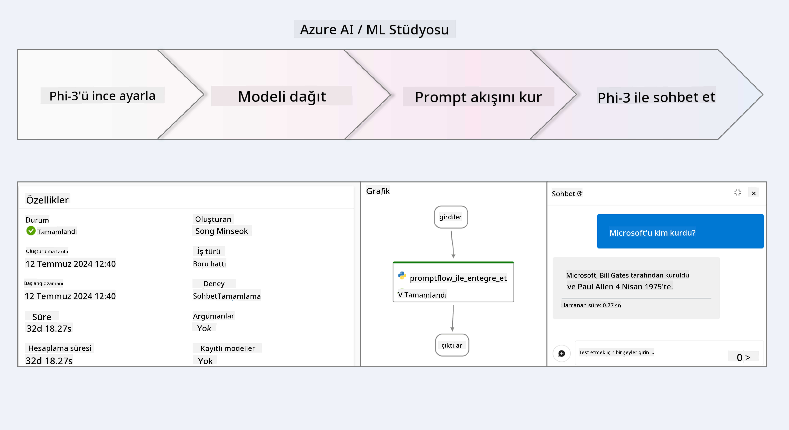

### İçindekiler

1. **[Senaryo 1: Azure kaynaklarını kurun ve ince ayar için hazırlanın](../../../../../../md/02.Application/01.TextAndChat/Phi3)**
    - [Azure Machine Learning Workspace oluşturun](../../../../../../md/02.Application/01.TextAndChat/Phi3)
    - [Azure Aboneliğinde GPU kotalarını talep edin](../../../../../../md/02.Application/01.TextAndChat/Phi3)
    - [Rol ataması ekleyin](../../../../../../md/02.Application/01.TextAndChat/Phi3)
    - [Projeyi kurun](../../../../../../md/02.Application/01.TextAndChat/Phi3)
    - [İnce ayar için veri setini hazırlayın](../../../../../../md/02.Application/01.TextAndChat/Phi3)

1. **[Senaryo 2: Phi-3 modelini ince ayar yapın ve Azure Machine Learning Studio'da dağıtın](../../../../../../md/02.Application/01.TextAndChat/Phi3)**
    - [Phi-3 modelini ince ayar yapın](../../../../../../md/02.Application/01.TextAndChat/Phi3)
    - [İnce ayar yapılmış Phi-3 modelini dağıtın](../../../../../../md/02.Application/01.TextAndChat/Phi3)

1. **[Senaryo 3: Prompt flow ile entegre edin ve Azure AI Foundry'de özel modelinizle sohbet edin](../../../../../../md/02.Application/01.TextAndChat/Phi3)**
    - [Özel Phi-3 modelini Prompt flow ile entegre edin](../../../../../../md/02.Application/01.TextAndChat/Phi3)
    - [Özel Phi-3 modelinizle sohbet edin](../../../../../../md/02.Application/01.TextAndChat/Phi3)

## Senaryo 1: Azure kaynaklarını kurun ve ince ayar için hazırlanın

### Azure Machine Learning Workspace oluşturun

1. Portal sayfasının üst kısmındaki **arama çubuğuna** *azure machine learning* yazın ve çıkan seçeneklerden **Azure Machine Learning**'i seçin.

    

2. Gezinti menüsünden **+ Oluştur**'u seçin.

3. Gezinti menüsünden **Yeni çalışma alanı**'nı seçin.

    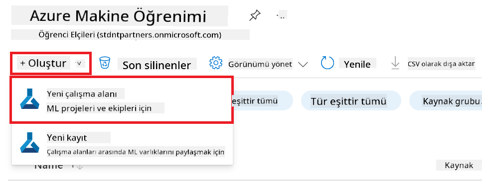

4. Aşağıdaki görevleri gerçekleştirin:

    - Azure **Aboneliğinizi** seçin.
    - Kullanmak istediğiniz **Kaynak grubunu** seçin (gerekirse yeni bir tane oluşturun).
    - **Çalışma Alanı Adı** girin. Benzersiz bir değer olmalıdır.
    - Kullanmak istediğiniz **Bölgeyi** seçin.
    - Kullanmak istediğiniz **Depolama hesabını** seçin (gerekirse yeni bir tane oluşturun).
    - Kullanmak istediğiniz **Anahtar kasasını** seçin (gerekirse yeni bir tane oluşturun).
    - Kullanmak istediğiniz **Uygulama içgörülerini** seçin (gerekirse yeni bir tane oluşturun).
    - Kullanmak istediğiniz **Kapsayıcı kayıt defterini** seçin (gerekirse yeni bir tane oluşturun).

    

5. **İncele + oluştur**'u seçin.

6. **Oluştur**'u seçin.

### Azure Aboneliğinde GPU kotalarını talep edin

Bu öğreticide, Phi-3 modelini ince ayar yapmak ve dağıtmak için GPU'lar kullanılacaktır. İnce ayar için *Standard_NC24ads_A100_v4* GPU'sunu kullanacaksınız, bu da kota talebini gerektirir. Dağıtım için ise *Standard_NC6s_v3* GPU'sunu kullanacaksınız; bu da kota talebini gerektirir.

> [!NOTE]
>
> Yalnızca Ödemeye Göre (Pay-As-You-Go) abonelikler (standart abonelik türü) GPU tahsisi için uygundur; avantaj abonelikleri şu anda desteklenmemektedir.
>

1. [Azure ML Studio](https://ml.azure.com/home?wt.mc_id=studentamb_279723) adresine gidin.

1. *Standard NCADSA100v4 Family* kotasını talep etmek için aşağıdaki görevleri gerçekleştirin:

    - Sol taraftaki sekmeden **Kota**'yı seçin.
    - Kullanılacak **Sanal makine ailesi**ni seçin. Örneğin, *Standard_NC24ads_A100_v4* GPU'sunu içeren **Standard NCADSA100v4 Family Cluster Dedicated vCPU** ailesini seçin.
    - Gezinti menüsünden **Kota talep et**'i seçin.

        

    - Kota talep sayfasında, kullanmak istediğiniz **Yeni çekirdek limiti** değerini girin. Örnek: 24.
    - Kota talep sayfasında, GPU kotalarını talep etmek için **Gönder**'i seçin.

1. *Standard NCSv3 Family* kotasını talep etmek için aşağıdaki görevleri gerçekleştirin:

    - Sol taraftaki sekmeden **Kota**'yı seçin.
    - Kullanılacak **Sanal makine ailesi**ni seçin. Örneğin, *Standard_NC6s_v3* GPU'sunu içeren **Standard NCSv3 Family Cluster Dedicated vCPU** ailesini seçin.
    - Gezinti menüsünden **Kota talep et**'i seçin.
    - Kota talep sayfasında, kullanmak istediğiniz **Yeni çekirdek limiti** değerini girin. Örnek: 24.
    - Kota talep sayfasında, GPU kotalarını talep etmek için **Gönder**'i seçin.

### Rol ataması ekleyin

Modellerinizi ince ayar yapmak ve dağıtmak için önce bir Kullanıcı Atanmış Yönetilen Kimlik (UAI) oluşturmalı ve ona uygun izinleri vermelisiniz. Bu UAI, dağıtım sırasında kimlik doğrulama için kullanılacaktır.

#### Kullanıcı Atanmış Yönetilen Kimlik (UAI) oluşturun

1. Portal sayfasının üst kısmındaki **arama çubuğuna** *managed identities* yazın ve çıkan seçeneklerden **Managed Identities**'i seçin.

    

1. **+ Oluştur**'u seçin.

    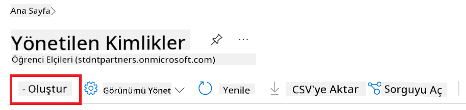

1. Aşağıdaki görevleri gerçekleştirin:

    - Azure **Aboneliğinizi** seçin.
    - Kullanmak istediğiniz **Kaynak grubunu** seçin (gerekirse yeni oluşturun).
    - Kullanmak istediğiniz **Bölgeyi** seçin.
    - **Ad** girin. Benzersiz bir değer olmalıdır.

    

1. **İncele + oluştur**'u seçin.

1. **+ Oluştur**'u seçin.

#### Yönetilen Kimlik için Katkıda Bulunan rolü atanması ekleyin

1. Oluşturduğunuz Yönetilen Kimlik kaynağına gidin.

1. Sol taraftaki sekmeden **Azure rol atamaları**'nı seçin.

1. Gezinti menüsünden **+ Rol ataması ekle**'yi seçin.

1. Rol ataması ekle sayfasında aşağıdaki görevleri yapın:
    - **Kapsam** olarak **Kaynak grubu**'nu seçin.
    - Azure **Aboneliğinizi** seçin.
    - Kullanmak istediğiniz **Kaynak grubunu** seçin.
    - **Rol** olarak **Katkıda Bulunan** (Contributor) seçin.

    

2. **Kaydet**'i seçin.

#### Yönetilen Kimlik için Storage Blob Data Reader rol atamasını ekleyin

1. Portal sayfasının üst kısmındaki **arama çubuğuna** *storage accounts* yazın ve çıkan seçeneklerden **Storage accounts**'u seçin.

    

1. Oluşturduğunuz Azure Machine Learning çalışma alanıyla ilişkili depolama hesabını seçin. Örneğin, *finetunephistorage*.

1. Rol ataması ekleme sayfasına gitmek için aşağıdaki görevleri yapın:

    - Oluşturduğunuz Azure Depolama hesabına gidin.
    - Sol taraftaki sekmeden **Erişim Denetimi (IAM)**'yı seçin.
    - Gezinti menüsünden **+ Ekle**'yi seçin.
    - Gezinti menüsünden **Rol ataması ekle**'yi seçin.

    

1. Rol ataması ekle sayfasında aşağıdaki görevleri yapın:

    - Rol sayfasında **arama çubuğuna** *Storage Blob Data Reader* yazın ve çıkan seçeneklerden **Storage Blob Data Reader**'ı seçin.
    - Rol sayfasında **İleri**'yi seçin.
    - Üyeler sayfasında **Erişimi ata** olarak **Yönetilen kimlik**'i seçin.
    - Üyeler sayfasında **+ Üyeleri seç**'i seçin.
    - Yönetilen kimlik seçme sayfasında Azure **Aboneliğinizi** seçin.
    - Yönetilen kimlik seçme sayfasında **Yönetilen kimlik** olarak **Manage Identity**'yi seçin.
    - Yönetilen kimlik seçme sayfasında oluşturduğunuz Yönetilen Kimliği seçin. Örneğin, *finetunephi-managedidentity*.
    - Yönetilen kimlik seçme sayfasında **Seç**'i seçin.

    

1. **İncele + ata**'yı seçin.

#### Yönetilen Kimlik için AcrPull rol ataması ekleyin

1. Portal sayfasının üst kısmındaki **arama çubuğuna** *container registries* yazın ve çıkan seçeneklerden **Container registries**'i seçin.

    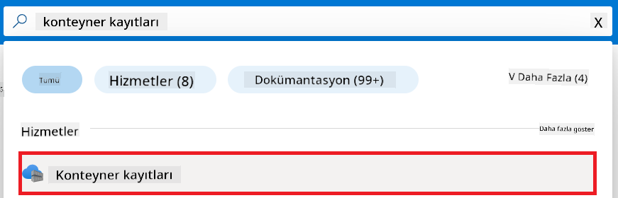

1. Azure Machine Learning çalışma alanıyla ilişkili kapsayıcı kayıt defterini seçin. Örneğin, *finetunephicontainerregistry*.

1. Rol ataması ekleme sayfasına gitmek için aşağıdaki görevleri yapın:

    - Sol taraftaki sekmeden **Erişim Denetimi (IAM)**'ı seçin.
    - Gezinti menüsünden **+ Ekle**'yi seçin.
    - Gezinti menüsünden **Rol ataması ekle**'yi seçin.

1. Rol ataması ekle sayfasında aşağıdaki görevleri yapın:

    - Rol sayfasında **arama çubuğuna** *AcrPull* yazın ve çıkan seçeneklerden **AcrPull**'u seçin.
    - Rol sayfasında **İleri**'yi seçin.
    - Üyeler sayfasında **Erişimi ata** olarak **Yönetilen kimlik**'i seçin.
    - Üyeler sayfasında **+ Üyeleri seç**'i seçin.
    - Yönetilen kimlik seçme sayfasında Azure **Aboneliğinizi** seçin.
    - Yönetilen kimlik seçme sayfasında **Yönetilen kimlik** olarak **Manage Identity**'yi seçin.
    - Yönetilen kimlik seçme sayfasında oluşturduğunuz Yönetilen Kimliği seçin. Örneğin, *finetunephi-managedidentity*.
    - Yönetilen kimlik seçme sayfasında **Seç**'i seçin.
    - **İncele + ata**'yı seçin.

### Projeyi kurun

İnce ayar için gereken veri setlerini indirmek üzere yerel bir ortam kuracaksınız.

Bu alıştırmada:

- İçinde çalışmak üzere bir klasör oluşturacaksınız.
- Sanal bir ortam oluşturacaksınız.
- Gerekli paketleri yükleyeceksiniz.
- Veri setini indirmek için *download_dataset.py* dosyası oluşturacaksınız.

#### İçinde çalışmak için bir klasör oluşturun

1. Bir terminal penceresi açın ve varsayılan yolda *finetune-phi* adlı bir klasör oluşturmak için aşağıdaki komutu yazın.

    ```console
    mkdir finetune-phi
    ```

2. Terminalinizde oluşturduğunuz *finetune-phi* klasörüne gitmek için aşağıdaki komutu yazın.

    ```console
    cd finetune-phi
    ```

#### Sanal ortam oluşturun

1. Terminalinizde *.venv* adlı bir sanal ortam oluşturmak için aşağıdaki komutu yazın.

    ```console
    python -m venv .venv
    ```

2. Terminalinizde sanal ortamı aktifleştirmek için aşağıdaki komutu yazın.

    ```console
    .venv\Scripts\activate.bat
    ```

> [!NOTE]
> Eğer başarılı olduysa, komut isteminden önce *(.venv)* görmelisiniz.

#### Gerekli paketleri yükleyin

1. Gerekli paketleri yüklemek için terminalinizde aşağıdaki komutları yazın.

    ```console
    pip install datasets==2.19.1
    ```

#### `download_dataset.py` dosyasını oluşturun

> [!NOTE]
> Tam klasör yapısı:
>
> ```text
> └── YourUserName
> .    └── finetune-phi
> .        └── download_dataset.py
> ```

1. **Visual Studio Code**'u açın.

1. Menü çubuğundan **File**'ı seçin.

1. **Open Folder**'ı seçin.

1. *finetune-phi* klasörünü seçin. Bu klasör *C:\Users\yourUserName\finetune-phi* yolunda bulunur.

    

1. Visual Studio Code'un sol panelinde sağ tıklayın ve *download_dataset.py* adında yeni bir dosya oluşturmak için **New File**'ı seçin.

    

### İnce ayar için veri setini hazırlayın

Bu egzersizde, *download_dataset.py* dosyasını çalıştırarak *ultrachat_200k* veri kümelerini yerel ortamınıza indireceksiniz. Daha sonra bu veri kümelerini Azure Machine Learning içinde Phi-3 modelini ince ayar yapmak için kullanacaksınız.

Bu egzersizde yapacaklarınız:

- *download_dataset.py* dosyasına veri kümelerini indirmek için kod eklemek.
- *download_dataset.py* dosyasını çalıştırarak veri kümelerini yerel ortamınıza indirmek.

#### *download_dataset.py* kullanarak veri kümenizi indirin

1. *download_dataset.py* dosyasını Visual Studio Code'da açın.

1. Aşağıdaki kodu *download_dataset.py* dosyasına ekleyin.

    ```python
    import json
    import os
    from datasets import load_dataset

    def load_and_split_dataset(dataset_name, config_name, split_ratio):
        """
        Load and split a dataset.
        """
        # Belirtilen isim, yapılandırma ve bölme oranı ile veri setini yükle
        dataset = load_dataset(dataset_name, config_name, split=split_ratio)
        print(f"Original dataset size: {len(dataset)}")
        
        # Veri setini eğitim ve test setlerine böl (yüzde 80 eğitim, yüzde 20 test)
        split_dataset = dataset.train_test_split(test_size=0.2)
        print(f"Train dataset size: {len(split_dataset['train'])}")
        print(f"Test dataset size: {len(split_dataset['test'])}")
        
        return split_dataset

    def save_dataset_to_jsonl(dataset, filepath):
        """
        Save a dataset to a JSONL file.
        """
        # Dizini yoksa oluştur
        os.makedirs(os.path.dirname(filepath), exist_ok=True)
        
        # Dosyayı yazma modunda aç
        with open(filepath, 'w', encoding='utf-8') as f:
            # Veri setindeki her kaydı yinele
            for record in dataset:
                # Kaydı JSON nesnesi olarak dök ve dosyaya yaz
                json.dump(record, f)
                # Kayıtları ayırmak için yeni satır karakteri yaz
                f.write('\n')
        
        print(f"Dataset saved to {filepath}")

    def main():
        """
        Main function to load, split, and save the dataset.
        """
        # ULTRACHAT_200k veri setini belirli bir yapılandırma ve bölme oranı ile yükle ve böl
        dataset = load_and_split_dataset("HuggingFaceH4/ultrachat_200k", 'default', 'train_sft[:1%]')
        
        # Bölmeden eğitim ve test veri setlerini çıkar
        train_dataset = dataset['train']
        test_dataset = dataset['test']

        # Eğitim veri setini bir JSONL dosyasına kaydet
        save_dataset_to_jsonl(train_dataset, "data/train_data.jsonl")
        
        # Test veri setini ayrı bir JSONL dosyasına kaydet
        save_dataset_to_jsonl(test_dataset, "data/test_data.jsonl")

    if __name__ == "__main__":
        main()

    ```

1. Terminalinizde aşağıdaki komutu yazarak scripti çalıştırın ve veri kümesini yerel ortamınıza indirin.

    ```console
    python download_dataset.py
    ```

1. Veri kümelerinin yerel *finetune-phi/data* dizinine başarıyla kaydedildiğini doğrulayın.

> [!NOTE]
>
> #### Veri kümesi boyutu ve ince ayar süresi hakkında not
>
> Bu öğreticide, veri kümesinin sadece %1'ini (`split='train[:1%]'`) kullanıyorsunuz. Bu, veri miktarını önemli ölçüde azaltır ve yükleme ile ince ayar süreçlerini hızlandırır. Eğitim süresi ile model performansı arasında doğru dengeyi bulmak için yüzdeyi ayarlayabilirsiniz. Daha küçük bir veri kümesi alt kümesi kullanmak, ince ayar süresini azaltır ve öğreticiyi daha yönetilebilir hale getirir.

## Senaryo 2: Phi-3 modelini ince ayar yapın ve Azure Machine Learning Studio'da Yayınlayın

### Phi-3 modelini ince ayar yapın

Bu egzersizde, Phi-3 modelini Azure Machine Learning Studio'da ince ayar yapacaksınız.

Bu egzersizde yapacaklarınız:

- İnce ayar için bilgisayar kümesi oluşturmak.
- Azure Machine Learning Studio'da Phi-3 modelini ince ayar yapmak.

#### İnce ayar için bilgisayar kümesi oluşturun

1. [Azure ML Studio](https://ml.azure.com/home?wt.mc_id=studentamb_279723) sitesini ziyaret edin.

1. Sol taraftaki sekmeden **Compute**'u seçin.

1. Navigasyon menüsünden **Compute clusters**'ı seçin.

1. **+ New**'i seçin.

    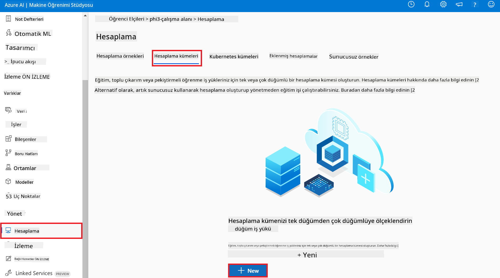

1. Şu işlemleri yapın:

    - Kullanmak istediğiniz **Region**'u seçin.
    - **Virtual machine tier** olarak **Dedicated** seçin.
    - **Virtual machine type** olarak **GPU** seçin.
    - **Virtual machine size** filtresini **Select from all options** olarak ayarlayın.
    - **Virtual machine size** olarak **Standard_NC24ads_A100_v4**'ü seçin.

    

1. **Next**'i seçin.

1. Şu işlemleri yapın:

    - **Compute name**'i yazın. Bu benzersiz bir değer olmalıdır.
    - **Minimum number of nodes**'u **0** olarak seçin.
    - **Maximum number of nodes**'u **1** olarak seçin.
    - **Idle seconds before scale down**'u **120** olarak seçin.

    

1. **Create**'i seçin.

#### Phi-3 modelini ince ayar yapın

1. [Azure ML Studio](https://ml.azure.com/home?wt.mc_id=studentamb_279723) sitesini ziyaret edin.

1. Oluşturduğunuz Azure Machine Learning çalışma alanını seçin.

    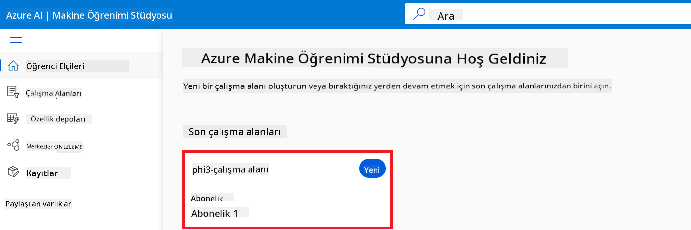

1. Şu işlemleri yapın:

    - Sol taraftaki sekmeden **Model catalog**'u seçin.
    - **Arama çubuğuna** *phi-3-mini-4k* yazın ve çıkan seçeneklerden **Phi-3-mini-4k-instruct**'ı seçin.

    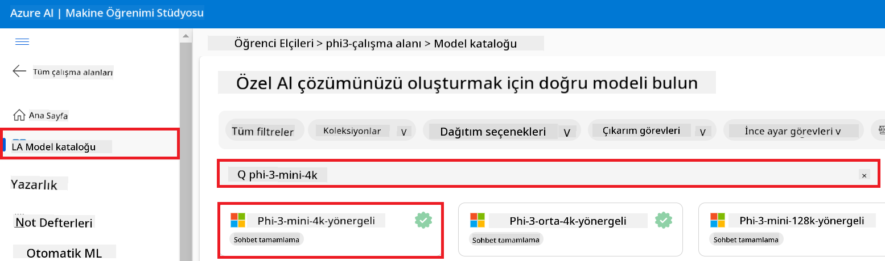

1. Navigasyon menüsünden **Fine-tune**'u seçin.

    

1. Şu işlemleri yapın:

    - **Select task type**'ı **Chat completion** olarak ayarlayın.
    - **+ Select data**'yı seçerek **Eğitim verisi** yükleyin.
    - Doğrulama verisi yükleme türünü **Provide different validation data** olarak seçin.
    - **+ Select data**'yı seçerek **Doğrulama verisi** yükleyin.

    

> [!TIP]
>
> İleri ayarlar bölümünden (**Advanced settings**) **learning_rate** ve **lr_scheduler_type** gibi ayarları özelleştirerek ince ayar sürecini ihtiyacınıza göre optimize edebilirsiniz.

1. **Finish**'i seçin.

1. Bu egzersizde, Azure Machine Learning kullanarak Phi-3 modelini başarıyla ince ayar yaptınız. Lütfen ince ayar işleminin önemli bir süre alabileceğini unutmayın. İnce ayar işi çalıştırıldıktan sonra tamamlanmasını beklemeniz gerekmektedir. İnce ayar işinin durumunu Azure Machine Learning Çalışma Alanınızın sol tarafındaki İşler (Jobs) sekmesinden takip edebilirsiniz. Bir sonraki bölümde, ince ayar yapılmış modeli yayınlayacak ve Prompt flow ile entegre edeceksiniz.

    

### İnce ayarlanmış Phi-3 modelini yayınlayın

İnce ayarlanmış Phi-3 modelini Prompt flow ile entegre etmek için modeli gerçek zamanlı çıkarım için erişilebilir hale getirmeniz gerekir. Bu işlem modelin kaydedilmesini, çevrimiçi bir uç nokta oluşturulmasını ve modelin dağıtımını içerir.

Bu egzersizde yapacaklarınız:

- Azure Machine Learning çalışma alanında ince ayar yapılmış modeli kaydetmek.
- Çevrimiçi bir uç nokta oluşturmak.
- Kaydedilmiş ince ayar yapılmış Phi-3 modelini dağıtmak.

#### İnce ayar yapılmış modeli kaydedin

1. [Azure ML Studio](https://ml.azure.com/home?wt.mc_id=studentamb_279723) sitesini ziyaret edin.

1. Oluşturduğunuz Azure Machine Learning çalışma alanını seçin.

    

1. Sol taraftaki sekmeden **Models**'i seçin.
1. **+ Register**'ı seçin.
1. **From a job output**'u seçin.

    

1. Oluşturduğunuz işi seçin.

    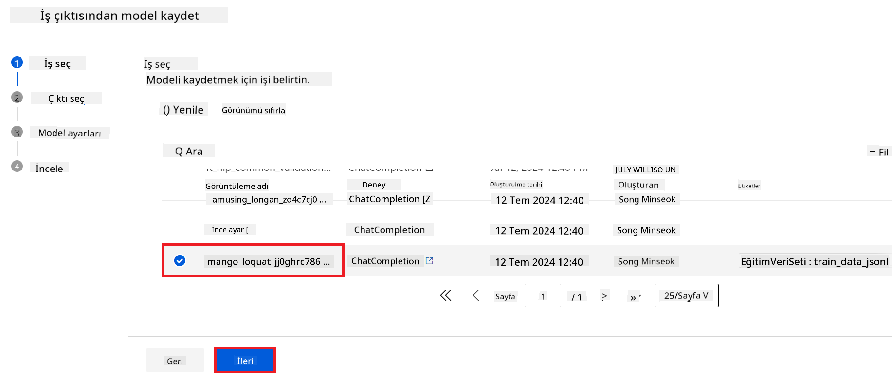

1. **Next**'i seçin.

1. **Model type** olarak **MLflow**'u seçin.

1. **Job output**'un seçili olduğundan emin olun; otomatik seçili olmalıdır.

    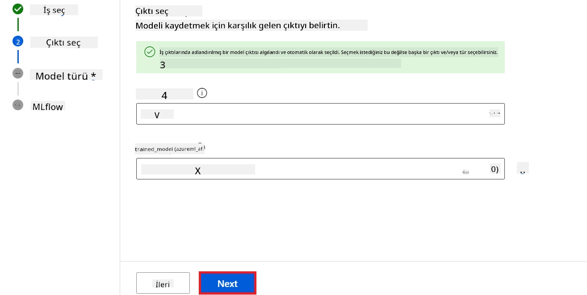

2. **Next**'i seçin.

3. **Register**'ı seçin.

    

4. Kayıtlı modelinizi sol taraftaki sekmeden **Models** menüsüne giderek görebilirsiniz.

    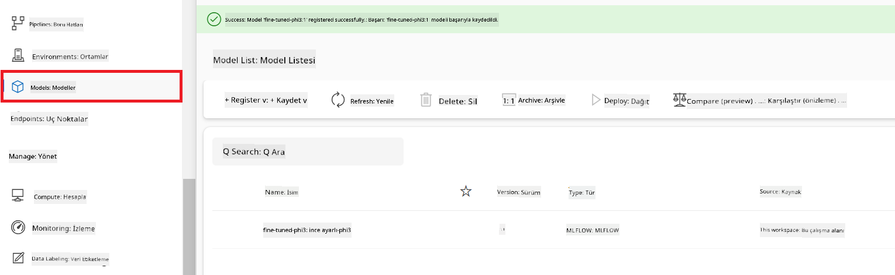

#### İnce ayarlanmış modeli yayınlayın

1. Oluşturduğunuz Azure Machine Learning çalışma alanına gidin.

1. Sol taraftaki sekmeden **Endpoints**'i seçin.

1. Navigasyon menüsünden **Real-time endpoints**'i seçin.

    

1. **Create**'i seçin.

1. Oluşturduğunuz kayıtlı modeli seçin.

    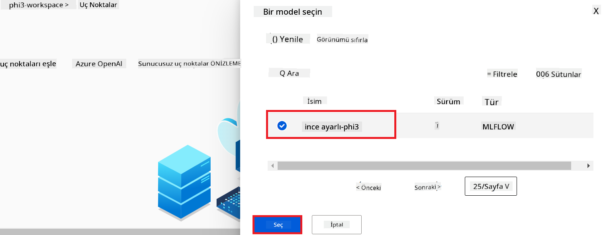

1. **Select**'i seçin.

1. Şu işlemleri yapın:

    - **Virtual machine** olarak *Standard_NC6s_v3*'ü seçin.
    - Kullanmaya karar verdiğiniz **Instance count** değerini seçin. Örneğin, *1*.
    - Uç nokta için **Endpoint**'i **New** olarak seçin.
    - **Endpoint name** girin. Benzersiz bir değer olmalıdır.
    - **Deployment name** girin. Benzersiz bir değer olmalıdır.

    

1. **Deploy**'ı seçin.

> [!WARNING]
> Hesabınıza ek ücretler yansımasını önlemek için Azure Machine Learning çalışma alanında oluşturduğunuz uç noktayı silmeyi unutmayın.
>

#### Azure Machine Learning Çalışma Alanında dağıtım durumunu kontrol edin

1. Oluşturduğunuz Azure Machine Learning çalışma alanına gidin.

1. Sol taraftaki sekmeden **Endpoints**'i seçin.

1. Oluşturduğunuz uç noktayı seçin.

    

1. Bu sayfada, dağıtım sürecinde uç noktaları yönetebilirsiniz.

> [!NOTE]
> Dağıtım tamamlandığında, **Live traffic** ayarının **%100** olduğundan emin olun. Değilse, trafik ayarlarını değiştirmek için **Update traffic** seçeneğini kullanın. Trafik %0 iken modeli test edemezsiniz.
>
> 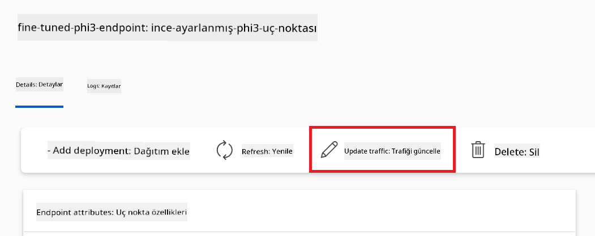
>

## Senaryo 3: Prompt flow ile entegrasyon ve özel modelinizle Azure AI Foundry'de sohbet

### Özel Phi-3 modelini Prompt flow ile entegre edin

İnce ayarlı modelinizi başarıyla yayınladıktan sonra, Prompt Flow ile entegre ederek modelinizi gerçek zamanlı uygulamalarda kullanabilir ve özel Phi-3 modelinizle çeşitli etkileşimli görevler gerçekleştirebilirsiniz.

Bu egzersizde yapacaklarınız:

- Azure AI Foundry Hub oluşturmak.
- Azure AI Foundry Projesi oluşturmak.
- Prompt flow oluşturmak.
- İnce ayarlı Phi-3 modeli için özel bağlantı eklemek.
- Özel Phi-3 modelinizle sohbet etmek için Prompt flow'u yapılandırmak.

> [!NOTE]
> Azure ML Studio kullanarak da Promptflow ile entegre olabilirsiniz. Aynı entegrasyon süreci Azure ML Studio için de geçerlidir.

#### Azure AI Foundry Hub oluşturun

Proje oluşturmadan önce bir Hub oluşturmalısınız. Hub, kaynak grubu gibi davranarak Azure AI Foundry içinde birden fazla projeyi organize etmenize ve yönetmenize olanak tanır.

1. [Azure AI Foundry](https://ai.azure.com/?WT.mc_id=aiml-137032-kinfeylo) sitesini ziyaret edin.

1. Sol taraftaki sekmeden **All hubs**'u seçin.

1. Navigasyon menüsünden **+ New hub**'ı seçin.


1. Aşağıdaki görevleri gerçekleştirin:

    - **Hub adı** girin. Benzersiz bir değer olmalıdır.
    - Azure **Aboneliğinizi** seçin.
    - Kullanılacak **Kaynak grubunu** seçin (gerekirse yenisini oluşturun).
    - Kullanmak istediğiniz **Konumu** seçin.
    - Kullanılacak **Azure AI Hizmetlerini Bağla** seçin (gerekirse yenisini oluşturun).
    - **Azure AI Arama Bağlantısı** için **Bağlantıyı atla** seçin.


1. **İleri** seçeneğini tıklayın.

#### Azure AI Foundry Projesi Oluşturma

1. Oluşturduğunuz Hub'da, sol taraftaki sekmeden **Tüm projeler**i seçin.

1. Gezinme menüsünden **+ Yeni proje** seçin.


1. **Proje adı** girin. Benzersiz bir değer olmalıdır.

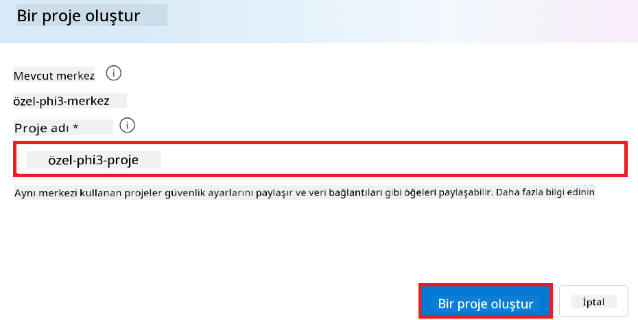

1. **Bir proje oluştur** seçeneğini tıklayın.

#### Fine-tuning yapılmış Phi-3 modeli için özel bağlantı ekleme

Özel Phi-3 modelinizi Prompt flow ile entegre etmek için modelin uç noktası ve anahtarını özel bir bağlantıda kaydetmeniz gerekmektedir. Bu kurulum, Prompt flow'da özel Phi-3 modelinize erişim sağlar.

#### Fine-tuning yapılmış Phi-3 modelinin api anahtarı ve uç nokta URI'sını ayarlama

1. [Azure ML Studio](https://ml.azure.com/home?WT.mc_id=aiml-137032-kinfeylo) sitesine gidin.

1. Oluşturduğunuz Azure Makine öğrenimi çalışma alanına gidin.

1. Sol taraftaki sekmeden **Uç Noktalar**ı seçin.


1. Oluşturduğunuz uç noktayı seçin.


1. Gezinme menüsünden **Tüket** seçeneğini seçin.

1. **REST uç noktası** ve **Birincil anahtarı** kopyalayın.


#### Özel Bağlantı Ekleme

1. [Azure AI Foundry](https://ai.azure.com/?WT.mc_id=aiml-137032-kinfeylo) sitesine gidin.

1. Oluşturduğunuz Azure AI Foundry projesine gidin.

1. Oluşturduğunuz projede, sol taraftaki sekmeden **Ayarlar**ı seçin.

1. **+ Yeni bağlantı** seçeneğini seçin.

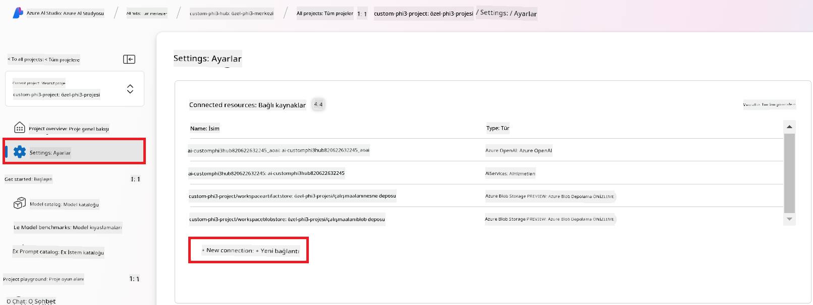

1. Gezinme menüsünden **Özel anahtarlar**ı seçin.

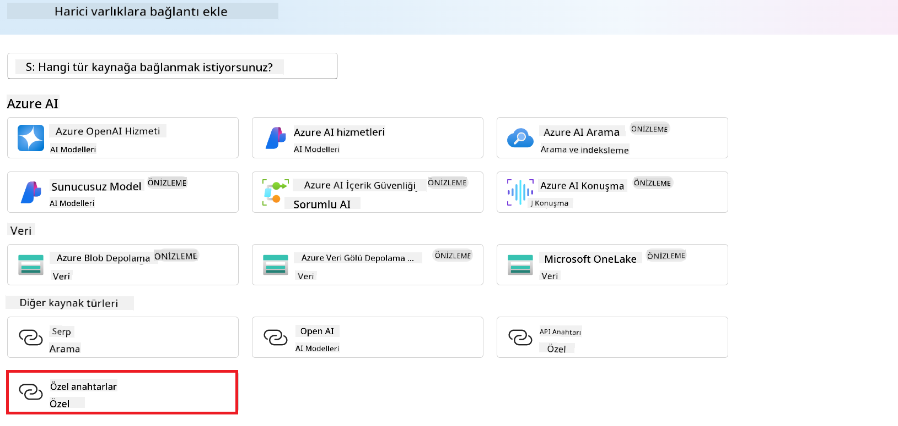

1. Aşağıdaki görevleri gerçekleştirin:

    - **+ Anahtar değer çiftleri ekle** seçin.
    - Anahtar adı olarak **endpoint** girin ve Azure ML Studio'dan kopyaladığınız uç noktayı değer alanına yapıştırın.
    - Tekrar **+ Anahtar değer çiftleri ekle** seçin.
    - Anahtar adı olarak **key** girin ve Azure ML Studio'dan kopyaladığınız anahtarı değer alanına yapıştırın.
    - Anahtarları ekledikten sonra, anahtarın görünmesini engellemek için **gizli olarak işaretle** seçeneğini seçin.


1. **Bağlantı ekle** seçeneğini tıklayın.

#### Prompt flow oluşturma

Azure AI Foundry'de özel bir bağlantı eklediniz. Şimdi aşağıdaki adımları kullanarak bir Prompt flow oluşturalım. Daha sonra bu Prompt flow'u özel bağlantıya bağlayarak fine-tuning yapılmış modeli Prompt flow içerisinde kullanabileceksiniz.

1. Oluşturduğunuz Azure AI Foundry projesine gidin.

1. Sol taraftaki sekmeden **Prompt flow** seçin.

1. Gezinme menüsünden **+ Oluştur** seçeneğini tıklayın.


1. Gezinme menüsünden **Sohbet akışı** seçeneğini seçin.


1. Kullanmak istediğiniz **Klasör adını** girin.


2. **Oluştur** seçeneğini tıklayın.

#### Prompt flow'u fine-tuning yapılmış Phi-3 modelinizle sohbet için ayarlama

Fine-tuning yapılmış Phi-3 modelini Prompt flow'a entegre etmeniz gerekiyor. Ancak, mevcut sağlanan Prompt flow bunun için tasarlanmamıştır. Bu nedenle, özel modelin entegrasyonunu mümkün kılmak amacıyla Prompt flow'u yeniden tasarlamalısınız.

1. Prompt flow'da, mevcut akışı yeniden oluşturmak için şu görevleri gerçekleştirin:

    - **Ham dosya modu**nu seçin.
    - *flow.dag.yml* dosyasındaki tüm mevcut kodu silin.
    - Aşağıdaki kodu *flow.dag.yml* dosyasına ekleyin.

        ```yml
        inputs:
          input_data:
            type: string
            default: "Who founded Microsoft?"

        outputs:
          answer:
            type: string
            reference: ${integrate_with_promptflow.output}

        nodes:
        - name: integrate_with_promptflow
          type: python
          source:
            type: code
            path: integrate_with_promptflow.py
          inputs:
            input_data: ${inputs.input_data}
        ```

    - **Kaydet** seçeneğini tıklayın.


1. Prompt flow'da özel Phi-3 modelini kullanmak için *integrate_with_promptflow.py* dosyasına aşağıdaki kodu ekleyin.

    ```python
    import logging
    import requests
    from promptflow import tool
    from promptflow.connections import CustomConnection

    # Günlük kaydı kurulumu
    logging.basicConfig(
        format="%(asctime)s - %(levelname)s - %(name)s - %(message)s",
        datefmt="%Y-%m-%d %H:%M:%S",
        level=logging.DEBUG
    )
    logger = logging.getLogger(__name__)

    def query_phi3_model(input_data: str, connection: CustomConnection) -> str:
        """
        Send a request to the Phi-3 model endpoint with the given input data using Custom Connection.
        """

        # "connection", Özel Bağlantının adıdır, "endpoint", "key" Özel Bağlantıdaki anahtarlardır
        endpoint_url = connection.endpoint
        api_key = connection.key

        headers = {
            "Content-Type": "application/json",
            "Authorization": f"Bearer {api_key}"
        }
        data = {
            "input_data": {
                "input_string": [
                    {"role": "user", "content": input_data}
                ],
                "parameters": {
                    "temperature": 0.7,
                    "max_new_tokens": 128
                }
            }
        }
        try:
            response = requests.post(endpoint_url, json=data, headers=headers)
            response.raise_for_status()
            
            # Tam JSON yanıtını günlükle
            logger.debug(f"Full JSON response: {response.json()}")

            result = response.json()["output"]
            logger.info("Successfully received response from Azure ML Endpoint.")
            return result
        except requests.exceptions.RequestException as e:
            logger.error(f"Error querying Azure ML Endpoint: {e}")
            raise

    @tool
    def my_python_tool(input_data: str, connection: CustomConnection) -> str:
        """
        Tool function to process input data and query the Phi-3 model.
        """
        return query_phi3_model(input_data, connection)

    ```


> [!NOTE]
> Azure AI Foundry'de Prompt flow kullanımı hakkında daha ayrıntılı bilgi için [Azure AI Foundry'de Prompt flow](https://learn.microsoft.com/azure/ai-studio/how-to/prompt-flow) sayfasına bakabilirsiniz.

1. Modelinizle sohbeti etkinleştirmek için **Sohbet girişi**, **Sohbet çıkışı** seçeneklerini seçin.


1. Artık özel Phi-3 modelinizle sohbet etmeye hazırsınız. Bir sonraki egzersizde, Prompt flow'u nasıl başlatacağınızı ve fine-tuning yapılmış Phi-3 modelinizle nasıl sohbet edeceğinizi öğreneceksiniz.

> [!NOTE]
>
> Yeniden oluşturulan akış aşağıdaki görseldeki gibi olmalıdır:
>
> 
>

### Özel Phi-3 modelinizle sohbet etme

Fine-tuning işlemini tamamlayıp özel Phi-3 modelinizi Prompt flow ile entegre ettiğinize göre, modelinizle etkileşim başlatmaya hazırsınız. Bu egzersiz, Prompt flow kullanarak modelinizle sohbeti ayarlayıp başlatma sürecini size adım adım gösterecektir. Bu adımları izleyerek, fine-tuning yapılmış Phi-3 modelinizin çeşitli görevler ve sohbetler için yeteneklerini tam olarak kullanabileceksiniz.

- Prompt flow kullanarak özel Phi-3 modelinizle sohbet edin.

#### Prompt flow'u başlatma

1. Prompt flow'u başlatmak için **Hesaplama oturumlarını başlat** seçeneğini tıklayın.


1. Parametreleri yenilemek için **Girişi doğrula ve ayrıştır** seçeneğini seçin.

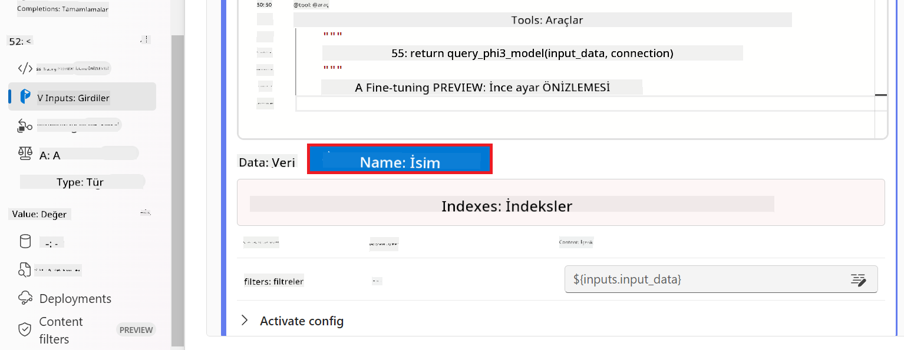

1. Oluşturduğunuz özel bağlantıya ait **connection** değerini seçin. Örneğin, *connection*.


#### Özel modelinizle sohbet edin

1. **Sohbet** seçeneğini seçin.


1. İşte sonuçlara bir örnek: Artık özel Phi-3 modelinizle sohbet edebilirsiniz. Fine-tuning için kullanılan verilere dayalı sorular sorulması önerilir.

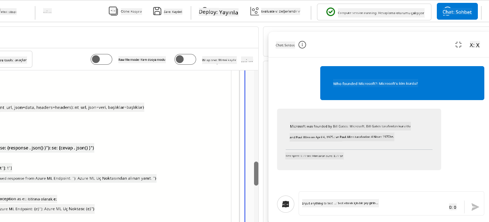

---

<!-- CO-OP TRANSLATOR DISCLAIMER START -->
**Feragatname**:
Bu belge, AI çeviri hizmeti [Co-op Translator](https://github.com/Azure/co-op-translator) kullanılarak çevrilmiştir. Doğruluk için çaba göstersek de, otomatik çevirilerin hatalar veya yanlışlıklar içerebileceğini lütfen unutmayınız. Orijinal belge, kendi dilinde otoritatif kaynak olarak kabul edilmelidir. Kritik bilgiler için profesyonel insan çevirisi tavsiye edilir. Bu çevirinin kullanımı sonucunda ortaya çıkabilecek herhangi bir yanlış anlama veya yanlış yorumdan sorumlu değiliz.
<!-- CO-OP TRANSLATOR DISCLAIMER END -->