<!--
CO_OP_TRANSLATOR_METADATA:
{
  "original_hash": "ecbd9179a21edbaafaf114d47f09f3e3",
  "translation_date": "2025-05-09T18:05:21+00:00",
  "source_file": "md/02.Application/01.TextAndChat/Phi3/E2E_Phi-3-FineTuning_PromptFlow_Integration_AIFoundry.md",
  "language_code": "tr"
}
-->
# Azure AI Foundry'de Prompt flow ile özel Phi-3 modellerini ince ayar yapma ve entegre etme

Bu uçtan uca (E2E) örnek, Microsoft Tech Community'den "[Fine-Tune and Integrate Custom Phi-3 Models with Prompt Flow in Azure AI Foundry](https://techcommunity.microsoft.com/t5/educator-developer-blog/fine-tune-and-integrate-custom-phi-3-models-with-prompt-flow-in/ba-p/4191726?WT.mc_id=aiml-137032-kinfeylo)" rehberine dayanmaktadır. Azure AI Foundry'de özel Phi-3 modellerinin ince ayar yapılması, dağıtılması ve Prompt flow ile entegrasyon süreçlerini tanıtmaktadır. Kodun yerel olarak çalıştırıldığı "[Fine-Tune and Integrate Custom Phi-3 Models with Prompt Flow](./E2E_Phi-3-FineTuning_PromptFlow_Integration.md)" E2E örneğinin aksine, bu eğitim tamamen Azure AI / ML Studio içinde modelinizi ince ayar yapma ve entegre etmeye odaklanmaktadır.

## Genel Bakış

Bu E2E örnekte, Phi-3 modelini nasıl ince ayar yapacağınızı ve Azure AI Foundry'de Prompt flow ile nasıl entegre edeceğinizi öğreneceksiniz. Azure AI / ML Studio'yu kullanarak, özel AI modellerini dağıtmak ve kullanmak için bir iş akışı oluşturacaksınız. Bu E2E örnek üç senaryoya ayrılmıştır:

**Senaryo 1: Azure kaynaklarını kurma ve ince ayar için hazırlık**

**Senaryo 2: Phi-3 modelini ince ayar yapma ve Azure Machine Learning Studio'da dağıtma**

**Senaryo 3: Prompt flow ile entegrasyon ve Azure AI Foundry'de özel modelinizle sohbet etme**

İşte bu E2E örneğin genel görünümü.

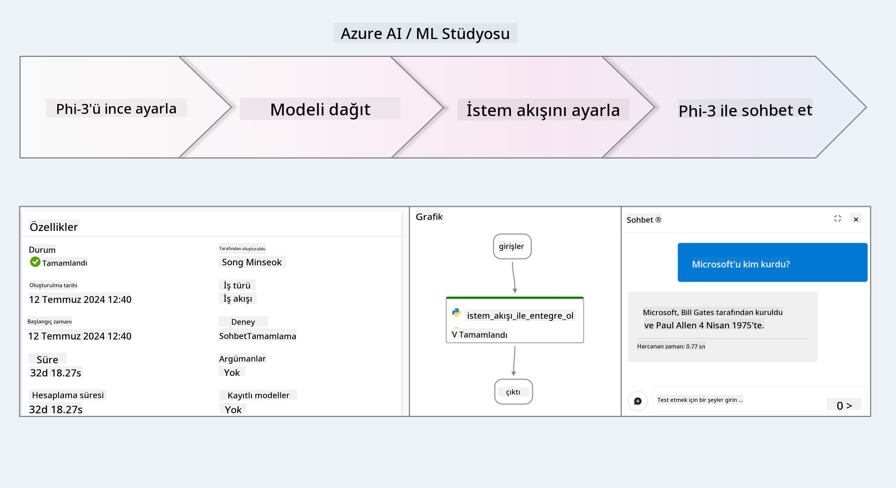

### İçindekiler

1. **[Senaryo 1: Azure kaynaklarını kurma ve ince ayar için hazırlık](../../../../../../md/02.Application/01.TextAndChat/Phi3)**
    - [Azure Machine Learning Workspace oluşturma](../../../../../../md/02.Application/01.TextAndChat/Phi3)
    - [Azure Aboneliğinde GPU kotası talep etme](../../../../../../md/02.Application/01.TextAndChat/Phi3)
    - [Rol ataması ekleme](../../../../../../md/02.Application/01.TextAndChat/Phi3)
    - [Projeyi kurma](../../../../../../md/02.Application/01.TextAndChat/Phi3)
    - [İnce ayar için veri setini hazırlama](../../../../../../md/02.Application/01.TextAndChat/Phi3)

1. **[Senaryo 2: Phi-3 modelini ince ayar yapma ve Azure Machine Learning Studio'da dağıtma](../../../../../../md/02.Application/01.TextAndChat/Phi3)**
    - [Phi-3 modelini ince ayar yapma](../../../../../../md/02.Application/01.TextAndChat/Phi3)
    - [İnce ayar yapılmış Phi-3 modelini dağıtma](../../../../../../md/02.Application/01.TextAndChat/Phi3)

1. **[Senaryo 3: Prompt flow ile entegrasyon ve Azure AI Foundry'de özel modelinizle sohbet etme](../../../../../../md/02.Application/01.TextAndChat/Phi3)**
    - [Özel Phi-3 modelini Prompt flow ile entegre etme](../../../../../../md/02.Application/01.TextAndChat/Phi3)
    - [Özel Phi-3 modelinizle sohbet etme](../../../../../../md/02.Application/01.TextAndChat/Phi3)

## Senaryo 1: Azure kaynaklarını kurma ve ince ayar için hazırlık

### Azure Machine Learning Workspace oluşturma

1. Portal sayfasının üstündeki **arama çubuğuna** *azure machine learning* yazın ve çıkan seçeneklerden **Azure Machine Learning**'i seçin.

    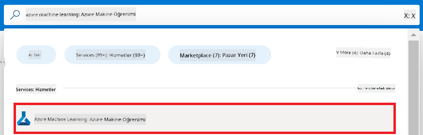

2. Navigasyon menüsünden **+ Create** seçeneğini tıklayın.

3. Navigasyon menüsünden **New workspace** seçeneğini seçin.

    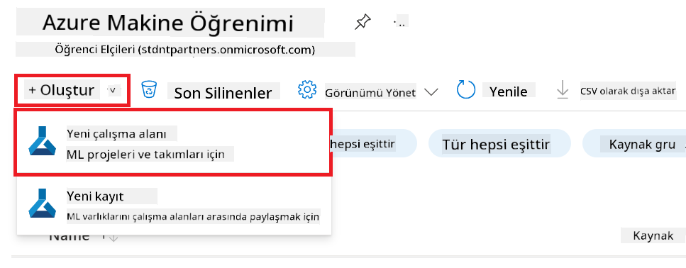

4. Aşağıdaki adımları gerçekleştirin:

    - Azure **Subscription**'ınızı seçin.
    - Kullanılacak **Resource group**'u seçin (gerekirse yenisini oluşturun).
    - **Workspace Name** girin. Benzersiz bir değer olmalıdır.
    - Kullanmak istediğiniz **Region**'u seçin.
    - Kullanılacak **Storage account**'u seçin (gerekirse yenisini oluşturun).
    - Kullanılacak **Key vault**'u seçin (gerekirse yenisini oluşturun).
    - Kullanılacak **Application insights**'ı seçin (gerekirse yenisini oluşturun).
    - Kullanılacak **Container registry**'yi seçin (gerekirse yenisini oluşturun).

    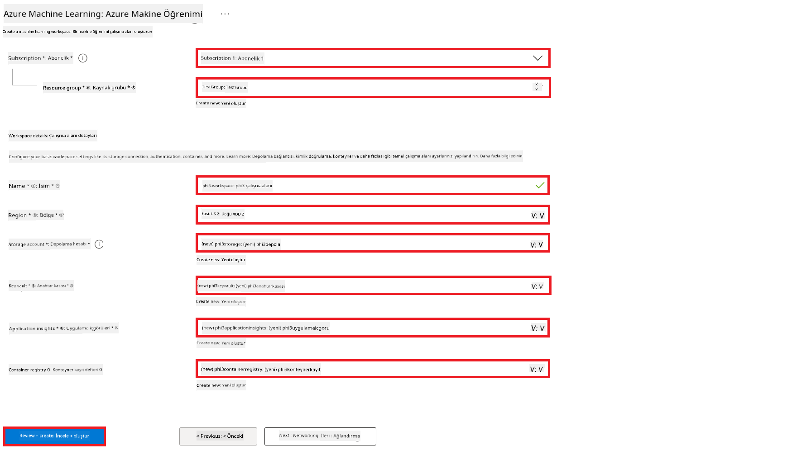

5. **Review + Create** seçeneğini tıklayın.

6. **Create** seçeneğini tıklayın.

### Azure Aboneliğinde GPU kotası talep etme

Bu eğitimde, Phi-3 modelini ince ayar yapmak ve dağıtmak için GPU'lar kullanılacaktır. İnce ayar için *Standard_NC24ads_A100_v4* GPU kullanılacak ve bu GPU için kota talebi yapılması gerekiyor. Dağıtım için ise *Standard_NC6s_v3* GPU kullanılacak ve bu GPU için de kota talebi yapılmalıdır.

> [!NOTE]
>
> Yalnızca Pay-As-You-Go abonelikleri (standart abonelik türü) GPU tahsisi için uygundur; avantaj abonelikleri şu anda desteklenmemektedir.
>

1. [Azure ML Studio](https://ml.azure.com/home?wt.mc_id=studentamb_279723) adresini ziyaret edin.

1. *Standard NCADSA100v4 Family* kotası talep etmek için aşağıdaki adımları izleyin:

    - Sol taraftaki sekmeden **Quota**'yı seçin.
    - Kullanılacak **Virtual machine family**'yi seçin. Örneğin, *Standard NCADSA100v4 Family Cluster Dedicated vCPUs* (bu, *Standard_NC24ads_A100_v4* GPU'yu içerir).
    - Navigasyon menüsünden **Request quota** seçeneğini seçin.

        

    - Request quota sayfasında, kullanmak istediğiniz **New cores limit** değerini girin. Örneğin, 24.
    - Request quota sayfasında **Submit** seçeneğini tıklayarak GPU kotası talebinde bulunun.

1. *Standard NCSv3 Family* kotası talep etmek için aşağıdaki adımları izleyin:

    - Sol taraftaki sekmeden **Quota**'yı seçin.
    - Kullanılacak **Virtual machine family**'yi seçin. Örneğin, *Standard NCSv3 Family Cluster Dedicated vCPUs* (bu, *Standard_NC6s_v3* GPU'yu içerir).
    - Navigasyon menüsünden **Request quota** seçeneğini seçin.
    - Request quota sayfasında, kullanmak istediğiniz **New cores limit** değerini girin. Örneğin, 24.
    - Request quota sayfasında **Submit** seçeneğini tıklayarak GPU kotası talebinde bulunun.

### Rol ataması ekleme

Modellerinizi ince ayar yapmak ve dağıtmak için öncelikle bir User Assigned Managed Identity (UAI) oluşturmanız ve ona uygun izinleri atamanız gerekir. Bu UAI, dağıtım sırasında kimlik doğrulama için kullanılacaktır.

#### User Assigned Managed Identity (UAI) oluşturma

1. Portal sayfasının üstündeki **arama çubuğuna** *managed identities* yazın ve çıkan seçeneklerden **Managed Identities**'i seçin.

    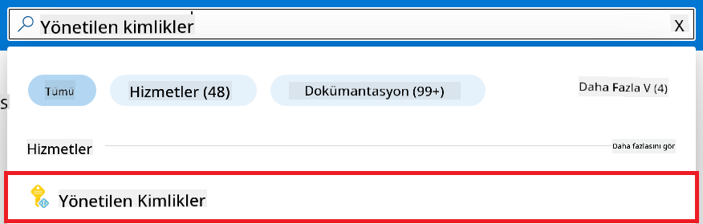

1. **+ Create** seçeneğini tıklayın.

    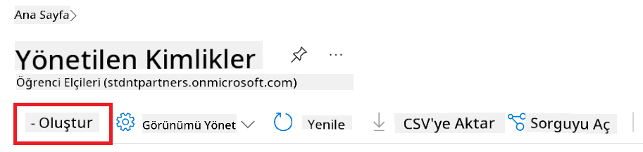

1. Aşağıdaki adımları gerçekleştirin:

    - Azure **Subscription**'ınızı seçin.
    - Kullanılacak **Resource group**'u seçin (gerekirse yenisini oluşturun).
    - Kullanmak istediğiniz **Region**'u seçin.
    - **Name** girin. Benzersiz bir değer olmalıdır.

    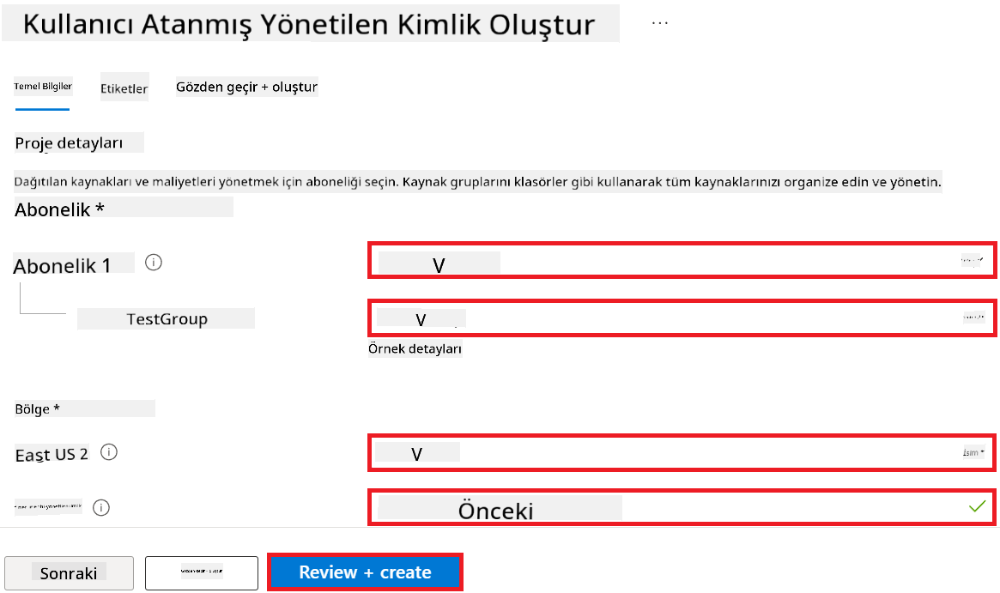

1. **Review + create** seçeneğini tıklayın.

1. **+ Create** seçeneğini tıklayın.

#### Managed Identity'ye Contributor rolü atama

1. Oluşturduğunuz Managed Identity kaynağına gidin.

1. Sol taraftaki sekmeden **Azure role assignments** seçeneğini seçin.

1. Navigasyon menüsünden **+Add role assignment** seçeneğini seçin.

1. Add role assignment sayfasında aşağıdaki adımları yapın:
    - **Scope** olarak **Resource group** seçin.
    - Azure **Subscription**'ınızı seçin.
    - Kullanılacak **Resource group**'u seçin.
    - **Role** olarak **Contributor** seçin.

    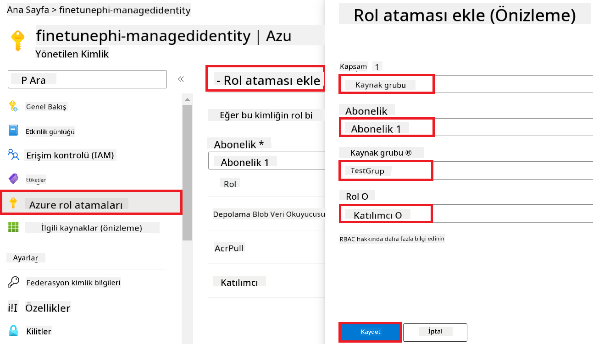

2. **Save** seçeneğini tıklayın.

#### Managed Identity'ye Storage Blob Data Reader rolü atama

1. Portal sayfasının üstündeki **arama çubuğuna** *storage accounts* yazın ve çıkan seçeneklerden **Storage accounts**'u seçin.

    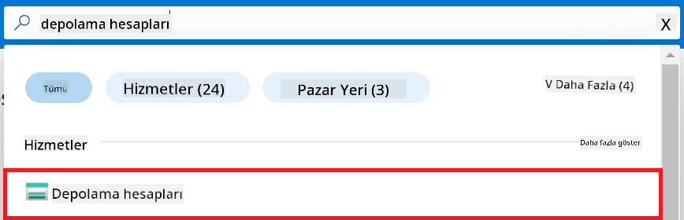

1. Oluşturduğunuz Azure Machine Learning workspace ile ilişkili storage hesabını seçin. Örneğin, *finetunephistorage*.

1. Add role assignment sayfasına gitmek için aşağıdaki adımları izleyin:

    - Oluşturduğunuz Azure Storage hesabına gidin.
    - Sol taraftaki sekmeden **Access Control (IAM)**'ı seçin.
    - Navigasyon menüsünden **+ Add** seçeneğini seçin.
    - Navigasyon menüsünden **Add role assignment** seçeneğini seçin.

    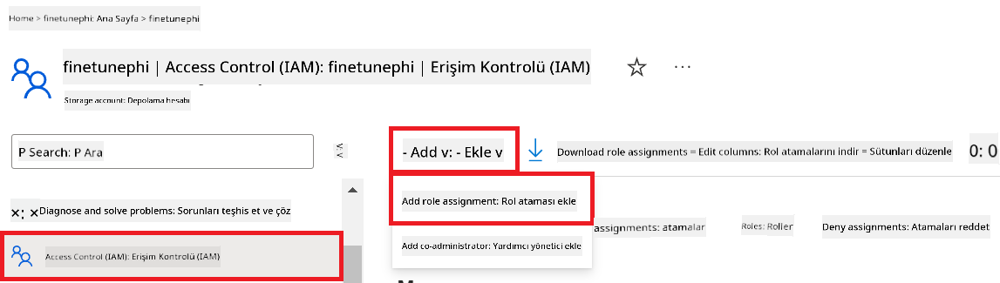

1. Add role assignment sayfasında aşağıdaki adımları gerçekleştirin:

    - Rol sayfasında, **arama çubuğuna** *Storage Blob Data Reader* yazın ve çıkan seçeneklerden **Storage Blob Data Reader**'ı seçin.
    - Rol sayfasında **Next** seçeneğini tıklayın.
    - Üyeler sayfasında **Assign access to** olarak **Managed identity** seçin.
    - Üyeler sayfasında **+ Select members** seçeneğini tıklayın.
    - Managed identities seçme sayfasında Azure **Subscription**'ınızı seçin.
    - Managed identities seçme sayfasında **Managed identity** olarak **Manage Identity** seçin.
    - Oluşturduğunuz Manage Identity'yi seçin. Örneğin, *finetunephi-managedidentity*.
    - Managed identities seçme sayfasında **Select** seçeneğini tıklayın.

    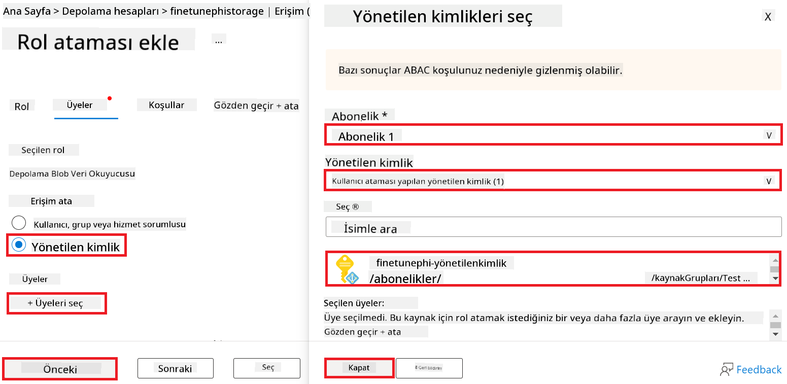

1. **Review + assign** seçeneğini tıklayın.

#### Managed Identity'ye AcrPull rolü atama

1. Portal sayfasının üstündeki **arama çubuğuna** *container registries* yazın ve çıkan seçeneklerden **Container registries**'yi seçin.

    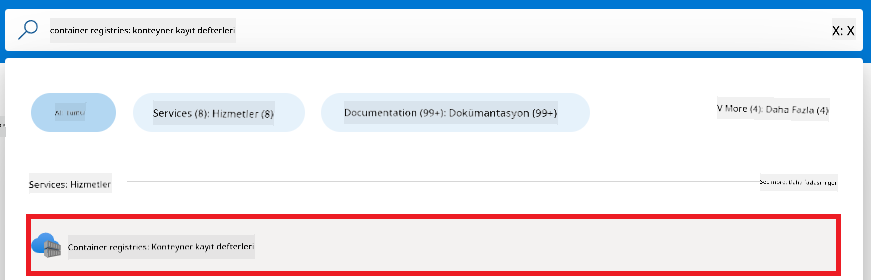

1. Azure Machine Learning workspace ile ilişkili container registry'i seçin. Örneğin, *finetunephicontainerregistry*

1. Add role assignment sayfasına gitmek için aşağıdaki adımları izleyin:

    - Sol taraftaki sekmeden **Access Control (IAM)** seçin.
    - Navigasyon menüsünden **+ Add** seçeneğini seçin.
    - Navigasyon menüsünden **Add role assignment** seçeneğini seçin.

1. Add role assignment sayfasında aşağıdaki adımları gerçekleştirin:

    - Rol sayfasında, **arama çubuğuna** *AcrPull* yazın ve çıkan seçeneklerden **AcrPull**'u seçin.
    - Rol sayfasında **Next** seçeneğini tıklayın.
    - Üyeler sayfasında **Assign access to** olarak **Managed identity** seçin.
    - Üyeler sayfasında **+ Select members** seçeneğini tıklayın.
    - Managed identities seçme sayfasında Azure **Subscription**'ınızı seçin.
    - Managed identities seçme sayfasında **Managed identity** olarak **Manage Identity** seçin.
    - Oluşturduğunuz Manage Identity'yi seçin. Örneğin, *finetunephi-managedidentity*.
    - Managed identities seçme sayfasında **Select** seçeneğini tıklayın.
    - **Review + assign** seçeneğini tıklayın.

### Projeyi kurma

İnce ayar için gereken veri setlerini indirmek üzere yerel bir ortam kuracaksınız.

Bu egzersizde:

- İçinde çalışmak için bir klasör oluşturacaksınız.
- Sanal ortam oluşturacaksınız.
- Gerekli paketleri yükleyeceksiniz.
- Veri setini indirmek için *download_dataset.py* dosyası oluşturacaksınız.

#### Çalışmak için bir klasör oluşturma

1. Bir terminal penceresi açın ve varsayılan dizinde *finetune-phi* adlı bir klasör oluşturmak için aşağıdaki komutu yazın.

    ```console
    mkdir finetune-phi
    ```

2. Terminalde aşağıdaki komutu yazarak oluşturduğunuz *finetune-phi* klasörüne gidin.

    ```console
    cd finetune-phi
    ```

#### Sanal ortam oluşturma

1. Terminalde aşağıdaki komutu yazarak *.venv* adlı bir sanal ortam oluşturun.

    ```console
    python -m venv .venv
    ```

2. Terminalde aşağıdaki komutu yazarak sanal ortamı etkinleştirin.

    ```console
    .venv\Scripts\activate.bat
    ```

> [!NOTE]
> Eğer başarılı olduysa, komut satırından önce *(.venv)* görünmelidir.

#### Gerekli paketleri yükleme

1. Terminalde aşağıdaki komutları yazarak gerekli paketleri yükleyin.

    ```console
    pip install datasets==2.19.1
    ```

#### `download_dataset.py` dosyasını oluşturma

> [!NOTE]
> Tam klasör yapısı:
>
> ```text
> └── YourUserName
> .    └── finetune-phi
> .        └── download_dataset.py
> ```

1. **Visual Studio Code**'u açın.

1. Menü çubuğundan **File** seçeneğini seçin.

1. **Open Folder** seçeneğini seçin.

1. Oluşturduğunuz *finetune-phi* klasörünü seçin. Örneğin, *C:\Users\yourUserName\finetune-phi*.

    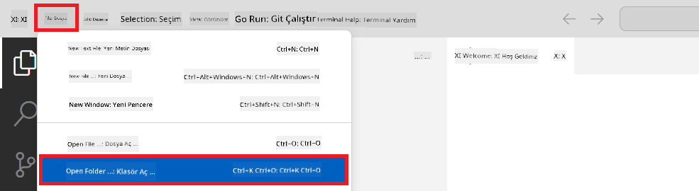

1. Visual Studio Code'un sol panelinde sağ tıklayın ve **New File** seçeneğini seçerek *download_dataset.py* adlı yeni bir dosya oluşturun.

    

### İnce ayar için veri setini hazırlama

Bu egzersizde, *download_dataset.py* dosyasını çalıştırarak *ultrachat_200k* veri setlerini yerel ortamınıza indireceksiniz. Daha sonra bu veri setlerini Azure Machine Learning'de Phi-3 modelini ince ayar yapmak için kullanacaksınız.

Bu egzersizde:

- *download_dataset.py* dosyasına veri setini indirmek için kod ekleyeceksiniz.
- *download_dataset.py* dosyasını çalıştırarak veri setini yerel ortamınıza indireceksiniz.

#### *download_dataset.py* kullanarak veri setinizi indirme

1. Visual Studio Code'da *download_dataset.py* dosyasını açın.

1. Aşağıdaki kodu *download_dataset.py* dosyasına ekleyin.

    ```python
    import json
    import os
    from datasets import load_dataset

    def load_and_split_dataset(dataset_name, config_name, split_ratio):
        """
        Load and split a dataset.
        """
        # Load the dataset with the specified name, configuration, and split ratio
        dataset = load_dataset(dataset_name, config_name, split=split_ratio)
        print(f"Original dataset size: {len(dataset)}")
        
        # Split the dataset into train and test sets (80% train, 20% test)
        split_dataset = dataset.train_test_split(test_size=0.2)
        print(f"Train dataset size: {len(split_dataset['train'])}")
        print(f"Test dataset size: {len(split_dataset['test'])}")
        
        return split_dataset

    def save_dataset_to_jsonl(dataset, filepath):
        """
        Save a dataset to a JSONL file.
        """
        # Create the directory if it does not exist
        os.makedirs(os.path.dirname(filepath), exist_ok=True)
        
        # Open the file in write mode
        with open(filepath, 'w', encoding='utf-8') as f:
            # Iterate over each record in the dataset
            for record in dataset:
                # Dump the record as a JSON object and write it to the file
                json.dump(record, f)
                # Write a newline character to separate records
                f.write('\n')
        
        print(f"Dataset saved to {filepath}")

    def main():
        """
        Main function to load, split, and save the dataset.
        """
        # Load and split the ULTRACHAT_200k dataset with a specific configuration and split ratio
        dataset = load_and_split_dataset("HuggingFaceH4/ultrachat_200k", 'default', 'train_sft[:1%]')
        
        # Extract the train and test datasets from the split
        train_dataset = dataset['train']
        test_dataset = dataset['test']

        # Save the train dataset to a JSONL file
        save_dataset_to_jsonl(train_dataset, "data/train_data.jsonl")
        
        # Save the test dataset to a separate JSONL file
        save_dataset_to_jsonl(test_dataset, "data/test_data.jsonl")

    if __name__ == "__main__":
        main()

    ```

1. Terminalde aşağıdaki komutu yazarak scripti çalıştırın ve veri setini yerel ortamınıza indirin.

    ```console
    python download_dataset.py
    ```

1. Veri setlerinin yerel *finetune-phi/data* dizinine başarıyla kaydedildiğini doğrulayın.

> [!NOTE]
>
> #### Veri seti boyutu ve ince ayar süresi hakkında not
>
> Bu eğitimde, veri setinin yalnızca %1'ini (`split='train[:1%]'`) kullanıyorsunuz. Bu, veri miktarını önemli ölçüde azaltır ve hem yükleme hem de ince ayar süreçlerini hızlandırır. Eğitim süresi ile model performansı arasında doğru dengeyi bulmak için bu yüzdeyi ayarlayabilirsiniz. Veri setinin daha küçük bir alt kümesini kullanmak, ince ayar süresini kısaltarak eğitimi daha yönetilebilir hale getirir.

## Senaryo 2: Phi-3 modelini ince ayar yapma ve Azure Machine Learning Studio
1. [Azure ML Studio](https://ml.azure.com/home?wt.mc_id=studentamb_279723) sitesini ziyaret edin.

1. Sol taraftaki sekmeden **Compute** seçeneğini seçin.

1. Navigasyon menüsünden **Compute clusters** seçeneğini seçin.

1. **+ New** seçeneğini seçin.

    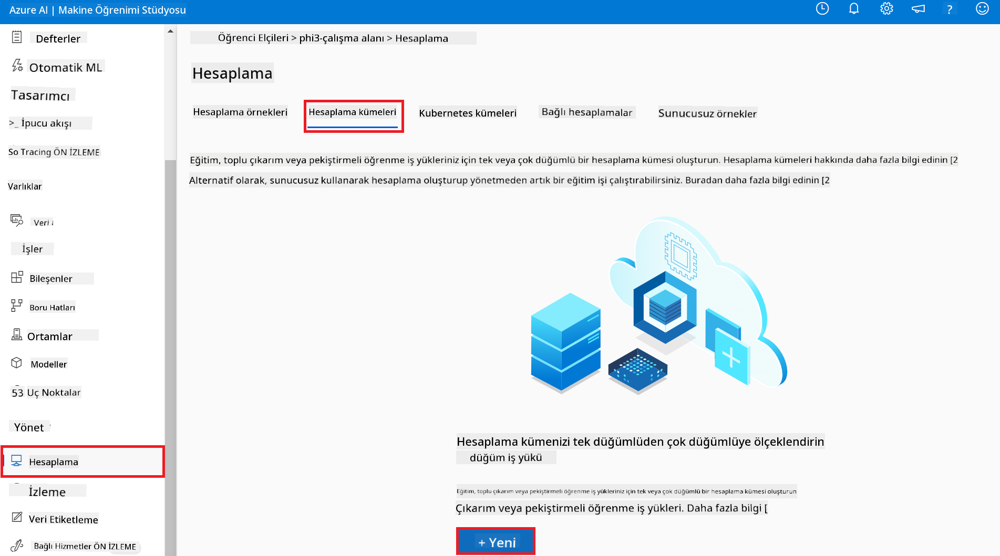

1. Aşağıdaki işlemleri yapın:

    - Kullanmak istediğiniz **Region**'u seçin.
    - **Virtual machine tier** seçeneğini **Dedicated** olarak ayarlayın.
    - **Virtual machine type** seçeneğini **GPU** olarak ayarlayın.
    - **Virtual machine size** filtresini **Select from all options** olarak ayarlayın.
    - **Virtual machine size** olarak **Standard_NC24ads_A100_v4** seçin.

    

1. **Next** seçeneğini seçin.

1. Aşağıdaki işlemleri yapın:

    - **Compute name** girin. Bu değer benzersiz olmalıdır.
    - **Minimum number of nodes** değerini **0** olarak ayarlayın.
    - **Maximum number of nodes** değerini **1** olarak ayarlayın.
    - **Idle seconds before scale down** değerini **120** olarak ayarlayın.

    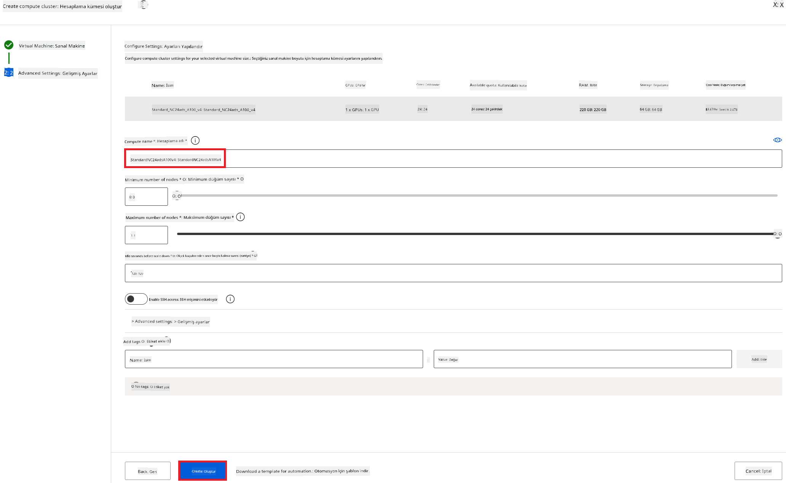

1. **Create** seçeneğini seçin.

#### Phi-3 modelini ince ayar yapma

1. [Azure ML Studio](https://ml.azure.com/home?wt.mc_id=studentamb_279723) sitesini ziyaret edin.

1. Oluşturduğunuz Azure Machine Learning çalışma alanını seçin.

    

1. Aşağıdaki işlemleri yapın:

    - Sol taraftaki sekmeden **Model catalog** seçeneğini seçin.
    - **Arama çubuğuna** *phi-3-mini-4k* yazın ve çıkan seçeneklerden **Phi-3-mini-4k-instruct** seçeneğini seçin.

    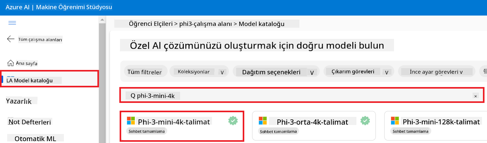

1. Navigasyon menüsünden **Fine-tune** seçeneğini seçin.

    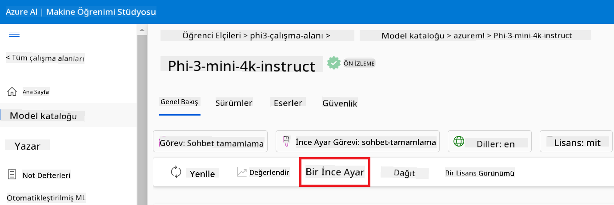

1. Aşağıdaki işlemleri yapın:

    - **Select task type** seçeneğini **Chat completion** olarak ayarlayın.
    - **+ Select data** seçeneğini kullanarak **Traning data** yükleyin.
    - Doğrulama verisi yükleme türünü **Provide different validation data** olarak ayarlayın.
    - **+ Select data** seçeneğini kullanarak **Validation data** yükleyin.

    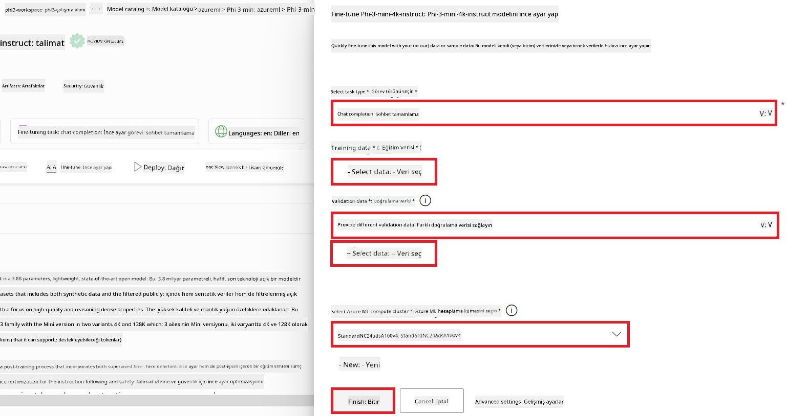

    > [!TIP]
    >
    > İnce ayar sürecini ihtiyaçlarınıza göre optimize etmek için **learning_rate** ve **lr_scheduler_type** gibi ayarları özelleştirmek üzere **Advanced settings** seçeneğini kullanabilirsiniz.

1. **Finish** seçeneğini seçin.

1. Bu alıştırmada, Azure Machine Learning kullanarak Phi-3 modelini başarıyla ince ayar yaptınız. İnce ayar işleminin oldukça zaman alabileceğini unutmayın. İnce ayar işlemi başladıktan sonra tamamlanmasını beklemeniz gerekmektedir. İnce ayar işleminin durumunu Azure Machine Learning çalışma alanınızdaki sol taraftaki Jobs sekmesinden takip edebilirsiniz. Sonraki bölümde, ince ayar yapılan modeli dağıtacak ve Prompt flow ile entegre edeceksiniz.

    

### İnce ayar yapılan Phi-3 modelini dağıtma

İnce ayar yapılan Phi-3 modelini Prompt flow ile entegre etmek için modeli gerçek zamanlı çıkarım için erişilebilir hale getirmek üzere dağıtmanız gerekir. Bu işlem, modelin kaydedilmesini, çevrimiçi bir uç nokta oluşturulmasını ve modelin dağıtılmasını içerir.

Bu alıştırmada şunları yapacaksınız:

- İnce ayar yapılan modeli Azure Machine Learning çalışma alanına kaydetmek.
- Çevrimiçi bir uç nokta oluşturmak.
- Kaydedilen ince ayar yapılan Phi-3 modelini dağıtmak.

#### İnce ayar yapılan modeli kaydetme

1. [Azure ML Studio](https://ml.azure.com/home?wt.mc_id=studentamb_279723) sitesini ziyaret edin.

1. Oluşturduğunuz Azure Machine Learning çalışma alanını seçin.

    

1. Sol taraftaki sekmeden **Models** seçeneğini seçin.
1. **+ Register** seçeneğini seçin.
1. **From a job output** seçeneğini seçin.

    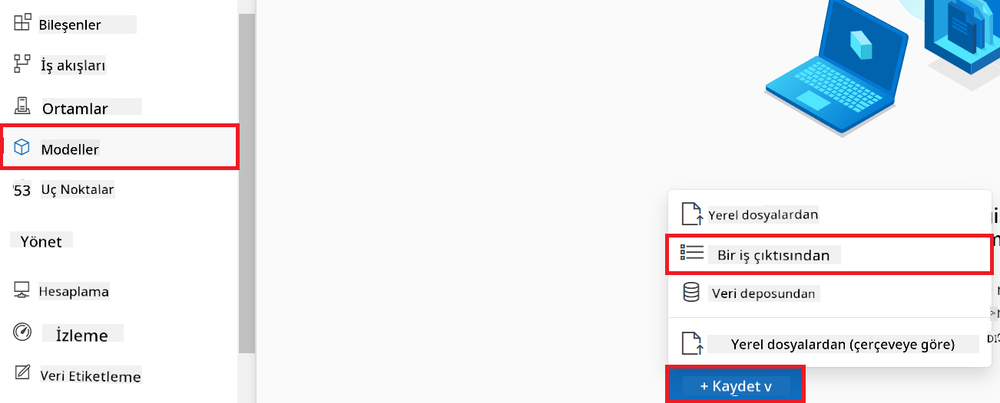

1. Oluşturduğunuz işi seçin.

    

1. **Next** seçeneğini seçin.

1. **Model type** olarak **MLflow** seçeneğini ayarlayın.

1. **Job output** seçeneğinin seçili olduğundan emin olun; otomatik olarak seçilmiş olmalıdır.

    

2. **Next** seçeneğini seçin.

3. **Register** seçeneğini seçin.

    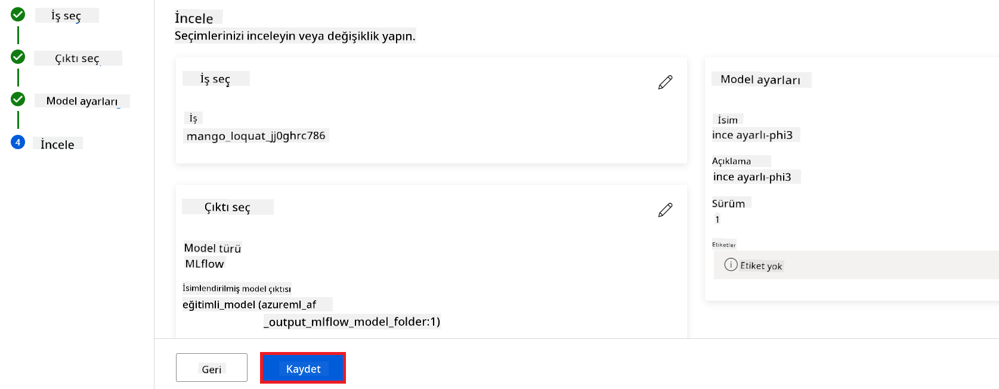

4. Kaydettiğiniz modeli sol taraftaki sekmeden **Models** menüsüne giderek görüntüleyebilirsiniz.

    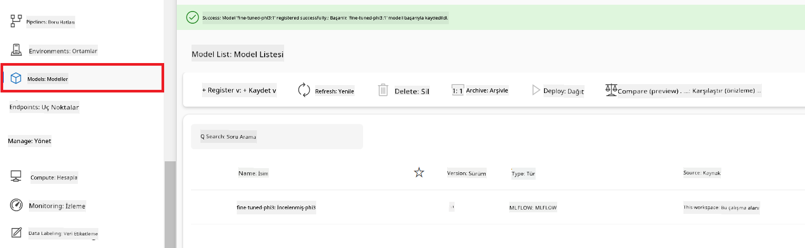

#### İnce ayar yapılan modeli dağıtma

1. Oluşturduğunuz Azure Machine Learning çalışma alanına gidin.

1. Sol taraftaki sekmeden **Endpoints** seçeneğini seçin.

1. Navigasyon menüsünden **Real-time endpoints** seçeneğini seçin.

    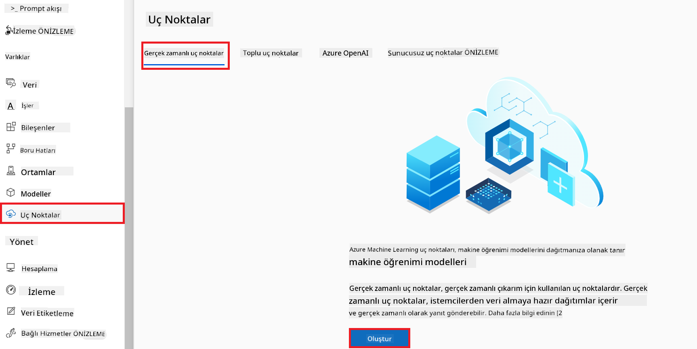

1. **Create** seçeneğini seçin.

1. Oluşturduğunuz kayıtlı modeli seçin.

    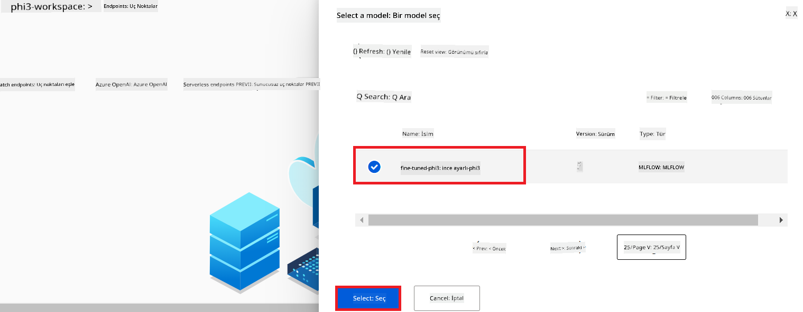

1. **Select** seçeneğini seçin.

1. Aşağıdaki işlemleri yapın:

    - **Virtual machine** olarak *Standard_NC6s_v3* seçin.
    - Kullanmak istediğiniz **Instance count** değerini seçin. Örneğin, *1*.
    - **Endpoint** olarak **New** seçeneğini seçerek yeni bir uç nokta oluşturun.
    - **Endpoint name** girin. Bu benzersiz bir değer olmalıdır.
    - **Deployment name** girin. Bu da benzersiz olmalıdır.

    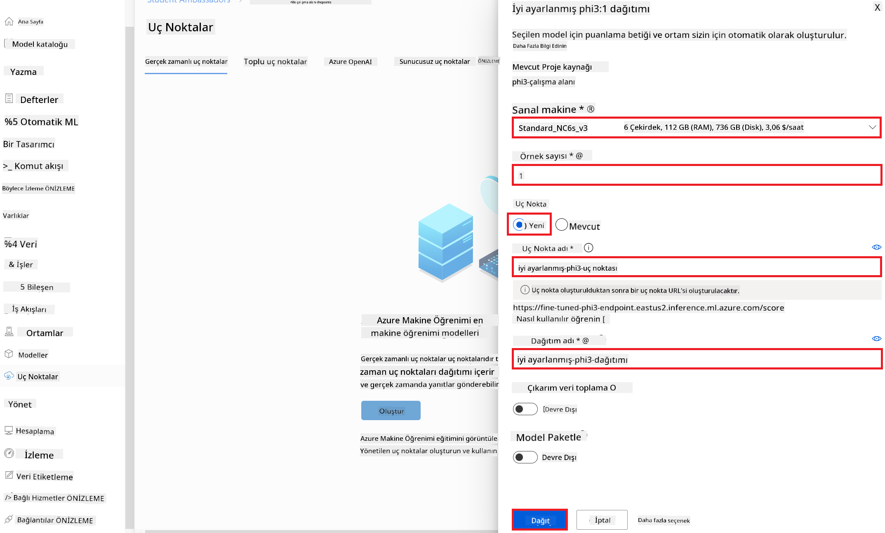

1. **Deploy** seçeneğini seçin.

> [!WARNING]
> Hesabınıza ek ücret yansımaması için, Azure Machine Learning çalışma alanında oluşturduğunuz uç noktayı silmeyi unutmayın.
>

#### Azure Machine Learning Workspace içinde dağıtım durumunu kontrol etme

1. Oluşturduğunuz Azure Machine Learning çalışma alanına gidin.

1. Sol taraftaki sekmeden **Endpoints** seçeneğini seçin.

1. Oluşturduğunuz uç noktayı seçin.

    

1. Bu sayfada, dağıtım sürecinde uç noktaları yönetebilirsiniz.

> [!NOTE]
> Dağıtım tamamlandığında, **Live traffic** değerinin **%100** olduğundan emin olun. Eğer değilse, trafiği ayarlamak için **Update traffic** seçeneğini kullanın. Trafik %0 olarak ayarlanmışsa modeli test edemezsiniz.
>
> 
>

## Senaryo 3: Prompt flow ile entegrasyon ve Azure AI Foundry’de özel modelinizle sohbet

### Özel Phi-3 modelini Prompt flow ile entegre etme

İnce ayar yaptığınız modeli başarıyla dağıttıktan sonra, Prompt Flow ile entegre ederek modelinizi gerçek zamanlı uygulamalarda kullanabilir ve özel Phi-3 modelinizle çeşitli etkileşimli görevler gerçekleştirebilirsiniz.

Bu alıştırmada şunları yapacaksınız:

- Azure AI Foundry Hub oluşturma.
- Azure AI Foundry Projesi oluşturma.
- Prompt flow oluşturma.
- İnce ayar yapılan Phi-3 modeli için özel bağlantı ekleme.
- Prompt flow'u özel Phi-3 modelinizle sohbet edecek şekilde ayarlama.

> [!NOTE]
> Azure ML Studio kullanarak da Promptflow ile entegrasyon yapabilirsiniz. Aynı entegrasyon süreci Azure ML Studio için de geçerlidir.

#### Azure AI Foundry Hub oluşturma

Proje oluşturmadan önce bir Hub oluşturmanız gerekir. Hub, Azure AI Foundry içinde birden fazla projeyi organize edip yönetmenizi sağlayan bir Kaynak Grubu gibi çalışır.

1. [Azure AI Foundry](https://ai.azure.com/?WT.mc_id=aiml-137032-kinfeylo) sitesini ziyaret edin.

1. Sol taraftaki sekmeden **All hubs** seçeneğini seçin.

1. Navigasyon menüsünden **+ New hub** seçeneğini seçin.

    

1. Aşağıdaki işlemleri yapın:

    - **Hub name** girin. Bu benzersiz bir değer olmalıdır.
    - Azure **Subscription** seçin.
    - Kullanılacak **Resource group** seçin (gerekirse yenisini oluşturun).
    - Kullanmak istediğiniz **Location** seçin.
    - Kullanılacak **Connect Azure AI Services** seçeneğini seçin (gerekirse yenisini oluşturun).
    - **Connect Azure AI Search** seçeneğini **Skip connecting** olarak ayarlayın.

    

1. **Next** seçeneğini seçin.

#### Azure AI Foundry Projesi oluşturma

1. Oluşturduğunuz Hub’da sol taraftaki sekmeden **All projects** seçeneğini seçin.

1. Navigasyon menüsünden **+ New project** seçeneğini seçin.

    

1. **Project name** girin. Bu benzersiz bir değer olmalıdır.

    

1. **Create a project** seçeneğini seçin.

#### İnce ayar yapılan Phi-3 modeli için özel bağlantı ekleme

Özel Phi-3 modelinizi Prompt flow ile entegre etmek için modelin uç noktası ve anahtarını özel bir bağlantıda kaydetmeniz gerekir. Bu ayar, Prompt flow’da özel Phi-3 modelinize erişimi sağlar.

#### İnce ayar yapılan Phi-3 modelinin api anahtarı ve uç nokta URI’sini ayarlama

1. [Azure ML Studio](https://ml.azure.com/home?WT.mc_id=aiml-137032-kinfeylo) sitesini ziyaret edin.

1. Oluşturduğunuz Azure Machine Learning çalışma alanına gidin.

1. Sol taraftaki sekmeden **Endpoints** seçeneğini seçin.

    

1. Oluşturduğunuz uç noktayı seçin.

    

1. Navigasyon menüsünden **Consume** seçeneğini seçin.

1. **REST endpoint** ve **Primary key** değerlerinizi kopyalayın.
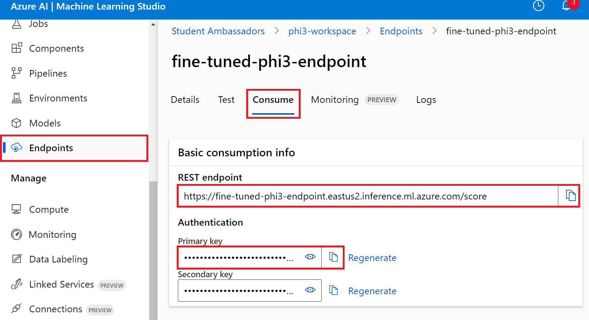

#### Özel Bağlantıyı Ekle

1. [Azure AI Foundry](https://ai.azure.com/?WT.mc_id=aiml-137032-kinfeylo) sitesini ziyaret edin.

1. Oluşturduğunuz Azure AI Foundry projesine gidin.

1. Oluşturduğunuz projede, sol taraftaki sekmeden **Ayarlar**'ı seçin.

1. **+ Yeni bağlantı** seçeneğini tıklayın.

    

1. Navigasyon menüsünden **Özel anahtarlar**'ı seçin.

    

1. Aşağıdaki işlemleri gerçekleştirin:

    - **+ Anahtar-değer çiftleri ekle**'yi seçin.
    - Anahtar adı olarak **endpoint** yazın ve Azure ML Studio’dan kopyaladığınız uç noktayı değer alanına yapıştırın.
    - Tekrar **+ Anahtar-değer çiftleri ekle**'yi seçin.
    - Anahtar adı olarak **key** yazın ve Azure ML Studio’dan kopyaladığınız anahtarı değer alanına yapıştırın.
    - Anahtarları ekledikten sonra, anahtarın görünmesini engellemek için **gizli olarak işaretle** seçeneğini işaretleyin.

    

1. **Bağlantı ekle**'yi seçin.

#### Prompt flow Oluşturma

Azure AI Foundry’de özel bağlantı eklediniz. Şimdi aşağıdaki adımları izleyerek bir Prompt flow oluşturacağız. Daha sonra bu Prompt flow’u özel bağlantıya bağlayarak, ince ayarlı modeli Prompt flow içinde kullanabileceksiniz.

1. Oluşturduğunuz Azure AI Foundry projesine gidin.

1. Sol taraftaki sekmeden **Prompt flow**'u seçin.

1. Navigasyon menüsünden **+ Oluştur**'u seçin.

    

1. Navigasyon menüsünden **Sohbet akışı**'nı seçin.

    

1. Kullanmak istediğiniz **Klasör adı**'nı girin.

    

2. **Oluştur**'u seçin.

#### Prompt flow’u özel Phi-3 modelinizle sohbet edecek şekilde ayarlama

İnce ayarlı Phi-3 modelini Prompt flow’a entegre etmeniz gerekiyor. Ancak mevcut Prompt flow bu amaç için tasarlanmamış. Bu nedenle, özel modeli entegre etmek için Prompt flow’u yeniden tasarlamanız gerekmektedir.

1. Prompt flow’da mevcut akışı yeniden oluşturmak için şu işlemleri yapın:

    - **Ham dosya modu**'nu seçin.
    - *flow.dag.yml* dosyasındaki tüm mevcut kodu silin.
    - Aşağıdaki kodu *flow.dag.yml* dosyasına ekleyin.

        ```yml
        inputs:
          input_data:
            type: string
            default: "Who founded Microsoft?"

        outputs:
          answer:
            type: string
            reference: ${integrate_with_promptflow.output}

        nodes:
        - name: integrate_with_promptflow
          type: python
          source:
            type: code
            path: integrate_with_promptflow.py
          inputs:
            input_data: ${inputs.input_data}
        ```

    - **Kaydet**'i seçin.

    

1. Özel Phi-3 modelini Prompt flow’da kullanmak için *integrate_with_promptflow.py* dosyasına aşağıdaki kodu ekleyin.

    ```python
    import logging
    import requests
    from promptflow import tool
    from promptflow.connections import CustomConnection

    # Logging setup
    logging.basicConfig(
        format="%(asctime)s - %(levelname)s - %(name)s - %(message)s",
        datefmt="%Y-%m-%d %H:%M:%S",
        level=logging.DEBUG
    )
    logger = logging.getLogger(__name__)

    def query_phi3_model(input_data: str, connection: CustomConnection) -> str:
        """
        Send a request to the Phi-3 model endpoint with the given input data using Custom Connection.
        """

        # "connection" is the name of the Custom Connection, "endpoint", "key" are the keys in the Custom Connection
        endpoint_url = connection.endpoint
        api_key = connection.key

        headers = {
            "Content-Type": "application/json",
            "Authorization": f"Bearer {api_key}"
        }
        data = {
            "input_data": {
                "input_string": [
                    {"role": "user", "content": input_data}
                ],
                "parameters": {
                    "temperature": 0.7,
                    "max_new_tokens": 128
                }
            }
        }
        try:
            response = requests.post(endpoint_url, json=data, headers=headers)
            response.raise_for_status()
            
            # Log the full JSON response
            logger.debug(f"Full JSON response: {response.json()}")

            result = response.json()["output"]
            logger.info("Successfully received response from Azure ML Endpoint.")
            return result
        except requests.exceptions.RequestException as e:
            logger.error(f"Error querying Azure ML Endpoint: {e}")
            raise

    @tool
    def my_python_tool(input_data: str, connection: CustomConnection) -> str:
        """
        Tool function to process input data and query the Phi-3 model.
        """
        return query_phi3_model(input_data, connection)

    ```

    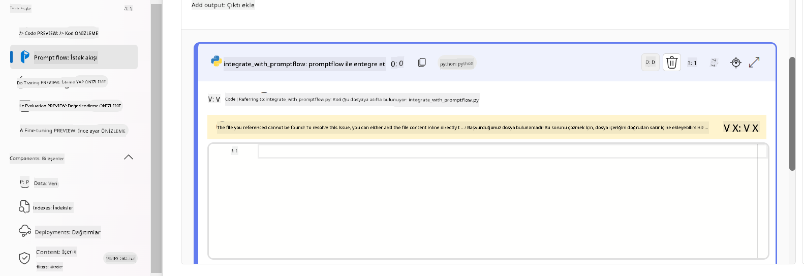

> [!NOTE]
> Azure AI Foundry’de Prompt flow kullanımı hakkında daha ayrıntılı bilgi için [Azure AI Foundry'de Prompt flow](https://learn.microsoft.com/azure/ai-studio/how-to/prompt-flow) sayfasına bakabilirsiniz.

1. Modelinizle sohbeti etkinleştirmek için **Sohbet girişi**, **Sohbet çıkışı** seçeneklerini seçin.

    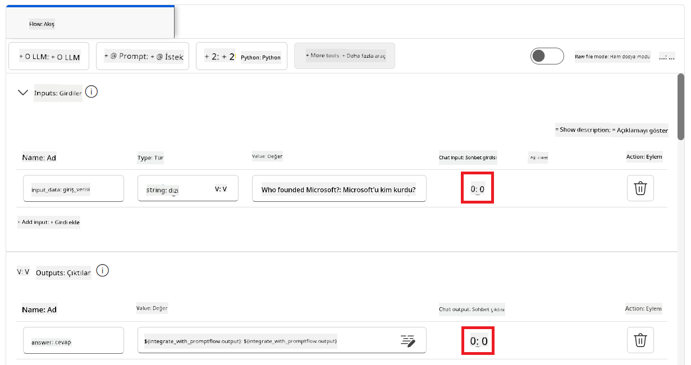

1. Artık özel Phi-3 modelinizle sohbet etmeye hazırsınız. Bir sonraki alıştırmada Prompt flow’u nasıl başlatacağınızı ve ince ayarlı Phi-3 modelinizle sohbet etmek için nasıl kullanacağınızı öğreneceksiniz.

> [!NOTE]
>
> Yeniden oluşturulan akış aşağıdaki görünüme benzemelidir:
>
> 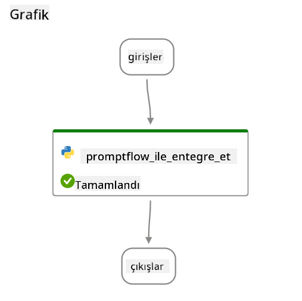
>

### Özel Phi-3 modelinizle sohbet edin

Artık özel Phi-3 modelinizi ince ayarladınız ve Prompt flow ile entegre ettiniz, modelle etkileşime geçmeye hazırsınız. Bu alıştırma, Prompt flow kullanarak modelinizle sohbet başlatma ve ayarlama sürecinde size rehberlik edecektir. Bu adımları takip ederek, ince ayarlı Phi-3 modelinizin çeşitli görevler ve sohbetler için tüm yeteneklerinden faydalanabileceksiniz.

- Prompt flow kullanarak özel Phi-3 modelinizle sohbet edin.

#### Prompt flow’u başlatma

1. Prompt flow’u başlatmak için **Hesaplama oturumlarını başlat**'ı seçin.

    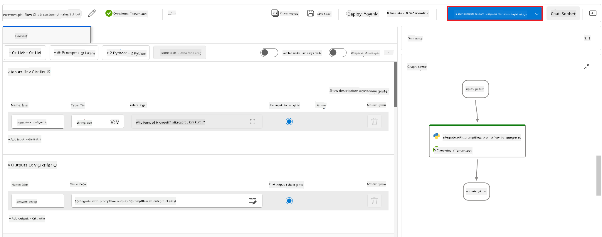

1. Parametreleri yenilemek için **Girişi doğrula ve çözümle**'yi seçin.

    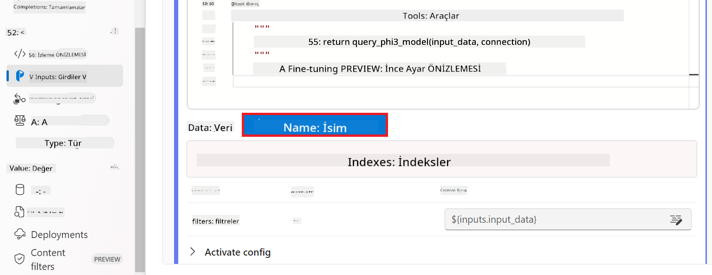

1. Oluşturduğunuz özel bağlantıya ait **connection** değerini seçin. Örneğin, *connection*.

    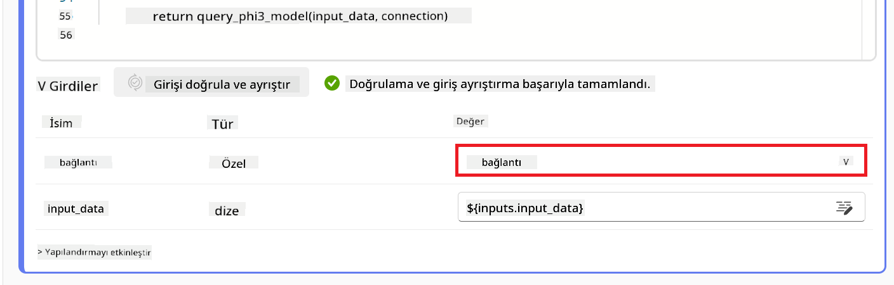

#### Özel modelinizle sohbet edin

1. **Sohbet**'i seçin.

    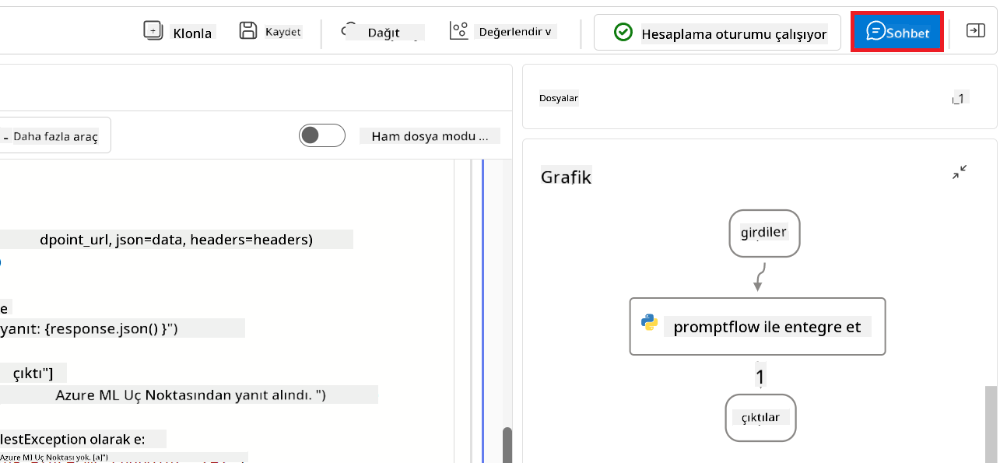

1. İşte sonuçlardan bir örnek: Artık özel Phi-3 modelinizle sohbet edebilirsiniz. İnce ayar için kullanılan verilere dayalı sorular sormanız önerilir.

    

**Feragatname**:  
Bu belge, AI çeviri servisi [Co-op Translator](https://github.com/Azure/co-op-translator) kullanılarak çevrilmiştir. Doğruluk için çaba göstersek de, otomatik çevirilerin hatalar veya yanlışlıklar içerebileceğini lütfen unutmayınız. Orijinal belge, kendi dilinde yetkili kaynak olarak kabul edilmelidir. Kritik bilgiler için profesyonel insan çevirisi önerilir. Bu çevirinin kullanımı sonucu ortaya çıkabilecek yanlış anlamalar veya yorum hatalarından sorumlu değiliz.