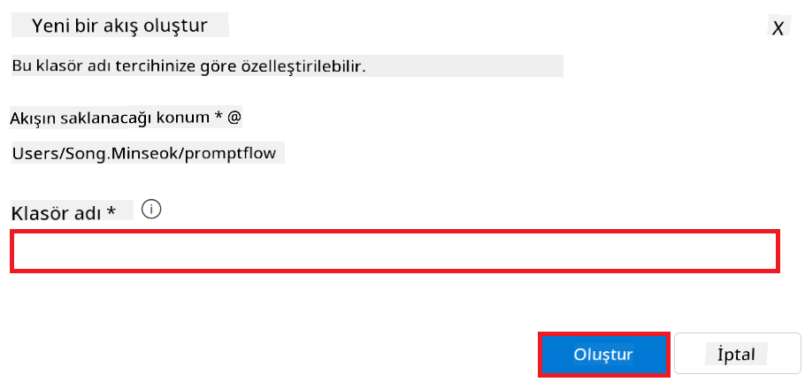

<!--
CO_OP_TRANSLATOR_METADATA:
{
  "original_hash": "ecbd9179a21edbaafaf114d47f09f3e3",
  "translation_date": "2025-07-17T01:27:22+00:00",
  "source_file": "md/02.Application/01.TextAndChat/Phi3/E2E_Phi-3-FineTuning_PromptFlow_Integration_AIFoundry.md",
  "language_code": "tr"
}
-->
# Azure AI Foundry'de Prompt flow ile özel Phi-3 modellerini ince ayar yapma ve entegre etme

Bu uçtan uca (E2E) örnek, Microsoft Tech Community'den "[Fine-Tune and Integrate Custom Phi-3 Models with Prompt Flow in Azure AI Foundry](https://techcommunity.microsoft.com/t5/educator-developer-blog/fine-tune-and-integrate-custom-phi-3-models-with-prompt-flow-in/ba-p/4191726?WT.mc_id=aiml-137032-kinfeylo)" rehberine dayanmaktadır. Azure AI Foundry'de Prompt flow ile özel Phi-3 modellerinin ince ayar, dağıtım ve entegrasyon süreçlerini tanıtmaktadır. Yerel olarak kod çalıştırmayı içeren "[Fine-Tune and Integrate Custom Phi-3 Models with Prompt Flow](./E2E_Phi-3-FineTuning_PromptFlow_Integration.md)" E2E örneğinin aksine, bu eğitim tamamen Azure AI / ML Studio içinde modelinizi ince ayar yapma ve entegre etmeye odaklanmaktadır.

## Genel Bakış

Bu E2E örnekte, Phi-3 modelini nasıl ince ayar yapacağınızı ve Azure AI Foundry'de Prompt flow ile nasıl entegre edeceğinizi öğreneceksiniz. Azure AI / ML Studio'yu kullanarak özel AI modellerini dağıtmak ve kullanmak için bir iş akışı oluşturacaksınız. Bu E2E örnek üç senaryoya ayrılmıştır:

**Senaryo 1: Azure kaynaklarını kurma ve ince ayar için hazırlık**

**Senaryo 2: Phi-3 modelini ince ayar yapma ve Azure Machine Learning Studio'da dağıtma**

**Senaryo 3: Prompt flow ile entegrasyon ve Azure AI Foundry'de özel modelinizle sohbet etme**

İşte bu E2E örneğin genel görünümü.


### İçindekiler

1. **[Senaryo 1: Azure kaynaklarını kurma ve ince ayar için hazırlık](../../../../../../md/02.Application/01.TextAndChat/Phi3)**
    - [Azure Machine Learning Workspace oluşturma](../../../../../../md/02.Application/01.TextAndChat/Phi3)
    - [Azure Aboneliğinde GPU kotası talep etme](../../../../../../md/02.Application/01.TextAndChat/Phi3)
    - [Rol ataması ekleme](../../../../../../md/02.Application/01.TextAndChat/Phi3)
    - [Projeyi kurma](../../../../../../md/02.Application/01.TextAndChat/Phi3)
    - [İnce ayar için veri setini hazırlama](../../../../../../md/02.Application/01.TextAndChat/Phi3)

1. **[Senaryo 2: Phi-3 modelini ince ayar yapma ve Azure Machine Learning Studio'da dağıtma](../../../../../../md/02.Application/01.TextAndChat/Phi3)**
    - [Phi-3 modelini ince ayar yapma](../../../../../../md/02.Application/01.TextAndChat/Phi3)
    - [İnce ayar yapılmış Phi-3 modelini dağıtma](../../../../../../md/02.Application/01.TextAndChat/Phi3)

1. **[Senaryo 3: Prompt flow ile entegrasyon ve Azure AI Foundry'de özel modelinizle sohbet etme](../../../../../../md/02.Application/01.TextAndChat/Phi3)**
    - [Özel Phi-3 modelini Prompt flow ile entegre etme](../../../../../../md/02.Application/01.TextAndChat/Phi3)
    - [Özel Phi-3 modelinizle sohbet etme](../../../../../../md/02.Application/01.TextAndChat/Phi3)

## Senaryo 1: Azure kaynaklarını kurma ve ince ayar için hazırlık

### Azure Machine Learning Workspace oluşturma

1. Portal sayfasının üstündeki **arama çubuğuna** *azure machine learning* yazın ve çıkan seçeneklerden **Azure Machine Learning**'i seçin.

    

2. Navigasyon menüsünden **+ Create** seçeneğini tıklayın.

3. Navigasyon menüsünden **New workspace** seçeneğini seçin.

    

4. Aşağıdaki işlemleri yapın:

    - Azure **Subscription**'ınızı seçin.
    - Kullanılacak **Resource group**'u seçin (gerekirse yenisini oluşturun).
    - **Workspace Name** girin. Benzersiz bir değer olmalıdır.
    - Kullanmak istediğiniz **Region**'u seçin.
    - Kullanılacak **Storage account**'u seçin (gerekirse yenisini oluşturun).
    - Kullanılacak **Key vault**'u seçin (gerekirse yenisini oluşturun).
    - Kullanılacak **Application insights**'ı seçin (gerekirse yenisini oluşturun).
    - Kullanılacak **Container registry**'yi seçin (gerekirse yenisini oluşturun).

    

5. **Review + Create** seçeneğini tıklayın.

6. **Create** seçeneğini tıklayın.

### Azure Aboneliğinde GPU kotası talep etme

Bu eğitimde, Phi-3 modelini ince ayar yapmak ve dağıtmak için GPU kullanmayı öğreneceksiniz. İnce ayar için *Standard_NC24ads_A100_v4* GPU'sunu kullanacaksınız ve bu GPU için kota talebinde bulunmanız gerekmektedir. Dağıtım için ise *Standard_NC6s_v3* GPU'sunu kullanacaksınız ve bu GPU için de kota talebi gereklidir.

> [!NOTE]
>
> Sadece Pay-As-You-Go abonelikleri (standart abonelik türü) GPU tahsisi için uygundur; avantaj abonelikleri şu anda desteklenmemektedir.
>

1. [Azure ML Studio](https://ml.azure.com/home?wt.mc_id=studentamb_279723) adresini ziyaret edin.

1. *Standard NCADSA100v4 Family* kotası talep etmek için aşağıdaki adımları izleyin:

    - Sol taraftaki sekmeden **Quota**'yı seçin.
    - Kullanılacak **Virtual machine family**'yi seçin. Örneğin, *Standard_NC24ads_A100_v4* GPU'sunu içeren **Standard NCADSA100v4 Family Cluster Dedicated vCPUs**'u seçin.
    - Navigasyon menüsünden **Request quota**'yı seçin.

        

    - Request quota sayfasında, kullanmak istediğiniz **New cores limit** değerini girin. Örneğin, 24.
    - Request quota sayfasında, GPU kotası talebi için **Submit**'i seçin.

1. *Standard NCSv3 Family* kotası talep etmek için aşağıdaki adımları izleyin:

    - Sol taraftaki sekmeden **Quota**'yı seçin.
    - Kullanılacak **Virtual machine family**'yi seçin. Örneğin, *Standard_NC6s_v3* GPU'sunu içeren **Standard NCSv3 Family Cluster Dedicated vCPUs**'u seçin.
    - Navigasyon menüsünden **Request quota**'yı seçin.
    - Request quota sayfasında, kullanmak istediğiniz **New cores limit** değerini girin. Örneğin, 24.
    - Request quota sayfasında, GPU kotası talebi için **Submit**'i seçin.

### Rol ataması ekleme

Modellerinizi ince ayar yapmak ve dağıtmak için önce bir User Assigned Managed Identity (UAI) oluşturmalı ve ona uygun izinleri atamalısınız. Bu UAI, dağıtım sırasında kimlik doğrulama için kullanılacaktır.

#### User Assigned Managed Identity (UAI) oluşturma

1. Portal sayfasının üstündeki **arama çubuğuna** *managed identities* yazın ve çıkan seçeneklerden **Managed Identities**'i seçin.

    

1. **+ Create** seçeneğini tıklayın.

    

1. Aşağıdaki işlemleri yapın:

    - Azure **Subscription**'ınızı seçin.
    - Kullanılacak **Resource group**'u seçin (gerekirse yenisini oluşturun).
    - Kullanmak istediğiniz **Region**'u seçin.
    - **Name** girin. Benzersiz bir değer olmalıdır.

    

1. **Review + create** seçeneğini tıklayın.

1. **+ Create** seçeneğini tıklayın.

#### Managed Identity'ye Contributor rolü atama

1. Oluşturduğunuz Managed Identity kaynağına gidin.

1. Sol taraftaki sekmeden **Azure role assignments**'ı seçin.

1. Navigasyon menüsünden **+Add role assignment**'ı seçin.

1. Add role assignment sayfasında aşağıdaki işlemleri yapın:
    - **Scope**'u **Resource group** olarak seçin.
    - Azure **Subscription**'ınızı seçin.
    - Kullanılacak **Resource group**'u seçin.
    - **Role** olarak **Contributor**'ı seçin.

    

2. **Save** seçeneğini tıklayın.

#### Managed Identity'ye Storage Blob Data Reader rolü atama

1. Portal sayfasının üstündeki **arama çubuğuna** *storage accounts* yazın ve çıkan seçeneklerden **Storage accounts**'u seçin.

    

1. Oluşturduğunuz Azure Machine Learning workspace ile ilişkili storage hesabını seçin. Örneğin, *finetunephistorage*.

1. Add role assignment sayfasına gitmek için aşağıdaki adımları izleyin:

    - Oluşturduğunuz Azure Storage hesabına gidin.
    - Sol taraftaki sekmeden **Access Control (IAM)**'ı seçin.
    - Navigasyon menüsünden **+ Add**'i seçin.
    - Navigasyon menüsünden **Add role assignment**'ı seçin.

    

1. Add role assignment sayfasında aşağıdaki işlemleri yapın:

    - Rol sayfasında, **arama çubuğuna** *Storage Blob Data Reader* yazın ve çıkan seçeneklerden **Storage Blob Data Reader**'ı seçin.
    - Rol sayfasında **Next**'i seçin.
    - Üyeler sayfasında, **Assign access to** olarak **Managed identity**'yi seçin.
    - Üyeler sayfasında **+ Select members**'ı seçin.
    - Select managed identities sayfasında Azure **Subscription**'ınızı seçin.
    - Select managed identities sayfasında **Managed identity** olarak **Manage Identity**'yi seçin.
    - Select managed identities sayfasında oluşturduğunuz Manage Identity'yi seçin. Örneğin, *finetunephi-managedidentity*.
    - Select managed identities sayfasında **Select**'i seçin.

    

1. **Review + assign** seçeneğini tıklayın.

#### Managed Identity'ye AcrPull rolü atama

1. Portal sayfasının üstündeki **arama çubuğuna** *container registries* yazın ve çıkan seçeneklerden **Container registries**'i seçin.

    

1. Azure Machine Learning workspace ile ilişkili container registry'yi seçin. Örneğin, *finetunephicontainerregistry*

1. Add role assignment sayfasına gitmek için aşağıdaki adımları izleyin:

    - Sol taraftaki sekmeden **Access Control (IAM)**'ı seçin.
    - Navigasyon menüsünden **+ Add**'i seçin.
    - Navigasyon menüsünden **Add role assignment**'ı seçin.

1. Add role assignment sayfasında aşağıdaki işlemleri yapın:

    - Rol sayfasında, **arama çubuğuna** *AcrPull* yazın ve çıkan seçeneklerden **AcrPull**'u seçin.
    - Rol sayfasında **Next**'i seçin.
    - Üyeler sayfasında, **Assign access to** olarak **Managed identity**'yi seçin.
    - Üyeler sayfasında **+ Select members**'ı seçin.
    - Select managed identities sayfasında Azure **Subscription**'ınızı seçin.
    - Select managed identities sayfasında **Managed identity** olarak **Manage Identity**'yi seçin.
    - Select managed identities sayfasında oluşturduğunuz Manage Identity'yi seçin. Örneğin, *finetunephi-managedidentity*.
    - Select managed identities sayfasında **Select**'i seçin.
    - **Review + assign** seçeneğini tıklayın.

### Projeyi kurma

İnce ayar için gereken veri setlerini indirmek üzere yerel bir ortam kuracaksınız.

Bu egzersizde,

- İçinde çalışmak için bir klasör oluşturacaksınız.
- Sanal bir ortam oluşturacaksınız.
- Gerekli paketleri yükleyeceksiniz.
- Veri setini indirmek için *download_dataset.py* dosyası oluşturacaksınız.

#### İçinde çalışmak için bir klasör oluşturma

1. Bir terminal penceresi açın ve varsayılan yolda *finetune-phi* adında bir klasör oluşturmak için aşağıdaki komutu yazın.

    ```console
    mkdir finetune-phi
    ```

2. Oluşturduğunuz *finetune-phi* klasörüne gitmek için terminalde aşağıdaki komutu yazın.
#### Sanal ortam oluşturma

1. Terminalinizde *.venv* adlı bir sanal ortam oluşturmak için aşağıdaki komutu yazın.

    ```console
    python -m venv .venv
    ```

2. Sanal ortamı etkinleştirmek için terminalinize aşağıdaki komutu yazın.

    ```console
    .venv\Scripts\activate.bat
    ```


> [!NOTE]
> Eğer başarılı olduysa, komut isteminden önce *(.venv)* görmelisiniz.

#### Gerekli paketleri yükleme

1. Gerekli paketleri yüklemek için terminalinize aşağıdaki komutları yazın.

    ```console
    pip install datasets==2.19.1
    ```

#### `download_dataset.py` dosyasını oluşturma

> [!NOTE]
> Tam klasör yapısı:
>
> ```text
> └── YourUserName
> .    └── finetune-phi
> .        └── download_dataset.py
> ```

1. **Visual Studio Code**'u açın.

1. Menü çubuğundan **File** seçeneğini seçin.

1. **Open Folder** seçeneğini seçin.

1. *C:\Users\yourUserName\finetune-phi* konumunda oluşturduğunuz *finetune-phi* klasörünü seçin.

    

1. Visual Studio Code'un sol panelinde sağ tıklayın ve **New File** seçeneği ile *download_dataset.py* adlı yeni bir dosya oluşturun.

    

### İnce ayar için veri setini hazırlama

Bu alıştırmada, *download_dataset.py* dosyasını çalıştırarak *ultrachat_200k* veri setlerini yerel ortamınıza indireceksiniz. Daha sonra bu veri setlerini Azure Machine Learning'de Phi-3 modelini ince ayar yapmak için kullanacaksınız.

Bu alıştırmada şunları yapacaksınız:

- Veri setlerini indirmek için *download_dataset.py* dosyasına kod eklemek.
- *download_dataset.py* dosyasını çalıştırarak veri setlerini yerel ortamınıza indirmek.

#### *download_dataset.py* ile veri setinizi indirin

1. Visual Studio Code'da *download_dataset.py* dosyasını açın.

1. Aşağıdaki kodu *download_dataset.py* dosyasına ekleyin.

    ```python
    import json
    import os
    from datasets import load_dataset

    def load_and_split_dataset(dataset_name, config_name, split_ratio):
        """
        Load and split a dataset.
        """
        # Load the dataset with the specified name, configuration, and split ratio
        dataset = load_dataset(dataset_name, config_name, split=split_ratio)
        print(f"Original dataset size: {len(dataset)}")
        
        # Split the dataset into train and test sets (80% train, 20% test)
        split_dataset = dataset.train_test_split(test_size=0.2)
        print(f"Train dataset size: {len(split_dataset['train'])}")
        print(f"Test dataset size: {len(split_dataset['test'])}")
        
        return split_dataset

    def save_dataset_to_jsonl(dataset, filepath):
        """
        Save a dataset to a JSONL file.
        """
        # Create the directory if it does not exist
        os.makedirs(os.path.dirname(filepath), exist_ok=True)
        
        # Open the file in write mode
        with open(filepath, 'w', encoding='utf-8') as f:
            # Iterate over each record in the dataset
            for record in dataset:
                # Dump the record as a JSON object and write it to the file
                json.dump(record, f)
                # Write a newline character to separate records
                f.write('\n')
        
        print(f"Dataset saved to {filepath}")

    def main():
        """
        Main function to load, split, and save the dataset.
        """
        # Load and split the ULTRACHAT_200k dataset with a specific configuration and split ratio
        dataset = load_and_split_dataset("HuggingFaceH4/ultrachat_200k", 'default', 'train_sft[:1%]')
        
        # Extract the train and test datasets from the split
        train_dataset = dataset['train']
        test_dataset = dataset['test']

        # Save the train dataset to a JSONL file
        save_dataset_to_jsonl(train_dataset, "data/train_data.jsonl")
        
        # Save the test dataset to a separate JSONL file
        save_dataset_to_jsonl(test_dataset, "data/test_data.jsonl")

    if __name__ == "__main__":
        main()

    ```

1. Terminalinize aşağıdaki komutu yazarak scripti çalıştırın ve veri setini yerel ortamınıza indirin.

    ```console
    python download_dataset.py
    ```

1. Veri setlerinin yerel *finetune-phi/data* dizinine başarıyla kaydedildiğini doğrulayın.

> [!NOTE]
>
> #### Veri seti boyutu ve ince ayar süresi hakkında not
>
> Bu eğitimde, veri setinin sadece %1'ini kullanıyorsunuz (`split='train[:1%]'`). Bu, veri miktarını önemli ölçüde azaltarak hem yükleme hem de ince ayar süreçlerini hızlandırır. Eğitim süresi ile model performansı arasında doğru dengeyi bulmak için bu yüzdeyi ayarlayabilirsiniz. Veri setinin daha küçük bir alt kümesini kullanmak, ince ayar için gereken süreyi azaltır ve süreci eğitim için daha yönetilebilir hale getirir.

## Senaryo 2: Phi-3 modelini ince ayar yapma ve Azure Machine Learning Studio'da dağıtma

### Phi-3 modelini ince ayar yapma

Bu alıştırmada, Phi-3 modelini Azure Machine Learning Studio'da ince ayar yapacaksınız.

Bu alıştırmada şunları yapacaksınız:

- İnce ayar için bilgisayar kümesi oluşturma.
- Azure Machine Learning Studio'da Phi-3 modelini ince ayar yapma.

#### İnce ayar için bilgisayar kümesi oluşturma

1. [Azure ML Studio](https://ml.azure.com/home?wt.mc_id=studentamb_279723) sitesini ziyaret edin.

1. Sol taraftaki sekmeden **Compute** seçeneğini seçin.

1. Navigasyon menüsünden **Compute clusters** seçeneğini seçin.

1. **+ New** seçeneğini seçin.

    

1. Aşağıdaki işlemleri yapın:

    - Kullanmak istediğiniz **Region**'ı seçin.
    - **Virtual machine tier** olarak **Dedicated** seçin.
    - **Virtual machine type** olarak **GPU** seçin.
    - **Virtual machine size** filtresini **Select from all options** olarak ayarlayın.
    - **Virtual machine size** olarak **Standard_NC24ads_A100_v4** seçin.

    

1. **Next** seçeneğini seçin.

1. Aşağıdaki işlemleri yapın:

    - **Compute name** girin. Bu benzersiz bir değer olmalıdır.
    - **Minimum number of nodes** değerini **0** olarak ayarlayın.
    - **Maximum number of nodes** değerini **1** olarak ayarlayın.
    - **Idle seconds before scale down** değerini **120** olarak ayarlayın.

    

1. **Create** seçeneğini seçin.

#### Phi-3 modelini ince ayar yapma

1. [Azure ML Studio](https://ml.azure.com/home?wt.mc_id=studentamb_279723) sitesini ziyaret edin.

1. Oluşturduğunuz Azure Machine Learning çalışma alanını seçin.

    

1. Aşağıdaki işlemleri yapın:

    - Sol taraftaki sekmeden **Model catalog** seçeneğini seçin.
    - **Arama çubuğuna** *phi-3-mini-4k* yazın ve çıkan seçeneklerden **Phi-3-mini-4k-instruct**'i seçin.

    

1. Navigasyon menüsünden **Fine-tune** seçeneğini seçin.

    

1. Aşağıdaki işlemleri yapın:

    - **Select task type** olarak **Chat completion** seçin.
    - **+ Select data** seçeneği ile **Training data** yükleyin.
    - Doğrulama verisi yükleme türü olarak **Provide different validation data** seçin.
    - **+ Select data** seçeneği ile **Validation data** yükleyin.

    

    > [!TIP]
    >
    > İnce ayar sürecini ihtiyaçlarınıza göre optimize etmek için **learning_rate** ve **lr_scheduler_type** gibi ayarları değiştirmek üzere **Advanced settings** seçeneğini kullanabilirsiniz.

1. **Finish** seçeneğini seçin.

1. Bu alıştırmada, Azure Machine Learning kullanarak Phi-3 modelini başarıyla ince ayar yaptınız. İnce ayar işleminin önemli bir süre alabileceğini unutmayın. İnce ayar işi çalıştıktan sonra tamamlanmasını beklemeniz gerekir. İnce ayar işinin durumunu Azure Machine Learning Çalışma Alanınızın sol tarafındaki Jobs sekmesinden takip edebilirsiniz. Sonraki seride, ince ayar yapılmış modeli dağıtacak ve Prompt flow ile entegre edeceksiniz.

    

### İnce ayar yapılmış Phi-3 modelini dağıtma

İnce ayar yapılmış Phi-3 modelini Prompt flow ile entegre etmek için modeli gerçek zamanlı çıkarım için erişilebilir hale getirmek üzere dağıtmanız gerekir. Bu süreç modelin kaydedilmesini, çevrimiçi bir uç nokta oluşturulmasını ve modelin dağıtılmasını içerir.

Bu alıştırmada şunları yapacaksınız:

- İnce ayar yapılmış modeli Azure Machine Learning çalışma alanına kaydetmek.
- Çevrimiçi bir uç nokta oluşturmak.
- Kayıtlı ince ayar yapılmış Phi-3 modelini dağıtmak.

#### İnce ayar yapılmış modeli kaydetme

1. [Azure ML Studio](https://ml.azure.com/home?wt.mc_id=studentamb_279723) sitesini ziyaret edin.

1. Oluşturduğunuz Azure Machine Learning çalışma alanını seçin.

    

1. Sol taraftaki sekmeden **Models** seçeneğini seçin.
1. **+ Register** seçeneğini seçin.
1. **From a job output** seçeneğini seçin.

    

1. Oluşturduğunuz işi seçin.

    

1. **Next** seçeneğini seçin.

1. **Model type** olarak **MLflow** seçin.

1. **Job output** seçeneğinin seçili olduğundan emin olun; otomatik seçilmiş olmalıdır.

    

2. **Next** seçeneğini seçin.

3. **Register** seçeneğini seçin.

    

4. Kayıtlı modelinizi sol taraftaki sekmeden **Models** menüsüne giderek görüntüleyebilirsiniz.

    

#### İnce ayar yapılmış modeli dağıtma

1. Oluşturduğunuz Azure Machine Learning çalışma alanına gidin.

1. Sol taraftaki sekmeden **Endpoints** seçeneğini seçin.

1. Navigasyon menüsünden **Real-time endpoints** seçeneğini seçin.

    

1. **Create** seçeneğini seçin.

1. Oluşturduğunuz kayıtlı modeli seçin.

    

1. **Select** seçeneğini seçin.

1. Aşağıdaki işlemleri yapın:

    - **Virtual machine** olarak *Standard_NC6s_v3* seçin.
    - Kullanmak istediğiniz **Instance count** değerini seçin. Örneğin, *1*.
    - **Endpoint** olarak **New** seçeneğini seçerek yeni bir uç nokta oluşturun.
    - **Endpoint name** girin. Bu benzersiz bir değer olmalıdır.
    - **Deployment name** girin. Bu benzersiz bir değer olmalıdır.

    

1. **Deploy** seçeneğini seçin.

> [!WARNING]
> Hesabınıza ek ücret yansımaması için Azure Machine Learning çalışma alanında oluşturduğunuz uç noktayı silmeyi unutmayın.
>

#### Azure Machine Learning Çalışma Alanında dağıtım durumunu kontrol etme

1. Oluşturduğunuz Azure Machine Learning çalışma alanına gidin.

1. Sol taraftaki sekmeden **Endpoints** seçeneğini seçin.

1. Oluşturduğunuz uç noktayı seçin.

    

1. Bu sayfada, dağıtım sürecindeki uç noktaları yönetebilirsiniz.

> [!NOTE]
> Dağıtım tamamlandıktan sonra, **Live traffic** değerinin **%100** olarak ayarlandığından emin olun. Eğer değilse, trafik ayarlarını değiştirmek için **Update traffic** seçeneğini kullanın. Trafik %0 olarak ayarlanmışsa modeli test edemezsiniz.
>
> 
>

## Senaryo 3: Prompt flow ile entegrasyon ve Azure AI Foundry'de özel modelinizle sohbet

### Özel Phi-3 modelini Prompt flow ile entegre etme

İnce ayar yapılmış modelinizi başarıyla dağıttıktan sonra, modelinizi gerçek zamanlı uygulamalarda kullanmak için Prompt Flow ile entegre edebilirsiniz. Bu sayede özel Phi-3 modelinizle çeşitli etkileşimli görevler gerçekleştirebilirsiniz.

Bu alıştırmada şunları yapacaksınız:

- Azure AI Foundry Hub oluşturma.
- Azure AI Foundry Projesi oluşturma.
- Prompt flow oluşturma.
- İnce ayar yapılmış Phi-3 modeli için özel bağlantı ekleme.
- Prompt flow'u özel Phi-3 modelinizle sohbet edecek şekilde ayarlama.
> [!NOTE]
> Azure ML Studio kullanarak Promptflow ile entegrasyon da yapabilirsiniz. Aynı entegrasyon süreci Azure ML Studio için de geçerlidir.
#### Azure AI Foundry Hub Oluşturma

Proje oluşturmadan önce bir Hub oluşturmanız gerekir. Hub, bir Kaynak Grubu gibi davranır ve Azure AI Foundry içinde birden fazla Projeyi organize edip yönetmenizi sağlar.

1. [Azure AI Foundry](https://ai.azure.com/?WT.mc_id=aiml-137032-kinfeylo) sitesini ziyaret edin.

1. Sol taraftaki sekmeden **All hubs** seçeneğini seçin.

1. Navigasyon menüsünden **+ New hub** seçeneğini seçin.

    

1. Aşağıdaki işlemleri yapın:

    - **Hub name** girin. Bu benzersiz bir değer olmalıdır.
    - Azure **Subscription** seçin.
    - Kullanmak istediğiniz **Resource group** seçin (gerekirse yeni bir tane oluşturun).
    - Kullanmak istediğiniz **Location** seçin.
    - Kullanmak istediğiniz **Connect Azure AI Services** seçin (gerekirse yeni bir tane oluşturun).
    - **Connect Azure AI Search** için **Skip connecting** seçeneğini seçin.

    

1. **Next** seçeneğini seçin.

#### Azure AI Foundry Projesi Oluşturma

1. Oluşturduğunuz Hub içinde, sol taraftaki sekmeden **All projects** seçeneğini seçin.

1. Navigasyon menüsünden **+ New project** seçeneğini seçin.

    

1. **Project name** girin. Bu benzersiz bir değer olmalıdır.

    

1. **Create a project** seçeneğini seçin.

#### İnce Ayarlanmış Phi-3 modeli için özel bağlantı ekleme

Özel Phi-3 modelinizi Prompt flow ile entegre etmek için modelin endpoint ve anahtarını özel bir bağlantıda kaydetmeniz gerekir. Bu yapılandırma, Prompt flow içinde özel Phi-3 modelinize erişimi sağlar.

#### İnce ayarlanmış Phi-3 modelinin api anahtarı ve endpoint uri'sini ayarlama

1. [Azure ML Studio](https://ml.azure.com/home?WT.mc_id=aiml-137032-kinfeylo) sitesini ziyaret edin.

1. Oluşturduğunuz Azure Machine learning çalışma alanına gidin.

1. Sol taraftaki sekmeden **Endpoints** seçeneğini seçin.

    

1. Oluşturduğunuz endpoint'i seçin.

    

1. Navigasyon menüsünden **Consume** seçeneğini seçin.

1. **REST endpoint** ve **Primary key** değerlerini kopyalayın.

    

#### Özel Bağlantı Ekleme

1. [Azure AI Foundry](https://ai.azure.com/?WT.mc_id=aiml-137032-kinfeylo) sitesini ziyaret edin.

1. Oluşturduğunuz Azure AI Foundry projesine gidin.

1. Oluşturduğunuz Proje içinde, sol taraftaki sekmeden **Settings** seçeneğini seçin.

1. **+ New connection** seçeneğini seçin.

    

1. Navigasyon menüsünden **Custom keys** seçeneğini seçin.

    

1. Aşağıdaki işlemleri yapın:

    - **+ Add key value pairs** seçeneğini seçin.
    - Anahtar adı olarak **endpoint** girin ve Azure ML Studio’dan kopyaladığınız endpoint’i değer alanına yapıştırın.
    - Tekrar **+ Add key value pairs** seçeneğini seçin.
    - Anahtar adı olarak **key** girin ve Azure ML Studio’dan kopyaladığınız anahtarı değer alanına yapıştırın.
    - Anahtarları ekledikten sonra, anahtarın görünmesini engellemek için **is secret** seçeneğini işaretleyin.

    

1. **Add connection** seçeneğini seçin.

#### Prompt flow Oluşturma

Azure AI Foundry içinde özel bir bağlantı eklediniz. Şimdi aşağıdaki adımları izleyerek bir Prompt flow oluşturacağız. Daha sonra bu Prompt flow’u özel bağlantıya bağlayarak ince ayarlı modeli Prompt flow içinde kullanabileceksiniz.

1. Oluşturduğunuz Azure AI Foundry projesine gidin.

1. Sol taraftaki sekmeden **Prompt flow** seçeneğini seçin.

1. Navigasyon menüsünden **+ Create** seçeneğini seçin.

    

1. Navigasyon menüsünden **Chat flow** seçeneğini seçin.

    

1. Kullanmak istediğiniz **Folder name** girin.

    

2. **Create** seçeneğini seçin.

#### Prompt flow’u özel Phi-3 modelinizle sohbet edecek şekilde ayarlama

İnce ayarlı Phi-3 modelinizi Prompt flow’a entegre etmeniz gerekiyor. Ancak mevcut Prompt flow bu amaç için tasarlanmamıştır. Bu nedenle, özel modelin entegrasyonunu sağlamak için Prompt flow’u yeniden tasarlamanız gerekir.

1. Prompt flow içinde, mevcut akışı yeniden oluşturmak için aşağıdaki işlemleri yapın:

    - **Raw file mode** seçeneğini seçin.
    - *flow.dag.yml* dosyasındaki tüm mevcut kodu silin.
    - Aşağıdaki kodu *flow.dag.yml* dosyasına ekleyin.

        ```yml
        inputs:
          input_data:
            type: string
            default: "Who founded Microsoft?"

        outputs:
          answer:
            type: string
            reference: ${integrate_with_promptflow.output}

        nodes:
        - name: integrate_with_promptflow
          type: python
          source:
            type: code
            path: integrate_with_promptflow.py
          inputs:
            input_data: ${inputs.input_data}
        ```

    - **Save** seçeneğini seçin.

    

1. Prompt flow içinde özel Phi-3 modelini kullanmak için *integrate_with_promptflow.py* dosyasına aşağıdaki kodu ekleyin.

    ```python
    import logging
    import requests
    from promptflow import tool
    from promptflow.connections import CustomConnection

    # Logging setup
    logging.basicConfig(
        format="%(asctime)s - %(levelname)s - %(name)s - %(message)s",
        datefmt="%Y-%m-%d %H:%M:%S",
        level=logging.DEBUG
    )
    logger = logging.getLogger(__name__)

    def query_phi3_model(input_data: str, connection: CustomConnection) -> str:
        """
        Send a request to the Phi-3 model endpoint with the given input data using Custom Connection.
        """

        # "connection" is the name of the Custom Connection, "endpoint", "key" are the keys in the Custom Connection
        endpoint_url = connection.endpoint
        api_key = connection.key

        headers = {
            "Content-Type": "application/json",
            "Authorization": f"Bearer {api_key}"
        }
        data = {
            "input_data": {
                "input_string": [
                    {"role": "user", "content": input_data}
                ],
                "parameters": {
                    "temperature": 0.7,
                    "max_new_tokens": 128
                }
            }
        }
        try:
            response = requests.post(endpoint_url, json=data, headers=headers)
            response.raise_for_status()
            
            # Log the full JSON response
            logger.debug(f"Full JSON response: {response.json()}")

            result = response.json()["output"]
            logger.info("Successfully received response from Azure ML Endpoint.")
            return result
        except requests.exceptions.RequestException as e:
            logger.error(f"Error querying Azure ML Endpoint: {e}")
            raise

    @tool
    def my_python_tool(input_data: str, connection: CustomConnection) -> str:
        """
        Tool function to process input data and query the Phi-3 model.
        """
        return query_phi3_model(input_data, connection)

    ```

    

> [!NOTE]
> Azure AI Foundry’de Prompt flow kullanımı hakkında daha ayrıntılı bilgi için [Prompt flow in Azure AI Foundry](https://learn.microsoft.com/azure/ai-studio/how-to/prompt-flow) sayfasına bakabilirsiniz.

1. Modelinizle sohbeti etkinleştirmek için **Chat input**, **Chat output** seçeneklerini seçin.

    

1. Artık özel Phi-3 modelinizle sohbet etmeye hazırsınız. Bir sonraki alıştırmada, Prompt flow’u nasıl başlatacağınızı ve ince ayarlı Phi-3 modelinizle sohbet etmek için nasıl kullanacağınızı öğreneceksiniz.

> [!NOTE]
>
> Yeniden oluşturulan akış aşağıdaki görseldeki gibi olmalıdır:
>
> 
>

### Özel Phi-3 modelinizle sohbet etme

Artık özel Phi-3 modelinizi ince ayarladınız ve Prompt flow ile entegre ettiniz, modelinizle etkileşime geçmeye hazırsınız. Bu alıştırma, Prompt flow kullanarak modelinizle sohbet başlatma ve ayarlama sürecinde size rehberlik edecektir. Bu adımları takip ederek, ince ayarlı Phi-3 modelinizin çeşitli görevler ve sohbetler için sunduğu yeteneklerden tam olarak faydalanabileceksiniz.

- Prompt flow kullanarak özel Phi-3 modelinizle sohbet edin.

#### Prompt flow’u başlatma

1. Prompt flow’u başlatmak için **Start compute sessions** seçeneğini seçin.

    

1. Parametreleri yenilemek için **Validate and parse input** seçeneğini seçin.

    

1. Oluşturduğunuz özel bağlantının **connection** değerini seçin. Örneğin, *connection*.

    

#### Özel modelinizle sohbet etme

1. **Chat** seçeneğini seçin.

    

1. İşte sonuçlara bir örnek: Artık özel Phi-3 modelinizle sohbet edebilirsiniz. İnce ayar için kullanılan verilere dayalı sorular sormanız önerilir.

    

**Feragatname**:  
Bu belge, AI çeviri servisi [Co-op Translator](https://github.com/Azure/co-op-translator) kullanılarak çevrilmiştir. Doğruluk için çaba göstersek de, otomatik çevirilerin hatalar veya yanlışlıklar içerebileceğini lütfen unutmayın. Orijinal belge, kendi dilinde yetkili kaynak olarak kabul edilmelidir. Kritik bilgiler için profesyonel insan çevirisi önerilir. Bu çevirinin kullanımı sonucu ortaya çıkabilecek yanlış anlamalar veya yorum hatalarından sorumlu değiliz.