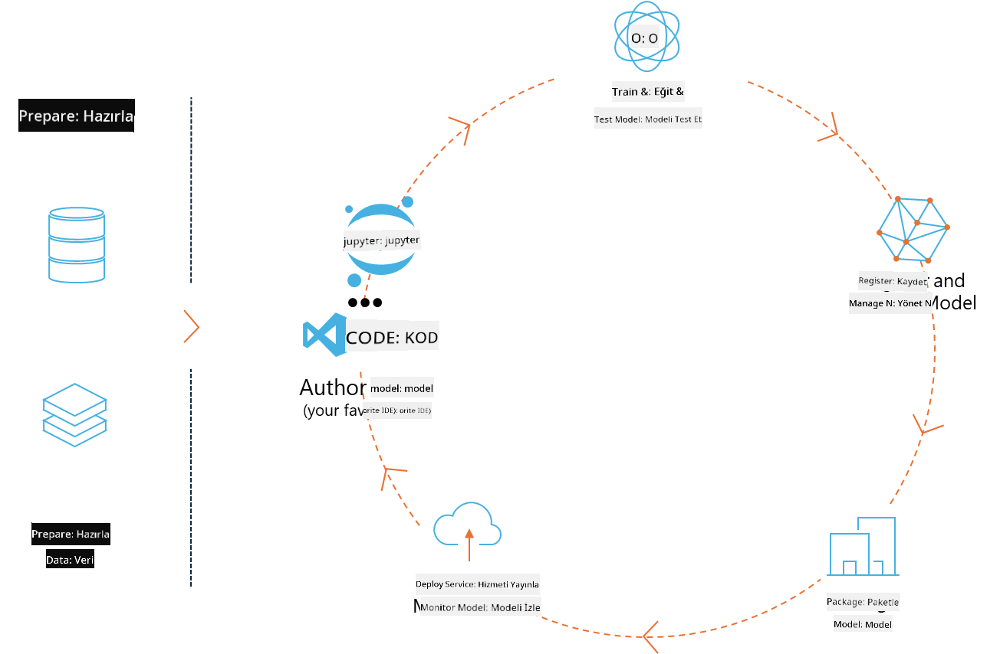
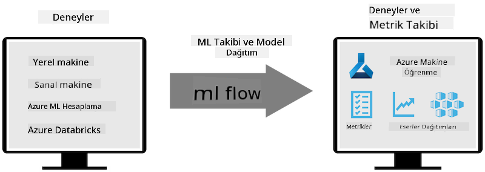
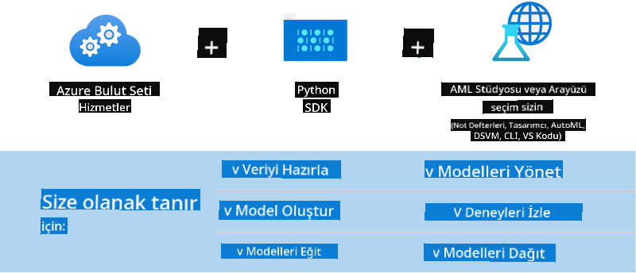

<!--
CO_OP_TRANSLATOR_METADATA:
{
  "original_hash": "f61c383bbf0c3dac97e43f833c258731",
  "translation_date": "2025-05-09T18:37:03+00:00",
  "source_file": "md/02.Application/01.TextAndChat/Phi3/E2E_Phi-3-MLflow.md",
  "language_code": "tr"
}
-->
# MLflow

[MLflow](https://mlflow.org/) uçtan uca makine öğrenimi yaşam döngüsünü yönetmek için tasarlanmış açık kaynaklı bir platformdur.



MLFlow, deney, tekrarlanabilirlik, dağıtım ve merkezi model kayıt defteri dahil olmak üzere ML yaşam döngüsünü yönetmek için kullanılır. MLflow şu anda dört bileşen sunmaktadır.

- **MLflow Tracking:** Deneyleri, kodu, veri yapılandırmasını ve sonuçları kaydetme ve sorgulama.
- **MLflow Projects:** Veri bilimi kodunu herhangi bir platformda çalıştırmayı tekrarlanabilir hale getiren formatta paketleme.
- **Mlflow Models:** Makine öğrenimi modellerini çeşitli servis ortamlarında dağıtma.
- **Model Registry:** Modelleri merkezi bir depoda saklama, not ekleme ve yönetme.

Deneyleri takip etme, kodu tekrarlanabilir çalıştırmalara paketleme ve modelleri paylaşma ve dağıtma yeteneklerini içerir. MLFlow, Databricks ile entegredir ve çeşitli ML kütüphanelerini destekleyerek kütüphane bağımsızlığı sağlar. Herhangi bir makine öğrenimi kütüphanesi ve programlama dili ile kullanılabilir, çünkü kullanım kolaylığı için REST API ve CLI sunar.



MLFlow’un temel özellikleri şunlardır:

- **Deney Takibi:** Parametreleri ve sonuçları kaydetme ve karşılaştırma.
- **Model Yönetimi:** Modelleri çeşitli servis ve çıkarım platformlarına dağıtma.
- **Model Kayıt Defteri:** MLflow Modellerinin yaşam döngüsünü, versiyonlama ve notlar dahil olmak üzere ortaklaşa yönetme.
- **Projeler:** ML kodunu paylaşım veya üretim kullanımı için paketleme.  
MLFlow ayrıca veri hazırlama, modelleri kaydetme ve yönetme, modelleri çalıştırma için paketleme, servisleri dağıtma ve modelleri izleme gibi MLOps döngüsünü destekler. Özellikle bulut ve uç ortamlarında prototipten üretim iş akışına geçiş sürecini basitleştirmeyi hedefler.

## Uçtan Uca Senaryo - Phi-3 için bir sarmalayıcı oluşturma ve MLFlow modeli olarak kullanma

Bu uçtan uca örnekte, Phi-3 küçük dil modeli (SLM) etrafında iki farklı sarmalayıcı oluşturma yaklaşımını göstereceğiz ve ardından bunu MLFlow modeli olarak ya yerel ya da bulutta, örneğin Azure Machine Learning çalışma alanında çalıştıracağız.



| Proje | Açıklama | Konum |
| ------------ | ----------- | -------- |
| Transformer Pipeline | Transformer Pipeline, MLFlow’un deneysel transformers çeşidi ile HuggingFace modeli kullanmak istiyorsanız sarmalayıcı oluşturmanın en kolay yoludur. | [**TransformerPipeline.ipynb**](../../../../../../code/06.E2E/E2E_Phi-3-MLflow_TransformerPipeline.ipynb) |
| Custom Python Wrapper | Yazım sırasında, transformer pipeline ONNX formatındaki HuggingFace modelleri için MLFlow sarmalayıcı oluşturmayı desteklemiyordu, hatta deneysel optimum Python paketi ile bile. Böyle durumlarda, MLFlow modu için özel Python sarmalayıcınızı oluşturabilirsiniz. | [**CustomPythonWrapper.ipynb**](../../../../../../code/06.E2E/E2E_Phi-3-MLflow_CustomPythonWrapper.ipynb) |

## Proje: Transformer Pipeline

1. MLFlow ve HuggingFace’den ilgili Python paketlerine ihtiyacınız olacak:

    ``` Python
    import mlflow
    import transformers
    ```

2. Sonra, HuggingFace kayıt defterindeki hedef Phi-3 modeline referans vererek bir transformer pipeline başlatmalısınız. _Phi-3-mini-4k-instruct_ model kartından görülebileceği gibi, görevi “Metin Üretimi” türündendir:

    ``` Python
    pipeline = transformers.pipeline(
        task = "text-generation",
        model = "microsoft/Phi-3-mini-4k-instruct"
    )
    ```

3. Şimdi Phi-3 modelinizin transformer pipeline’ını MLFlow formatında kaydedebilir ve hedef artefakt yolu, belirli model yapılandırma ayarları ve çıkarım API türü gibi ek detaylar verebilirsiniz:

    ``` Python
    model_info = mlflow.transformers.log_model(
        transformers_model = pipeline,
        artifact_path = "phi3-mlflow-model",
        model_config = model_config,
        task = "llm/v1/chat"
    )
    ```

## Proje: Custom Python Wrapper

1. Burada Microsoft’un [ONNX Runtime generate() API](https://github.com/microsoft/onnxruntime-genai)’sini ONNX modelin çıkarımı ve token kodlama / kod çözme için kullanabiliriz. Hedef hesaplama için _onnxruntime_genai_ paketini seçmelisiniz, aşağıdaki örnek CPU hedeflemektedir:

    ``` Python
    import mlflow
    from mlflow.models import infer_signature
    import onnxruntime_genai as og
    ```

1. Özel sınıfımız iki metot uygular: Phi-3 Mini 4K Instruct **ONNX modeli**, **üreteç parametreleri** ve **tokenizer**’ı başlatmak için _load_context()_; verilen prompt için çıktı tokenları üretmek için _predict()_:

    ``` Python
    class Phi3Model(mlflow.pyfunc.PythonModel):
        def load_context(self, context):
            # Retrieving model from the artifacts
            model_path = context.artifacts["phi3-mini-onnx"]
            model_options = {
                 "max_length": 300,
                 "temperature": 0.2,         
            }
        
            # Defining the model
            self.phi3_model = og.Model(model_path)
            self.params = og.GeneratorParams(self.phi3_model)
            self.params.set_search_options(**model_options)
            
            # Defining the tokenizer
            self.tokenizer = og.Tokenizer(self.phi3_model)
    
        def predict(self, context, model_input):
            # Retrieving prompt from the input
            prompt = model_input["prompt"][0]
            self.params.input_ids = self.tokenizer.encode(prompt)
    
            # Generating the model's response
            response = self.phi3_model.generate(self.params)
    
            return self.tokenizer.decode(response[0][len(self.params.input_ids):])
    ```

1. Şimdi _mlflow.pyfunc.log_model()_ fonksiyonunu kullanarak Phi-3 modeli için orijinal ONNX modeli ve gerekli bağımlılıklarla birlikte özel Python sarmalayıcıyı (pickle formatında) oluşturabilirsiniz:

    ``` Python
    model_info = mlflow.pyfunc.log_model(
        artifact_path = artifact_path,
        python_model = Phi3Model(),
        artifacts = {
            "phi3-mini-onnx": "cpu_and_mobile/cpu-int4-rtn-block-32-acc-level-4",
        },
        input_example = input_example,
        signature = infer_signature(input_example, ["Run"]),
        extra_pip_requirements = ["torch", "onnxruntime_genai", "numpy"],
    )
    ```

## Oluşturulan MLFlow modellerinin imzaları

1. Yukarıdaki Transformer Pipeline projesinin 3. adımında, MLFlow modelinin görevini “_llm/v1/chat_” olarak belirledik. Bu talimat, aşağıda gösterildiği gibi OpenAI’nin Chat API’si ile uyumlu bir model API sarmalayıcısı oluşturur:

    ``` Python
    {inputs: 
      ['messages': Array({content: string (required), name: string (optional), role: string (required)}) (required), 'temperature': double (optional), 'max_tokens': long (optional), 'stop': Array(string) (optional), 'n': long (optional), 'stream': boolean (optional)],
    outputs: 
      ['id': string (required), 'object': string (required), 'created': long (required), 'model': string (required), 'choices': Array({finish_reason: string (required), index: long (required), message: {content: string (required), name: string (optional), role: string (required)} (required)}) (required), 'usage': {completion_tokens: long (required), prompt_tokens: long (required), total_tokens: long (required)} (required)],
    params: 
      None}
    ```

1. Sonuç olarak, prompt’unuzu aşağıdaki formatta gönderebilirsiniz:

    ``` Python
    messages = [{"role": "user", "content": "What is the capital of Spain?"}]
    ```

1. Ardından, OpenAI API uyumlu son işleme kullanarak, örneğin _response[0][‘choices’][0][‘message’][‘content’]_ ile çıktınızı şu şekilde güzelleştirebilirsiniz:

    ``` JSON
    Question: What is the capital of Spain?
    
    Answer: The capital of Spain is Madrid. It is the largest city in Spain and serves as the political, economic, and cultural center of the country. Madrid is located in the center of the Iberian Peninsula and is known for its rich history, art, and architecture, including the Royal Palace, the Prado Museum, and the Plaza Mayor.
    
    Usage: {'prompt_tokens': 11, 'completion_tokens': 73, 'total_tokens': 84}
    ```

1. Yukarıdaki Custom Python Wrapper projesinin 3. adımında, MLFlow paketinin verilen bir giriş örneğinden model imzası oluşturmasına izin verdik. MLFlow sarmalayıcımızın imzası şöyle görünecek:

    ``` Python
    {inputs: 
      ['prompt': string (required)],
    outputs: 
      [string (required)],
    params: 
      None}
    ```

1. Bu yüzden prompt’umuz, aşağıdaki gibi "prompt" anahtarını içeren bir sözlük olmalıdır:

    ``` Python
    {"prompt": "<|system|>You are a stand-up comedian.<|end|><|user|>Tell me a joke about atom<|end|><|assistant|>",}
    ```

1. Modelin çıktısı ise string formatında sağlanacaktır:

    ``` JSON
    Alright, here's a little atom-related joke for you!
    
    Why don't electrons ever play hide and seek with protons?
    
    Because good luck finding them when they're always "sharing" their electrons!
    
    Remember, this is all in good fun, and we're just having a little atomic-level humor!
    ```

**Feragatname**:  
Bu belge, AI çeviri hizmeti [Co-op Translator](https://github.com/Azure/co-op-translator) kullanılarak çevrilmiştir. Doğruluk için çaba göstersek de, otomatik çevirilerin hatalar veya yanlışlıklar içerebileceğini lütfen unutmayınız. Orijinal belge, kendi ana dilinde yetkili kaynak olarak kabul edilmelidir. Kritik bilgiler için profesyonel insan çevirisi önerilir. Bu çevirinin kullanımı sonucu ortaya çıkabilecek yanlış anlamalar veya yanlış yorumlamalardan sorumlu değiliz.