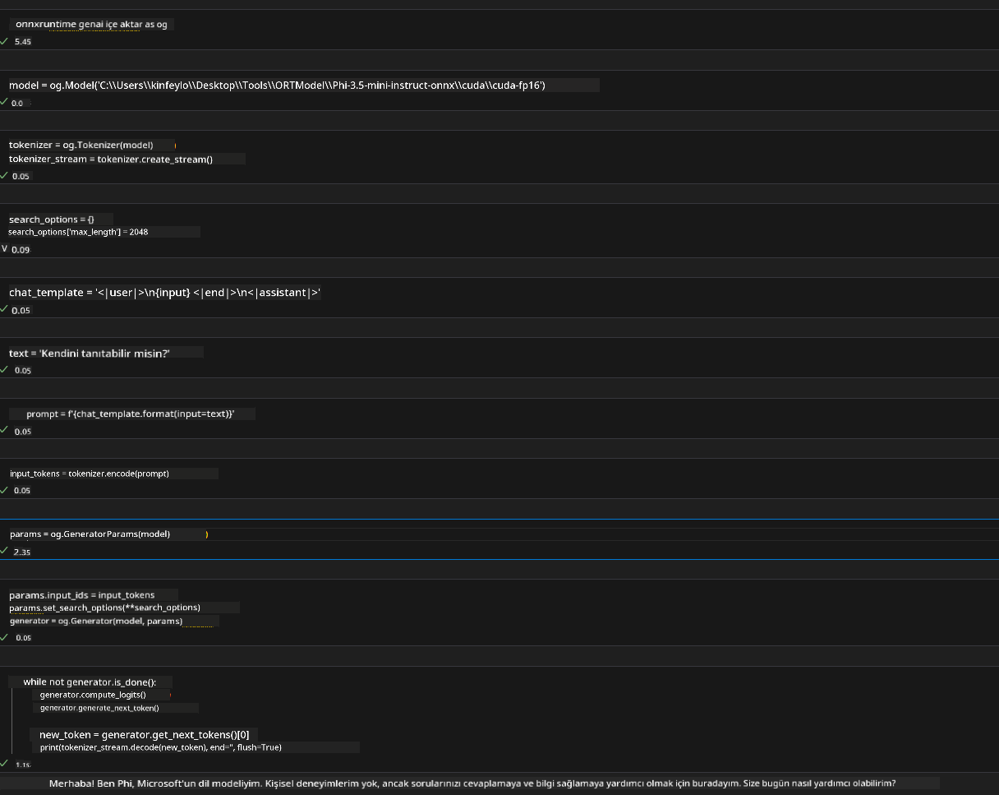
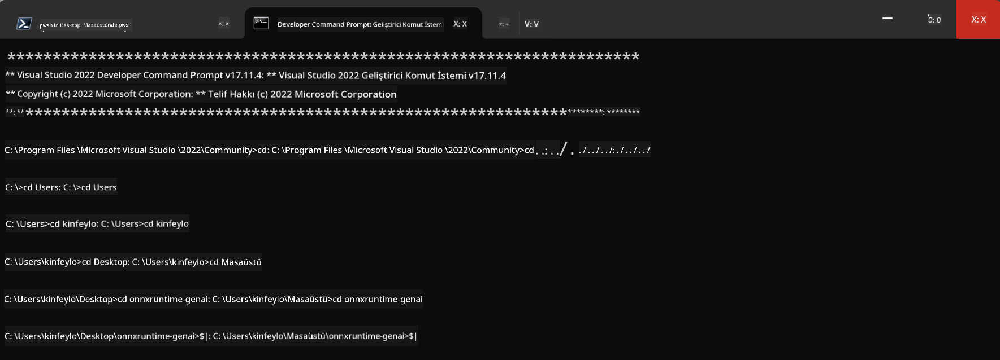

<!--
CO_OP_TRANSLATOR_METADATA:
{
  "original_hash": "b066fc29c1b2129df84e027cb75119ce",
  "translation_date": "2025-05-09T18:43:26+00:00",
  "source_file": "md/02.Application/01.TextAndChat/Phi3/ORTWindowGPUGuideline.md",
  "language_code": "tr"
}
-->
# **OnnxRuntime GenAI Windows GPU için Kılavuz**

Bu kılavuz, Windows üzerinde GPU'larla ONNX Runtime (ORT) kurulum ve kullanım adımlarını sağlar. Modelleriniz için GPU hızlandırmasını kullanarak performans ve verimliliği artırmanıza yardımcı olmak için hazırlanmıştır.

Doküman aşağıdaki konularda rehberlik sunar:

- Ortam Kurulumu: CUDA, cuDNN ve ONNX Runtime gibi gerekli bağımlılıkların kurulumu için talimatlar.
- Yapılandırma: GPU kaynaklarını etkili kullanmak için ortam ve ONNX Runtime yapılandırması.
- Optimizasyon İpuçları: GPU ayarlarınızı en iyi performans için nasıl ince ayar yapacağınız hakkında öneriler.

### **1. Python 3.10.x /3.11.8**

   ***Note*** Python ortamınız olarak [miniforge](https://github.com/conda-forge/miniforge/releases/latest/download/Miniforge3-Windows-x86_64.exe) kullanmanız önerilir.

   ```bash

   conda create -n pydev python==3.11.8

   conda activate pydev

   ```

   ***Reminder*** Python ONNX kütüphanesi ile ilgili herhangi bir kurulum yaptıysanız, lütfen kaldırın.

### **2. winget ile CMake Kurulumu**


   ```bash

   winget install -e --id Kitware.CMake

   ```

### **3. Visual Studio 2022 - C++ ile Masaüstü Geliştirme Kurulumu**

   ***Note*** Derleme yapmak istemiyorsanız bu adımı atlayabilirsiniz.


### **4. NVIDIA Sürücüsünü Kurun**

1. **NVIDIA GPU Sürücüsü**  [https://www.nvidia.com/en-us/drivers/](https://www.nvidia.com/en-us/drivers/)

2. **NVIDIA CUDA 12.4** [https://developer.nvidia.com/cuda-12-4-0-download-archive](https://developer.nvidia.com/cuda-12-4-0-download-archive)

3. **NVIDIA CUDNN 9.4**  [https://developer.nvidia.com/cudnn-downloads](https://developer.nvidia.com/cudnn-downloads)

***Reminder*** Kurulum sırasında varsayılan ayarları kullanın.

### **5. NVIDIA Ortamını Ayarlayın**

NVIDIA CUDNN 9.4'ün lib, bin, include dosyalarını NVIDIA CUDA 12.4'ün lib, bin, include klasörlerine kopyalayın.

- *'C:\Program Files\NVIDIA\CUDNN\v9.4\bin\12.6'* dosyalarını *'C:\Program Files\NVIDIA GPU Computing Toolkit\CUDA\v12.4\bin'* klasörüne kopyalayın.

- *'C:\Program Files\NVIDIA\CUDNN\v9.4\include\12.6'* dosyalarını *'C:\Program Files\NVIDIA GPU Computing Toolkit\CUDA\v12.4\include'* klasörüne kopyalayın.

- *'C:\Program Files\NVIDIA\CUDNN\v9.4\lib\12.6'* dosyalarını *'C:\Program Files\NVIDIA GPU Computing Toolkit\CUDA\v12.4\lib\x64'* klasörüne kopyalayın.


### **6. Phi-3.5-mini-instruct-onnx İndirin**


   ```bash

   winget install -e --id Git.Git

   winget install -e --id GitHub.GitLFS

   git lfs install

   git clone https://huggingface.co/microsoft/Phi-3.5-mini-instruct-onnx

   ```

### **7. InferencePhi35Instruct.ipynb Dosyasını Çalıştırın**

   [Notebook](../../../../../../code/09.UpdateSamples/Aug/ortgpu-phi35-instruct.ipynb) dosyasını açın ve çalıştırın.





### **8. ORT GenAI GPU'yu Derleyin**


   ***Note*** 
   
   1. Öncelikle onnx, onnxruntime ve onnxruntime-genai ile ilgili tüm kurulumları kaldırın.

   
   ```bash

   pip list 
   
   ```

   Ardından tüm onnxruntime kütüphanelerini kaldırın, örneğin:


   ```bash

   pip uninstall onnxruntime

   pip uninstall onnxruntime-genai

   pip uninstall onnxruntume-genai-cuda
   
   ```

   2. Visual Studio Eklenti desteğini kontrol edin

   C:\Program Files\NVIDIA GPU Computing Toolkit\CUDA\v12.4\extras klasöründe C:\Program Files\NVIDIA GPU Computing Toolkit\CUDA\v12.4\extras\visual_studio_integration klasörünün bulunduğundan emin olun. 
   
   Eğer bulunamazsa, diğer CUDA toolkit sürücü klasörlerini kontrol edin ve visual_studio_integration klasörü ile içeriğini C:\Program Files\NVIDIA GPU Computing Toolkit\CUDA\v12.4\extras\visual_studio_integration klasörüne kopyalayın.


   - Derleme yapmak istemiyorsanız bu adımı atlayabilirsiniz.


   ```bash

   git clone https://github.com/microsoft/onnxruntime-genai

   ```

   - [https://github.com/microsoft/onnxruntime/releases/download/v1.19.2/onnxruntime-win-x64-gpu-1.19.2.zip](https://github.com/microsoft/onnxruntime/releases/download/v1.19.2/onnxruntime-win-x64-gpu-1.19.2.zip) dosyasını indirin.

   - onnxruntime-win-x64-gpu-1.19.2.zip dosyasının içeriğini açın, klasörün adını **ort** olarak değiştirin ve ort klasörünü onnxruntime-genai içine kopyalayın.

   - Windows Terminal'i kullanarak VS 2022 için Geliştirici Komut İstemine gidin ve onnxruntime-genai klasörüne geçin.



   - Python ortamınız ile derleyin.

   
   ```bash

   cd onnxruntime-genai

   python build.py --use_cuda  --cuda_home "C:\Program Files\NVIDIA GPU Computing Toolkit\CUDA\v12.4" --config Release
 

   cd build/Windows/Release/Wheel

   pip install .whl

   ```

**Feragatname**:  
Bu belge, AI çeviri hizmeti [Co-op Translator](https://github.com/Azure/co-op-translator) kullanılarak çevrilmiştir. Doğruluk için çaba gösterilse de, otomatik çevirilerin hatalar veya yanlışlıklar içerebileceğini lütfen unutmayınız. Orijinal belge, kendi dilinde yetkili kaynak olarak kabul edilmelidir. Kritik bilgiler için profesyonel insan çevirisi önerilir. Bu çevirinin kullanımı sonucu oluşabilecek yanlış anlamalar veya yorumlamalardan sorumlu değiliz.