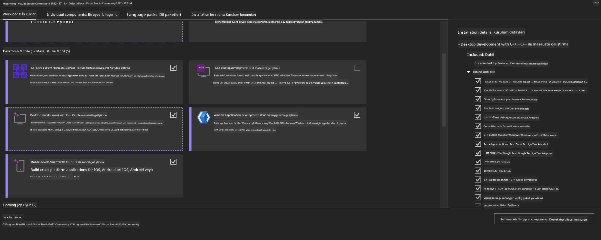
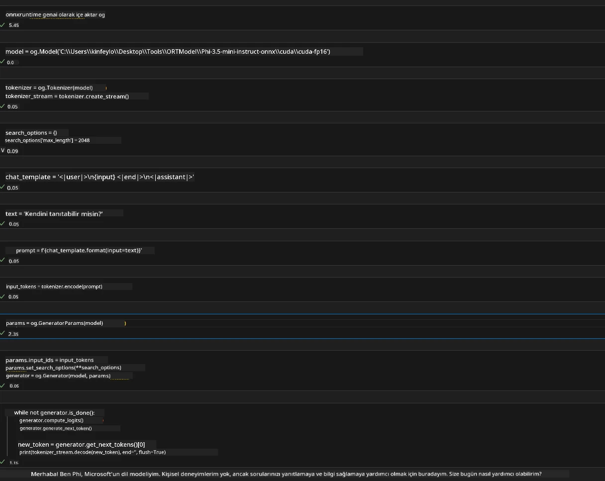
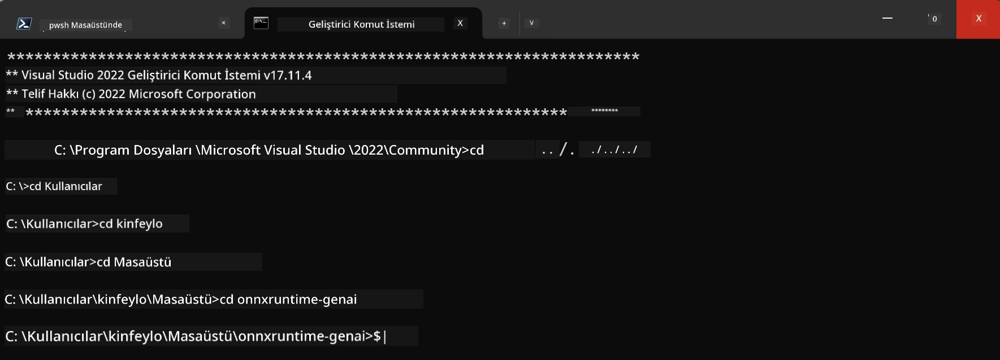

# **OnnxRuntime GenAI Windows GPU Kılavuzu**

Bu kılavuz, Windows'ta GPU'larla ONNX Runtime (ORT) kurulumunu ve kullanımını sağlamaktadır. Model performansınızı ve verimliliğinizi artırmak için GPU hızlandırmasından yararlanmanıza yardımcı olmak amacıyla tasarlanmıştır.

Belge, aşağıdaki konularda rehberlik sağlar:

- Ortam Kurulumu: CUDA, cuDNN ve ONNX Runtime gibi gerekli bağımlılıkların yüklenmesi için talimatlar.
- Yapılandırma: Ortam ve ONNX Runtime'ın GPU kaynaklarını verimli kullanacak şekilde nasıl yapılandırılacağı.
- Optimizasyon İpuçları: GPU ayarlarınızı optimum performans için nasıl ince ayarlayacağınıza dair öneriler.

### **1. Python 3.10.x /3.11.8**

   ***Not*** Python ortamınız olarak [miniforge](https://github.com/conda-forge/miniforge/releases/latest/download/Miniforge3-Windows-x86_64.exe) kullanmanız önerilir

   ```bash

   conda create -n pydev python==3.11.8

   conda activate pydev

   ```

   ***Hatırlatma*** Eğer python ONNX kütüphanesinden herhangi birini kurduysanız, lütfen kaldırın

### **2. winget ile CMake kurulumu**


   ```bash

   winget install -e --id Kitware.CMake

   ```

### **3. Visual Studio 2022 - C++ ile Masaüstü Geliştirme Kurulumu**

   ***Not*** Derlemek istemiyorsanız bu adımı atlayabilirsiniz




### **4. NVIDIA Sürücü Kurulumu**

1. **NVIDIA GPU Sürücüsü**  [https://www.nvidia.com/en-us/drivers/](https://www.nvidia.com/en-us/drivers/)

2. **NVIDIA CUDA 12.4** [https://developer.nvidia.com/cuda-12-4-0-download-archive](https://developer.nvidia.com/cuda-12-4-0-download-archive)

3. **NVIDIA CUDNN 9.4**  [https://developer.nvidia.com/cudnn-downloads](https://developer.nvidia.com/cudnn-downloads)

***Hatırlatma*** Kurulum akışında lütfen varsayılan ayarları kullanın

### **5. NVIDIA Ortamını Ayarlama**

NVIDIA CUDNN 9.4 lib, bin, include dosyalarını NVIDIA CUDA 12.4 lib, bin, include klasörlerine kopyalayın

- *'C:\Program Files\NVIDIA\CUDNN\v9.4\bin\12.6'* dosyalarını *'C:\Program Files\NVIDIA GPU Computing Toolkit\CUDA\v12.4\bin'* klasörüne kopyalayın

- *'C:\Program Files\NVIDIA\CUDNN\v9.4\include\12.6'* dosyalarını *'C:\Program Files\NVIDIA GPU Computing Toolkit\CUDA\v12.4\include'* klasörüne kopyalayın

- *'C:\Program Files\NVIDIA\CUDNN\v9.4\lib\12.6'* dosyalarını *'C:\Program Files\NVIDIA GPU Computing Toolkit\CUDA\v12.4\lib\x64'* klasörüne kopyalayın


### **6. Phi-3.5-mini-instruct-onnx İndirme**


   ```bash

   winget install -e --id Git.Git

   winget install -e --id GitHub.GitLFS

   git lfs install

   git clone https://huggingface.co/microsoft/Phi-3.5-mini-instruct-onnx

   ```

### **7. InferencePhi35Instruct.ipynb Çalıştırma**

   [Notebook'u](../../../../code/09.UpdateSamples/Aug/ortgpu-phi35-instruct.ipynb) açın ve çalıştırın





### **8. ORT GenAI GPU Derleme**


   ***Not*** 
   
   1. Öncelikle onnx, onnxruntime ve onnxruntime-genai ile ilgili tüm paketleri kaldırın

   
   ```bash

   pip list 
   
   ```

   Ardından tüm onnxruntime kütüphanelerini kaldırın, örneğin 


   ```bash

   pip uninstall onnxruntime

   pip uninstall onnxruntime-genai

   pip uninstall onnxruntume-genai-cuda
   
   ```

   2. Visual Studio Uzantısının desteklendiğini kontrol edin

   C:\Program Files\NVIDIA GPU Computing Toolkit\CUDA\v12.4\extras klasöründe C:\Program Files\NVIDIA GPU Computing Toolkit\CUDA\v12.4\extras\visual_studio_integration klasörünün var olduğunu doğrulayın.
   
   Eğer bulunamazsa, diğer CUDA toolkit sürücü klasörlerini kontrol edin ve visual_studio_integration klasörünü ve içeriğini C:\Program Files\NVIDIA GPU Computing Toolkit\CUDA\v12.4\extras\visual_studio_integration yoluna kopyalayın


   - Eğer derlemek istemiyorsanız bu adımı atlayabilirsiniz


   ```bash

   git clone https://github.com/microsoft/onnxruntime-genai

   ```

   - [https://github.com/microsoft/onnxruntime/releases/download/v1.19.2/onnxruntime-win-x64-gpu-1.19.2.zip](https://github.com/microsoft/onnxruntime/releases/download/v1.19.2/onnxruntime-win-x64-gpu-1.19.2.zip) adresinden indirin

   - onnxruntime-win-x64-gpu-1.19.2.zip dosyasının sıkıştırmasını açın, **ort** olarak yeniden adlandırın, ort klasörünü onnxruntime-genai içine kopyalayın

   - Windows Terminal'i kullanarak VS 2022 için Geliştirici Komut İstemi'ne gidin ve onnxruntime-genai klasörüne geçin



   - Python ortamınız ile derleyin

   
   ```bash

   cd onnxruntime-genai

   python build.py --use_cuda  --cuda_home "C:\Program Files\NVIDIA GPU Computing Toolkit\CUDA\v12.4" --config Release
 

   cd build/Windows/Release/Wheel

   pip install .whl

   ```

---

<!-- CO-OP TRANSLATOR DISCLAIMER START -->
**Feragatname**:
Bu belge, AI çeviri hizmeti [Co-op Translator](https://github.com/Azure/co-op-translator) kullanılarak çevrilmiştir. Doğruluk için çaba sarf etsek de, otomatik çevirilerin hata veya yanlışlık içerebileceğini lütfen unutmayınız. Orijinal belge, kendi dilinde yetkili kaynak olarak kabul edilmelidir. Kritik bilgiler için profesyonel insan çevirisi önerilir. Bu çevirinin kullanımı sonucu ortaya çıkabilecek yanlış anlamalardan veya yanlış yorumlamalardan sorumlu değiliz.
<!-- CO-OP TRANSLATOR DISCLAIMER END -->