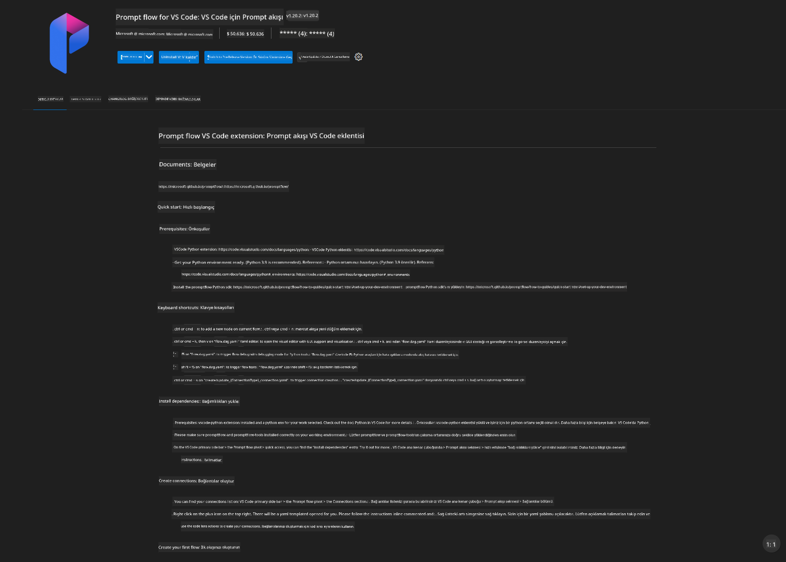
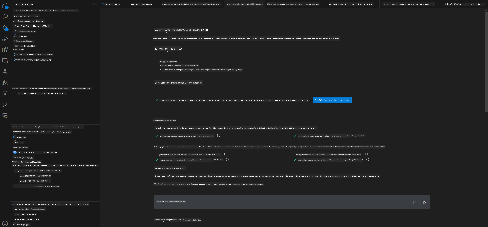
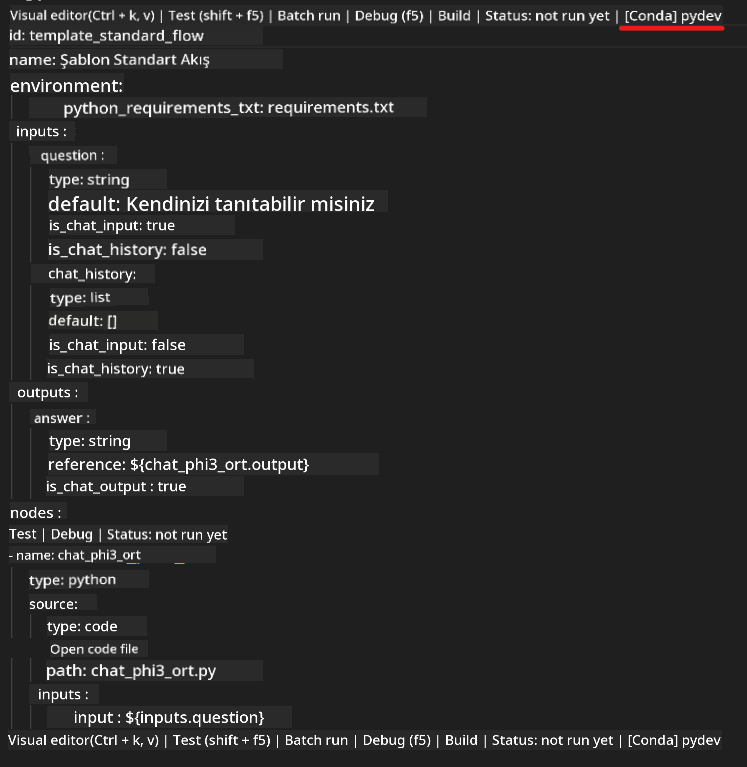
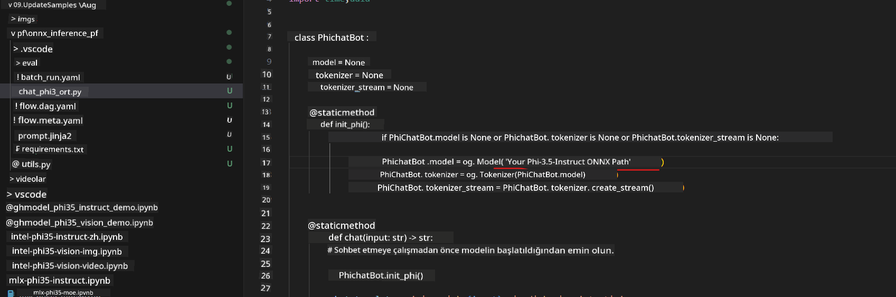
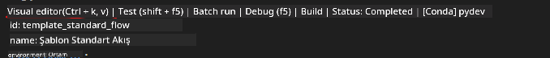
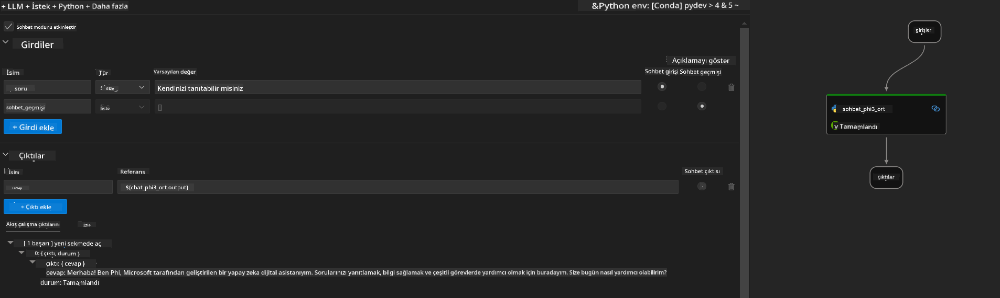
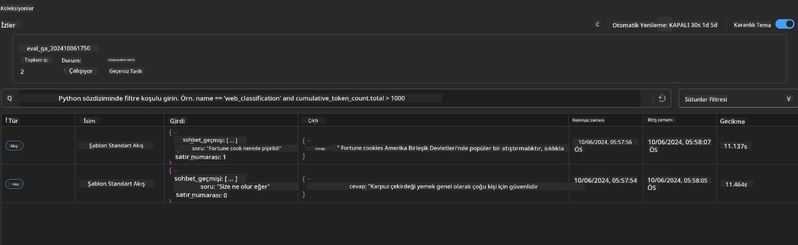

<!--
CO_OP_TRANSLATOR_METADATA:
{
  "original_hash": "92e7dac1e5af0dd7c94170fdaf6860fe",
  "translation_date": "2025-05-09T18:52:44+00:00",
  "source_file": "md/02.Application/01.TextAndChat/Phi3/UsingPromptFlowWithONNX.md",
  "language_code": "tr"
}
-->
# Windows GPU kullanarak Phi-3.5-Instruct ONNX ile Prompt flow çözümü oluşturma

Aşağıdaki doküman, Phi-3 modellerine dayalı AI uygulamaları geliştirmek için ONNX (Open Neural Network Exchange) ile PromptFlow kullanımına dair bir örnektir.

PromptFlow, fikir aşamasından prototip oluşturma, test ve değerlendirmeye kadar LLM tabanlı (Büyük Dil Modeli) AI uygulamalarının uçtan uca geliştirme döngüsünü kolaylaştırmak için tasarlanmış bir geliştirme araçları paketidir.

PromptFlow’u ONNX ile entegre ederek geliştiriciler:

- Model Performansını Optimize Edebilir: Verimli model çıkarımı ve dağıtımı için ONNX'ten yararlanabilir.
- Geliştirmeyi Basitleştirebilir: İş akışını yönetmek ve tekrarlayan görevleri otomatikleştirmek için PromptFlow kullanabilir.
- İşbirliğini Geliştirebilir: Birleşik bir geliştirme ortamı sağlayarak ekip üyeleri arasında daha iyi işbirliği yapılmasını kolaylaştırabilir.

**Prompt flow**, fikir aşamasından prototip oluşturmaya, test ve değerlendirmeye, üretim dağıtımı ve izlemeye kadar LLM tabanlı AI uygulamalarının uçtan uca geliştirme döngüsünü kolaylaştırmak için tasarlanmış bir geliştirme araçları paketidir. Prompt mühendisliğini çok daha kolay hale getirir ve üretim kalitesinde LLM uygulamaları oluşturmanızı sağlar.

Prompt flow, OpenAI, Azure OpenAI Servisi ve özelleştirilebilir modellerle (Huggingface, yerel LLM/SLM) bağlantı kurabilir. Phi-3.5’in kuantize edilmiş ONNX modelini yerel uygulamalara dağıtmayı hedefliyoruz. Prompt flow, işimizi daha iyi planlamamıza ve Phi-3.5 tabanlı yerel çözümleri tamamlamamıza yardımcı olabilir. Bu örnekte, Windows GPU tabanlı Prompt flow çözümünü tamamlamak için ONNX Runtime GenAI Kütüphanesi ile birleştireceğiz.

## **Kurulum**

### **Windows GPU için ONNX Runtime GenAI**

Windows GPU için ONNX Runtime GenAI kurulum rehberini okumak için [buraya tıklayın](./ORTWindowGPUGuideline.md)

### **VSCode’da Prompt flow kurulumu**

1. Prompt flow VS Code Uzantısını yükleyin



2. Prompt flow VS Code Uzantısını yükledikten sonra, uzantıya tıklayın ve **Installation dependencies** seçeneğini seçerek bu rehberi takip edip ortamınıza Prompt flow SDK’yı kurun



3. [Örnek Kodu](../../../../../../code/09.UpdateSamples/Aug/pf/onnx_inference_pf) indirin ve VS Code ile açın


4. Python ortamınızı seçmek için **flow.dag.yaml** dosyasını açın



   Phi-3.5-instruct ONNX Modelinizin konumunu değiştirmek için **chat_phi3_ort.py** dosyasını açın



5. Prompt flow’u test etmek için çalıştırın

**flow.dag.yaml** dosyasını açın ve görsel editöre tıklayın



Buna tıkladıktan sonra test etmek için çalıştırın



1. Daha fazla sonuç görmek için terminalde toplu çalıştırma yapabilirsiniz


```bash

pf run create --file batch_run.yaml --stream --name 'Your eval qa name'    

```

Sonuçları varsayılan tarayıcınızda kontrol edebilirsiniz




**Feragatname**:  
Bu belge, AI çeviri hizmeti [Co-op Translator](https://github.com/Azure/co-op-translator) kullanılarak çevrilmiştir. Doğruluk için çaba göstersek de, otomatik çevirilerin hata veya yanlışlık içerebileceğini lütfen unutmayınız. Orijinal belge, kendi ana dilinde yetkili kaynak olarak kabul edilmelidir. Kritik bilgiler için profesyonel insan çevirisi önerilir. Bu çevirinin kullanımı sonucu ortaya çıkabilecek yanlış anlamalar veya yanlış yorumlamalar nedeniyle sorumluluk kabul edilmemektedir.