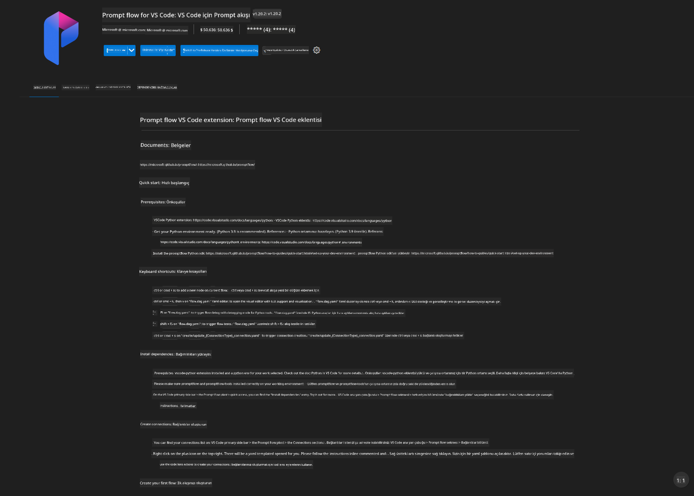
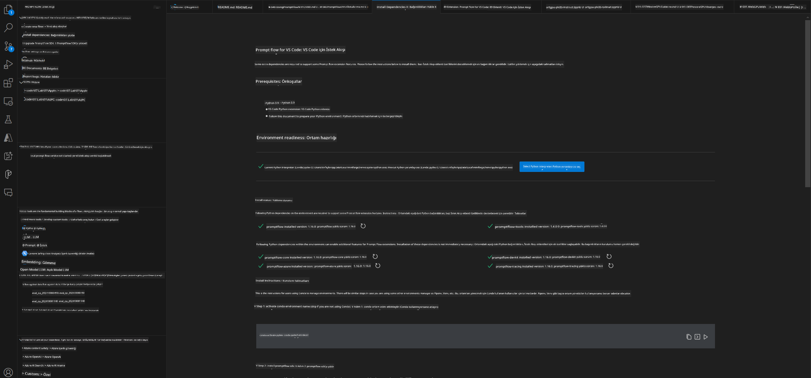
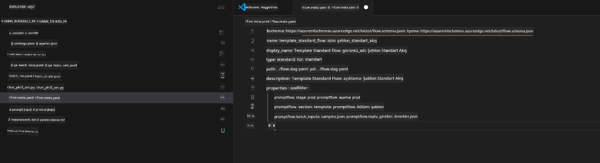
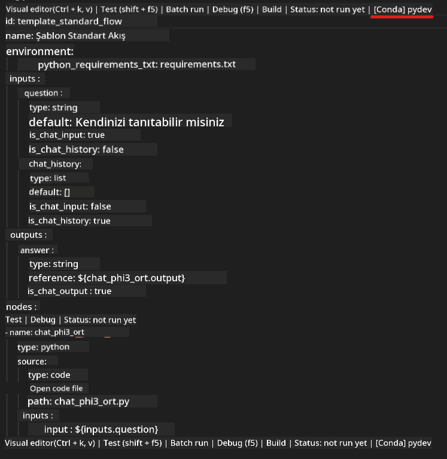
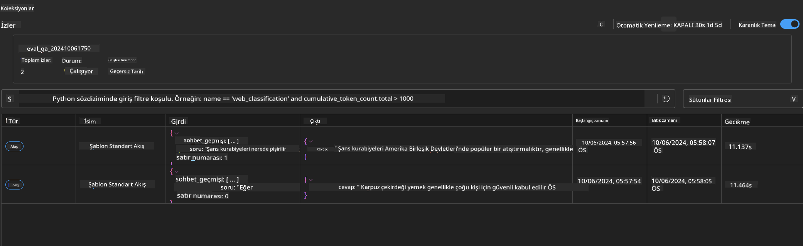

<!--
CO_OP_TRANSLATOR_METADATA:
{
  "original_hash": "92e7dac1e5af0dd7c94170fdaf6860fe",
  "translation_date": "2025-07-17T03:00:14+00:00",
  "source_file": "md/02.Application/01.TextAndChat/Phi3/UsingPromptFlowWithONNX.md",
  "language_code": "tr"
}
-->
# Phi-3.5-Instruct ONNX ile Windows GPU kullanarak Prompt flow çözümü oluşturma

Aşağıdaki belge, Phi-3 modellerine dayalı yapay zeka uygulamaları geliştirmek için PromptFlow'u ONNX (Open Neural Network Exchange) ile nasıl kullanacağınıza dair bir örnektir.

PromptFlow, LLM tabanlı (Büyük Dil Modeli) yapay zeka uygulamalarının fikir aşamasından prototiplemeye, test ve değerlendirmeye kadar uçtan uca geliştirme döngüsünü kolaylaştırmak için tasarlanmış bir geliştirme araçları paketidir.

PromptFlow'u ONNX ile entegre ederek geliştiriciler:

- Model Performansını Optimize Edebilir: Verimli model çıkarımı ve dağıtımı için ONNX'ten yararlanabilir.
- Geliştirmeyi Basitleştirebilir: İş akışını yönetmek ve tekrarlayan görevleri otomatikleştirmek için PromptFlow'u kullanabilir.
- İş Birliğini Artırabilir: Birleşik bir geliştirme ortamı sağlayarak ekip üyeleri arasında daha iyi iş birliği kolaylaştırabilir.

**Prompt flow**, LLM tabanlı yapay zeka uygulamalarının fikir aşamasından prototipleme, test, değerlendirme, üretim dağıtımı ve izlemeye kadar uçtan uca geliştirme döngüsünü kolaylaştırmak için tasarlanmış bir geliştirme araçları paketidir. Prompt mühendisliğini çok daha kolay hale getirir ve üretim kalitesinde LLM uygulamaları oluşturmanızı sağlar.

Prompt flow, OpenAI, Azure OpenAI Service ve özelleştirilebilir modellerle (Huggingface, yerel LLM/SLM) bağlantı kurabilir. Phi-3.5'in kuantize edilmiş ONNX modelini yerel uygulamalara dağıtmayı hedefliyoruz. Prompt flow, işimizi daha iyi planlamamıza ve Phi-3.5 tabanlı yerel çözümleri tamamlamamıza yardımcı olabilir. Bu örnekte, Windows GPU tabanlı Prompt flow çözümünü tamamlamak için ONNX Runtime GenAI Kütüphanesi ile birleştireceğiz.

## **Kurulum**

### **Windows GPU için ONNX Runtime GenAI**

Windows GPU için ONNX Runtime GenAI'yi kurmak için bu kılavuzu okuyun [buraya tıklayın](./ORTWindowGPUGuideline.md)

### **VSCode'da Prompt flow kurulumu**

1. Prompt flow VS Code Eklentisini yükleyin



2. Prompt flow VS Code Eklentisini yükledikten sonra, eklentiye tıklayın ve **Installation dependencies** seçeneğini seçin, bu kılavuzu takip ederek ortamınıza Prompt flow SDK'yı kurun



3. [Örnek Kodu](../../../../../../code/09.UpdateSamples/Aug/pf/onnx_inference_pf) indirin ve VS Code ile bu örneği açın



4. Python ortamınızı seçmek için **flow.dag.yaml** dosyasını açın



   Phi-3.5-instruct ONNX Model konumunuzu değiştirmek için **chat_phi3_ort.py** dosyasını açın


5. Prompt flow'u test etmek için çalıştırın

**flow.dag.yaml** dosyasını açın ve görsel editöre tıklayın


Buna tıkladıktan sonra çalıştırarak testi başlatın


1. Daha fazla sonuç kontrol etmek için terminalde toplu çalıştırma yapabilirsiniz


```bash

pf run create --file batch_run.yaml --stream --name 'Your eval qa name'    

```

Sonuçları varsayılan tarayıcınızda kontrol edebilirsiniz




**Feragatname**:  
Bu belge, AI çeviri servisi [Co-op Translator](https://github.com/Azure/co-op-translator) kullanılarak çevrilmiştir. Doğruluk için çaba göstersek de, otomatik çevirilerin hatalar veya yanlışlıklar içerebileceğini lütfen unutmayınız. Orijinal belge, kendi dilinde yetkili kaynak olarak kabul edilmelidir. Kritik bilgiler için profesyonel insan çevirisi önerilir. Bu çevirinin kullanımı sonucu oluşabilecek yanlış anlamalar veya yorum hatalarından sorumlu değiliz.