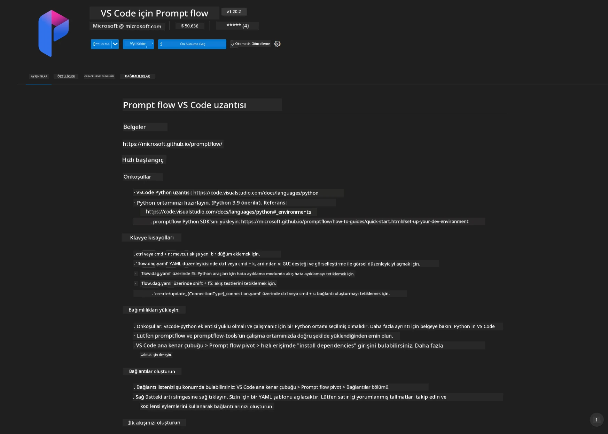
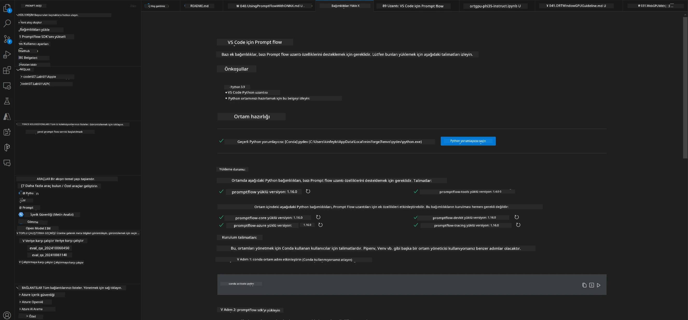
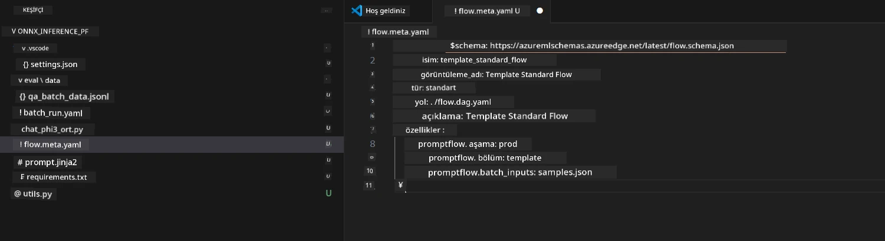
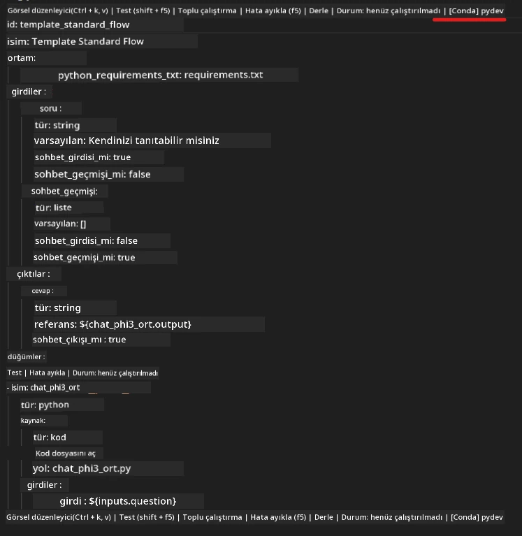
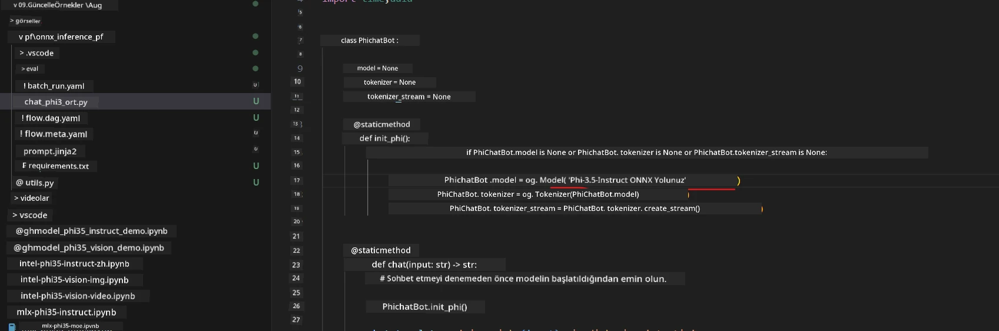
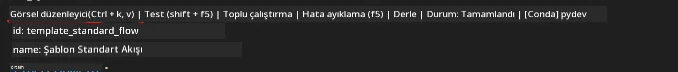
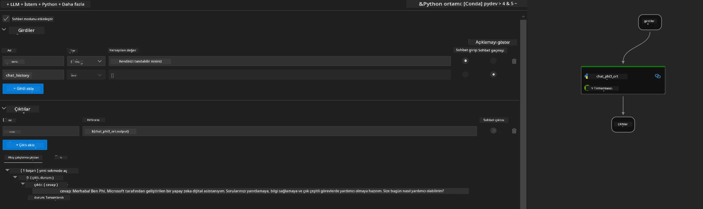
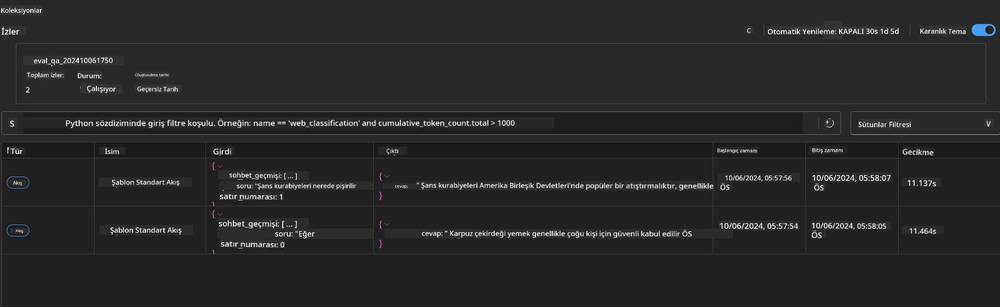

# Windows GPU kullanarak Phi-3.5-Instruct ONNX ile Prompt flow çözümü oluşturma 

Aşağıdaki belge, Phi-3 modellerine dayalı AI uygulamaları geliştirmek için ONNX (Open Neural Network Exchange) ile PromptFlow kullanımına bir örnektir.

PromptFlow, LLM tabanlı (Büyük Dil Modeli) AI uygulamalarının fikir aşamasından prototipleme, test ve değerlendirmeye kadar uçtan uca geliştirme döngüsünü kolaylaştırmak için tasarlanmış bir geliştirme araçları paketidir.

PromptFlow'u ONNX ile entegre ederek geliştiriciler:

- Model Performansını Optimize Edebilir: Verimli model çıkarımı ve dağıtımı için ONNX'ten yararlanın.
- Geliştirmeyi Basitleştirebilir: İş akışını yönetmek ve tekrarlayan görevleri otomatikleştirmek için PromptFlow'u kullanın.
- İş Birliğini Geliştirebilir: Birleşik bir geliştirme ortamı sağlayarak ekip üyeleri arasında daha iyi iş birliğini kolaylaştırır.

**Prompt flow**, fikir aşamasından prototipleme, test, değerlendirme, üretim dağıtımı ve izlemesine kadar LLM tabanlı AI uygulamalarının uçtan uca geliştirme döngüsünü kolaylaştırmak için tasarlanmış bir geliştirme araçları paketidir. Prompt mühendisliğini çok daha kolay hale getirir ve üretim kalitesinde LLM uygulamaları oluşturmanıza olanak tanır.

Prompt flow, OpenAI, Azure OpenAI Hizmeti ve özelleştirilebilir modellerle (Huggingface, yerel LLM/SLM) bağlantı kurabilir. Phi-3.5'in kuantize edilmiş ONNX modelini yerel uygulamalara dağıtmayı hedefliyoruz. Prompt flow, işimizi daha iyi planlamamızda ve Phi-3.5'e dayalı yerel çözümleri tamamlamamızda yardımcı olabilir. Bu örnekte, Windows GPU tabanlı Prompt flow çözümünü tamamlamak için ONNX Runtime GenAI Kütüphanesini birleştireceğiz.

## **Kurulum**

### **Windows GPU için ONNX Runtime GenAI**

Windows GPU için ONNX Runtime GenAI kurmak için bu kılavuzu okuyun [buraya tıklayın](./ORTWindowGPUGuideline.md)

### **VSCode'da Prompt flow kurulum**

1. Prompt flow VS Code Uzantısını yükleyin



2. Prompt flow VS Code Uzantısını yükledikten sonra, uzantıya tıklayın ve **Kurulum bağımlılıklarını** seçerek bu kılavuzu takip edip ortamınızda Prompt flow SDK'yı kurun



3. [Örnek Kodu](../../../../../../code/09.UpdateSamples/Aug/pf/onnx_inference_pf) indirin ve VS Code ile bu örneği açın



4. Python ortamınızı seçmek için **flow.dag.yaml** dosyasını açın



   Phi-3.5-instruct ONNX Model konumunu değiştirmek için **chat_phi3_ort.py** dosyasını açın



5. Prompt flow'unuzu test etmek için çalıştırın

**flow.dag.yaml** dosyasını açın ve görsel düzenleyiciye tıklayın



bunu tıkladıktan sonra çalıştırarak test edin



1. Daha fazla sonuç görmek için terminalde toplu çalıştırma yapabilirsiniz


```bash

pf run create --file batch_run.yaml --stream --name 'Your eval qa name'    

```

Sonuçları varsayılan tarayıcınızda kontrol edebilirsiniz




---

<!-- CO-OP TRANSLATOR DISCLAIMER START -->
**Feragatname**:
Bu belge, AI çeviri hizmeti [Co-op Translator](https://github.com/Azure/co-op-translator) kullanılarak çevrilmiştir. Doğruluk için çaba sarf etsek de, otomatik çevirilerin hata veya yanlışlık içerebileceğini lütfen unutmayınız. Orijinal belge, kendi dilinde yetkili kaynak olarak kabul edilmelidir. Kritik bilgiler için profesyonel insan çevirisi önerilir. Bu çevirinin kullanımı sonucu ortaya çıkabilecek yanlış anlamalardan veya yanlış yorumlamalardan sorumlu değiliz.
<!-- CO-OP TRANSLATOR DISCLAIMER END -->