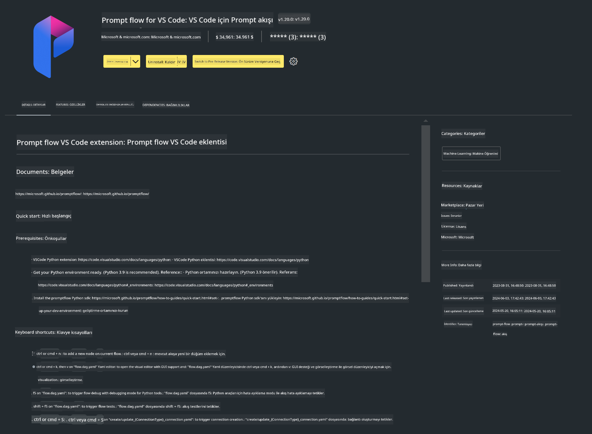

<!--
CO_OP_TRANSLATOR_METADATA:
{
  "original_hash": "a4ef39027902e82f2c33d568d2a2259a",
  "translation_date": "2025-07-17T03:50:20+00:00",
  "source_file": "md/02.Application/02.Code/Phi3/VSCodeExt/HOL/AIPC/01.Installations.md",
  "language_code": "tr"
}
-->
# **Lab 0 - Kurulum**

Laba girdiğimizde, ilgili ortamı yapılandırmamız gerekiyor:


### **1. Python 3.11+**

Python ortamınızı yapılandırmak için miniforge kullanmanız önerilir.

Miniforge'u yapılandırmak için lütfen [https://github.com/conda-forge/miniforge](https://github.com/conda-forge/miniforge) adresine bakınız.

Miniforge'u yapılandırdıktan sonra, Power Shell'de aşağıdaki komutu çalıştırın

```bash

conda create -n pyenv python==3.11.8 -y

conda activate pyenv

```


### **2. Prompt flow SDK Kurulumu**

Lab 1'de Prompt flow kullanacağız, bu yüzden Prompt flow SDK'yı yapılandırmanız gerekiyor.

```bash

pip install promptflow --upgrade

```

Promptflow sdk'yı bu komutla kontrol edebilirsiniz


```bash

pf --version

```

### **3. Visual Studio Code Prompt flow Eklentisi Kurulumu**




### **4. Intel NPU Hızlandırma Kütüphanesi**

Intel'in yeni nesil işlemcileri NPU desteği sunar. LLM'leri / SLM'leri yerel olarak NPU ile çalıştırmak istiyorsanız, ***Intel NPU Acceleration Library*** kullanabilirsiniz. Daha fazla bilgi için [https://github.com/microsoft/PhiCookBook/blob/main/md/01.Introduction/03/AIPC_Inference.md](https://github.com/microsoft/PhiCookBook/blob/main/md/01.Introduction/03/AIPC_Inference.md) adresini okuyabilirsiniz.

Intel NPU Acceleration Library'yi bash'te kurun


```bash

pip install intel-npu-acceleration-library

```

***Not***: Bu kütüphanenin transformers ***4.40.2*** sürümünü desteklediğini unutmayın, lütfen sürümü kontrol edin.


### **5. Diğer Python Kütüphaneleri**

requirements.txt dosyası oluşturun ve aşağıdaki içeriği ekleyin

```txt

notebook
numpy 
scipy 
scikit-learn 
matplotlib 
pandas 
pillow 
graphviz

```


### **6. NVM Kurulumu**

Powershell'de nvm'yi kurun


```bash

winget install -e --id CoreyButler.NVMforWindows

```

nodejs 18.20 sürümünü kurun


```bash

nvm install 18.20.0

nvm use 18.20.0

```

### **7. Visual Studio Code Geliştirme Desteği Kurulumu**


```bash

npm install --global yo generator-code

```

Tebrikler! SDK'yı başarıyla yapılandırdınız. Şimdi uygulamalı adımlara geçebilirsiniz.

**Feragatname**:  
Bu belge, AI çeviri servisi [Co-op Translator](https://github.com/Azure/co-op-translator) kullanılarak çevrilmiştir. Doğruluk için çaba göstersek de, otomatik çevirilerin hatalar veya yanlışlıklar içerebileceğini lütfen unutmayınız. Orijinal belge, kendi dilinde yetkili kaynak olarak kabul edilmelidir. Kritik bilgiler için profesyonel insan çevirisi önerilir. Bu çevirinin kullanımı sonucu oluşabilecek yanlış anlamalar veya yorum hatalarından sorumlu değiliz.