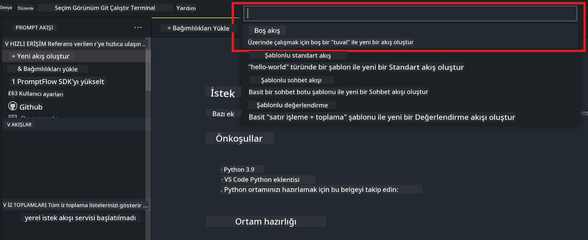
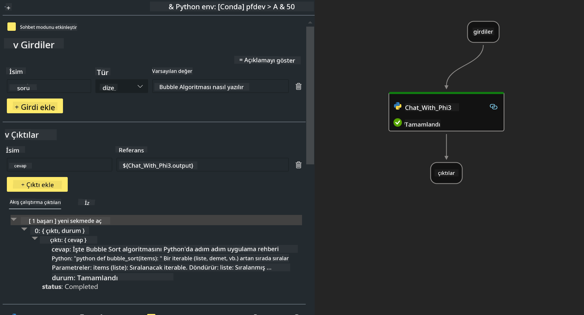

<!--
CO_OP_TRANSLATOR_METADATA:
{
  "original_hash": "bc29f7fe7fc16bed6932733eac8c81b8",
  "translation_date": "2025-07-17T03:58:05+00:00",
  "source_file": "md/02.Application/02.Code/Phi3/VSCodeExt/HOL/AIPC/02.PromptflowWithNPU.md",
  "language_code": "tr"
}
-->
# **Lab 2 - Phi-3-mini ile AIPC'de Prompt flow Çalıştırma**

## **Prompt flow Nedir**

Prompt flow, LLM tabanlı yapay zeka uygulamalarının fikir aşamasından prototip oluşturma, test, değerlendirme, üretime dağıtım ve izlemeye kadar olan uçtan uca geliştirme döngüsünü kolaylaştırmak için tasarlanmış bir geliştirme araçları paketidir. Prompt mühendisliğini çok daha basit hale getirir ve üretim kalitesinde LLM uygulamaları oluşturmanızı sağlar.

Prompt flow ile şunları yapabilirsiniz:

- LLM’leri, promptları, Python kodunu ve diğer araçları birbirine bağlayan çalıştırılabilir iş akışları oluşturmak.

- Özellikle LLM’lerle olan etkileşimi kolayca hata ayıklamak ve yinelemek.

- İş akışlarınızı değerlendirmek, daha büyük veri setleriyle kalite ve performans metriklerini hesaplamak.

- Test ve değerlendirmeyi CI/CD sisteminize entegre ederek iş akışınızın kalitesini sağlamak.

- İş akışlarınızı seçtiğiniz servis platformuna dağıtmak veya uygulamanızın kod tabanına kolayca entegre etmek.

- (İsteğe bağlı ama şiddetle tavsiye edilir) Azure AI’daki Prompt flow bulut sürümünü kullanarak ekibinizle iş birliği yapmak.

## **AIPC Nedir**

Bir AI PC, CPU, GPU ve her biri belirli yapay zeka hızlandırma yeteneklerine sahip bir NPU içerir. NPU, yani sinirsel işlem birimi, yapay zeka (AI) ve makine öğrenimi (ML) görevlerini verileri buluta göndermek yerine doğrudan bilgisayarınızda işleyen özel bir hızlandırıcıdır. GPU ve CPU da bu işleri yapabilir, ancak NPU özellikle düşük güç tüketimli AI hesaplamalarında çok iyidir. AI PC, bilgisayarlarımızın çalışma şeklinde temel bir değişimi temsil eder. Daha önce var olmayan bir soruna çözüm değil, günlük PC kullanımlarında büyük bir iyileştirme vaat eder.

Peki nasıl çalışır? Jeneratif AI ve tonlarca halka açık veriyle eğitilmiş devasa büyük dil modellerine (LLM’ler) kıyasla, bilgisayarınızda gerçekleşecek AI hemen her seviyede daha erişilebilirdir. Konsept daha kolay anlaşılır ve verilerinizle eğitildiği için buluta erişim gerektirmez; bu da faydalarını daha geniş bir kitle için hemen çekici kılar.

Kısa vadede, AI PC dünyası kişisel asistanlar ve daha küçük AI modellerinin doğrudan bilgisayarınızda çalışmasını içerir; verilerinizi kullanarak kişisel, özel ve daha güvenli AI iyileştirmeleri sunar. Örneğin toplantı notları almak, bir fantazi futbol ligi düzenlemek, fotoğraf ve video düzenlemeleri için otomatik iyileştirmeler yapmak veya herkesin geliş-gidiş saatlerine göre mükemmel bir aile buluşması programı hazırlamak gibi günlük yaptığınız işleri kolaylaştırır.

## **AIPC’de jenerasyon kod akışları oluşturma**

***Not*** ：Ortam kurulumunu tamamlamadıysanız, lütfen [Lab 0 -Installations](./01.Installations.md) sayfasını ziyaret edin.

1. Visual Studio Code’da Prompt flow Uzantısını açın ve boş bir flow projesi oluşturun



2. Girdi ve Çıktı parametreleri ekleyin ve yeni bir flow olarak Python Kodu ekleyin



İş akışınızı oluşturmak için bu yapıya (flow.dag.yaml) bakabilirsiniz

```yaml

inputs:
  question:
    type: string
    default: how to write Bubble Algorithm
outputs:
  answer:
    type: string
    reference: ${Chat_With_Phi3.output}
nodes:
- name: Chat_With_Phi3
  type: python
  source:
    type: code
    path: Chat_With_Phi3.py
  inputs:
    question: ${inputs.question}


```

3. ***Chat_With_Phi3.py*** dosyasına kod ekleyin

```python


from promptflow.core import tool

# import torch
from transformers import AutoTokenizer, pipeline,TextStreamer
import intel_npu_acceleration_library as npu_lib

import warnings

import asyncio
import platform

class Phi3CodeAgent:
    
    model = None
    tokenizer = None
    text_streamer = None
    
    model_id = "microsoft/Phi-3-mini-4k-instruct"

    @staticmethod
    def init_phi3():
        
        if Phi3CodeAgent.model is None or Phi3CodeAgent.tokenizer is None or Phi3CodeAgent.text_streamer is None:
            Phi3CodeAgent.model = npu_lib.NPUModelForCausalLM.from_pretrained(
                                    Phi3CodeAgent.model_id,
                                    torch_dtype="auto",
                                    dtype=npu_lib.int4,
                                    trust_remote_code=True
                                )
            Phi3CodeAgent.tokenizer = AutoTokenizer.from_pretrained(Phi3CodeAgent.model_id)
            Phi3CodeAgent.text_streamer = TextStreamer(Phi3CodeAgent.tokenizer, skip_prompt=True)

    

    @staticmethod
    def chat_with_phi3(prompt):
        
        Phi3CodeAgent.init_phi3()

        messages = "<|system|>You are a AI Python coding assistant. Please help me to generate code in Python.The answer only genertated Python code, but any comments and instructions do not need to be generated<|end|><|user|>" + prompt +"<|end|><|assistant|>"


        generation_args = {
            "max_new_tokens": 1024,
            "return_full_text": False,
            "temperature": 0.3,
            "do_sample": False,
            "streamer": Phi3CodeAgent.text_streamer,
        }

        pipe = pipeline(
            "text-generation",
            model=Phi3CodeAgent.model,
            tokenizer=Phi3CodeAgent.tokenizer,
            # **generation_args
        )

        result = ''

        with warnings.catch_warnings():
            warnings.simplefilter("ignore")
            response = pipe(messages, **generation_args)
            result =response[0]['generated_text']
            return result


@tool
def my_python_tool(question: str) -> str:
    if platform.system() == 'Windows':
        asyncio.set_event_loop_policy(asyncio.WindowsSelectorEventLoopPolicy())
    return Phi3CodeAgent.chat_with_phi3(question)


```

4. Jenerasyon kodunun doğru çalışıp çalışmadığını kontrol etmek için Debug veya Run’dan akışı test edebilirsiniz


5. Terminalde geliştirme API’si olarak akışı çalıştırın

```

pf flow serve --source ./ --port 8080 --host localhost   

```

Postman / Thunder Client ile test edebilirsiniz

### **Not**

1. İlk çalıştırma uzun sürebilir. Phi-3 modelini Hugging face CLI üzerinden indirmeniz önerilir.

2. Intel NPU’nun sınırlı hesaplama gücü göz önüne alındığında, Phi-3-mini-4k-instruct kullanmanız tavsiye edilir.

3. INT4 dönüşümü için Intel NPU Hızlandırması kullanıyoruz, ancak servisi yeniden çalıştırırsanız cache ve nc_workshop klasörlerini silmeniz gerekir.

## **Kaynaklar**

1. Promptflow Öğrenin [https://microsoft.github.io/promptflow/](https://microsoft.github.io/promptflow/)

2. Intel NPU Hızlandırmasını Öğrenin [https://github.com/intel/intel-npu-acceleration-library](https://github.com/intel/intel-npu-acceleration-library)

3. Örnek Kod, indirin [Local NPU Agent Sample Code](../../../../../../../../../code/07.Lab/01/AIPC)

**Feragatname**:  
Bu belge, AI çeviri servisi [Co-op Translator](https://github.com/Azure/co-op-translator) kullanılarak çevrilmiştir. Doğruluk için çaba göstersek de, otomatik çevirilerin hatalar veya yanlışlıklar içerebileceğini lütfen unutmayınız. Orijinal belge, kendi dilinde yetkili kaynak olarak kabul edilmelidir. Kritik bilgiler için profesyonel insan çevirisi önerilir. Bu çevirinin kullanımı sonucu oluşabilecek yanlış anlamalar veya yorum hatalarından sorumlu değiliz.