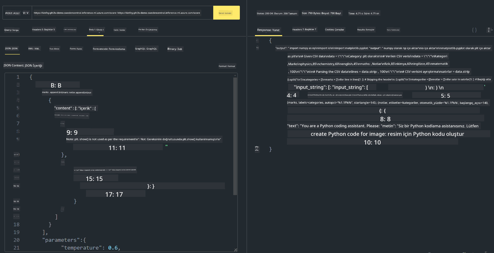

<!--
CO_OP_TRANSLATOR_METADATA:
{
  "original_hash": "20cb4e6ac1686248e8be913ccf6c2bc2",
  "translation_date": "2025-07-17T04:06:24+00:00",
  "source_file": "md/02.Application/02.Code/Phi3/VSCodeExt/HOL/AIPC/03.DeployPhi3VisionOnAzure.md",
  "language_code": "tr"
}
-->
# **Lab 3 - Phi-3-vision'u Azure Machine Learning Service Üzerinde Dağıtma**

Yerel kodun üretim dağıtımını tamamlamak için NPU kullanıyoruz ve ardından PHI-3-VISION'u tanıtarak resimlerden kod üretme yeteneğini kazandırmak istiyoruz.

Bu tanıtımda, Azure Machine Learning Service üzerinde Model As Service Phi-3 Vision servisini hızlıca oluşturabiliriz.

***Note***： Phi-3 Vision, içeriği daha hızlı oluşturmak için hesaplama gücüne ihtiyaç duyar. Bunu başarmak için bulut hesaplama gücüne ihtiyacımız var.


### **1. Azure Machine Learning Service Oluşturma**

Azure Portal’da bir Azure Machine Learning Service oluşturmanız gerekiyor. Nasıl yapılacağını öğrenmek isterseniz, lütfen şu bağlantıyı ziyaret edin: [https://learn.microsoft.com/azure/machine-learning/quickstart-create-resources?view=azureml-api-2](https://learn.microsoft.com/azure/machine-learning/quickstart-create-resources?view=azureml-api-2)


### **2. Azure Machine Learning Service İçinde Phi-3 Vision Seçimi**


### **3. Azure Üzerinde Phi-3-Vision Dağıtımı**


### **4. Postman ile Endpoint Testi**





***Note***

1. Gönderilecek parametreler arasında Authorization, azureml-model-deployment ve Content-Type olmalıdır. Bunları almak için dağıtım bilgilerini kontrol etmeniz gerekir.

2. Parametreleri iletmek için Phi-3-Vision bir resim bağlantısı göndermelidir. Parametre iletimi için GPT-4-Vision yöntemine bakabilirsiniz, örneğin

```json

{
  "input_data":{
    "input_string":[
      {
        "role":"user",
        "content":[ 
          {
            "type": "text",
            "text": "You are a Python coding assistant.Please create Python code for image "
          },
          {
              "type": "image_url",
              "image_url": {
                "url": "https://ajaytech.co/wp-content/uploads/2019/09/index.png"
              }
          }
        ]
      }
    ],
    "parameters":{
          "temperature": 0.6,
          "top_p": 0.9,
          "do_sample": false,
          "max_new_tokens": 2048
    }
  }
}

```

3. Post yöntemi ile **/score** çağrısı yapın

**Tebrikler**! Hızlı PHI-3-VISION dağıtımını tamamladınız ve resimlerden kod üretmeyi denediniz. Sonraki adımda, NPU’lar ve bulutlarla birleşik uygulamalar geliştirebiliriz.

**Feragatname**:  
Bu belge, AI çeviri servisi [Co-op Translator](https://github.com/Azure/co-op-translator) kullanılarak çevrilmiştir. Doğruluk için çaba göstersek de, otomatik çevirilerin hatalar veya yanlışlıklar içerebileceğini lütfen unutmayınız. Orijinal belge, kendi dilinde yetkili kaynak olarak kabul edilmelidir. Kritik bilgiler için profesyonel insan çevirisi önerilir. Bu çevirinin kullanımı sonucu ortaya çıkabilecek yanlış anlamalar veya yorum hatalarından sorumlu değiliz.