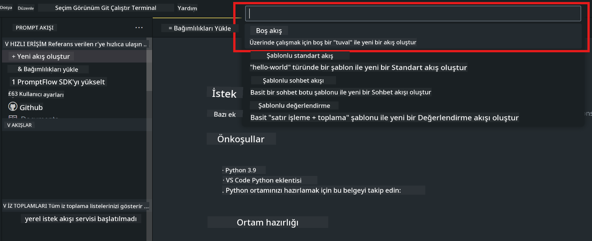
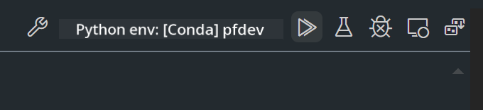

<!--
CO_OP_TRANSLATOR_METADATA:
{
  "original_hash": "3dbbf568625b1ee04b354c2dc81d3248",
  "translation_date": "2025-07-17T04:25:52+00:00",
  "source_file": "md/02.Application/02.Code/Phi3/VSCodeExt/HOL/Apple/02.PromptflowWithMLX.md",
  "language_code": "tr"
}
-->
# **Lab 2 - Phi-3-mini ile AIPC'de Prompt flow Çalıştırma**

## **Prompt flow Nedir**

Prompt flow, LLM tabanlı yapay zeka uygulamalarının fikir aşamasından prototip oluşturma, test, değerlendirme, üretime dağıtım ve izlemeye kadar olan uçtan uca geliştirme döngüsünü kolaylaştırmak için tasarlanmış bir geliştirme araçları paketidir. Prompt mühendisliğini çok daha basit hale getirir ve üretim kalitesinde LLM uygulamaları oluşturmanızı sağlar.

Prompt flow ile şunları yapabilirsiniz:

- LLM’leri, promptları, Python kodunu ve diğer araçları birbirine bağlayan yürütülebilir iş akışları oluşturmak.

- Özellikle LLM’lerle olan etkileşimi kolayca hata ayıklamak ve iş akışlarınızı yinelemek.

- İş akışlarınızı değerlendirmek, daha büyük veri setleriyle kalite ve performans metriklerini hesaplamak.

- Test ve değerlendirmeyi CI/CD sisteminize entegre ederek iş akışınızın kalitesini sağlamak.

- İş akışlarınızı seçtiğiniz servis platformuna dağıtmak veya uygulamanızın kod tabanına kolayca entegre etmek.

- (İsteğe bağlı ama şiddetle tavsiye edilir) Azure AI üzerindeki Prompt flow bulut sürümünü kullanarak ekibinizle iş birliği yapmak.


## **Apple Silicon üzerinde üretim kodu iş akışları oluşturma**

***Not*** ：Ortam kurulumunu tamamlamadıysanız, lütfen [Lab 0 - Kurulumlar](./01.Installations.md) sayfasını ziyaret edin.

1. Visual Studio Code’da Prompt flow Eklentisini açın ve boş bir iş akışı projesi oluşturun



2. Girdi ve Çıktı parametreleri ekleyin ve yeni bir iş akışı olarak Python Kodu ekleyin


İş akışınızı oluşturmak için bu yapıya (flow.dag.yaml) bakabilirsiniz

```yaml

inputs:
  prompt:
    type: string
    default: Write python code for Fibonacci serie. Please use markdown as output
outputs:
  result:
    type: string
    reference: ${gen_code_by_phi3.output}
nodes:
- name: gen_code_by_phi3
  type: python
  source:
    type: code
    path: gen_code_by_phi3.py
  inputs:
    prompt: ${inputs.prompt}


```

3. phi-3-mini modelini kantitatif hale getirin

Yerel cihazlarda SLM’yi daha iyi çalıştırmayı hedefliyoruz. Genellikle modeli kantitatif hale getiriyoruz (INT4, FP16, FP32)


```bash

python -m mlx_lm.convert --hf-path microsoft/Phi-3-mini-4k-instruct

```

**Not:** varsayılan klasör mlx_model

4. ***Chat_With_Phi3.py*** dosyasına kod ekleyin


```python


from promptflow import tool

from mlx_lm import load, generate


# The inputs section will change based on the arguments of the tool function, after you save the code
# Adding type to arguments and return value will help the system show the types properly
# Please update the function name/signature per need
@tool
def my_python_tool(prompt: str) -> str:

    model_id = './mlx_model_phi3_mini'

    model, tokenizer = load(model_id)

    # <|user|>\nWrite python code for Fibonacci serie. Please use markdown as output<|end|>\n<|assistant|>

    response = generate(model, tokenizer, prompt="<|user|>\n" + prompt  + "<|end|>\n<|assistant|>", max_tokens=2048, verbose=True)

    return response


```

4. Üretim kodunun doğru çalışıp çalışmadığını kontrol etmek için Debug veya Run’dan iş akışını test edebilirsiniz



5. Terminalde iş akışını geliştirme API’si olarak çalıştırın

```

pf flow serve --source ./ --port 8080 --host localhost   

```

Postman / Thunder Client ile test edebilirsiniz


### **Notlar**

1. İlk çalıştırma uzun sürebilir. Phi-3 modelini Hugging face CLI üzerinden indirmeniz önerilir.

2. Intel NPU’nun sınırlı hesaplama gücü göz önüne alındığında, Phi-3-mini-4k-instruct kullanmanız tavsiye edilir.

3. INT4 dönüşümü için Intel NPU Hızlandırması kullanıyoruz, ancak servisi tekrar çalıştırırsanız cache ve nc_workshop klasörlerini silmeniz gerekir.


## **Kaynaklar**

1. Promptflow Öğrenin [https://microsoft.github.io/promptflow/](https://microsoft.github.io/promptflow/)

2. Intel NPU Hızlandırmasını Öğrenin [https://github.com/intel/intel-npu-acceleration-library](https://github.com/intel/intel-npu-acceleration-library)

3. Örnek Kod, indirin [Local NPU Agent Sample Code](../../../../../../../../../code/07.Lab/01/AIPC/local-npu-agent)

**Feragatname**:  
Bu belge, AI çeviri servisi [Co-op Translator](https://github.com/Azure/co-op-translator) kullanılarak çevrilmiştir. Doğruluk için çaba göstersek de, otomatik çevirilerin hatalar veya yanlışlıklar içerebileceğini lütfen unutmayın. Orijinal belge, kendi dilinde yetkili kaynak olarak kabul edilmelidir. Kritik bilgiler için profesyonel insan çevirisi önerilir. Bu çevirinin kullanımı sonucu ortaya çıkabilecek yanlış anlamalar veya yorum hatalarından sorumlu değiliz.