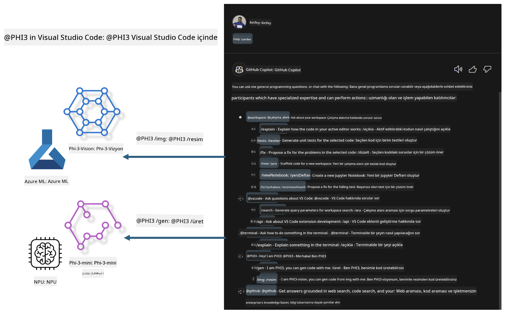

<!--
CO_OP_TRANSLATOR_METADATA:
{
  "original_hash": "00b7a699de8ac405fa821f4c0f7fc0ab",
  "translation_date": "2025-05-09T19:12:55+00:00",
  "source_file": "md/02.Application/02.Code/Phi3/VSCodeExt/README.md",
  "language_code": "tr"
}
-->
# **Kendi Visual Studio Code GitHub Copilot Chat'inizi Microsoft Phi-3 Ailesi ile Oluşturun**

GitHub Copilot Chat'teki workspace agent'ı kullandınız mı? Kendi ekibinizin kod ajanını oluşturmak ister misiniz? Bu uygulamalı laboratuvar, açık kaynak modeli birleştirerek kurumsal düzeyde bir kod iş ajanı oluşturmayı amaçlıyor.

## **Temel**

### **Neden Microsoft Phi-3'ü seçmelisiniz**

Phi-3, farklı eğitim parametrelerine göre metin üretimi, diyalog tamamlama ve kod üretimi için phi-3-mini, phi-3-small ve phi-3-medium gibi modelleri içeren bir aile serisidir. Ayrıca Vision tabanlı phi-3-vision modeli de vardır. Kurumlar veya farklı ekiplerin çevrimdışı üretken yapay zeka çözümleri oluşturması için uygundur.

Bu bağlantıyı okumanız önerilir [https://github.com/microsoft/PhiCookBook/blob/main/md/01.Introduction/01/01.PhiFamily.md](https://github.com/microsoft/PhiCookBook/blob/main/md/01.Introduction/01/01.PhiFamily.md)

### **Microsoft GitHub Copilot Chat**

GitHub Copilot Chat eklentisi, VS Code içinde doğrudan kodlama ile ilgili sorularınıza yanıt almanızı sağlayan bir sohbet arayüzü sunar; böylece belgelerde gezinmeye veya çevrimiçi forumlarda arama yapmaya gerek kalmaz.

Copilot Chat, oluşturulan yanıtı daha anlaşılır kılmak için sözdizimi vurgulama, girintileme ve diğer biçimlendirme özelliklerini kullanabilir. Kullanıcının sorusunun türüne bağlı olarak, sonuçta Copilot’un yanıt oluştururken kullandığı kaynak kod dosyaları veya belgeler gibi bağlama bağlantıları veya VS Code işlevlerine erişim düğmeleri bulunabilir.

- Copilot Chat, geliştirici akışınıza entegre olur ve ihtiyacınız olan yerde size destek sağlar:

- Kod yazarken yardım almak için editör veya terminalden doğrudan satır içi sohbet başlatabilirsiniz

- Her zaman yanınızda bir yapay zeka asistanı olması için Sohbet görünümünü kullanabilirsiniz

- Hızlı bir soru sormak ve işinize geri dönmek için Quick Chat’i başlatabilirsiniz

GitHub Copilot Chat’i aşağıdaki gibi çeşitli senaryolarda kullanabilirsiniz:

- Bir problemi en iyi şekilde çözmek için kodlama sorularını yanıtlamak

- Başkasının kodunu açıklamak ve iyileştirme önerileri sunmak

- Kod düzeltmeleri önermek

- Birim test vakaları oluşturmak

- Kod dokümantasyonu oluşturmak

Bu bağlantıyı okumanız önerilir [https://code.visualstudio.com/docs/copilot/copilot-chat](https://code.visualstudio.com/docs/copilot/copilot-chat?WT.mc_id=aiml-137032-kinfeylo)

###  **Microsoft GitHub Copilot Chat @workspace**

Copilot Chat’te **@workspace** kullanmak, tüm kod tabanınızla ilgili sorular sormanızı sağlar. Sorunuza bağlı olarak, Copilot ilgili dosyaları ve sembolleri akıllıca getirir ve yanıtında bunlara bağlantılar ve kod örnekleri olarak atıfta bulunur.

Sorunuzu yanıtlamak için **@workspace**, bir geliştiricinin VS Code’da bir kod tabanında gezinirken kullandığı kaynakları tarar:

- .gitignore dosyası tarafından yoksayılan dosyalar hariç çalışma alanındaki tüm dosyalar

- İç içe klasör ve dosya isimleriyle dizin yapısı

- Çalışma alanı bir GitHub deposu ise ve kod aramasıyla indekslendiyse GitHub’ın kod arama dizini

- Çalışma alanındaki semboller ve tanımlar

- Aktif editörde seçili veya görünen metin

Not: Bir dosya açıksa veya yoksayılan bir dosyada metin seçiliyse .gitignore göz ardı edilir.

Bu bağlantıyı okumanız önerilir [[https://code.visualstudio.com/docs/copilot/copilot-chat](https://code.visualstudio.com/docs/copilot/workspace-context?WT.mc_id=aiml-137032-kinfeylo)]

## **Bu Laboratuvar Hakkında Daha Fazla Bilgi**

GitHub Copilot, kurumların programlama verimliliğini büyük ölçüde artırdı ve her kurum GitHub Copilot’un ilgili işlevlerini özelleştirmeyi umut ediyor. Birçok kurum, kendi iş senaryoları ve açık kaynak modellerine dayanarak GitHub Copilot’a benzer özelleştirilmiş eklentiler geliştirdi. Kurumlar için özelleştirilmiş eklentiler kontrolü kolaylaştırır, ancak bu aynı zamanda kullanıcı deneyimini etkileyebilir. Sonuçta, GitHub Copilot genel senaryolarla ve profesyonellikle başa çıkmada daha güçlü işlevlere sahiptir. Deneyim tutarlı tutulabilirse, kurumun kendi eklentisini özelleştirmesi daha iyi olur. GitHub Copilot Chat, kurumların sohbet deneyimini genişletmesi için ilgili API’ler sağlar. Tutarlı bir deneyim sürdürmek ve özelleştirilmiş işlevlere sahip olmak daha iyi bir kullanıcı deneyimidir.

Bu laboratuvar esas olarak Phi-3 modelini yerel NPU ve Azure hibritiyle birleştirerek GitHub Copilot Chat’te ***@PHI3*** adlı özel bir Ajan oluşturur ve kurumsal geliştiricilere kod üretimini tamamlamada ***(@PHI3 /gen)*** ve görüntülere dayalı kod üretiminde ***(@PHI3 /img)*** yardımcı olur.

### ***Not:***

Bu laboratuvar şu anda Intel CPU ve Apple Silicon’un AIPC’sinde uygulanmaktadır. Qualcomm sürümü NPU için güncellemeler yapılmaya devam edecektir.

## **Laboratuvar**

| İsim | Açıklama | AIPC | Apple |
| ------------ | ----------- | -------- |-------- |
| Lab0 - Kurulumlar(✅) | İlgili ortamları ve kurulum araçlarını yapılandırma ve yükleme | [Git](./HOL/AIPC/01.Installations.md) |[Git](./HOL/Apple/01.Installations.md) |
| Lab1 - Phi-3-mini ile Prompt akışını çalıştırma (✅) | AIPC / Apple Silicon ile birleştirilerek yerel NPU kullanarak Phi-3-mini üzerinden kod üretimi oluşturma | [Git](./HOL/AIPC/02.PromptflowWithNPU.md) |  [Git](./HOL/Apple/02.PromptflowWithMLX.md) |
| Lab2 - Azure Machine Learning Servisi üzerinde Phi-3-vision dağıtımı(✅) | Azure Machine Learning Servisi Model Kataloğu - Phi-3-vision görüntüsünü dağıtarak kod üretimi | [Git](./HOL/AIPC/03.DeployPhi3VisionOnAzure.md) |[Git](./HOL/Apple/03.DeployPhi3VisionOnAzure.md) |
| Lab3 - GitHub Copilot Chat’te bir @phi-3 ajanı oluşturma(✅)  | GitHub Copilot Chat’te özel bir Phi-3 ajanı oluşturarak kod üretimi, grafik üretim kodu, RAG vb. tamamlama | [Git](./HOL/AIPC/04.CreatePhi3AgentInVSCode.md) | [Git](./HOL/Apple/04.CreatePhi3AgentInVSCode.md) |
| Örnek Kod (✅)  | Örnek kod indir | [Git](../../../../../../../code/07.Lab/01/AIPC) | [Git](../../../../../../../code/07.Lab/01/Apple) |

## **Kaynaklar**

1. Phi-3 Cookbook [https://github.com/microsoft/Phi-3CookBook](https://github.com/microsoft/Phi-3CookBook)

2. GitHub Copilot hakkında daha fazla bilgi edinin [https://learn.microsoft.com/training/paths/copilot/](https://learn.microsoft.com/training/paths/copilot/?WT.mc_id=aiml-137032-kinfeylo)

3. GitHub Copilot Chat hakkında daha fazla bilgi edinin [https://learn.microsoft.com/training/paths/accelerate-app-development-using-github-copilot/](https://learn.microsoft.com/training/paths/accelerate-app-development-using-github-copilot/?WT.mc_id=aiml-137032-kinfeylo)

4. GitHub Copilot Chat API hakkında daha fazla bilgi edinin [https://code.visualstudio.com/api/extension-guides/chat](https://code.visualstudio.com/api/extension-guides/chat?WT.mc_id=aiml-137032-kinfeylo)

5. Azure AI Foundry hakkında daha fazla bilgi edinin [https://learn.microsoft.com/training/paths/create-custom-copilots-ai-studio/](https://learn.microsoft.com/training/paths/create-custom-copilots-ai-studio/?WT.mc_id=aiml-137032-kinfeylo)

6. Azure AI Foundry Model Kataloğu hakkında daha fazla bilgi edinin [https://learn.microsoft.com/azure/ai-studio/how-to/model-catalog-overview](https://learn.microsoft.com/azure/ai-studio/how-to/model-catalog-overview)

**Feragatname**:  
Bu belge, AI çeviri servisi [Co-op Translator](https://github.com/Azure/co-op-translator) kullanılarak çevrilmiştir. Doğruluk için çaba sarf etsek de, otomatik çevirilerin hatalar veya yanlışlıklar içerebileceğini lütfen unutmayınız. Orijinal belge, kendi dilinde yetkili kaynak olarak kabul edilmelidir. Kritik bilgiler için profesyonel insan çevirisi önerilir. Bu çevirinin kullanımı nedeniyle oluşabilecek yanlış anlamalar veya yorum farklılıklarından sorumlu değiliz.