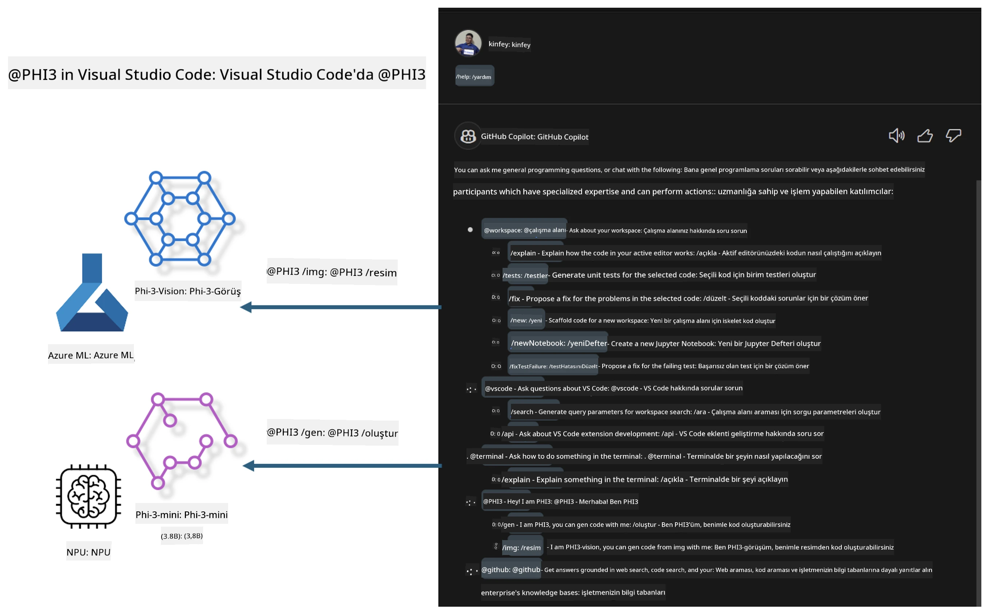

# **Microsoft Phi-3 Ailesi ile Kendi Visual Studio Code GitHub Copilot Chat'inizi Oluşturun**

GitHub Copilot Chat'teki workspace agent'ı kullandınız mı? Kendi ekibinizin kod ajanını oluşturmak ister misiniz? Bu uygulamalı laboratuvar, açık kaynak modeli birleştirerek kurumsal düzeyde bir kod iş ajanı oluşturmayı hedefliyor.

## **Temel Bilgiler**

### **Neden Microsoft Phi-3'ü Seçmelisiniz**

Phi-3, metin üretimi, diyalog tamamlama ve kod üretimi için farklı eğitim parametrelerine dayanan phi-3-mini, phi-3-small ve phi-3-medium gibi modelleri içeren bir aile serisidir. Ayrıca Vision tabanlı phi-3-vision modeli de vardır. Bu modeller, işletmelerin veya farklı ekiplerin çevrimdışı üretken yapay zeka çözümleri oluşturması için uygundur.

Bu bağlantıyı okumanız önerilir [https://github.com/microsoft/PhiCookBook/blob/main/md/01.Introduction/01/01.PhiFamily.md](https://github.com/microsoft/PhiCookBook/blob/main/md/01.Introduction/01/01.PhiFamily.md)

### **Microsoft GitHub Copilot Chat**

GitHub Copilot Chat eklentisi, VS Code içinde doğrudan kodlama ile ilgili sorularınıza yanıt almanızı sağlayan bir sohbet arayüzü sunar; böylece dokümantasyonda gezinmenize veya çevrimiçi forumlarda arama yapmanıza gerek kalmaz.

Copilot Chat, oluşturulan yanıtı daha anlaşılır kılmak için sözdizimi vurgulama, girintileme ve diğer biçimlendirme özelliklerini kullanabilir. Kullanıcının sorusunun türüne bağlı olarak, sonuç Copilot'un yanıt oluştururken kullandığı bağlama ait bağlantılar (örneğin kaynak kod dosyaları veya dokümantasyon) veya VS Code işlevlerine erişim için düğmeler içerebilir.

- Copilot Chat, geliştirici akışınıza entegre olur ve ihtiyacınız olan yerde size destek sağlar:

- Kod yazarken yardım almak için editör veya terminalden doğrudan satır içi sohbet başlatın

- Her zaman yanınızda bir yapay zeka asistanı olması için Chat görünümünü kullanın

- Hızlı bir soru sormak ve işinize geri dönmek için Quick Chat'i başlatın

GitHub Copilot Chat'i şu senaryolarda kullanabilirsiniz:

- Bir problemi en iyi nasıl çözeceğinize dair kodlama sorularını yanıtlamak

- Başkasının kodunu açıklamak ve iyileştirme önerileri sunmak

- Kod düzeltmeleri önermek

- Birim test vakaları oluşturmak

- Kod dokümantasyonu üretmek

Bu bağlantıyı okumanız önerilir [https://code.visualstudio.com/docs/copilot/copilot-chat](https://code.visualstudio.com/docs/copilot/copilot-chat?WT.mc_id=aiml-137032-kinfeylo)

### **Microsoft GitHub Copilot Chat @workspace**

Copilot Chat'te **@workspace** kullanmak, tüm kod tabanınızla ilgili sorular sormanıza olanak tanır. Sorunuza bağlı olarak, Copilot ilgili dosyaları ve sembolleri akıllıca bulur ve yanıtında bunlara bağlantılar ve kod örnekleri olarak referans verir.

Sorunuza yanıt vermek için **@workspace**, bir geliştiricinin VS Code'da bir kod tabanında gezinirken kullandığı kaynakları tarar:

- .gitignore dosyası tarafından yok sayılan dosyalar hariç, çalışma alanındaki tüm dosyalar

- İç içe klasör ve dosya adlarıyla dizin yapısı

- Çalışma alanı bir GitHub deposu ise ve kod araması tarafından indekslendiyse GitHub'ın kod arama dizini

- Çalışma alanındaki semboller ve tanımlar

- Aktif editörde seçili veya görünür metin

Not: .gitignore, yok sayılan bir dosya açık veya içinde metin seçiliyse atlanır.

Bu bağlantıyı okumanız önerilir [[https://code.visualstudio.com/docs/copilot/copilot-chat](https://code.visualstudio.com/docs/copilot/workspace-context?WT.mc_id=aiml-137032-kinfeylo)]

## **Bu Laboratuvar Hakkında Daha Fazla Bilgi**

GitHub Copilot, işletmelerin programlama verimliliğini büyük ölçüde artırdı ve her işletme GitHub Copilot'un ilgili işlevlerini özelleştirmeyi umuyor. Birçok işletme, kendi iş senaryoları ve açık kaynak modelleri temelinde GitHub Copilot'a benzer özelleştirilmiş eklentiler geliştirdi. İşletmeler için özelleştirilmiş eklentiler kontrolü kolaylaştırır, ancak bu kullanıcı deneyimini etkileyebilir. Sonuçta, GitHub Copilot genel senaryolar ve profesyonellik konusunda daha güçlü işlevlere sahiptir. Deneyim tutarlı tutulabilirse, işletmenin kendi eklentisini özelleştirmesi daha iyi olur. GitHub Copilot Chat, işletmelerin sohbet deneyimini genişletmesi için ilgili API'ler sağlar. Tutarlı bir deneyim sürdürmek ve özelleştirilmiş işlevlere sahip olmak daha iyi bir kullanıcı deneyimidir.

Bu laboratuvar, Phi-3 modelini yerel NPU ve Azure hibriti ile birleştirerek GitHub Copilot Chat'te ***@PHI3*** adlı özel bir ajan oluşturmayı amaçlar. Bu ajan, kurumsal geliştiricilere kod üretimi tamamlamada ***(@PHI3 /gen)*** ve görüntülere dayalı kod üretiminde ***(@PHI3 /img)*** yardımcı olur.

### ***Not:***

Bu laboratuvar şu anda Intel CPU ve Apple Silicon AIPC üzerinde uygulanmaktadır. Qualcomm NPU sürümü güncellemeleri devam edecektir.

## **Laboratuvar**

| İsim | Açıklama | AIPC | Apple |
| ------------ | ----------- | -------- |-------- |
| Lab0 - Kurulumlar(✅) | İlgili ortamları ve kurulum araçlarını yapılandırma ve yükleme | [Git](./HOL/AIPC/01.Installations.md) |[Git](./HOL/Apple/01.Installations.md) |
| Lab1 - Phi-3-mini ile Prompt akışını çalıştırma (✅) | AIPC / Apple Silicon ile birleşik, yerel NPU kullanarak Phi-3-mini ile kod üretimi oluşturma | [Git](./HOL/AIPC/02.PromptflowWithNPU.md) |  [Git](./HOL/Apple/02.PromptflowWithMLX.md) |
| Lab2 - Azure Machine Learning Service üzerinde Phi-3-vision dağıtımı(✅) | Azure Machine Learning Service'in Model Kataloğu - Phi-3-vision görüntüsünü dağıtarak kod üretimi | [Git](./HOL/AIPC/03.DeployPhi3VisionOnAzure.md) |[Git](./HOL/Apple/03.DeployPhi3VisionOnAzure.md) |
| Lab3 - GitHub Copilot Chat'te @phi-3 ajanı oluşturma(✅)  | GitHub Copilot Chat'te özel Phi-3 ajanı oluşturarak kod üretimi, grafik üretimi, RAG vb. işlemleri tamamlama | [Git](./HOL/AIPC/04.CreatePhi3AgentInVSCode.md) | [Git](./HOL/Apple/04.CreatePhi3AgentInVSCode.md) |
| Örnek Kod (✅)  | Örnek kodu indirin | [Git](../../../../../../../code/07.Lab/01/AIPC) | [Git](../../../../../../../code/07.Lab/01/Apple) |

## **Kaynaklar**

1. Phi-3 Cookbook [https://github.com/microsoft/Phi-3CookBook](https://github.com/microsoft/Phi-3CookBook)

2. GitHub Copilot hakkında daha fazla bilgi edinin [https://learn.microsoft.com/training/paths/copilot/](https://learn.microsoft.com/training/paths/copilot/?WT.mc_id=aiml-137032-kinfeylo)

3. GitHub Copilot Chat hakkında daha fazla bilgi edinin [https://learn.microsoft.com/training/paths/accelerate-app-development-using-github-copilot/](https://learn.microsoft.com/training/paths/accelerate-app-development-using-github-copilot/?WT.mc_id=aiml-137032-kinfeylo)

4. GitHub Copilot Chat API hakkında daha fazla bilgi edinin [https://code.visualstudio.com/api/extension-guides/chat](https://code.visualstudio.com/api/extension-guides/chat?WT.mc_id=aiml-137032-kinfeylo)

5. Azure AI Foundry hakkında daha fazla bilgi edinin [https://learn.microsoft.com/training/paths/create-custom-copilots-ai-studio/](https://learn.microsoft.com/training/paths/create-custom-copilots-ai-studio/?WT.mc_id=aiml-137032-kinfeylo)

6. Azure AI Foundry'nin Model Kataloğu hakkında daha fazla bilgi edinin [https://learn.microsoft.com/azure/ai-studio/how-to/model-catalog-overview](https://learn.microsoft.com/azure/ai-studio/how-to/model-catalog-overview)

**Feragatname**:  
Bu belge, AI çeviri servisi [Co-op Translator](https://github.com/Azure/co-op-translator) kullanılarak çevrilmiştir. Doğruluk için çaba göstersek de, otomatik çevirilerin hatalar veya yanlışlıklar içerebileceğini lütfen unutmayınız. Orijinal belge, kendi dilinde yetkili kaynak olarak kabul edilmelidir. Kritik bilgiler için profesyonel insan çevirisi önerilir. Bu çevirinin kullanımı sonucu oluşabilecek yanlış anlamalar veya yorum hatalarından sorumlu değiliz.