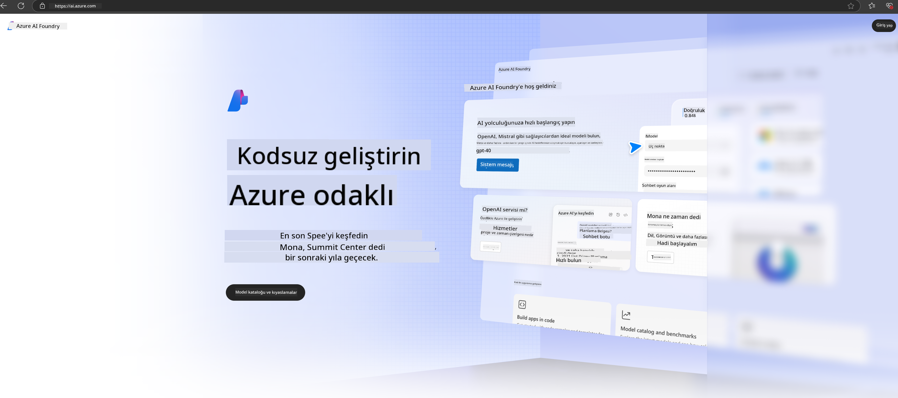

<!--
CO_OP_TRANSLATOR_METADATA:
{
  "original_hash": "3a1e48b628022485aac989c9f733e792",
  "translation_date": "2025-07-17T05:23:38+00:00",
  "source_file": "md/02.QuickStart/AzureAIFoundry_QuickStart.md",
  "language_code": "tr"
}
-->
# **Azure AI Foundry'de Phi-3 Kullanımı**

Generative AI'nin gelişimiyle birlikte, farklı LLM ve SLM'leri, kurumsal veri entegrasyonunu, ince ayar/RAG işlemlerini ve LLM ile SLM entegre edildikten sonra farklı kurumsal işlerin değerlendirilmesini tek bir platformda yönetmeyi umuyoruz. Böylece generative AI, akıllı uygulamalarda daha iyi uygulanabilir. [Azure AI Foundry](https://ai.azure.com), kurumsal düzeyde bir generative AI uygulama platformudur.

Azure AI Foundry ile büyük dil modeli (LLM) yanıtlarını değerlendirebilir ve daha iyi performans için prompt flow ile prompt uygulama bileşenlerini düzenleyebilirsiniz. Platform, kavram kanıtlarını tam üretime dönüştürmede ölçeklenebilirlik sağlar. Sürekli izleme ve iyileştirme uzun vadeli başarıyı destekler.

Phi-3 modelini Azure AI Foundry üzerinde hızlıca basit adımlarla dağıtabilir, ardından Azure AI Foundry'yi kullanarak Phi-3 ile ilgili Playground/Chat, ince ayar, değerlendirme ve diğer ilgili işleri tamamlayabilirsiniz.

## **1. Hazırlık**

Eğer makinenizde zaten [Azure Developer CLI](https://learn.microsoft.com/azure/developer/azure-developer-cli/overview?WT.mc_id=aiml-138114-kinfeylo) yüklüyse, bu şablonu kullanmak yeni bir dizinde bu komutu çalıştırmak kadar basittir.

## Manuel Oluşturma

Microsoft Azure AI Foundry projesi ve hub oluşturmak, AI çalışmalarınızı düzenlemek ve yönetmek için harika bir yoldur. İşte başlamanız için adım adım rehber:

### Azure AI Foundry'de Proje Oluşturma

1. **Azure AI Foundry'ye gidin**: Azure AI Foundry portalına giriş yapın.
2. **Proje Oluşturun**:
   - Eğer bir projedeyseniz, sayfanın sol üst köşesinden "Azure AI Foundry" seçeneğine tıklayarak Ana sayfaya gidin.
   - "+ Proje oluştur" seçeneğini seçin.
   - Proje için bir isim girin.
   - Eğer bir hubınız varsa, varsayılan olarak seçili olacaktır. Birden fazla hub erişiminiz varsa, açılır menüden farklı bir hub seçebilirsiniz. Yeni bir hub oluşturmak isterseniz, "Yeni hub oluştur" seçeneğini seçip bir isim verin.
   - "Oluştur" seçeneğine tıklayın.

### Azure AI Foundry'de Hub Oluşturma

1. **Azure AI Foundry'ye gidin**: Azure hesabınızla giriş yapın.
2. **Hub Oluşturun**:
   - Sol menüden Yönetim merkezini seçin.
   - "Tüm kaynaklar" seçeneğine, ardından "+ Yeni proje" yanındaki aşağı oka ve "+ Yeni hub" seçeneğine tıklayın.
   - "Yeni hub oluştur" penceresinde hub için bir isim girin (örneğin, contoso-hub) ve diğer alanları isteğinize göre düzenleyin.
   - "İleri" seçeneğine tıklayın, bilgileri gözden geçirin ve ardından "Oluştur" seçeneğini seçin.

Daha ayrıntılı talimatlar için resmi [Microsoft dokümantasyonuna](https://learn.microsoft.com/azure/ai-studio/how-to/create-projects) bakabilirsiniz.

Başarıyla oluşturduktan sonra, oluşturduğunuz stüdyoya [ai.azure.com](https://ai.azure.com/) üzerinden erişebilirsiniz.

Bir AI Foundry üzerinde birden fazla proje olabilir. Hazırlık için AI Foundry'de bir proje oluşturun.

Azure AI Foundry [Hızlı Başlangıçlar](https://learn.microsoft.com/azure/ai-studio/quickstarts/get-started-code) oluşturun.

## **2. Azure AI Foundry'de Phi Modeli Dağıtımı**

Projede Explore seçeneğine tıklayarak Model Kataloğuna girin ve Phi-3'ü seçin.

Phi-3-mini-4k-instruct modelini seçin.

Phi-3-mini-4k-instruct modelini dağıtmak için 'Deploy' butonuna tıklayın.

> [!NOTE]
>
> Dağıtım sırasında hesaplama gücünü seçebilirsiniz.

## **3. Azure AI Foundry'de Playground Chat Phi**

Dağıtım sayfasına gidin, Playground'u seçin ve Azure AI Foundry'nin Phi-3 modeli ile sohbet edin.

## **4. Azure AI Foundry'den Model Dağıtımı**

Azure Model Kataloğundan model dağıtmak için şu adımları izleyebilirsiniz:

- Azure AI Foundry'ye giriş yapın.
- Azure AI Foundry model kataloğundan dağıtmak istediğiniz modeli seçin.
- Modelin Detaylar sayfasında Deploy seçeneğini seçin, ardından Azure AI Content Safety ile Serverless API'yi seçin.
- Modellerinizi dağıtmak istediğiniz projeyi seçin. Serverless API hizmetini kullanmak için çalışma alanınızın East US 2 veya Sweden Central bölgesinde olması gerekir. Dağıtım adını özelleştirebilirsiniz.
- Dağıtım sihirbazında, fiyatlandırma ve kullanım koşullarını öğrenmek için Pricing and terms seçeneğini seçin.
- Deploy seçeneğine tıklayın. Dağıtım hazır olana kadar bekleyin ve Deployments sayfasına yönlendirileceksiniz.
- Modelle etkileşime başlamak için Open in playground seçeneğini seçin.
- Deployments sayfasına geri dönebilir, dağıtımı seçebilir ve çağrı yapmak ve tamamlamalar oluşturmak için kullanabileceğiniz endpoint'in Target URL ve Secret Key bilgilerini not edebilirsiniz.
- Endpoint detayları, URL ve erişim anahtarlarını her zaman Build sekmesine gidip Components bölümünden Deployments seçeneğini seçerek bulabilirsiniz.

> [!NOTE]
> Bu adımları gerçekleştirebilmek için hesabınızın Kaynak Grubu üzerinde Azure AI Developer rol izinlerine sahip olması gerektiğini unutmayın.

## **5. Azure AI Foundry'de Phi API Kullanımı**

https://{Proje adınız}.region.inference.ml.azure.com/swagger.json adresine Postman ile GET isteği yaparak ve Key ile birleştirerek sunulan arayüzleri öğrenebilirsiniz.

İstek parametrelerini ve yanıt parametrelerini çok kolay bir şekilde elde edebilirsiniz.

**Feragatname**:  
Bu belge, AI çeviri servisi [Co-op Translator](https://github.com/Azure/co-op-translator) kullanılarak çevrilmiştir. Doğruluk için çaba gösterilse de, otomatik çevirilerin hatalar veya yanlışlıklar içerebileceğini lütfen unutmayınız. Orijinal belge, kendi dilinde yetkili kaynak olarak kabul edilmelidir. Kritik bilgiler için profesyonel insan çevirisi önerilir. Bu çevirinin kullanımı sonucu oluşabilecek yanlış anlamalar veya yorum hatalarından sorumlu değiliz.