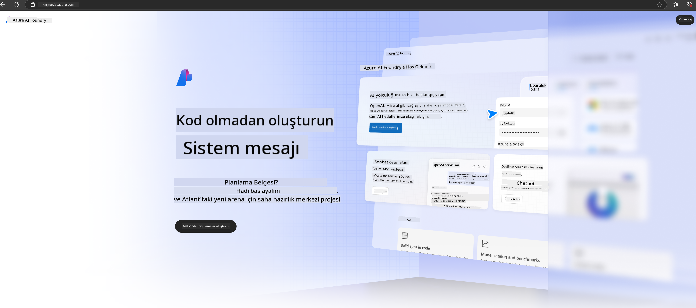

<!--
CO_OP_TRANSLATOR_METADATA:
{
  "original_hash": "3a1e48b628022485aac989c9f733e792",
  "translation_date": "2025-05-09T20:11:29+00:00",
  "source_file": "md/02.QuickStart/AzureAIFoundry_QuickStart.md",
  "language_code": "tr"
}
-->
# **Azure AI Foundry’de Phi-3 Kullanımı**

Generatif AI’nin gelişimiyle birlikte, farklı LLM ve SLM’leri, kurumsal veri entegrasyonunu, ince ayar/RAG işlemlerini ve LLM ile SLM entegre edildikten sonra farklı kurumsal işlerin değerlendirilmesini tek bir platformda yönetmeyi hedefliyoruz. Böylece generatif AI ile akıllı uygulamalar daha iyi hayata geçirilebilir. [Azure AI Foundry](https://ai.azure.com), kurumsal düzeyde bir generatif AI uygulama platformudur.

Azure AI Foundry ile büyük dil modeli (LLM) yanıtlarını değerlendirebilir ve daha iyi performans için prompt flow ile prompt uygulama bileşenlerini düzenleyebilirsiniz. Platform, kavram kanıtlarını tam üretime dönüştürme sürecinde ölçeklenebilirlik sağlar. Sürekli izleme ve iyileştirme uzun vadeli başarıyı destekler.

Phi-3 modelini Azure AI Foundry üzerinde hızlıca basit adımlarla dağıtabilir, ardından Azure AI Foundry üzerinden Phi-3 ile ilgili Playground/Chat, İnce Ayar, değerlendirme ve diğer ilgili işleri tamamlayabilirsiniz.

## **1. Hazırlık**

Eğer makinenizde zaten [Azure Developer CLI](https://learn.microsoft.com/azure/developer/azure-developer-cli/overview?WT.mc_id=aiml-138114-kinfeylo) yüklüyse, bu şablonu kullanmak yeni bir dizinde bu komutu çalıştırmak kadar basittir.

## Manuel Oluşturma

Microsoft Azure AI Foundry projesi ve hub oluşturmak, AI çalışmalarınızı organize etmek ve yönetmek için harika bir yoldur. İşte başlamanız için adım adım rehber:

### Azure AI Foundry’de Proje Oluşturma

1. **Azure AI Foundry’ye gidin**: Azure AI Foundry portalına giriş yapın.
2. **Proje Oluşturun**:
   - Eğer bir projedeyseniz, sayfanın sol üstündeki "Azure AI Foundry" seçeneğine tıklayarak Ana sayfaya gidin.
   - "+ Proje oluştur" seçeneğini seçin.
   - Proje için bir isim girin.
   - Eğer bir hub’ınız varsa, varsayılan olarak seçili olacaktır. Birden fazla hub erişiminiz varsa, açılır menüden farklı bir hub seçebilirsiniz. Yeni bir hub oluşturmak istiyorsanız, "Yeni hub oluştur" seçeneğini seçip isim verin.
   - "Oluştur" seçeneğine tıklayın.

### Azure AI Foundry’de Hub Oluşturma

1. **Azure AI Foundry’ye gidin**: Azure hesabınızla giriş yapın.
2. **Hub Oluşturun**:
   - Sol menüden Yönetim merkezini seçin.
   - "Tüm kaynaklar" seçeneğine, ardından "+ Yeni proje" yanındaki aşağı oka ve "+ Yeni hub" seçeneğine tıklayın.
   - "Yeni bir hub oluştur" penceresinde hub için bir isim girin (örneğin contoso-hub) ve diğer alanları istediğiniz gibi düzenleyin.
   - "İleri" seçeneğini seçin, bilgileri gözden geçirin ve ardından "Oluştur" seçeneğine tıklayın.

Daha detaylı talimatlar için resmi [Microsoft dokümantasyonuna](https://learn.microsoft.com/azure/ai-studio/how-to/create-projects) bakabilirsiniz.

Başarıyla oluşturduktan sonra, oluşturduğunuz stüdyoya [ai.azure.com](https://ai.azure.com/) üzerinden erişebilirsiniz.

Bir AI Foundry üzerinde birden fazla proje olabilir. AI Foundry’de bir proje oluşturarak hazırlık yapın.

Azure AI Foundry [QuickStarts](https://learn.microsoft.com/azure/ai-studio/quickstarts/get-started-code) oluşturun.

## **2. Azure AI Foundry’de Phi modelini dağıtma**

Projenin Explore seçeneğine tıklayarak Model Kataloğuna girin ve Phi-3’ü seçin.

Phi-3-mini-4k-instruct seçeneğini seçin.

Phi-3-mini-4k-instruct modelini dağıtmak için 'Deploy' butonuna tıklayın.

> [!NOTE]
>
> Dağıtım sırasında hesaplama gücünü seçebilirsiniz.

## **3. Azure AI Foundry’de Playground Chat Phi**

Dağıtım sayfasına gidin, Playground’u seçin ve Azure AI Foundry’deki Phi-3 ile sohbet edin.

## **4. Azure AI Foundry’den Model Dağıtımı**

Azure Model Kataloğundan bir modeli dağıtmak için şu adımları izleyebilirsiniz:

- Azure AI Foundry’ye giriş yapın.
- Azure AI Foundry model kataloğundan dağıtmak istediğiniz modeli seçin.
- Modelin Detaylar sayfasında Deploy seçeneğini ve ardından Azure AI Content Safety ile Serverless API’yi seçin.
- Modellerinizi dağıtmak istediğiniz projeyi seçin. Serverless API’yi kullanmak için çalışma alanınızın East US 2 veya Sweden Central bölgesinde olması gerekir. Dağıtım ismini özelleştirebilirsiniz.
- Dağıtım sihirbazında Fiyatlandırma ve kullanım koşullarını inceleyin.
- Deploy seçeneğine tıklayın. Dağıtım hazır olana kadar bekleyin ve Deployments sayfasına yönlendirileceksiniz.
- Modelle etkileşime başlamak için Open in playground seçeneğini seçin.
- Deployments sayfasına geri dönebilir, dağıtımı seçip, dağıtımı çağırmak ve tamamlamalar oluşturmak için kullanabileceğiniz hedef URL ve Gizli Anahtarı not edebilirsiniz.
- Endpoint detayları, URL ve erişim anahtarlarını her zaman Build sekmesinden Components bölümündeki Deployments’a giderek bulabilirsiniz.

> [!NOTE]
> Bu adımları gerçekleştirmek için hesabınızın Resource Group üzerinde Azure AI Developer rol izinlerine sahip olması gerektiğini unutmayın.

## **5. Azure AI Foundry’de Phi API Kullanımı**

https://{Your project name}.region.inference.ml.azure.com/swagger.json adresine Postman GET ile erişebilir ve Key ile birlikte sunulan arayüzleri inceleyebilirsiniz.

İstek parametrelerini ve yanıt parametrelerini çok kolay şekilde elde edebilirsiniz.

**Feragatname**:  
Bu belge, AI çeviri servisi [Co-op Translator](https://github.com/Azure/co-op-translator) kullanılarak çevrilmiştir. Doğruluk için çaba göstersek de, otomatik çevirilerin hatalar veya yanlışlıklar içerebileceğini lütfen unutmayınız. Orijinal belge, kendi ana dilindeki haliyle yetkili kaynak olarak kabul edilmelidir. Kritik bilgiler için profesyonel insan çevirisi önerilir. Bu çevirinin kullanımı sonucunda oluşabilecek yanlış anlamalar veya yanlış yorumlamalar nedeniyle sorumluluk kabul edilmemektedir.