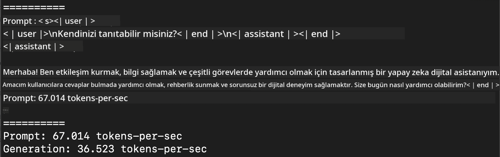
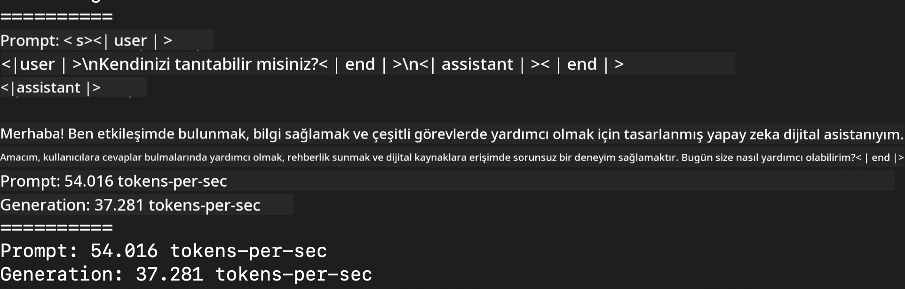
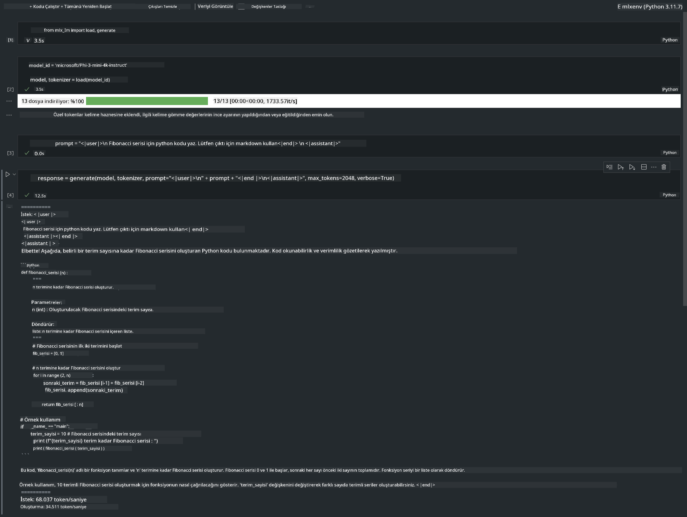

<!--
CO_OP_TRANSLATOR_METADATA:
{
  "original_hash": "dcb656f3d206fc4968e236deec5d4384",
  "translation_date": "2025-05-09T22:31:36+00:00",
  "source_file": "md/03.FineTuning/03.Inference/MLX_Inference.md",
  "language_code": "tr"
}
-->
# **Apple MLX Framework ile Phi-3 Çıkarımı**

## **MLX Framework Nedir**

MLX, Apple silikon üzerinde makine öğrenimi araştırmaları için Apple makine öğrenimi araştırmacıları tarafından geliştirilen bir dizi (array) framework’üdür.

MLX, makine öğrenimi araştırmacıları tarafından makine öğrenimi araştırmacıları için tasarlanmıştır. Framework kullanıcı dostu olacak şekilde hazırlanmış, ancak modelleri eğitmek ve dağıtmak için verimli olmayı da hedeflemektedir. Framework’ün tasarımı kavramsal olarak da basittir. Amacımız, araştırmacıların MLX’i kolayca genişletip geliştirebilmesini sağlamak ve yeni fikirleri hızlıca keşfetmektir.

Apple Silikon cihazlarda LLM’ler MLX sayesinde hızlandırılabilir ve modeller çok rahat bir şekilde yerel olarak çalıştırılabilir.

## **MLX ile Phi-3-mini Çıkarımı Yapmak**

### **1. MLX ortamınızı hazırlayın**

1. Python 3.11.x
2. MLX Kütüphanesini kurun


```bash

pip install mlx-lm

```

### **2. Terminalde MLX ile Phi-3-mini’yi çalıştırmak**


```bash

python -m mlx_lm.generate --model microsoft/Phi-3-mini-4k-instruct --max-token 2048 --prompt  "<|user|>\nCan you introduce yourself<|end|>\n<|assistant|>"

```

Sonuç (benim ortamım Apple M1 Max, 64GB) şu şekildedir:



### **3. Terminalde MLX ile Phi-3-mini’yi Kuantize Etmek**


```bash

python -m mlx_lm.convert --hf-path microsoft/Phi-3-mini-4k-instruct

```

***Note:*** Model mlx_lm.convert ile kuantize edilebilir ve varsayılan kuantizasyon INT4’tür. Bu örnekte Phi-3-mini INT4’e kuantize ediliyor.

Model mlx_lm.convert ile kuantize edilebilir ve varsayılan kuantizasyon INT4’tür. Bu örnek Phi-3-mini’yi INT4’e kuantize etmektedir. Kuantizasyondan sonra model varsayılan ./mlx_model dizininde saklanacaktır.

Terminalden MLX ile kuantize edilmiş modeli test edebiliriz.


```bash

python -m mlx_lm.generate --model ./mlx_model/ --max-token 2048 --prompt  "<|user|>\nCan you introduce yourself<|end|>\n<|assistant|>"

```

Sonuç aşağıdaki gibidir:




### **4. Jupyter Notebook’ta MLX ile Phi-3-mini’yi çalıştırmak**




***Note:*** Lütfen bu örneği okuyun [click this link](../../../../../code/03.Inference/MLX/MLX_DEMO.ipynb)


## **Kaynaklar**

1. Apple MLX Framework hakkında bilgi edinin [https://ml-explore.github.io](https://ml-explore.github.io/mlx/build/html/index.html)

2. Apple MLX GitHub Deposu [https://github.com/ml-explore](https://github.com/ml-explore)

**Feragatname**:  
Bu belge, AI çeviri hizmeti [Co-op Translator](https://github.com/Azure/co-op-translator) kullanılarak çevrilmiştir. Doğruluk için çaba gösterilse de, otomatik çevirilerin hatalar veya yanlışlıklar içerebileceğini lütfen unutmayın. Orijinal belge, kendi ana dilinde yetkili kaynak olarak kabul edilmelidir. Kritik bilgiler için profesyonel insan çevirisi önerilir. Bu çevirinin kullanımı sonucu ortaya çıkabilecek yanlış anlamalar veya yanlış yorumlamalardan sorumlu değiliz.