<!--
CO_OP_TRANSLATOR_METADATA:
{
  "original_hash": "c1559c5af6caccf6f623fd43a6b3a9a3",
  "translation_date": "2025-07-17T06:04:54+00:00",
  "source_file": "md/03.FineTuning/FineTuning_AIFoundry.md",
  "language_code": "tr"
}
-->
# Azure AI Foundry ile Phi-3 Modelini İnce Ayarlama

Microsoft’un Phi-3 Mini dil modelini Azure AI Foundry kullanarak nasıl ince ayarlayabileceğimizi keşfedelim. İnce ayar, Phi-3 Mini’yi belirli görevlere uyarlamanıza olanak tanır ve böylece modeli daha güçlü ve bağlama duyarlı hale getirir.

## Dikkat Edilmesi Gerekenler

- **Yetenekler:** Hangi modeller ince ayar yapılabilir? Temel model hangi görevler için ince ayarlanabilir?
- **Maliyet:** İnce ayar için fiyatlandırma modeli nedir?
- **Özelleştirilebilirlik:** Temel modeli ne kadar ve nasıl değiştirebilirim?
- **Kullanım Kolaylığı:** İnce ayar nasıl gerçekleşir – özel kod yazmam gerekir mi? Kendi hesaplama kaynaklarımı getirmem gerekir mi?
- **Güvenlik:** İnce ayarlanmış modellerin güvenlik riskleri olduğu biliniyor – istenmeyen zararlara karşı koruma için herhangi bir önlem var mı?

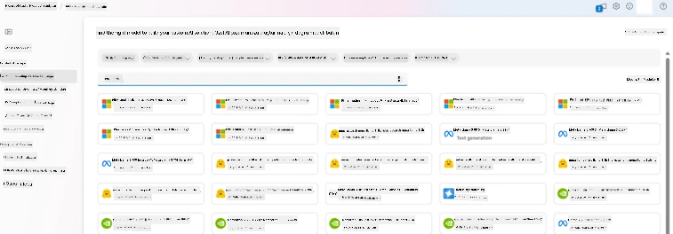

## İnce Ayar İçin Hazırlık

### Ön Koşullar

> [!NOTE]
> Phi-3 ailesi modeller için, kullan-at modeliyle ince ayar yalnızca **East US 2** bölgelerinde oluşturulan hub’lar için geçerlidir.

- Bir Azure aboneliği. Azure aboneliğiniz yoksa, başlamak için bir [ücretli Azure hesabı](https://azure.microsoft.com/pricing/purchase-options/pay-as-you-go) oluşturun.

- Bir [AI Foundry projesi](https://ai.azure.com?WT.mc_id=aiml-138114-kinfeylo).
- Azure rol tabanlı erişim kontrolleri (Azure RBAC), Azure AI Foundry’deki işlemlere erişim vermek için kullanılır. Bu makaledeki adımları gerçekleştirmek için kullanıcı hesabınıza kaynak grubunda __Azure AI Developer rolü__ atanmış olmalıdır.

### Abonelik sağlayıcı kaydı

Aboneliğin `Microsoft.Network` kaynak sağlayıcısına kayıtlı olduğunu doğrulayın.

1. [Azure portalına](https://portal.azure.com) giriş yapın.
1. Sol menüden **Subscriptions** (Abonelikler) seçeneğini seçin.
1. Kullanmak istediğiniz aboneliği seçin.
1. Sol menüden **AI project settings** > **Resource providers** seçeneğini seçin.
1. **Microsoft.Network** kaynak sağlayıcılar listesinde varsa onaylayın, yoksa ekleyin.

### Veri hazırlığı

Modelinizi ince ayarlamak için eğitim ve doğrulama verilerinizi hazırlayın. Eğitim ve doğrulama veri setleriniz, modelin nasıl performans göstermesini istediğinize dair giriş ve çıkış örneklerinden oluşur.

Tüm eğitim örneklerinizin çıkarım için beklenen formatta olduğundan emin olun. Modelleri etkili şekilde ince ayarlamak için dengeli ve çeşitli bir veri seti kullanın.

Bu, veri dengesini korumayı, farklı senaryoları dahil etmeyi ve eğitim verilerini gerçek dünya beklentilerine göre periyodik olarak iyileştirmeyi içerir; böylece daha doğru ve dengeli model yanıtları elde edilir.

Farklı model türleri farklı eğitim veri formatları gerektirir.

### Chat Completion

Kullandığınız eğitim ve doğrulama verileri **JSON Lines (JSONL)** formatında olmalıdır. `Phi-3-mini-128k-instruct` için ince ayar veri seti, Chat completions API tarafından kullanılan konuşma formatında olmalıdır.

### Örnek dosya formatı

```json
    {"messages": [{"role": "system", "content": "You are an Xbox customer support agent whose primary goal is to help users with issues they are experiencing with their Xbox devices. You are friendly and concise. You only provide factual answers to queries, and do not provide answers that are not related to Xbox."}, {"role": "user", "content": "Is Xbox better than PlayStation?"}, {"role": "assistant", "content": "I apologize, but I cannot provide personal opinions. My primary job is to assist you with any issues related to your Xbox device. Do you have any Xbox-related issues that need addressing?"}]}
    {"messages": [{"role": "system", "content": "You are an Xbox customer support agent whose primary goal is to help users with issues they are experiencing with their Xbox devices. You are friendly and concise. You only provide factual answers to queries, and do not provide answers that are not related to Xbox."}, {"role": "user", "content": "Can I play PC games on my Xbox?"}, {"role": "assistant", "content": "While Xbox consoles don't natively support PC games, they can play an array of Xbox games, many of which are also available on PC. Can I assist you with finding games compatible with your Xbox device?"}]}
    {"messages": [{"role": "system", "content": "You are an Xbox customer support agent whose primary goal is to help users with issues they are experiencing with their Xbox devices. You are friendly and concise. You only provide factual answers to queries, and do not provide answers that are not related to Xbox."}, {"role": "user", "content": "I'm having trouble connecting my Xbox to the Wi-Fi."}, {"role": "assistant", "content": "No worries, let's go through the network settings on your Xbox. Can you please tell me what happens when you try to connect it to the Wi-Fi?"}]}
```

Desteklenen dosya türü JSON Lines’dır. Dosyalar varsayılan veri deposuna yüklenir ve projenizde kullanılabilir hale gelir.

## Azure AI Foundry ile Phi-3 İnce Ayarı

Azure AI Foundry, büyük dil modellerini kişisel veri setlerinize göre ince ayarlamanıza olanak tanır. İnce ayar, belirli görevler ve uygulamalar için özelleştirme ve optimizasyon sağlayarak önemli faydalar sunar. Bu, geliştirilmiş performans, maliyet etkinliği, azalan gecikme süresi ve kişiselleştirilmiş çıktılar anlamına gelir.

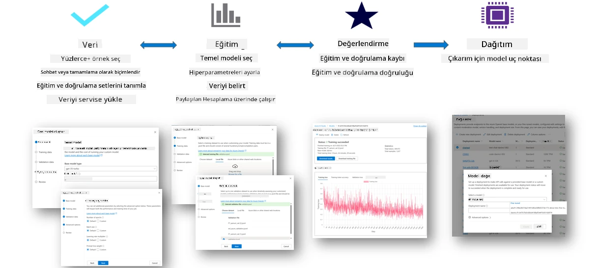

### Yeni Proje Oluşturma

1. [Azure AI Foundry](https://ai.azure.com) sitesine giriş yapın.

1. Azure AI Foundry’da yeni proje oluşturmak için **+New project** seçeneğini tıklayın.

    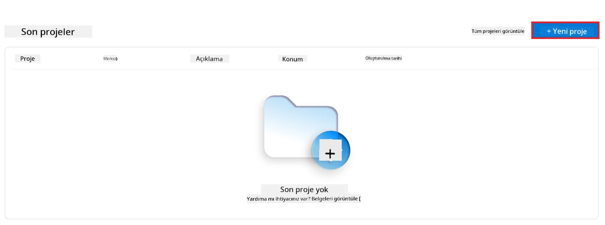

1. Aşağıdaki işlemleri yapın:

    - Proje **Hub adı**. Benzersiz bir değer olmalıdır.
    - Kullanılacak **Hub**’ı seçin (gerekirse yenisini oluşturun).

    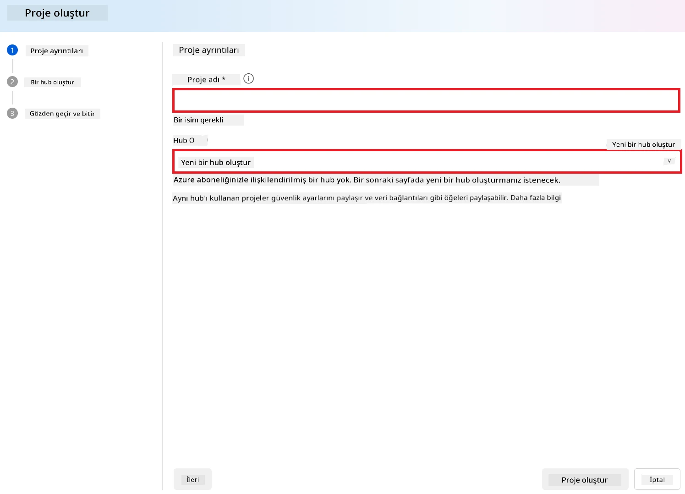

1. Yeni bir hub oluşturmak için aşağıdaki adımları gerçekleştirin:

    - **Hub adı** girin. Benzersiz olmalıdır.
    - Azure **Aboneliğinizi** seçin.
    - Kullanılacak **Kaynak grubunu** seçin (gerekirse yenisini oluşturun).
    - Kullanmak istediğiniz **Konumu** seçin.
    - Kullanmak istediğiniz **Azure AI Hizmetlerini Bağla** seçeneğini seçin (gerekirse yenisini oluşturun).
    - **Azure AI Arama Bağlantısını** **Bağlantıyı atla** olarak seçin.

    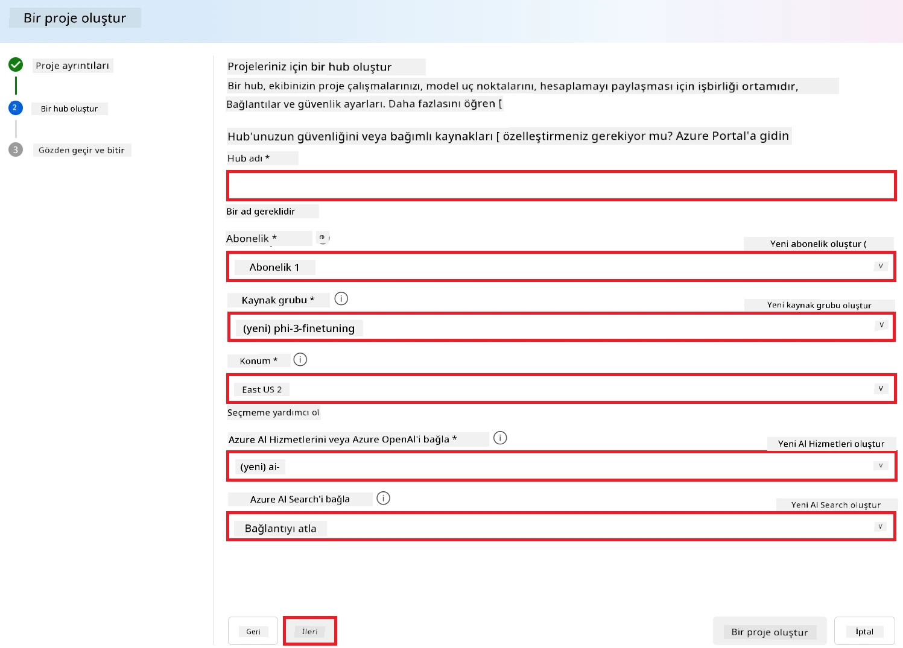

1. **Next** seçeneğine tıklayın.
1. **Create a project** seçeneğini seçin.

### Veri Hazırlığı

İnce ayar öncesinde, sohbet talimatları, soru-cevap çiftleri veya ilgili diğer metin verileri gibi görevinizle alakalı bir veri seti toplayın veya oluşturun. Bu veriyi temizleyin, eksik değerleri işleyin ve metni token’lara ayırın.

### Azure AI Foundry’de Phi-3 modellerini ince ayarlama

> [!NOTE]
> Phi-3 modellerinin ince ayarı şu anda yalnızca East US 2 bölgesindeki projelerde desteklenmektedir.

1. Sol taraftaki sekmeden **Model catalog** seçeneğini seçin.

1. **Arama çubuğuna** *phi-3* yazın ve kullanmak istediğiniz phi-3 modelini seçin.

    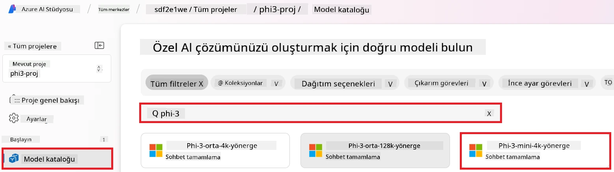

1. **Fine-tune** seçeneğini tıklayın.

    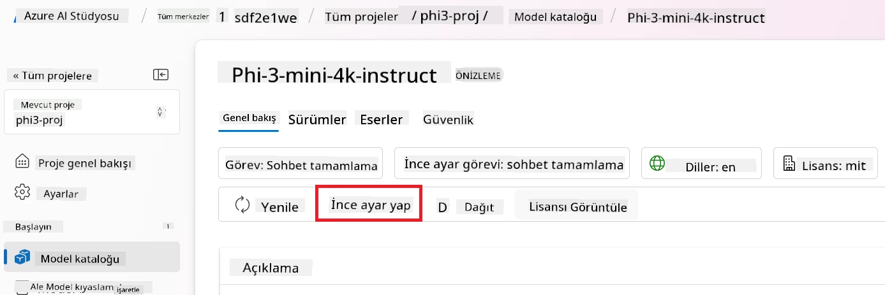

1. **Fine-tuned model name** (İnce ayarlı model adı) girin.

    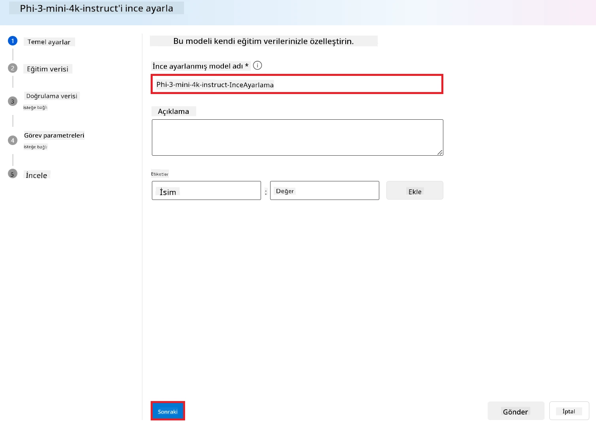

1. **Next** seçeneğine tıklayın.

1. Aşağıdaki işlemleri yapın:

    - **Görev türü** olarak **Chat completion** seçin.
    - Kullanmak istediğiniz **Eğitim verisini** seçin. Azure AI Foundry veri deposundan veya yerel ortamınızdan yükleyebilirsiniz.

    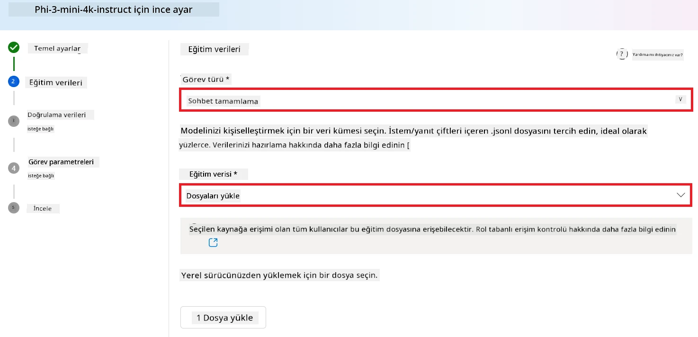

1. **Next** seçeneğine tıklayın.

1. Kullanmak istediğiniz **Doğrulama verisini** yükleyin veya **Eğitim verisinin otomatik bölünmesi** seçeneğini seçin.

    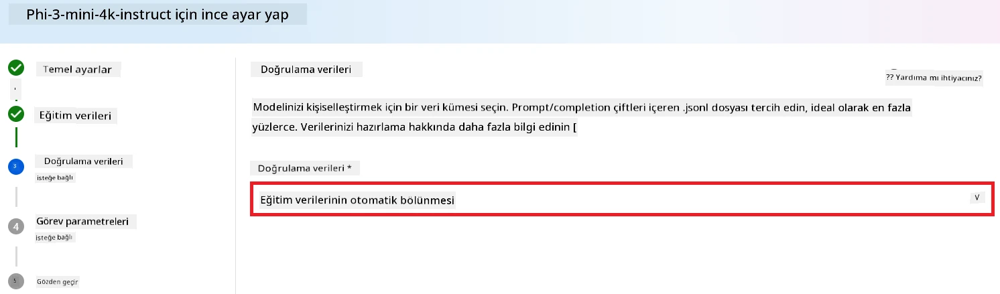

1. **Next** seçeneğine tıklayın.

1. Aşağıdaki ayarları yapın:

    - Kullanmak istediğiniz **Batch size multiplier** (Toplu iş boyutu çarpanı).
    - Kullanmak istediğiniz **Learning rate** (Öğrenme hızı).
    - Kullanmak istediğiniz **Epochs** (Eğitim döngüsü sayısı).

    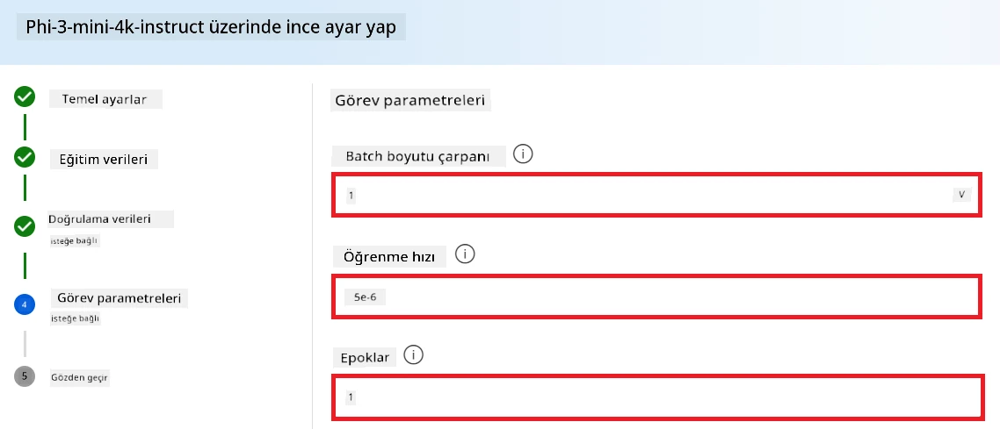

1. İnce ayar işlemini başlatmak için **Submit** seçeneğine tıklayın.

    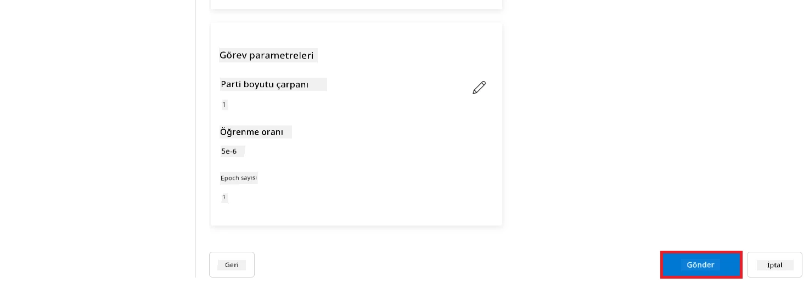

1. Modeliniz ince ayarlandıktan sonra durumu **Completed** olarak gösterilecektir. Artık modeli dağıtabilir ve kendi uygulamanızda, playground’da veya prompt flow’da kullanabilirsiniz. Daha fazla bilgi için bkz. [Azure AI Foundry ile Phi-3 ailesi küçük dil modellerinin dağıtımı](https://learn.microsoft.com/azure/ai-studio/how-to/deploy-models-phi-3?tabs=phi-3-5&pivots=programming-language-python).

    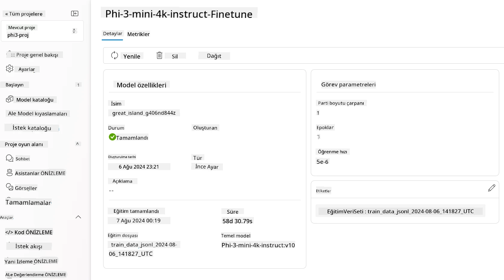

> [!NOTE]
> Phi-3 ince ayarı hakkında daha ayrıntılı bilgi için lütfen [Azure AI Foundry’de Phi-3 modellerini ince ayarlama](https://learn.microsoft.com/azure/ai-studio/how-to/fine-tune-phi-3?tabs=phi-3-mini) sayfasını ziyaret edin.

## İnce ayarlanmış modellerinizi temizleme

İnce ayarlanmış bir modeli [Azure AI Foundry](https://ai.azure.com) içindeki ince ayar model listesinden veya model detay sayfasından silebilirsiniz. İnce ayar sayfasından silmek istediğiniz modeli seçin ve ardından Sil düğmesine tıklayın.

> [!NOTE]
> Var olan bir dağıtımı olan özel modeli silemezsiniz. Önce model dağıtımınızı silmeniz gerekir.

## Maliyet ve kota

### Hizmet olarak ince ayarlanmış Phi-3 modelleri için maliyet ve kota

Hizmet olarak ince ayarlanmış Phi modelleri Microsoft tarafından sunulur ve Azure AI Foundry ile entegredir. Modelleri [dağıtırken](https://learn.microsoft.com/azure/ai-studio/how-to/deploy-models-phi-3?tabs=phi-3-5&pivots=programming-language-python) veya ince ayar yaparken fiyatlandırmayı dağıtım sihirbazındaki Fiyatlandırma ve koşullar sekmesinde bulabilirsiniz.

## İçerik filtreleme

Kullan-at modeliyle hizmet olarak dağıtılan modeller Azure AI Content Safety tarafından korunur. Gerçek zamanlı uç noktalara dağıtıldığında bu özelliği devre dışı bırakabilirsiniz. Azure AI içerik güvenliği etkinleştirildiğinde, hem istem hem de çıktı, zararlı içeriklerin tespiti ve önlenmesi için bir sınıflandırma modelleri topluluğundan geçer. İçerik filtreleme sistemi, hem giriş istemlerinde hem de çıktı tamamlamalarında potansiyel zararlı içerik kategorilerini tespit eder ve önlem alır. Daha fazla bilgi için bkz. [Azure AI Content Safety](https://learn.microsoft.com/azure/ai-studio/concepts/content-filtering).

**İnce Ayar Yapılandırması**

Hiperparametreler: Öğrenme hızı, batch boyutu ve eğitim epoch sayısı gibi hiperparametreleri tanımlayın.

**Kayıp Fonksiyonu**

Görevinize uygun bir kayıp fonksiyonu seçin (örneğin, çapraz entropi).

**Optimizatör**

Eğitim sırasında gradyan güncellemeleri için bir optimizatör seçin (örneğin, Adam).

**İnce Ayar Süreci**

- Önceden Eğitilmiş Modeli Yükle: Phi-3 Mini kontrol noktasını yükleyin.
- Özel Katmanlar Ekle: Göreve özgü katmanlar ekleyin (örneğin, sohbet talimatları için sınıflandırma başlığı).

**Modeli Eğitme**

Hazırladığınız veri setiyle modeli ince ayarlayın. Eğitim ilerlemesini izleyin ve gerekirse hiperparametreleri ayarlayın.

**Değerlendirme ve Doğrulama**

Doğrulama Seti: Verilerinizi eğitim ve doğrulama setlerine ayırın.

**Performansı Değerlendir**

Model performansını doğruluk, F1 skoru veya perplexity gibi metriklerle ölçün.

## İnce Ayarlanmış Modeli Kaydetme

**Kontrol Noktası**

İnce ayarlanmış model kontrol noktasını gelecekte kullanmak üzere kaydedin.

## Dağıtım

- Web Hizmeti Olarak Dağıtın: İnce ayarlanmış modelinizi Azure AI Foundry’de web hizmeti olarak dağıtın.
- Uç Noktayı Test Edin: Dağıtılan uç noktaya test sorguları göndererek işlevselliğini doğrulayın.

## Tekrarlama ve İyileştirme

Tekrarlayın: Performans tatmin edici değilse, hiperparametreleri ayarlayarak, daha fazla veri ekleyerek veya ek epoch’lar ile ince ayar yaparak süreci tekrarlayın.

## İzleme ve İyileştirme

Modelin davranışını sürekli izleyin ve gerektiğinde iyileştirin.

## Özelleştirme ve Genişletme

Özel Görevler: Phi-3 Mini, sohbet talimatlarının ötesinde çeşitli görevler için ince ayarlanabilir. Diğer kullanım senaryolarını keşfedin!
Deneyler: Performansı artırmak için farklı mimariler, katman kombinasyonları ve teknikler deneyin.

> [!NOTE]
> İnce ayar yinelemeli bir süreçtir. Deneyin, öğrenin ve modelinizi belirli göreviniz için en iyi sonuçları elde edecek şekilde uyarlayın!

**Feragatname**:  
Bu belge, AI çeviri hizmeti [Co-op Translator](https://github.com/Azure/co-op-translator) kullanılarak çevrilmiştir. Doğruluk için çaba göstersek de, otomatik çevirilerin hatalar veya yanlışlıklar içerebileceğini lütfen unutmayınız. Orijinal belge, kendi dilinde yetkili kaynak olarak kabul edilmelidir. Kritik bilgiler için profesyonel insan çevirisi önerilir. Bu çevirinin kullanımı sonucu ortaya çıkabilecek yanlış anlamalar veya yorum hatalarından sorumlu değiliz.