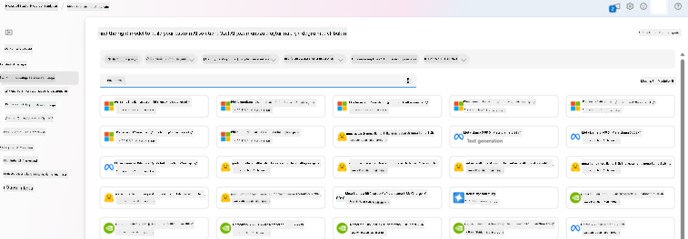
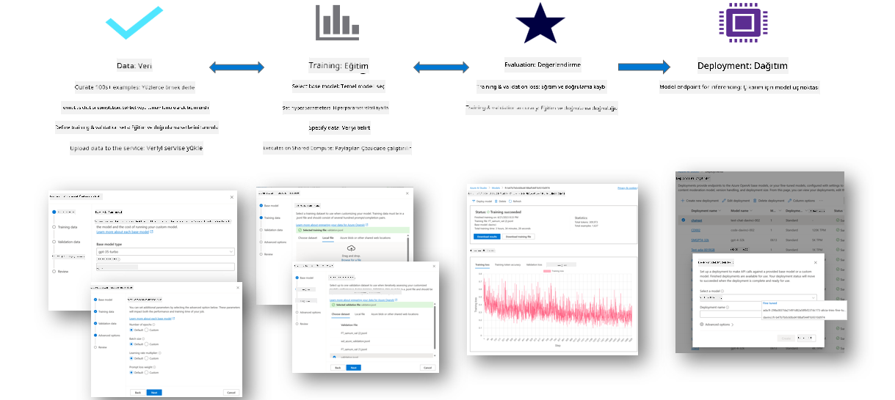
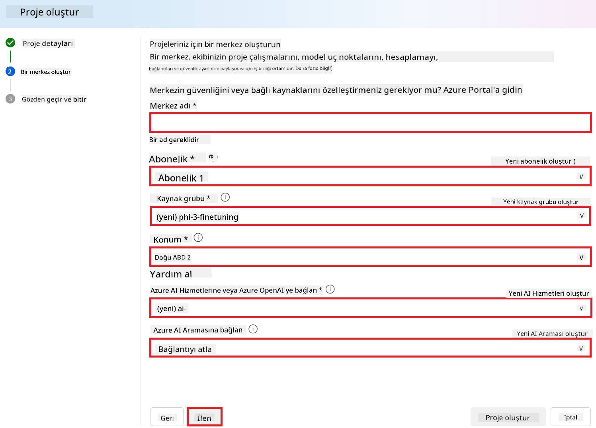
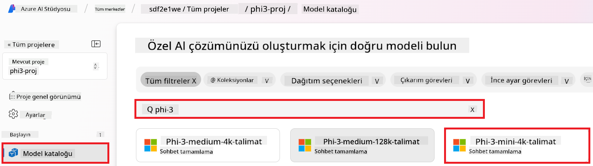
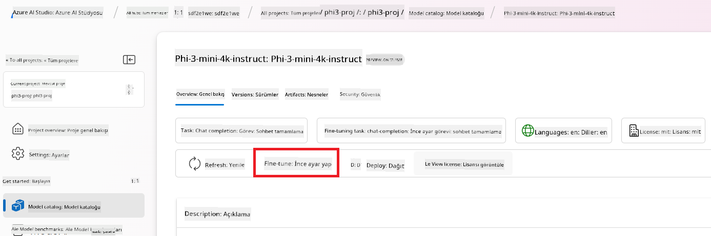
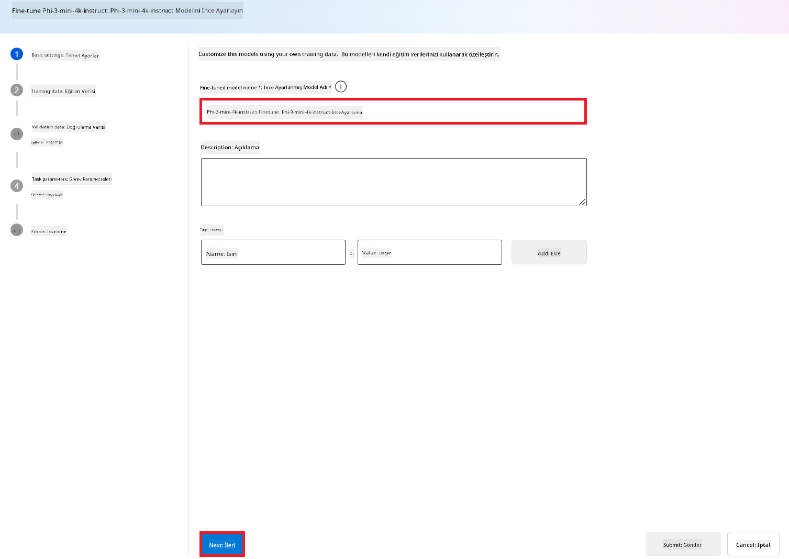
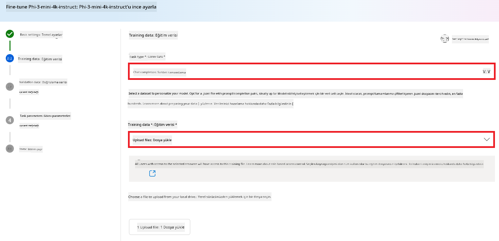
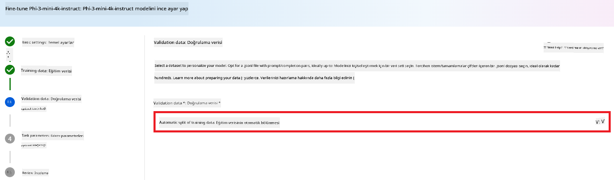
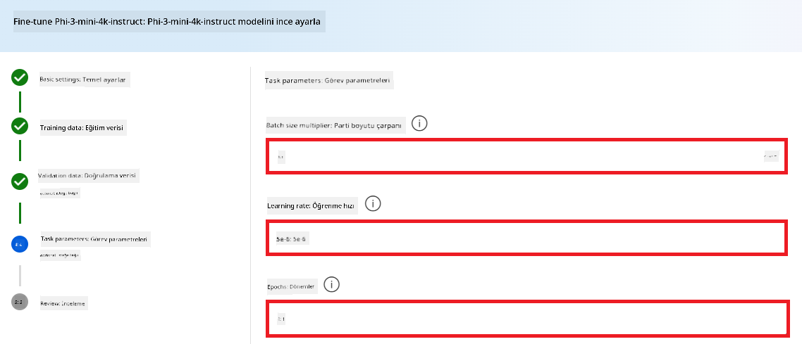
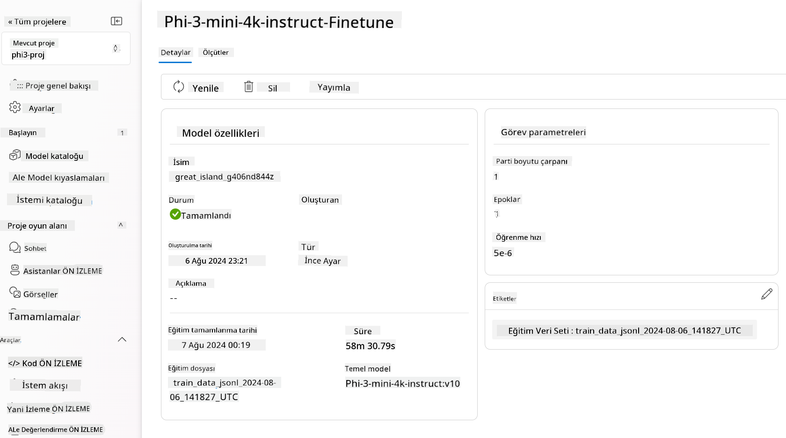

<!--
CO_OP_TRANSLATOR_METADATA:
{
  "original_hash": "c1559c5af6caccf6f623fd43a6b3a9a3",
  "translation_date": "2025-05-09T20:30:52+00:00",
  "source_file": "md/03.FineTuning/FineTuning_AIFoundry.md",
  "language_code": "tr"
}
-->
# Azure AI Foundry ile Phi-3 İnce Ayarı

Microsoft’un Phi-3 Mini dil modelini Azure AI Foundry kullanarak nasıl ince ayar yapabileceğimizi keşfedelim. İnce ayar, Phi-3 Mini’yi belirli görevlere uyarlamanıza olanak tanır ve böylece modeli daha güçlü ve bağlama duyarlı hale getirir.

## Dikkate Alınması Gerekenler

- **Yetenekler:** Hangi modeller ince ayar yapılabilir? Temel model ne tür görevler için ince ayarlanabilir?
- **Maliyet:** İnce ayar için fiyatlandırma modeli nedir?
- **Özelleştirilebilirlik:** Temel modeli ne kadar ve nasıl değiştirebilirim?
- **Kolaylık:** İnce ayar nasıl gerçekleşir – özel kod yazmam gerekir mi? Kendi hesaplama kaynaklarımı getirmem gerekir mi?
- **Güvenlik:** İnce ayarlanmış modellerin güvenlik riskleri olduğu biliniyor – istenmeyen zararlara karşı koruma önlemleri var mı?



## İnce Ayar İçin Hazırlık

### Ön Koşullar

> [!NOTE]
> Phi-3 ailesi modelleri için, kullandıkça öde modeli ince ayar seçeneği yalnızca **East US 2** bölgelerinde oluşturulan hub’lar ile kullanılabilir.

- Bir Azure aboneliği. Azure aboneliğiniz yoksa, başlamak için bir [ücretli Azure hesabı](https://azure.microsoft.com/pricing/purchase-options/pay-as-you-go) oluşturun.

- Bir [AI Foundry projesi](https://ai.azure.com?WT.mc_id=aiml-138114-kinfeylo).
- Azure rol tabanlı erişim kontrolleri (Azure RBAC), Azure AI Foundry’deki işlemlere erişim sağlamak için kullanılır. Bu makaledeki adımları gerçekleştirmek için kullanıcı hesabınızın kaynak grubunda __Azure AI Developer rolü__ atanmış olmalıdır.

### Abonelik sağlayıcı kaydı

Aboneliğin `Microsoft.Network` kaynak sağlayıcısına kayıtlı olduğunu doğrulayın.

1. [Azure portalına](https://portal.azure.com) giriş yapın.
1. Sol menüden **Subscriptions**’ı seçin.
1. Kullanmak istediğiniz aboneliği seçin.
1. Sol menüden **AI project settings** > **Resource providers**’ı seçin.
1. Listede **Microsoft.Network**’ün olduğundan emin olun. Yoksa ekleyin.

### Veri hazırlığı

Modelinizi ince ayar için eğitmek ve doğrulamak üzere verilerinizi hazırlayın. Eğitim ve doğrulama veri setleriniz, modelin nasıl performans göstermesini istediğinize dair giriş ve çıkış örneklerinden oluşur.

Tüm eğitim örneklerinizin çıkarım için beklenen formatta olduğundan emin olun. Modelleri etkili şekilde ince ayarlamak için dengeli ve çeşitli bir veri seti kullanın.

Bu, veri dengesini korumak, farklı senaryoları dahil etmek ve eğitim verisini zaman içinde gerçek dünya beklentilerine göre düzenli olarak iyileştirmek anlamına gelir; böylece daha doğru ve dengeli model çıktıları elde edilir.

Farklı model türleri, farklı eğitim veri formatları gerektirir.

### Chat Completion

Kullandığınız eğitim ve doğrulama verileri **JSON Lines (JSONL)** formatında olmalıdır. `Phi-3-mini-128k-instruct` için ince ayar veri seti, Chat completions API tarafından kullanılan konuşma formatında olmalıdır.

### Örnek dosya formatı

```json
    {"messages": [{"role": "system", "content": "You are an Xbox customer support agent whose primary goal is to help users with issues they are experiencing with their Xbox devices. You are friendly and concise. You only provide factual answers to queries, and do not provide answers that are not related to Xbox."}, {"role": "user", "content": "Is Xbox better than PlayStation?"}, {"role": "assistant", "content": "I apologize, but I cannot provide personal opinions. My primary job is to assist you with any issues related to your Xbox device. Do you have any Xbox-related issues that need addressing?"}]}
    {"messages": [{"role": "system", "content": "You are an Xbox customer support agent whose primary goal is to help users with issues they are experiencing with their Xbox devices. You are friendly and concise. You only provide factual answers to queries, and do not provide answers that are not related to Xbox."}, {"role": "user", "content": "Can I play PC games on my Xbox?"}, {"role": "assistant", "content": "While Xbox consoles don't natively support PC games, they can play an array of Xbox games, many of which are also available on PC. Can I assist you with finding games compatible with your Xbox device?"}]}
    {"messages": [{"role": "system", "content": "You are an Xbox customer support agent whose primary goal is to help users with issues they are experiencing with their Xbox devices. You are friendly and concise. You only provide factual answers to queries, and do not provide answers that are not related to Xbox."}, {"role": "user", "content": "I'm having trouble connecting my Xbox to the Wi-Fi."}, {"role": "assistant", "content": "No worries, let's go through the network settings on your Xbox. Can you please tell me what happens when you try to connect it to the Wi-Fi?"}]}
```

Desteklenen dosya türü JSON Lines’dır. Dosyalar varsayılan veri deposuna yüklenir ve projenizde kullanılabilir hale gelir.

## Azure AI Foundry ile Phi-3 İnce Ayarı

Azure AI Foundry, büyük dil modellerini kişisel veri setlerinize göre ince ayar yapmanızı sağlar. İnce ayar, belirli görev ve uygulamalar için özelleştirme ve optimizasyon imkanı sunarak önemli faydalar sağlar. Bu sayede performans artar, maliyetler düşer, gecikme azalır ve çıktılar kişiselleştirilir.



### Yeni Proje Oluşturma

1. [Azure AI Foundry](https://ai.azure.com) sitesine giriş yapın.

1. Azure AI Foundry’de yeni proje oluşturmak için **+New project** seçeneğini tıklayın.

    

1. Aşağıdaki adımları gerçekleştirin:

    - Proje **Hub adı**. Benzersiz bir değer olmalıdır.
    - Kullanılacak **Hub**’ı seçin (gerekirse yenisini oluşturun).

    

1. Yeni bir hub oluşturmak için şu adımları yapın:

    - **Hub adı** girin. Benzersiz olmalıdır.
    - Azure **Aboneliğinizi** seçin.
    - Kullanılacak **Kaynak grubunu** seçin (gerekirse yenisini oluşturun).
    - Kullanmak istediğiniz **Konumu** seçin.
    - Kullanmak istediğiniz **Connect Azure AI Services**’i seçin (gerekirse yenisini oluşturun).
    - **Connect Azure AI Search** için **Bağlantıyı atla** seçeneğini işaretleyin.

    

1. **Next**’i seçin.
1. **Create a project**’i seçin.

### Veri Hazırlığı

İnce ayar yapmadan önce, görevle ilgili bir veri seti toplayın veya oluşturun; örneğin sohbet talimatları, soru-cevap çiftleri veya diğer ilgili metin verileri. Verileri temizleyin ve ön işleme tabi tutun; gürültüyü kaldırın, eksik değerleri yönetin ve metni token’lara ayırın.

### Azure AI Foundry’de Phi-3 modellerini ince ayarlama

> [!NOTE]
> Phi-3 modellerinin ince ayarı şu anda sadece East US 2 bölgesindeki projelerde desteklenmektedir.

1. Sol taraftaki sekmeden **Model catalog**’u seçin.

1. **Arama çubuğuna** *phi-3* yazın ve kullanmak istediğiniz phi-3 modelini seçin.

    

1. **Fine-tune** seçeneğini tıklayın.

    

1. **Fine-tuned model name** girin.

    

1. **Next**’i seçin.

1. Aşağıdaki işlemleri yapın:

    - **Görev türü** olarak **Chat completion**’ı seçin.
    - Kullanmak istediğiniz **Eğitim verisini** seçin. Azure AI Foundry verileri üzerinden veya yerel ortamınızdan yükleyebilirsiniz.

    

1. **Next**’i seçin.

1. Kullanmak istediğiniz **Doğrulama verisini** yükleyin veya **Eğitim verisinin otomatik bölünmesi**’ni seçin.

    

1. **Next**’i seçin.

1. Aşağıdaki ayarları yapın:

    - Kullanmak istediğiniz **Batch size multiplier**’ı seçin.
    - Kullanmak istediğiniz **Learning rate**’i seçin.
    - Kullanmak istediğiniz **Epoch** sayısını belirleyin.

    

1. İnce ayar işlemini başlatmak için **Submit**’e tıklayın.

    

1. Modeliniz ince ayar yapıldıktan sonra durumu **Completed** olarak görüntülenecektir. Artık modeli dağıtabilir ve kendi uygulamanızda, playground’da veya prompt flow’da kullanabilirsiniz. Daha fazla bilgi için bkz. [Azure AI Foundry ile Phi-3 ailesi küçük dil modellerini dağıtma](https://learn.microsoft.com/azure/ai-studio/how-to/deploy-models-phi-3?tabs=phi-3-5&pivots=programming-language-python).

    

> [!NOTE]
> Phi-3 ince ayarı hakkında daha detaylı bilgi için lütfen [Azure AI Foundry’de Phi-3 modellerini ince ayarlama](https://learn.microsoft.com/azure/ai-studio/how-to/fine-tune-phi-3?tabs=phi-3-mini) sayfasını ziyaret edin.

## İnce Ayarlı Modellerinizi Temizleme

İnce ayar yapılmış bir modeli, [Azure AI Foundry](https://ai.azure.com) içindeki ince ayar model listesinden veya model detay sayfasından silebilirsiniz. İnce ayar sayfasından silmek istediğiniz modeli seçin ve ardından Sil butonuna tıklayın.

> [!NOTE]
> Var olan bir dağıtımı olan özel modelleri silemezsiniz. Önce model dağıtımınızı silmeniz gerekir, ardından özel modelinizi silebilirsiniz.

## Maliyet ve Kota

### Hizmet olarak ince ayar yapılmış Phi-3 modelleri için maliyet ve kota değerlendirmeleri

Hizmet olarak ince ayar yapılmış Phi modelleri Microsoft tarafından sunulur ve Azure AI Foundry ile entegre edilmiştir. Fiyatlandırmayı [model dağıtımı](https://learn.microsoft.com/azure/ai-studio/how-to/deploy-models-phi-3?tabs=phi-3-5&pivots=programming-language-python) veya ince ayar sırasında dağıtım sihirbazındaki Fiyatlandırma ve koşullar sekmesinde bulabilirsiniz.

## İçerik Filtreleme

Kullandıkça öde modeliyle hizmet olarak dağıtılan modeller, Azure AI Content Safety ile korunur. Gerçek zamanlı uç noktalara dağıtıldığında bu özelliği devre dışı bırakabilirsiniz. Azure AI içerik güvenliği etkin olduğunda, hem prompt hem de tamamlamalar, zararlı içeriklerin tespit ve engellenmesi amacıyla bir sınıflandırma modelleri topluluğundan geçer. İçerik filtreleme sistemi, hem giriş promptlarında hem de çıktı tamamlamalarında potansiyel olarak zararlı içerik kategorilerini tespit eder ve gerekli önlemleri alır. Daha fazla bilgi için bkz. [Azure AI Content Safety](https://learn.microsoft.com/azure/ai-studio/concepts/content-filtering).

**İnce Ayar Konfigürasyonu**

Öğrenme hızı, batch boyutu ve eğitim epoch sayısı gibi hiperparametreleri tanımlayın.

**Kayıp Fonksiyonu**

Görevinize uygun bir kayıp fonksiyonu seçin (örneğin, çapraz entropi).

**Optimizatör**

Eğitim sırasında gradyan güncellemeleri için bir optimizatör seçin (örneğin, Adam).

**İnce Ayar Süreci**

- Önceden Eğitilmiş Modeli Yükle: Phi-3 Mini kontrol noktasını yükleyin.
- Özel Katmanlar Ekle: Göreve özel katmanlar ekleyin (örneğin, sohbet talimatları için sınıflandırma başlığı).

**Modeli Eğitme**

Hazırladığınız veri setiyle modeli ince ayar yapın. Eğitim ilerlemesini izleyin ve gerekirse hiperparametreleri ayarlayın.

**Değerlendirme ve Doğrulama**

Doğrulama Seti: Verilerinizi eğitim ve doğrulama setlerine bölün.

**Performansı Değerlendir**

Model performansını doğruluk, F1 skoru veya perplexity gibi metriklerle değerlendirin.

## İnce Ayarlı Modeli Kaydetme

**Kontrol Noktası**

İnce ayarlı model kontrol noktasını gelecekte kullanmak üzere kaydedin.

## Dağıtım

- Web Hizmeti Olarak Dağıtım: İnce ayarlı modelinizi Azure AI Foundry’de web hizmeti olarak dağıtın.
- Uç Noktayı Test Etme: Dağıtılan uç noktaya test sorguları göndererek işlevselliğini doğrulayın.

## Yineleme ve İyileştirme

Yineleme: Performans yeterli değilse, hiperparametreleri ayarlayarak, daha fazla veri ekleyerek veya ek epoch’lar için ince ayar yaparak süreci tekrarlayın.

## İzleme ve İyileştirme

Modelin davranışını sürekli izleyin ve gerektiğinde iyileştirin.

## Özelleştirme ve Genişletme

Özel Görevler: Phi-3 Mini, sohbet talimatlarının ötesinde çeşitli görevler için ince ayar yapılabilir. Diğer kullanım senaryolarını keşfedin!
Deney Yapın: Performansı artırmak için farklı mimariler, katman kombinasyonları ve teknikler deneyin.

> [!NOTE]
> İnce ayar yinelemeli bir süreçtir. Deney yapın, öğrenin ve modelinizi belirli göreviniz için en iyi sonuçları elde edecek şekilde uyarlayın!

**Feragatname**:  
Bu belge, AI çeviri servisi [Co-op Translator](https://github.com/Azure/co-op-translator) kullanılarak çevrilmiştir. Doğruluk için çaba göstersek de, otomatik çevirilerin hatalar veya yanlışlıklar içerebileceğini lütfen unutmayınız. Orijinal belge, kendi ana dilindeki haliyle yetkili kaynak olarak kabul edilmelidir. Kritik bilgiler için profesyonel insan çevirisi önerilir. Bu çevirinin kullanımı sonucu ortaya çıkabilecek herhangi bir yanlış anlama veya yorumlama nedeniyle sorumluluk kabul edilmemektedir.